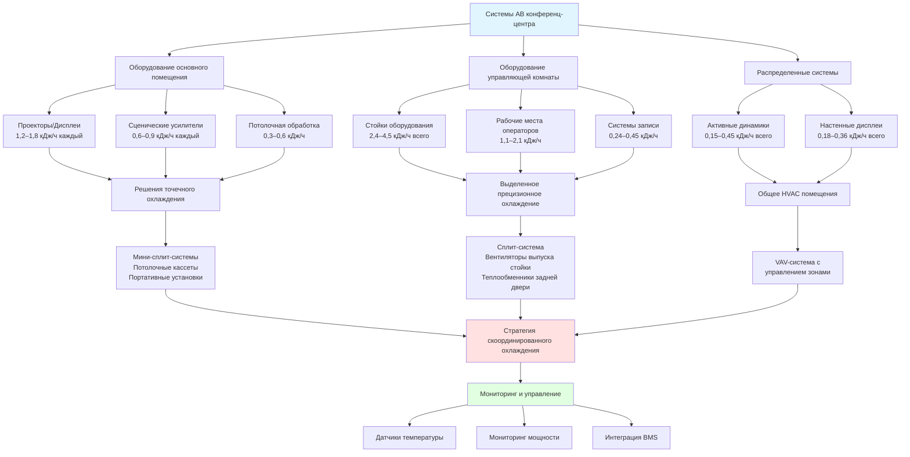

Аудиовизуальное оборудование в современных конференц-центрах представляет собой значительную тепловую нагрузку, требующую тщательной координации HVAC. Высокомощные проекторы, аппаратура обработки сигнала, усилительные системы и управляющая электроника генерируют концентрированное тепло, которое может нарушить надежность оборудования, сократить срок его службы и создать неудовлетворительные условия для операторов. Эффективное управление тепловыми потоками требует понимания специфических требований охлаждения оборудования и внедрения целевых стратегий, дополняющих общую систему кондиционирования помещения.

## Теплогенерация проекторов и дисплейного оборудования

Высокопроизводительные проекторы, особенно с мощностью свыше 5 000 люмен, генерируют значительное тепло в результате неэффективности работы лампы или источника лазерного света. Типичный лазерный проектор мощностью 10 000 люмен рассеивает примерно 1 200–1 500 Вт в виде тепла, тогда как более старые модели с лампой генерируют еще большие тепловые нагрузки.

Расчет чувствительной тепловой нагрузки от проекторов выполняется по формуле:

$$Q_{\text{proj}} = P_{\text{rated}} \times \eta_{\text{heat}} \times 3.412$$

где $Q_{\text{proj}}$ — тепловая нагрузка в кДж/ч, $P_{\text{rated}}$ — номинальное потребление мощности в ваттах, $\eta_{\text{heat}}$ — доля мощности, преобразуемая в тепло (обычно 0,85–0,95). Для проектора мощностью 10 000 люмен, потребляющего 1 400 Вт:

$$Q_{\text{proj}} = 1400 \times 0.90 \times 3.412 = 4,299 \text{ кДж/ч}$$

Крупноформатные LED-видеостены генерируют меньше тепла на единицу площади, чем проекционные системы, но все же требуют рассмотрения. Типичная LED-панель рассеивает 150–250 Вт/м² при полной яркости. Потолочные или встраиваемые проекторы получают преимущество от выделенного выпуска воздуха, который отводит тепло непосредственно из полости крепления до его попадания в занимаемое пространство.

## Требования к охлаждению звуковых систем и усилителей

Профессиональные звуковые усилители работают с эффективностью 60–75% при типовых нагрузках, преобразуя остаток в отходящее тепло. Усилитель мощностью 2 000 Вт, работающий с КПД 70%, генерирует:

$$Q_{\text{amp}} = P_{\text{amp}} \times (1 - \eta_{\text{amp}}) \times 3.412 = 2000 \times 0.30 \times 3.412 = 2,047 \text{ кДж/ч}$$

Стойки оборудования, содержащие несколько усилителей, обработчиков сигнала и сетевых коммутаторов, создают концентрированные тепловые нагрузки в диапазоне 5 000–15 000 кДж/ч на стойку. Оборудование в стойках требует контролируемой температуры входящего воздуха от 18 до 24°C для оптимальной надежности, при этом максимальная температура входящего воздуха не должна превышать 27°C.

Активные громкоговорители с интегрированным усилением добавляют распределенные нагрузки по всему пространству. Типичный активный громкоговоритель рассеивает 150–400 Вт в зависимости от мощности и коэффициента использования.

## Охлаждение управляющей комнаты и стоек оборудования

Технические управляющие комнаты, в которых размещаются системы управления АВ, оборудование коммутации видео и рабочие места операторов, требуют выделенного охлаждения, отдельного от основного конференц-помещения. Тепловые нагрузки управляющей комнаты обычно включают:

| Тип оборудования | Типичная тепловая нагрузка | Коэффициент количества |
|---------------|------------------|----------------|
| Видеопроцессор/коммутатор | 1,8–3,6 кДж/ч | 1–3 единицы |
| Аудиопроцессор DSP | 0,9–1,8 кДж/ч | 1–2 единицы |
| Процессор системы управления | 0,6–1,2 кДж/ч | 1–2 единицы |
| Сетевой коммутатор (48 портов) | 1,2–2,4 кДж/ч | 2–4 единицы |
| Оборудование записи/трансляции | 2,4–4,5 кДж/ч | 1–2 единицы |
| Рабочие места операторов | 3,6–5,4 кДж/ч | 2–4 станции |

Управляющие комнаты должны поддерживать температуру 20–22°C с относительной влажностью между 40–50%. Выделенные сплит-системы или прецизионные охладители обеспечивают лучший контроль, чем полагаться на общую систему HVAC здания, особенно во время продолжительных мероприятий или когда основное конференц-помещение работает при других установках температуры.

Стойки оборудования требуют управления вертикальным потоком воздуха с надлежащей маршрутизацией кабелей для предотвращения рециркуляции горячего воздуха. Глухие панели должны заполнять неиспользуемые места в стойке для поддержания постоянного потока воздуха спереди назад. Вентиляторы в стойке или система активного выпуска воздуха в задней части активно удаляют тепло из закрытых корпусов.

## Точечное охлаждение для оборудования АВ

Концентрированные нагрузки АВ в конкретных местах часто получают преимущество от решений точечного охлаждения, а не от увеличения размера всей системы HVAC помещения. Потолочные кассетные блоки, расположенные над местами размещения проекторов или оборудования, обеспечивают целевое охлаждение без влияния на общий комфорт в помещении.

Портативные точечные охладители (производительность 1,8–3,6 кДж/ч) обеспечивают гибкость для временных установок или мероприятий с переменными конфигурациями оборудования. Эти установки отводят тепло через гибкие воздуховоды в пленумы обратного воздуха или непосредственно наружу.

Для постоянных установок мини-сплит-системы, посвященные областям оборудования, позволяют независимое управление температурой. Типичный подход использует один наружный конденсирующий блок, обслуживающий несколько внутренних испарителей, расположенных в точках концентрации оборудования.

## Координация с нагрузками от освещения

Системы освещения конференц-центров генерируют значительное тепло, особенно с наследуемыми лампами накаливания и галогенными осветительными приборами. Переход на LED-освещение снижает тепловые нагрузки от освещения на 60–75%, позволяя перераспределить охладительную мощность на оборудование АВ.

Общая чувствительная тепловая нагрузка объединяет вклады от освещения и АВ:

$$Q_{\text{total}} = Q_{\text{lighting}} + Q_{\text{AV}} + Q_{\text{occupants}} + Q_{\text{envelope}}$$

Системы диммирования снижают как мощность освещения, так и связанное с ней тепловыделение пропорционально. Во время презентаций со сниженным уровнем освещения система HVAC должна модулировать выход охлаждения для предотвращения переохлаждения при сохранении адекватного охлаждения оборудования АВ.

Интеллектуальные системы управления освещением могут взаимодействовать с системами автоматизации зданий для оптимизации отклика HVAC на изменяющиеся тепловые нагрузки на протяжении циклов мероприятия.

## Подготовка к будущему развитию технологий

Системы АВ конференц-центров развиваются быстро, требуя инфраструктуры HVAC, которая вмещает растущую плотность мощности. Стратегии проектирования включают:

**Емкость инфраструктуры**: Рассчитывайте электрические и HVAC-распределительные системы на 125–150% начальных нагрузок для размещения будущих обновлений без крупных переделок.

**Модульное охлаждение**: Развертывайте масштабируемые решения по охлаждению с возможностью добавления зон или увеличения выхода по мере развития технологий.

**Гибкие воздуховоды**: Установите воздуховоды увеличенного размера с завершенными ветвями, расположенными рядом с вероятными местами размещения оборудования для простого будущего подключения.

**Возможность мониторинга**: Интегрируйте мониторинг температуры и мощности в критических местах оборудования для обнаружения тепловых проблем до отказа оборудования.

**Сетевая готовность**: Укажите управление HVAC с поддержкой IoT, которое может интегрироваться с развивающимися протоколами управления зданием и управления АВ.

Развивающиеся технологии, такие как 8K-проекция, иммерсивные аудиосистемы и расширенная реальность, будут увеличивать тепловые нагрузки. Планирование роста тепловыделения оборудования АВ на 40–50% в течение 10-летних жизненных циклов объекта обеспечивает достаточную охладительную мощность для технологического прогресса.

## Сводка по теплогенерации оборудования АВ

| Категория оборудования | Диапазон мощности (Вт) | Теплогенерация (кДж/ч) | Стратегия охлаждения |
|-------------------|-----------------|-------------------------|------------------|
| Лазерный проектор (5 000–10 000 люмен) | 800–1 500 | 2,7–5,1 | Точечное охлаждение + выпуск |
| Ламповый проектор (5 000–10 000 люмен) | 1 200–2 000 | 4,0–6,8 | Выделенный выпуск |
| LED-видеостена (на м²) | 150–250 | 0,5–0,85 | Общее HVAC |
| LCD/LED-дисплей (75–98") | 250–450 | 0,85–1,5 | Общее HVAC |
| Силовой усилитель (2 000 Вт) | 400–800 | 1,4–2,7 | Охлаждение стойки |
| Активный громкоговоритель | 100–300 | 0,34–1,0 | Общее HVAC |
| Видеопроцессор/коммутатор | 300–600 | 1,0–2,0 | Охлаждение стойки |
| Аудиопроцессор DSP | 100–200 | 0,34–0,68 | Охлаждение стойки |
| Сетевой коммутатор (48 портов PoE) | 200–400 | 0,68–1,4 | Охлаждение стойки |
| Процессор системы управления | 80–150 | 0,27–0,5 | Охлаждение стойки |
| Медиа-сервер/воспроизведение | 400–800 | 1,4–2,7 | Охлаждение стойки |
| Рабочая станция оператора | 350–550 | 1,2–1,9 | Общее HVAC |

Эффективное управление тепловыми потоками оборудования АВ конференц-центра требует тесной координации между разработчиками АВ, электротехническими инженерами и специалистами HVAC на этапе проектирования. Расчеты нагрузок должны учитывать одновременную работу всего оборудования при номинальной мощности, даже если типовые шаблоны использования предполагают более низкие средние нагрузки. Этот консервативный подход обеспечивает надежность оборудования в периоды пиковой нагрузки и продлевает срок эксплуатации дорогостоящих инвестиций в АВ.
