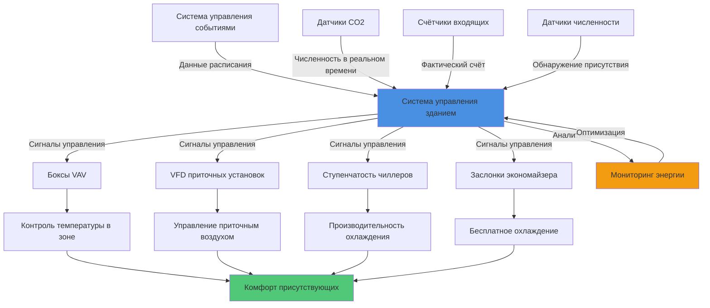

## Проблемы, связанные с изменением численности присутствующих

Конференц-центры представляют уникальные вызовы для HVAC из-за экстремальных колебаний численности присутствующих. Бальный зал может оставаться пустым в течение нескольких часов, а затем вместить 500 участников за считанные минуты. Такой быстрый переход от минимальной к максимальной численности требует отзывчивых и эффективных систем, способных поддерживать комфорт в диапазоне численности 10:1 или больше.

Традиционные системы с фиксированной производительностью, рассчитанные на пиковую численность, тратят значительную энергию в течение 60-80% времени эксплуатации, когда помещения слабо заняты или пусты. Эффективное проектирование HVAC конференц-центра требует сложных систем управления, оборудования с переменной производительностью и предиктивных стратегий.

## Проектирование для широкого диапазона численности присутствующих

Конференц-залы требуют систем, рассчитанных на оба экстремума. Диапазон проектной численности обычно варьируется от 5% минимум (команда подготовки, A/V техники) до 100% максимум (основные доклады, банкеты). Это создает противоречивые требования:

**Требования при максимальной численности:**
- Расход вентиляции 5-7,5 CFM на человека минимум
- Чувствительное охлаждение от людей: 264 кДж/ч на человека
- Латентное охлаждение от людей: 211 кДж/ч на человека
- Возможность быстрого восстановления температуры

**Требования при минимальной численности:**
- Снижение наружного воздуха для поддержания давления здания
- Эффективность при частичной нагрузке до 10-20% производительности
- Сниженное распределение воздуха для предотвращения переохлаждения и сквозняков
- Контроль влажности при низкой нагрузке

Общий расход вентиляции варьируется кардинально:

$$V_{ot} = V_{bz} \times D = \left(\frac{R_p \times P_z}{E_z} + \frac{R_a \times A_z}{E_z}\right) \times D$$

Где $V_{ot}$ — общий наружный воздух, $R_p$ — требование на человека (обычно 5 CFM), $P_z$ — численность в зоне, $R_a$ — компонент по площади, $A_z$ — площадь зоны, $E_z$ — эффективность распределения воздуха в зоне, и $D$ — коэффициент разнообразия численности (1,0 для конференц-залов).

Для бального зала площадью 930 м²:
- Пусто: 236 CFM (м³/ч: 400)
- 500 человек: 2 500+ CFM наружного воздуха минимум (м³/ч: 4 250+)

## Управление вентиляцией по спросу на основе CO2

Датчики CO2 обеспечивают обратную связь по численности в реальном времени, позволяя расходам вентиляции соответствовать фактическим условиям, а не предположениям проектирования. Конференц-центры получают значительные преимущества от управления вентиляцией по спросу благодаря высокой изменчивости расписаний.

**Стратегия управления вентиляцией по спросу:**

$$V_{oa} = V_{min} + \left(\frac{C_{space} - C_{outdoor}}{C_{target} - C_{outdoor}}\right) \times (V_{max} - V_{min})$$

Где $V_{oa}$ — расход наружного воздуха, $V_{min}$ — минимальный наружный воздух (обычно 0,06 CFM/м²), $C_{space}$ — измеренный CO2, $C_{outdoor}$ — наружный CO2 (обычно 400 ppm), и $C_{target}$ — уставка (обычно 1000 ppm).

**Рекомендации по размещению датчиков:**
- Несколько датчиков в больших помещениях (минимум один на 930 м²)
- Места в возвратном воздухе, избегая прямых выхлопных потоков
- На высоте 1,2-1,8 м от пола в зоне присутствия
- Алгоритмы усреднения для предотвращения колебаний от локальных вариаций

Правильно реализованное управление вентиляцией по спросу в конференц-центрах обычно снижает энергопотребление вентиляции на 40-60% по сравнению с системами фиксированного наружного воздуха, с более быстрой окупаемостью, чем в большинстве типов зданий, благодаря экстремальным колебаниям численности.

## Быстрое реагирование на изменения численности присутствующих

События в конференц-центрах часто начинаются с минимальным предупреждением. Система HVAC должна обнаружить изменение численности и ответить в течение 10-15 минут, чтобы избежать жалоб на комфорт во время критических открывающих сессий.

**Стратегии реагирования:**

1. **Быстродействующие датчики:** Датчики численности или счётчики входящих людей запускают немедленный ответ
2. **Вентиляторы с переменной скоростью:** Увеличение от 20% до 100% в течение 2-3 минут
3. **Ступенчатое оборудование:** Последовательный запуск нескольких блоков вместо одного большого
4. **Управление тепловой массой:** Предварительное охлаждение конструкции для буферизации начального скачка нагрузки

Кратность воздухообмена должна увеличиваться пропорционально численности. Требуемое время реагирования зависит от объёма помещения и кратности обмена:

$$t_{response} = \frac{V_{space}}{Q_{supply}} \times N_{ach,required}$$

Где $t_{response}$ — время достижения условий, $V_{space}$ — объём помещения, $Q_{supply}$ — расход приточного воздуха, и $N_{ach,required}$ — необходимые кратности воздухообмена для восстановления (обычно 3-4).

Системы с переменным расходом воздуха с приводами переменной скорости наиболее эффективно реагируют, достигая изменений расхода за считанные секунды, а не минуты, требуемые для входных направляющих аппаратов или систем с постоянной скоростью.

## Предварительное кондиционирование перед событиями

Интеграция с системами планирования событий обеспечивает проактивное предварительное кондиционирование, устраняя жалобы в начале события при минимизации энергопотерь. Система управления зданием получает календари событий и инициирует увеличение мощности HVAC в расчётные сроки.

**График предварительного кондиционирования:**

| Размер события | Начало предварительного кондиционирования | Восстановление температуры | Начало вентиляции |
|---|---|---|---|
| Малое (<50) | За 30 мин | За 20 мин | За 15 мин |
| Среднее (50-200) | За 60 мин | За 45 мин | За 30 мин |
| Большое (200-500) | За 90 мин | За 60 мин | За 45 мин |
| Очень большое (>500) | За 120 мин | За 90 мин | За 60 мин |

Расчёты предварительного охлаждения учитывают охлаждение тепловой массы и удаление нагрузки численности:

$$Q_{precool} = (UA \times \Delta T) + (m_{thermal} \times c_p \times \Delta T_{structure})$$

Типичные конференц-залы требуют снижения температуры с 25,6°C (уставка при отсутствии численности) до 22,2°C (уставка при численности) перед событиями. Предварительное кондиционирование в непиковые часы или в более прохладный утренний период значительно снижает пиковые платежи по спросу.

## Эффективность при частичной нагрузке

Конференц-центры работают при частичной нагрузке 70-85% годовых часов. Выбор оборудования должен приоритизировать эффективность при частичной нагрузке над пиковой эффективностью.

**Стратегии оптимизации при частичной нагрузке:**

1. **Несколько меньших установок:** Четыре установки 8,8 кВт превосходят одну установку 35,2 кВт при частичной нагрузке
2. **Компрессоры с переменной скоростью:** Поддержание высокой эффективности до 20-30% производительности
3. **Исключение горячего газового байпаса:** Неэффективен при лёгких нагрузках; используйте цифровую спираль или VFD вместо этого
4. **Интеграция экономайзера:** Бесплатное охлаждение в переходные сезоны и при подготовке помещений
5. **Снижение мощности приточного вентилятора:** Кубическая зависимость расхода и мощности вентилятора приводит к резким сбережениям

Интегрированное значение при частичной нагрузке (IPLV) обеспечивает лучшее указание на производительность, чем полнонагруженный EER для конференц-приложений:

$$IPLV = 0.01A + 0.42B + 0.45C + 0.12D$$

Где A, B, C, D представляют эффективность при 100%, 75%, 50% и 25% производительности соответственно. Конференц-центры должны взвешивать производительность при 50% и 25% даже более тяжело, чем стандартные расчёты IPLV предлагают.

Системы с переменным расходом хладагента (VRF) отлично подходят для конференц-приложений, поддерживая COP выше 3,0 вплоть до 20% нагрузки по сравнению с обычными системами, снижающимися до COP 2,0 или ниже.

## Датчики численности и интеграция с расписанием

Современные конференц-центры интегрируют несколько источников данных для оптимизации реагирования HVAC:

**Технологии датчиков:**
- **Датчики CO2:** Основной индикатор численности, уставка 1000 ppm
- **Пассивные инфракрасные (PIR):** Обнаружение движения для определения вакантности
- **Счётчики входящих:** Прямое измерение численности у входов
- **Wi-Fi аналитика:** Счёт смартфонов для прогнозной численности
- **Датчики давления на сиденьях:** Высокоточный счёт на ярусном сиденье

**Интеграция с расписанием:**
- Интеграция API системы управления событиями
- Автоматическое обновление уставок и расписаний
- Разрешение конфликтов между запланированной и измеренной численностью
- Анализ исторических данных для улучшенных предиктивных алгоритмов

## Сценарии численности и реагирование HVAC

| Уровень численности | Типичное расписание | Вентиляция наружного воздуха | Выход охлаждения | Расход приточного воздуха | Реагирование системы |
|---|---|---|---|---|---|
| Пусто (0%) | Ночью, выходные | 236 CFM (мин) | 0-1,8 кВт | 946 CFM | Режим с пониженной уставкой, минимальная эксплуатация |
| Подготовка (5-10%) | 2-4 часа до события | 354 CFM | 1,8-3,5 кВт | 1 419 CFM | Предварительное кондиционирование, снижение температуры |
| Лёгкая (25%) | Брейк-сессии | 708 CFM | 5,3-8,8 кВт | 2 839 CFM | Сниженная производительность, приоритет экономайзера |
| Средняя (50%) | События среднего размера | 1 181 CFM | 12,3-17,6 кВт | 4 729 CFM | Стандартная эксплуатация, сбалансированный режим |
| Высокая (75%) | Крупные конференции | 1 649 CFM | 21,1-26,4 кВт | 6 619 CFM | Высокая производительность, всё оборудование включено |
| Пик (100%) | Основные доклады, банкеты | 2 360 CFM | 31,7-35,2 кВт | 8 509 CFM | Максимальный выход, вспомогательные системы готовы |

## Архитектура системы для переменной численности

Оптимальная архитектура HVAC конференц-центра объединяет эффективность центральной станции с гибкостью на уровне зон:

**Центральная станция:**
- Несколько чиллеров с индивидуальной производительностью 25-40%
- Переменный первичный расход с независимыми от давления регулирующими клапанами
- Водяной экономайзер для работы в переходный сезон
- Накопление холода для срезания пиков во время крупных событий

**Распределение по воздуху:**
- Выделенные системы наружного воздуха (DOAS) с рекуперацией энергии
- Терминальные боксы VAV с прямым цифровым управлением
- Независимые от давления боксы VAV, предотвращающие колебания
- Периметровое отопление для вакантных/подготовительных периодов

**Интеграция управления:**
- Предиктивные алгоритмы, использующие исторические паттерны численности
- Реальная подгонка на основе фактической обратной связи датчиков
- Автоматические расчёты оптимального пуска/остановки
- Интеграция ответных нагрузок на сеть для захвата поощрений коммунальных предприятий

Этот многослойный подход обеспечивает энергоэффективность в течение большинства часов эксплуатации, сохраняя при этом возможность быстрого реагирования на пиковые события численности, которые определяют успех конференц-центра.

## Проверка производительности

Постоянный мониторинг проверяет производительность системы во всём спектре численности:

- Удельное энергопотребление, нормализованное по человеко-часам
- Отслеживание жалоб, связанное с переходами численности
- Анализ времени работы оборудования и частоты переключений
- Проверка эффективности при частичной нагрузке через тренд-данные
- Эффективность предварительного кондиционирования, измеренная временем восстановления

Конференц-центры, внедрившие комплексные системы HVAC, чувствительные к численности присутствующих, обычно достигают сбережения энергии на 30-50% по сравнению с традиционными подходами с фиксированной производительностью, одновременно повышая комфорт присутствующих во время критических периодов событий, которые определяют репутацию и доход учреждения.
