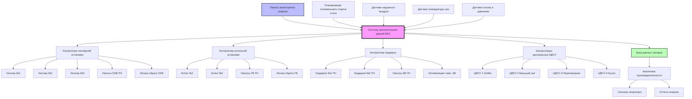

Управление центральной системой HVAC представляет наивысший уровень управления энергией в объектах гостеприимства, координируя несколько компонентов оборудования для подачи кондиционированного воздуха при минимизации операционных расходов. Современные системы автоматизации зданий позволяют применять сложные стратегии оптимизации, которые существенно снижают потребление энергии по сравнению с простым управлением включением/выключением.

## Стратегии оптимизации чиллерной установки

Оптимизация чиллерной установки сосредоточена на работе нескольких чиллеров в точках их максимальной эффективности при одновременном удовлетворении потребности здания в охлаждении. Коэффициент производительности (COP) чиллера варьируется в зависимости от нагрузки:

$$\text{COP} = \frac{Q_{\text{охлаждение}}}{W_{\text{компрессор}}}$$

где $Q_{\text{охлаждение}}$ представляет производительность охлаждения (кВ) и $W_{\text{компрессор}}$ — потребляемую мощность компрессора (кВт).

**Стратегии каскадирования включают:**

- **Оптимальная нагрузка:** распределение нагрузки между несколькими чиллерами для максимизации эффективности установки вместо работы одного чиллера при высокой нагрузке
- **Сброс температуры охлажденной воды:** повышение температуры подачи при снижении нагрузки охлаждения, что снижает напор компрессора
- **Оптимизация конденсаторной воды:** снижение температуры конденсаторной воды для повышения эффективности чиллера при благоприятных условиях окружающей среды

Взаимосвязь между напором чиллера и эффективностью:

$$\text{Коэффициент мощности} = \frac{T_{\text{конд}} - T_{\text{испаритель}}}{T_{\text{испаритель,базовая}} - T_{\text{конд,базовая}}}$$

Снижение температуры конденсаторной воды на 2,8°C может улучшить эффективность чиллера на 3–5% в зависимости от типа чиллера и нагрузки.

**Алгоритмы распределения нагрузки** рассчитывают наиболее эффективную комбинацию чиллеров для удовлетворения спроса. Для двухчиллерной системы система управления оценивает общую мощность установки при различных комбинациях нагрузок:

$$W_{\text{всего}} = W_{\text{ч1}}(L_1) + W_{\text{ч2}}(L_2) + W_{\text{насосы}} + W_{\text{градирни}}$$

где $L_1$ и $L_2$ представляют отдельные нагрузки чиллеров, ограниченные условием $L_1 + L_2 = L_{\text{всего}}$.

## Каскадирование котельной установки

Каскадирование котлов управляет несколькими котлами для соответствия потребности в тепле при максимизации эффективности горения. Конденсационные котлы достигают наивысшей эффективности при низких температурах обратной воды:

$$\eta_{\text{котел}} = \frac{Q_{\text{выход}}}{Q_{\text{топливо}} \times \text{ВВВ}}$$

**Стратегии управления включают:**

- **Ротация ведущего-ведомого:** чередование того, какой котел служит основным, для выравнивания времени работы и износа
- **Сброс температуры наружного воздуха:** модуляция температуры подачи горячей воды на основе температуры наружного воздуха
- **Управление температурой обратной воды:** поддержание низких температур обратной воды для обеспечения конденсационной работы
- **Модулирующее управление горелкой:** работа котлов при частичном пламени вместо циклического включения/выключения

Соотношение графика сброса:

$$T_{\text{ГВС}} = T_{\text{ГВС,проект}} - \left(\frac{T_{\text{НВ}} - T_{\text{НВ,проект}}}{T_{\text{НВ,баланс}} - T_{\text{НВ,проект}}}\right) \times (T_{\text{ГВС,проект}} - T_{\text{ГВС,мин}})$$

## Оптимизация градирни

Градирни потребляют значительное количество энергии через работу вентилятора, но напрямую влияют на эффективность чиллера. Баланс оптимизации:

$$W_{\text{градирня}} + W_{\text{чиллер}}(T_{\text{кв}}) = \text{минимум}$$

**Подходы к управлению:**

- **Управление переменной скоростью вентилятора:** модуляция скорости вентилятора для поддержания оптимальной температуры конденсаторной воды
- **Секционирование ячеек:** работа минимального количества ячеек градирни для удовлетворения нагрузки
- **Управление подходом:** целевое значение определенного подхода к температуре влажного термометра вместо фиксированного сигнала
- **Интеграция свободного охлаждения:** прямое использование воды градирни при благоприятных условиях окружающей среды

Соотношение мощности вентилятора градирни:

$$W_{\text{вентилятор}} = W_{\text{проект}} \times \left(\frac{\text{об/мин}}{\text{об/мин}_{\text{проект}}}\right)^3$$

## Управление центральным воздухоснабжающим устройством

Центральные воздухоснабжающие устройства (ЦВСУ), обслуживающие несколько зон, требуют скоординированного управления охлаждающими змеевиками, нагревающими змеевиками и вентиляторами подачи:

**Сброс температуры приточного воздуха** регулируется на основе потребностей зон:

$$T_{\text{ПВ}} = T_{\text{ПВ,мин}} + (T_{\text{ПВ,макс}} - T_{\text{ПВ,мин}}) \times \left(1 - \frac{N_{\text{охлаждение}}}{N_{\text{всего}}}\right)$$

где $N_{\text{охлаждение}}$ представляет зоны, требующие охлаждения.

**Сброс статического давления** снижает энергию вентилятора, когда заслонки зон не полностью открыты:

$$SP_{\text{сигнал}} = SP_{\text{мин}} + (SP_{\text{макс}} - SP_{\text{мин}}) \times \text{Max(Положения заслонок)}$$

Экономия энергии вентилятора следует законам вентилятора:

$$\frac{W_2}{W_1} = \left(\frac{\text{CFM}_2}{\text{CFM}_1}\right)^3$$

## Мониторинг и тренды энергии

Непрерывный мониторинг обеспечивает проверку производительности и выявление неисправностей:

- **Панели в реальном времени:** отображение текущей эффективности оборудования, потребления энергии и операционных расходов
- **Исторические тренды:** отслеживание производительности во времени для выявления деградации
- **Сравнительный анализ:** сравнение фактической производительности с расчетной или исходной производительностью
- **Управление сигналами тревоги:** уведомление операторов об отклонениях эффективности

Ключевые показатели производительности включают:

$$\text{кВт/кВ}_{\text{установка}} = \frac{W_{\text{чиллеры}} + W_{\text{насосы}} + W_{\text{градирни}}}{Q_{\text{всего}}}$$

$$\text{Эффективность котла} = \frac{\text{кДж выход}}{\text{кДж топливо}} \times 100\%$$

## Программы оптимального старта/остановки

Алгоритмы оптимального старта/остановки минимизируют время работы при обеспечении комфорта в занятых помещениях:

$$t_{\text{старт}} = t_{\text{занято}} - K \times (T_{\text{сигнал}} - T_{\text{текущая}})$$

где $K$ представляет усвоенную постоянную отклика системы (минут/°C).

Алгоритм адаптируется на основе:
- Тепловой массы здания
- Температуры наружного воздуха
- Производительности системы
- Исторических данных производительности

Экономия энергии от оптимального старта/остановки обычно составляет 10–20% потребления энергии HVAC за счет устранения ненужных ранних пусков и работы оборудования в периоды отсутствия людей.

## Стратегии управления и экономия энергии

| Стратегия управления | Типичная экономия энергии | Сложность реализации | Период окупаемости |
|----------------------|--------------------------|----------------------|-------------------|
| Оптимизация чиллерной установки | 15–25% | Высокая | 2–4 года |
| Сброс температуры охлажденной воды | 5–10% | Средняя | 1–2 года |
| Оптимизация конденсаторной воды | 8–12% | Средняя | 1–3 года |
| Каскадирование котлов | 10–15% | Средняя | 2–3 года |
| Сброс температуры горячей воды | 8–12% | Низкая | <1 года |
| Управление ПЧ вентилятора градирни | 30–50% (вентиляторы) | Средняя | 1–2 года |
| Сброс температуры приточного воздуха | 10–20% (вентиляторы ЦВСУ) | Низкая | 1–2 года |
| Сброс статического давления | 20–40% (вентиляторы ЦВСУ) | Средняя | 1–2 года |
| Оптимальный старт/стоп | 10–20% | Низкая | <1 года |
| Вентиляция по потребности | 15–25% | Средняя | 2–3 года |

## Архитектура управления центральной установкой

## Интеграция и коммуникация

Современное управление центральной установкой зависит от интегрированных протоколов коммуникации:

- **BACnet:** стандартный протокол отрасли для коммуникации оборудования HVAC
- **Modbus:** распространен для преобразователей частоты и оборудования учета
- **LON:** устаревший протокол, все еще присутствующий в многих существующих системах
- **OPC:** обеспечение интеграции с платформами управления энергией и аналитики

Успешная реализация требует полного списка точек, планирования архитектуры сети и мер кибербезопасности для защиты систем управления зданием от несанкционированного доступа.

## Проверка производительности

Непрерывный комиссионинг подтверждает, что последовательности управления достигают намеченной экономии:

1. **Установление исходных значений:** документирование потребления энергии до оптимизации
2. **Реализация:** системное развертывание стратегий управления
3. **Измерение:** отслеживание производительности после реализации
4. **Регулирование:** точная настройка параметров управления на основе фактического отклика здания
5. **Документирование:** ведение записей сигналов, последовательностей и производительности

Метрика нормализованного потребления энергии учитывает колебания погоды:

$$\text{Энергия}_{\text{нормализованная}} = \frac{\text{Энергия}_{\text{фактическая}}}{\text{Дни градусов}_{\text{фактические}}} \times \text{Дни градусов}_{\text{исходные}}$$

Оптимизация управления центральной системой представляет наиболее экономически эффективную меру энергосбережения в объектах гостеприимства, обычно обеспечивая общую экономию энергии HVAC в размере 20–35% с периодом окупаемости 2–4 года за счет повышения эффективности оборудования и снижения времени работы.
