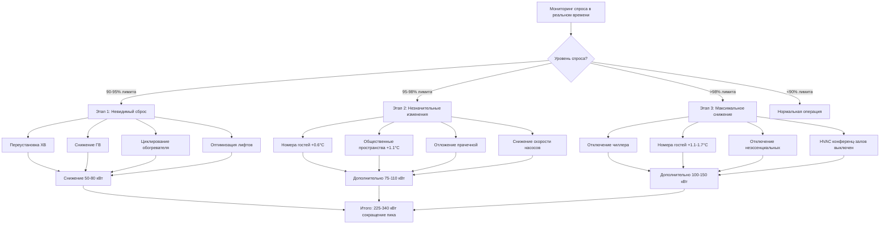

## Основные принципы сброса нагрузки в отелях

Плата за электроэнергию по мощности составляет 30-50% от коммунальных расходов отелей, создавая значительный финансовый стимул для снижения пиковой нагрузки. Сброс нагрузки временно ограничивает некритичное электрическое потребление в периоды высокого спроса для ограничения пиковой выставляемой мощности и участия в программах реагирования на спрос, предлагающих финансовые стимулы.

Отели предоставляют уникальные возможности и ограничения для сброса нагрузки. Крупные концентрированные нагрузки (чиллеры, бойлеры, насосы) позволяют значительное мгновенное снижение спроса, в то время как требования комфорта гостей налагают строгие ограничения на приемлемые стратегии ограничения. Успешный сброс нагрузки в отелях балансирует агрессивное снижение энергопотребления с незаметным воздействием на гостей.

Пиковый спрос возникает в жаркие летние полудни (14:00-18:00), когда совпадают нагрузки охлаждения, восстановление горячей воды после уборки после выезда и прачечные операции. Отель на 400 номеров может испытывать пиковый электрический спрос 1200-1800 кВт, при этом системы HVAC вносят вклад в 650-900 кВт (54-60% от общего объема).

Снижение пикового спроса с 1500 кВт до 1350 кВт (сокращение на 150 кВт) дает значительные сбережения:

$$Savings_{annual} = \Delta P_{peak} \times Rate_{demand} \times 12 = 150 \text{ кВт} \times \$18/\text{кВт} \times 12 = \$32,400/\text{год}$$

Многие отели достигают снижения пиковой нагрузки на 100-200 кВт благодаря согласованному сбросу нагрузки с периодом возврата инвестиций менее 2 лет для требуемой инфраструктуры мониторинга и управления.

## Участие в программах реагирования на спрос

Программы реагирования на спрос электроэнергетических компаний компенсируют потребителей за добровольное снижение нагрузки во время стрессовых ситуаций в сети, предоставляя дополнительный доход сверх сбережений от снижения платежей за мощность.

### Типы программ и компенсация

**Программы мощности**: Годовые платежи за обязательное снижение нагрузки независимо от частоты активации. Отель соглашается сбросить минимум 100 кВт в течение 30 минут с момента уведомления компании. Типичная компенсация: $50-120 за кВт-год обязательной мощности.

Для обязательства на 150 кВт: Годовой доход = 150 кВт × $80/кВт = $12,000

Программы обычно разрешают 10-15 событий за лето, каждое длится 2-4 часа. Штрафы применяются за неисполнение во время вызванных событий.

**Программы оплаты по энергии**: Компенсация в зависимости от фактического кВт∙ч сокращено во время событий. Базовая нагрузка устанавливается на основе предыдущих дней без событий, измеренное сокращение компенсируется по повышенной ставке.

Расчет расчета события:

$$Payment = (Load_{baseline} - Load_{actual}) \times Duration \times Rate_{energy}$$

Базовая нагрузка отеля 1400 кВт, нагрузка события 1250 кВт, событие на 3 часа, ставка $0,50/кВт∙ч:

$$Payment = (1400 - 1250) \times 3 \times \$0.50 = \$225$$

**Реагирование на ценообразование в реальном времени**: Отели на тарифах в реальном времени или с дифференцированным по времени применением сбрасывают нагрузку при скачке цен на энергию выше экономического порога. Автоматизированные системы отслеживают ценовые сигналы и инициируют сброс нагрузки, когда предельная стоимость энергии превышает стоимость реализации сброса.

### Интеграция автоматизированного реагирования на спрос

Протоколы OpenADR (Automated Demand Response) позволяют сигналам компании о реагировании на спрос запускать предварительно запрограммированные последовательности сброса нагрузки в отеле без ручного вмешательства.

Архитектура интеграции:

```
Сигнал компании DR (OpenADR 2.0b)
    ↓
Шлюз отеля/ПО-посредник
    ↓
Система автоматизации здания
    ↓
Исполнение последовательности сброса нагрузки
```

Уровни событий OpenADR соответствуют этапам сброса в отеле:

- **Умеренный (Уровень 1)**: Добровольное участие, минимальное воздействие на гостей, снижение на 50-75 кВт
- **Высокий (Уровень 2)**: Рекомендуемое участие, заметные изменения в операциях, снижение на 100-150 кВт
- **Специальный (Уровень 3)**: Чрезвычайные условия в сети, максимально возможное снижение, снижение на 150-250 кВт

Автоматизированное реагирование сокращает время от уведомления о событии к выполнению с 15-30 минут (ручное) до 2-5 минут (автоматизированное), максимизируя компенсацию и эффективность поддержки сети.

## Последовательности приоритизации при сбросе нагрузки

Структурированные последовательности приоритизации обеспечивают, чтобы сокращение нагрузки начиналось с систем с наименьшим воздействием, переходя на следующий уровень только при продолжающемся превышении целевых значений.

### Этап 1: Невидимое снижение нагрузки (90-95% от лимита)

Первоначальные стратегии сброса нагрузки незаметны для гостей и персонала:

**Переустановка температуры охлажденной воды**: Увеличение температуры подачи охлажденной воды с 5,6°C до 6,7-7,2°C. Терминальное оборудование (воздухообрабатывающие установки, вентиляторные доводчики) компенсируют повышенный расход или более длительное время работы. Снижение мощности чиллера:

$$\Delta P_{chiller} = P_{baseline} \times \left(1 - \frac{COP_{new}}{COP_{baseline}}\right)$$

Для чиллера, работающего на 5,5 COP (5,6°C ХВ), увеличение до 6,7°C улучшает COP до 5,8:

$$\Delta P = 400 \text{ кВт} \times \left(1 - \frac{5.8}{5.5}\right) = -22 \text{ кВт сбережения (увеличение)}$$

Повышение температуры немного снижает эффективность чиллера, но позволяет снизить мощность чиллера, если нагрузки позволяют отключить одну машину.

**Повышение температуры воды конденсатора**: Снижение скорости вентилятора градирни, позволяя температуре воды конденсатора повыситься с 23,9°C до 26,7°C. Эффективность чиллера снижается примерно на 1,5% на каждый °C повышения, но мощность вентилятора башни снижается на 40-60%:

Снижение мощности вентилятора башни: 15 кВт
Увеличение мощности чиллера: 400 кВт × 1,5% × 5°C = 30 кВт
Чистое изменение: +15 кВт спроса (не благоприятно для ДР)

Эта стратегия работает лучше в обратном направлении—вентиляторы башни уже на минимуме при низкой нагрузке, эта опция недоступна.

**Снижение температуры горячей воды для хозяйственных нужд**: Снижение уставки накопительного бака с 60°C до 57,2°C. Температура подаваемой горячей воды снижается минимально (48,9°C до 47,8°C), незаметна для гостей. Потери тепла при хранении и энергия восстановления оба снижаются:

$$Q_{reduction} = m \times c_p \times \Delta T = 500 \text{ галл} \times 8.33 \text{ фунт/галл} \times 1.0 \times 5°F = 20,825 \text{ Btu}$$

Для электрического нагревателя горячей воды, работающего на элементах 4500 Вт с циклом 40% времени:
Снижение мощности: 4,5 кВт × 40% × (57,2-48,9)/(60-48,9) = 1,35 кВт на нагреватель

**Регенеративное торможение лифтов**: Современные приводы лифтов с регенеративным торможением могут экспортировать питание при спуске. Алгоритмы отправки приоритизируют спуски и групповые вызовы для максимизации регенерации во время пиковых периодов. Типичные сбережения: 5-12 кВт для установки из 4 лифтов в отеле.

**Циклирование обогревателя бассейна и спа**: Отложить нагрев бассейна во время пиковых часов. Тепловая масса бассейна объемом 50000 галлонов поддерживает температуру в пределах 0,6-1,1°C во время периода сброса из 4 часов:

$$\Delta T = \frac{Q_{loss} \times t}{m \times c_p}$$

Потери тепла в бассейне 150000 Btu/час (накрытый бассейн), период сброса из 4 часов:

$$\Delta T = \frac{150,000 \times 4}{50,000 \times 8.33 \times 1.0} = 1.44°F$$

Мощность электрического обогревателя бассейна: снижение на 30-50 кВт

**Общее снижение этапа 1**: 50-80 кВт без воздействия на гостей

### Этап 2: Незначительные изменения в операциях (95-98% от лимита)

Среднее сбрасывание с минимальным, но потенциально заметным воздействием:

**Регулировка температуры в занятых номерах гостей**: Увеличение уставки охлаждения на 0,6°C во всех занятых номерах (номера-люкс уже при режиме сбережения). Средний гость не заметит изменение на 0,6°C, и отдельное управление термостатом позволяет переопределение при дискомфорте.

Для отеля на 400 номеров с 75% заполнением (300 занятых номеров), каждый PTAC потребляет 1,2 кВт при полном охлаждении:

$$\Delta P = N_{rooms} \times P_{PTAC} \times Reduction_{factor}$$

Предположим, что 40% номеров активно охлаждаются, и повышение уставки на 0,6°C снижает время работы на 15%:

$$\Delta P = 300 \times 0.40 \times 1.2 \times 0.15 = 21.6 \text{ кВт}$$

**Смягчение в общественных помещениях**: Повышение уставок охлаждения в холле, коридорах и конференц-залах на 1,1°C. Помещения переходят с 22,2°C на 23,3°C в течение 15-20 минут. Занятые лица, адаптирующиеся от 35°C внешних условий, обычно не воспринимают разницу.

10 воздухообрабатывающих установок в общественных помещениях, в среднем по 53 кВт каждая, 50% нагруженность:
Снижение мощности: 10 × 53 × 0,5 × 0,25 = 66,25 кВт

**Ограничение спроса в кухне и прачечной**: Отложить запуск новых стирок во время пиковых периодов. Кухонное оборудование (печи, фритюрницы) продолжает работу, но посудомоечные машины откладывают циклы пуска до после пикового периода.

Мощность прачечной: снижение на 25-40 кВт
Мощность кухни: снижение на 8-15 кВт

**Снижение скорости вспомогательных насосов**: Снижение скорости распределения охлажденной и отопительной воды до минимально приемлемого перепада давления. Терминальные устройства получают немного сниженный расход, но достаточно для повышения уставки на 0,6-1,1°C.

Три вспомогательных насоса по 15 кВт каждый, работающих на 75% скорости/расхода:
Текущая мощность: 3 × 15 × 0,75³ × 0,746 = 18,9 кВт

Снижение до 65% скорости:
Сниженная мощность: 3 × 15 × 0,65³ × 0,746 = 11,6 кВт
Сбережения: 7,3 кВт

**Общее снижение этапа 2**: Дополнительное снижение на 75-110 кВт (совокупное 125-190 кВт)

### Этап 3: Максимальное возможное снижение (>98% от лимита)

Чрезвычайное сбрасывание с заметным воздействием на гостей и операции, зарезервировано для критических событий спроса:

**Отключение чиллера**: Если работают несколько чиллеров, полностью отключить одну установку. Оставшийся чиллер(ы) работает с более высоким коэффициентом нагрузки (лучшая эффективность), но не может удовлетворить полную охлаждающую нагрузку, вызывая постепенное повышение температуры.

Для отеля с двумя чиллерами по 106 кВт, оба работают на 60% (127 кВт общая нагрузка):
Отключение одного чиллера заставляет оставшуюся установку работать на 100%+ мощности, неспособна удовлетворить полную нагрузку.

Температура в помещении повышается на 1,1-1,7°C в течение 90-минутного периода до перезапуска второго чиллера.

Снижение мощности: 106 кВт × 0,60 × 0,9 = 57,24 кВт

**Полное повышение уставки в номерах гостей**: Повышение уставок в занятых номерах на 1,1-1,7°C. Более вероятно генерирование жалоб гостей и переопределение термостата, снижающих эффективность.

Возможное снижение: 40-60 кВт (предполагая 50% уровень переопределения)

**Отключение неэссенциальных систем**: Отключение всех некритичных нагрузок:
- Декоративное освещение и водяные объекты: 5-10 кВт
- Внешнее здание освещение (кроме аварийного/выхода): 8-15 кВт
- HVAC в тыловой части (хранилища, механические помещения): 12-20 кВт
- HVAC конференц-залов (если не занято): 20-40 кВт

**Общее снижение этапа 3**: совокупное снижение на 200-300 кВт (этап 1 + 2 + 3)



## Стратегии предварительного охлаждения и теплового накопления

Предварительное охлаждение использует тепловую массу здания для смещения производства охлаждения с пиковых часов на внепиковые часы, снижая пиковый спрос без установленных систем теплового накопления энергии.

### Предварительное охлаждение с использованием тепловой массы здания

Отели содержат значительную тепловую массу в бетонной конструкции, гипсовых стенах, мебели и отделке. Предварительное охлаждение этой массы в утренние часы создает "накопленное охлаждение", которое поддерживает комфортные условия в пиковые часы с минимальным или полным исключением работы чиллера.

**Стратегия предварительного охлаждения**:

6:00-11:00 (внепиковые часы):
- Снижение уставок охлаждения на 1,1-1,7°C ниже нормального (20,6-21,1°C против 22,2°C)
- Работа чиллеров на полной мощности даже при мягких внешних условиях
- Максимизация расходов воздухообрабатывающих установок для быстрого охлаждения помещений
- Цель: снижение температуры массы здания до 20,0-21,1°C

11:00-18:00 (пиковый период):
- Повышение уставок до 23,3-23,9°C
- Допуск повышения температуры здания с использованием тепловой массы
- Минимизация или исключение работы чиллера
- Сниженная работа воздухообрабатывающих установок (менее мощность вентилятора)

Расчет эффективности для отеля площадью 9290 м² с бетонными полами толщиной 20 см и кладкой снаружи:

Тепловая масса = Объем × Плотность × Удельная теплоемкость

Бетон: 9290 м² × 0,2 м × 2400 кг/м³ × 0,84 кДж/кг-°C = 3,738,000 кДж/°C

Предварительное охлаждение с 22,2°C на 20,6°C: Накопленная энергия = 3,738,000 × 1,7 = 6,355,000 кДж

Во время пикового периода, допуск дрейфа с 20,6°C на 23,9°C:
Освобожденная энергия = 3,738,000 × 3,3 = 12,335,000 кДж

Эквивалентное охлаждение в течение 6-часового периода:

$$Q_{average} = \frac{12,335,000 \text{ кДж}}{6 \text{ часов}} = 2,056,000 \text{ кДж/ч} = 572 \text{ кВт}$$

Это представляет накопленную охлаждающую мощность, дополняющую или заменяющую работу чиллера во время пика. Фактическая производительность зависит от:

- Качества оболочки здания (более низкие нагрузки = более длительный период дрейфа)
- Уровня заполнения (гости генерируют 106-158 кДж/ч тепла каждый)
- Температуры снаружи и солнечных поступлений
- Норм вентиляции (наружный воздух вводит тепловую нагрузку)

Консервативный дизайн достигает 40-60% снижения пиковой нагрузки на 3-4 часа до превышения порогов комфорта температур в помещениях.

### Системы теплового накопления энергии

Системы накопления льда и охлажденной воды явно смещают производство охлаждения на внепиковые часы, исключая или значительно снижая работу чиллера в пиковый период.

**Проектирование частичного накопления льда**:

Отель на 400 номеров, пиковая охлаждающая нагрузка 212 кВт, пиковый период из 8 часов (10:00-18:00)

Стратегия: Установить чиллер на 212 кВт + накопление льда на 71 кВт

Ночное накопление (22:00-6:00, 8 часов):
- Чиллер производит лед при -9°C, мощность снижена до 124 кВт
- Накопленная энергия: 124 кВт × 8 часов = 992 кВт∙ч

Дневная работа (10:00-18:00, 8 часов):
- Нагрузка здания: 212 кВт среднего × 8 часов = 1696 кВт∙ч требуется
- Работа чиллера на 142 кВт: 142 × 8 = 1136 кВт∙ч
- Разряд накопления льда: 1696 - 1136 = 560 кВт∙ч
- Оставшаяся накопленная мощность: 992 - 560 = 432 кВт∙ч (резерв)

Снижение пикового спроса: 212 кВт (без накопления) - 142 кВт (с накоплением) = 71 кВт

Экономия на электроэнергии:

$$\Delta P = 71 \text{ кВт} \times 0.85 \text{ кВт/кВт} = 60 \text{ кВт}$$

Сбережения от снижения платежей за мощность: 71 кВт × $18/кВт × 12 месяцев = $15,336

Дополнительная экономия энергии при наличии тарифов с дифференцированием по времени для компаний энергоснабжения.

**Накопление охлажденной воды**:

Стратифицированные резервуары охлажденной воды обеспечивают более простую альтернативу накоплению льда без сложности фазового переходит. Типичный дизайн: резервуар 190,000-378,000 л, хранящий воду при 5,6°C, подающей воду при 3,3°C посредством термической стратификации.

Расчет емкости накопления:

$$Q_{storage} = m \times c_p \times \Delta T = V \times \rho \times c_p \times \Delta T$$

Для резервуара 284,000 л с дифференциальной температурой 8,3°C:

$$Q = 284,000 \text{ л} \times 1000 \text{ кг/м³} \times 4,18 \text{ кДж/кг-°C} \times 8,3 = 9,843,000 \text{ кДж} = 2,734 \text{ кВт∙ч}$$

Меньшая емкость чем накопление льда (лед обеспечивает 334 кДж/кг скрытого тепла против 8,3 кДж/кг чувствительного тепла), но более простая работа и без требования гликоля.

## Защита комфорта гостей во время событий ДР

Сохранение приемлемого комфорта во время событий сброса нагрузки предотвращает жалобы гостей и защищает репутацию отеля.

### Управление порогами комфорта

Тепловой комфорт человека зависит от температуры воздуха, влажности, скорости воздуха, радиационной температуры, уровня активности и одежды. Отели должны поддерживать условия в приемлемых диапазонах несмотря на ограничение нагрузки.

Зона комфорта ASHRAE Standard 55 для типичной заполняемости отеля:

- Температура: 20,0-24,4°C (охлаждение, легкая активность)
- Относительная влажность: 30-60%
- Скорость воздуха: <25 см/сек (чтобы избежать ощущения сквозняка)

Стратегии сброса нагрузки поддерживают условия в этих границах:

**Скорости дрейфа температуры**: Постепенные изменения температуры (≤0,3°C за 15 минут) остаются незаметны для большинства занятых. Быстрые изменения (>0,6°C за 15 минут) создают дискомфорт и жалобы.

Приемлемый дрейф во время события ДР из 4 часов:
Максимальное повышение: 0,3°C за 15 мин × 16 интервалов = 4,8°C общего

Начиная с уставки 22,2°C, помещение достигает 27°C превышает порог комфорта. Ограничить фактический дрейф до 1,7-2,2°C (финальная температура 23,9-24,4°C).

**Поддержание управления влажностью**: Снижение охлаждающей мощности может скомпрометировать осушение, особенно во влажном климате. Стратегии:

- Поддержание минимальной работы воздухообрабатывающих установок для осушения даже при приостановлении чувствительного охлаждения
- Использование систем осушения осушителем, независимые от системы охлаждения
- Предварительное осушение помещений в утренние часы (снижение ОВ до 35-40% до события ДР)

**Полномочия переопределения гостей**: Позволить термостатам в занятых номерах переопределять автоматизированные повышения уставок. Типичные уровни переопределения: 15-25% номеров во время сброса этапа 1, 35-50% во время этапа 2.

Проектировать последовательности сброса, предполагая 30% уровень переопределения, чтобы гарантировать целевые показатели спроса остаются достижимы несмотря на вмешательство гостей.

### Защита по зонам с приоритизацией

Защитить критичные для гостей области при допуске более широких диапазонов температур в менее чувствительных пространствах:

| Тип зоны | Нормальная уставка | Уставка ДР | Макс. приемлемо | Приоритет |
|-----------|-----------------|-----------|-----------------|-----------|
| Занятые номера гостей | 22,2°C | 22,8°C | 23,9°C | Высокий |
| Холл / ресепшн | 22,2°C | 23,3°C | 24,4°C | Высокий |
| Конференц-залы (занято) | 22,2°C | 23,3°C | 25,4°C | Средний |
| Ресторан / бар | 21,7°C | 22,8°C | 23,9°C | Высокий |
| Коридоры | 23,3°C | 24,4°C | 26,7°C | Низкий |
| Тыловая часть | 24,4°C | 25,6°C | 27,8°C | Низкий |
| Номера вакантные | 26,7°C | 27,8°C | 29,4°C | Нет |
| Хранилище / механический | 29,4°C | Выключено | 35,0°C | Нет |

Автоматизированные системы сбрасывают нагрузки в обратном порядке приоритета: сначала хранилища, затем тыловые помещения, коридоры, общественные пространства и номера гостей в последнюю очередь.

### Общение с гостями во время событий

Инициативное общение во время серьезных событий ДР (этап 3) минимизирует жалобы:

- Цифровые вывески: "Участие в программе энергосбережения сегодня 14:00-18:00"
- Экраны приветствия в номерах гостей: Краткое объяснение незначительных корректировок температуры
- Брифинг персонала ресепшена: Заготовленные ответы на вопросы об комфорте
- Протокол быстрого реагирования: Персонал обслуживания приоритизирует обращения гостей, связанные с HVAC, во время событий

Прозрачность относительно участия в реагировании на спрос часто генерирует положительный отзыв гостей относительно экологической приверженности отеля.

## Стратегии циклирования оборудования

Ротация нагрузок включение/отключение в коротких циклах снижает среднее потребление мощности при сохранении определенного уровня обслуживания всех зон.

### Основы циклирования нагрузки

Циклирование нагрузки работает оборудование при сниженном проценте времени работы путем управления включением/отключением:

$$Power_{average} = Power_{rated} \times DutyCycle_{percent}$$

Оборудование, работающее при 60% цикл работы (включено 6 минут, отключено 4 минуты за 10-минутный период):

$$P_{avg} = 100 \text{ кВт} \times 0.60 = 60 \text{ кВт средняя мощность}$$

Эффективно для нагрузок с тепловой массой или накоплением, обеспечивающих буфер во время циклов отключения:

**Кондиционирование воздуха**: Воздухообрабатывающие установки циклируют включение/отключение, пока воздуховоды, массив здания и подаваемый воздух в распределительной системе поддерживают температуру во время цикла отключения. Максимум 50% цикл работы для предотвращения жалоб о комфорте.

**Горячая вода для хозяйственных нужд**: Элементы электрического нагревателя циклируют с резервуаром для хранения, обеспечивающим горячую воду во время периодов отключения. Допускает 25-40% цикл работы в зависимости от одновременного спроса.

**Нагрев бассейна**: Большой объем воды тепловая масса позволяет 0-25% цикл работы (отложить все нагревание во время пика) с минимальным изменением температуры.

**Холодильное оборудование**: Холодильные камеры и морозильники допускают 60-80% циклирование из-за изолированной оболочки и теплового массива продуктов.

### Групповые ротационные последовательности

Разделить аналогичные нагрузки на несколько групп, циклируя каждую группу на различных расписаниях для сохранения частичной работы:

Пример: Отель с 6 воздухообрабатывающими установками для номеров гостей, обслуживающими 60 номеров каждая (360 номеров общего)

Назначение групп:
- Группа A: АОУ-1 и АОУ-2 (120 номеров)
- Группа B: АОУ-3 и АОУ-4 (120 номеров)
- Группа C: АОУ-5 и АОУ-6 (120 номеров)

15-минутный ротационный цикл:
- Минуты 0-5: Группы A и B включены, Группа C выключена (240 номеров обслуживаются)
- Минуты 5-10: Группы A и C включены, Группа B выключена (240 номеров обслуживаются)
- Минуты 10-15: Группы B и C включены, Группа A выключена (240 номеров обслуживаются)

Средний цикл работы: 66,7% (две из трех групп работают непрерывно)

Общая мощность АОУ: 6 × 15 кВт × 0,746 = 67,14 кВт
Средний спрос с циклированием: 67,14 кВт × 0,667 = 44,8 кВт
Сбережения: 22,34 кВт

Каждый номер гостя испытывает 5 минут отсутствия работы воздухообрабатывающей установки за 15-минутный период. Температура номера дрейфует <0,3°C во время цикла отключения, незаметно для гостей.

### Логика управления циклированием

Современные системы автоматизации зданий реализуют сложное циклирование:

```
ДЛЯ каждой группы оборудования:
  ЕСЛИ (спрос > порог) И (циклирование разрешено):
    ЕСЛИ (время_включения >= минимум_время_работы):
      ЕСЛИ (температура_помещения < уставка + смещение):
        ПРОДОЛЖИТЬ работу
      ИНАЧЕ:
        ВЫКЛЮЧИТЬ оборудование
        УСТАНОВИТЬ время_отключения = текущее_время
      КОНЕЦ ЕСЛИ
    КОНЕЦ ЕСЛИ
  КОНЕЦ ЕСЛИ

  ЕСЛИ оборудование ВЫКЛЮЧЕНО:
    ЕСЛИ (время_отключения >= время_отключения) ИЛИ (температура_помещения > уставка + макс_смещение):
      ВКЛЮЧИТЬ оборудование
      УСТАНОВИТЬ время_включения = текущее_время
    КОНЕЦ ЕСЛИ
  КОНЕЦ ЕСЛИ
КОНЕЦ ДЛЯ
```

Ключевые параметры:
- **минимум_время_работы**: Предотвращает повреждение от частого циклирования (5-10 минут типично)
- **время_отключения**: Целевой период цикла отключения (3-10 минут)
- **макс_смещение**: Максимальное отклонение температуры перед принудительным перезапуском (1,1-1,7°C)

Продвинутые алгоритмы регулируют циклирование на основе температуры на улице, заполняемости и текущего уровня спроса.

## Автоматизированное относительно ручного сброса нагрузки

Реализация сброса нагрузки варьируется от полностью ручного (инициирование оператором) до полностью автоматизированного (инициирование системой), с гибридными подходами общего.

### Полностью автоматизированный сброс

Система автоматизации здания непрерывно отслеживает электрический спрос по счетчикам импульсов или интеграции BACnet с коммунальным счетчиком. Когда измеренный спрос приближается к лимиту, автоматизированные последовательности инициируют без вмешательства человека.

**Преимущества**:
- Немедленное реагирование (30-60 секунды обнаружения-к-действию)
- Последовательное выполнение (нет человеческой ошибки или задержки)
- Оптимальная последовательность на основе условий в реальном времени
- Работа 24/7 (охватывает неожиданные пики)
- Логирование данных и проверка производительности

**Требования реализации**:
- Мониторинг спроса в реальном времени (±2% точность, <15 вторая задержка)
- Интеграция БАС со всем управляемым оборудованием
- Устойчивая логика управления с предохранительными блокировками
- Возможности переопределения для чрезвычайных ситуаций
- Регулярное тестирование и валидирование

**Типовая последовательность управления**:

```
НЕПРЕРЫВНО:
  измеренный_спрос = коммунальный_счетчик.читать_кВт()
  порог_спроса = договор_спрос × 0.95

  ЕСЛИ измеренный_спрос > порог_спроса:
    уровень_сброса = вычислить_требуемое_сокращение()

    ЕСЛИ уровень_сброса <= 34 кВт:
      выполнить_этап_1()
    ИНАЧЕ ЕСЛИ уровень_сброса <= 67 кВт:
      выполнить_этап_1()
      выполнить_этап_2()
    ИНАЧЕ:
      выполнить_этап_1()
      выполнить_этап_2()
      выполнить_этап_3()
    КОНЕЦ ЕСЛИ

    УСТАНОВИТЬ сброс_активен = ИСТИНА
    ЗАПИСАТЬ деталь_события()
  КОНЕЦ ЕСЛИ

  ЕСЛИ сброс_активен И (измеренный_спрос < порог_спроса × 0.85):
    восстановить_нормальная_операция()
    УСТАНОВИТЬ сброс_активен = ЛОЖЬ
    ЗАПИСАТЬ завершение_события()
  КОНЕЦ ЕСЛИ
```

### Сброс, инициированный оператором вручную

Операторы удобства отслеживают спрос и вручную выполняют процедуры сокращения нагрузки при приближении к лимитам.

**Преимущества**:
- Суждение оператора учитывает факторы за пределами спроса (важные гости, специальные события)
- Более простая реализация (интеграция мониторинга спроса не требуется)
- Более низкая начальная стоимость
- Проще объяснить/оправдать руководству

**Недостатки**:
- Более медленное реагирование (5-15 минут обнаружения-к-действию)
- Требует персонала 24/7 или пропуск пиков в ночное время/выходные
- Непоследовательное выполнение (варьируется по опыту оператора)
- Нет автоматизированной документации

**Реализация**:
- Письменные процедуры для каждого этапа сброса
- Специализированный дисплей мониторинга, показывающий спрос в реальном времени
- Процесс выполнения на основе контрольного списка
- Требование отчетности после события

### Гибридные подходы

Объединить автоматизированный мониторинг и оповещения с ручным одобрением выполнения:

1. БАС мониторит спрос непрерывно
2. При приближении к порогу, система оповещает оператора через:
   - Слышимый сигнал на рабочей станции оператора
   - Текстовое сообщение / эл.почта персоналу на вызов
   - Мигающая графика на дисплеях БАС
3. Оператор проверяет условия и инициирует приемлемый этап сброса
4. БАС автоматически выполняет выбранную последовательность
5. Оператор мониторит результаты и регулирует по мере необходимости

Этот подход обеспечивает скорость автоматизированного обнаружения с суждением человека для решений о выполнении.

## Сравнение стратегий сброса нагрузки

| Система/Стратегия | Снижение спроса | Воздействие на гостей | Сложность реализации | Время ответа |
|-------------------|-----------------|----------------------|----------------------|--------------|
| **Переустановка ХВ** | 2-7 кВт | Отсутствует | Низкая | 5-10 мин |
| **Снижение ГВ** | 1-3 кВт за нагр. | Отсутствует | Низкая | Немедленно |
| **Циклирование обогрева** | 13-22 кВт | Отсутствует | Низкая | Немедленно |
| **Номера гостей +0,6°C** | 7-15 кВт | Минимальное | Среднее | 10-15 мин |
| **Общ. пространства +1,1°C** | 7-11 кВт | Минимальное | Среднее | 10-15 мин |
| **Отложение прачечной** | 11-18 кВт | Операционное | Среднее | Немедленно |
| **Снижение скорости насосов** | 2-4 кВт | Отсутствует | Среднее | 2-5 мин |
| **Отключение чиллера** | 45-71 кВт | Умеренное | Высокая | 15-30 мин |
| **Номера гостей +1.1-1.7°C** | 13-22 кВт | Умер.-Высокое | Высокая | 10-15 мин |
| **Отключение конференц-залов** | 9-18 кВт | Высокое (если занято) | Низкая | Немедленно |
| **Предварительное охлаждение** | 45-134 кВт | Отсутствует | Высокая | 4-6 часов |
| **Тепловое накопление** | 67-178 кВт | Отсутствует | Очень высокая | Фаза проектирования |

## Мониторинг производительности и оптимизация

Непрерывный мониторинг валидирует эффективность сброса нагрузки и выявляет возможности улучшения.

### Ключевые показатели производительности

**Снижение пикового спроса**: Сравнить ежемесячный пиковый спрос до и после реализации сброса нагрузки:

$$Reduction_{percent} = \frac{Peak_{baseline} - Peak_{current}}{Peak_{baseline}} \times 100$$

Пиковый спрос базовой линии: 516 кВт
Пиковый спрос после реализации: 458 кВт
Снижение: (516 - 458) / 516 × 100 = 11,0%

**Коэффициент успеха события реагирования на спрос**: Процент событий ДР, отвечающих обязательному сокращению нагрузки:

$$Success_{rate} = \frac{Events_{successful}}{Events_{total}} \times 100$$

Сезон с 12 событиями ДР, отвечая обязательству в 11:
Коэффициент успеха = 11/12 × 100 = 91,7%

**Корреляция жалоб гостей**: Отслеживать жалобы гостей, связанные с HVAC, во время событий сброса относительно нормальных операций. Приемлемое увеличение: <5% увеличение частоты жалоб во время событий.

**Проверка экономии затрат**:

$$Savings_{verified} = (\Delta Demand \times Rate_{demand} \times 12) + Revenue_{DR}$$

Снижение на 67 кВт, плата за мощность $18/кВт, годовой доход ДР $8,000:
Сбережения = (67 × $18 × 12) + $8,000 = $22,424/год

### Процесс непрерывного улучшения

1. **Установка базовой линии**: Документировать пиковые схемы спроса до реализации
2. **Развертывание стратегии**: Реализовать автоматизированные последовательности сброса
3. **Измерение производительности**: Отслеживать снижение спроса и отзывы гостей
4. **Модификация последовательности**: Отрегулировать уставки, длительности и приоритеты на основе результатов
5. **Оптимизация по сезонам**: Модифицировать стратегии для переходного сезона против пика летних месяцев
6. **Годовой обзор**: Оценить финансовую производительность и отрегулировать уровни участия

Регулярное тестирование (ежемесячно в непиковые периоды) обеспечивает, что последовательности сброса выполняются правильно при необходимости. Автоматизированные системы записывают все активации для анализа производительности и проверки программы коммунальной компании.

---

*Эффективный сброс нагрузки в отелях интегрирует автоматизированный мониторинг спроса, структурированные последовательности приоритизации, защиту комфорта гостей и стратегии теплового накопления для достижения снижения пиковой нагрузки на 45-71 кВт с минимальным операционным воздействием, обеспечивая сбережения на $11,000-22,000 в год и поддерживая надежность сети через участие в программах реагирования на спрос.*
