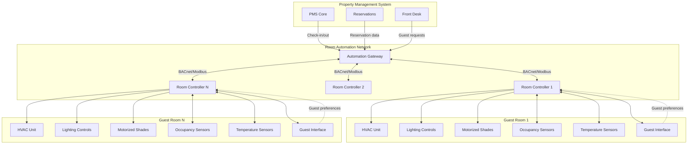

Системы автоматизации гостевых комнат представляют собой слияние управления HVAC, управления освещением и автоматизированного управления затемнением в единые платформы, которые оптимизируют потребление энергии при сохранении комфорта гостя. Эти интегрированные системы могут снизить энергопотребление гостевой комнаты на 20-45% по сравнению с традиционными отдельными системами управления, одновременно улучшая опыт гостя благодаря персонализированному управлению параметрами окружающей среды.

## Архитектура интеграции системы

Современная автоматизация гостевых комнат интегрирует несколько строительных систем через центральный контроллер или устройство шлюза, которое управляет всеми параметрами окружающей среды.

### Компоненты интеграции HVAC

Уровень интеграции HVAC подключает автоматизацию комнаты к оборудованию климат-контроля:

- **Управление фанкойлом**: модулирующее положение клапана, выбор скорости вентилятора (низкая/средняя/высокая) и переключение режимов работы
- **Интерфейс PTAC/VRF**: цифровая или аналоговая связь с блоками терминального типа или внутренними блоками с переменным расходом хладагента
- **Измерение температуры**: размещение нескольких датчиков (настенные, возвратный воздух, потолок) для точного измерения температуры в помещении
- **Обнаружение присутствия**: датчики PIR, контакты дверей и датчики кровати для проверки присутствия
- **Мониторинг окон/дверей**: магнитные контакты, которые запускают снижение параметров HVAC при обнаружении открытий

Система рассчитывает энергопотребление комнаты на основе параметров работы:

$$E_{room} = \int_0^t \left(Q_{cooling}(t) + Q_{heating}(t) + P_{fan}(t)\right) dt$$

где $Q_{cooling}$ и $Q_{heating}$ представляют тепловые нагрузки, а $P_{fan}$ — потребление мощности вентилятором за период времени $t$.

### Координация освещения и управления затемнением

Системы автоматического управления освещением и автоматизированного управления затемнением работают в координации с HVAC для минимизации общего энергопотребления:

- **Освещение на основе присутствия**: автоматическое отключение после освобождения комнаты с постепенным предупреждением о потускнении
- **Сбор дневного света**: затемнение на основе фотоэлемента периметровых светильников при достаточном естественном свете
- **Автоматизированные жалюзи**: автоматическое развертывание для снижения солнечного тепловыделения в периоды пикового охлаждения
- **Интеграция сценариев**: координированное позиционирование жалюзи и уровней освещения для различных видов деятельности

Снижение солнечного тепловыделения от автоматизированного управления затемнением можно количественно оценить:

$$Q_{solar,reduced} = A_{window} \cdot SHGC \cdot I_{solar} \cdot (1 - \eta_{shade})$$

где $A_{window}$ — площадь окна, $SHGC$ — коэффициент солнечного тепловыделения, $I_{solar}$ — интенсивность падающего солнечного излучения, а $\eta_{shade}$ — эффективность затемнения (обычно 0,60-0,85 для автоматизированных систем).

## Проектирование интерфейса для гостей

Интерфейс для гостей должен сбалансировать функциональность с интуитивным управлением, так как гости проводят минимальное время на изучение систем управления.

### Модальности интерфейса

**Управление на основе планшета**, установленное у кровати или входа, обеспечивает графические интерфейсы с регулировкой температуры, сценариями освещения и позиционированием жалюзи. Сенсорные интерфейсы должны использовать большие кнопки (минимум 44×44 пикселей) и четкую иконографию.

**Мобильные приложения** позволяют гостям управлять окружающей средой в комнате со смартфонов, обеспечивая кондиционирование перед прибытием и удаленную регулировку. Приложения должны работать как на iOS, так и на платформах Android с автономной функциональностью для критических функций.

**Интеграция голосового управления** с Amazon Alexa, Google Assistant или собственными голосовыми помощниками отеля обеспечивает управление без рук. Голосовые команды должны поддерживать обработку естественного языка: "Установи температуру 21 градус" или "Закрой жалюзи."

**Физические элементы управления** остаются необходимыми как вспомогательные интерфейсы. Настенные термостаты должны переопределять автоматические параметры и обеспечивать немедленную тактильную обратную связь.

### Программирование сценариев для экономии энергии

Предварительно запрограммированные сценарии оптимизируют энергопотребление при поддержке деятельности гостей:

| Название сценария | Параметр HVAC | Уровень освещения | Положение жалюзи | Снижение энергии |
|------------|---------------|----------------|------------------|------------------|
| Выезд | охлаждение 29°C / обогрев 15°C | Все выключены | 50% открыто | 45-60% |
| Вакантная | охлаждение 28°C / обогрев 17°C | Все выключены | Авто солнце | 35-50% |
| Сон | температура гостя - 1°C | 5% ночник | Закрыто | 15-25% |
| Отсутствие | температура гостя ± 2°C | Все выключены | Авто солнце | 25-40% |
| Добро пожаловать | 22°C | Вход + окружающее 75% | 30% открыто | Базовое |
| Занято | Предпочтение гостя | На основе сценария | Управление гостем | 5-15% |

Сценарий "Отсутствие" активируется после 30-45 минут отсутствия обнаружения движения, а "Выезд" срабатывает через интеграцию PMS при выезде гостя.

## Интеграция системы управления недвижимостью

Интеграция PMS обеспечивает автоматизированные переходы сценариев на основе статуса бронирования и присутствия:

- **Кондиционирование перед прибытием**: комната приводится в комфортные условия за 30-60 минут до регистрации
- **Обнаружение выезда**: немедленный переход в режим вакантной комнаты при подтверждении выезда PMS
- **Координация обслуживания**: HVAC и освещение остаются активными во время работы служб по уборке помещений
- **Предпочтения VIP**: предварительно загруженные параметры температуры и освещения для постоянных гостей

Протоколы связи обычно используют BACnet IP, Modbus TCP или собственные API с интерфейсами RESTful для двусторонней передачи данных.

## Системы обучения на предпочтениях гостей

Продвинутые платформы автоматизации включают алгоритмы машинного обучения, которые адаптируются к индивидуальным моделям поведения гостей.

### Механизмы обучения

**Отслеживание предпочтений температуры** записывает корректировки гостем начальных параметров и применяет полученные предпочтения к последующим постояниям. Система рассчитывает предпочитаемую температуру как:

$$T_{preferred} = T_{initial} + \frac{1}{n}\sum_{i=1}^{n}\Delta T_i$$

где $\Delta T_i$ представляет каждую корректировку, сделанную во время предыдущих постояний.

**Распознавание временных закономерностей** определяет, когда гости обычно корректируют условия (утреннее пробуждение, вечернее возвращение) и проактивно вносит эти изменения.

**Анализ использования сценариев** отслеживает, какие сценарии освещения и затемнения гости активируют чаще всего, и соответственно корректирует поведение по умолчанию.

### Соображения конфиденциальности и безопасности

Системы автоматизации гостевых комнат должны решать значительные проблемы конфиденциальности и безопасности данных:

**Прозрачность сбора данных**: отели должны четко раскрывать, какую информацию собирают системы автоматизации (предпочтения температуры, модели присутствия, время входа/выхода из комнаты).

**Политика хранения данных**: данные о предпочтениях гостей должны быть анонимизированы или удалены после выезда, если гости не явно согласились на сохранение для будущих постояний.

**Сегментация сети**: сети автоматизации комнат должны быть изолированы от гостевого WiFi и других сетей отеля для предотвращения несанкционированного доступа.

**Требования шифрования**: все коммуникации между интерфейсами гостей и контроллерами должны использовать шифрование TLS 1.3 или эквивалентное.

**Политика камер и микрофонов**: если развернуты голосовые помощники, должна быть четкая индикация активности микрофонов и явные механизмы отказа.

**Логирование доступа**: весь удаленный доступ сотрудников отеля к управлению комнатой должен регистрироваться с отметками времени и идентификацией персонала для целей аудита.

Физические меры безопасности включают защищенные от подделок кожухи для контроллеров и отключение портов USB/Ethernet, доступных гостям на устройствах интерфейса.

## Количественная оценка влияния на энергию

Кумулятивная экономия энергии от комплексной автоматизации комнаты может быть рассчитана как:

$$\Delta E_{annual} = N_{rooms} \times \left[\sum_{i=1}^{n}(E_{baseline,i} - E_{automated,i}) \times h_i\right] \times 365$$

где $N_{rooms}$ — общее количество комнат, $E_{baseline}$ и $E_{automated}$ — показатели энергопотребления для каждого режима работы, а $h_i$ представляет часы в сутки в каждом режиме.

Для 300-комнатного отеля с надлежащей конфигурацией автоматизации годовая экономия энергии обычно составляет 1 350 000-2 380 000 кВт⋅ч, что представляет снижение затрат на коммунальные услуги в размере 8 500-22 500 долл. США при типичных тарифах на коммерческое электричество.

## Рекомендации по внедрению

Успешное внедрение автоматизации комнаты требует тщательного внимания к наладке, обучению персонала и постоянной оптимизации. Контроллеры должны быть запрограммированы с соответствующими зонами нечувствительности (минимум ±1°C) для предотвращения скачков, а значения времени ожидания датчиков присутствия должны быть откалиброваны в соответствии с фактическими моделями поведения гостей, наблюдаемыми во время пилотных установок.

Интеграционное тестирование с системами PMS должно проверить все переходы состояний перед развертыванием по всему объекту, и должны быть установлены резервные режимы для отказа сети или контроллера, чтобы гарантировать сохранение комфорта гостя даже во время отключения системы.
