## Основы систем фанкойлов

Блоки фанкойлов (FCU) являются преобладающим решением для климат-контроля номеров гостей отелей, обеспечивая индивидуальное управление комнатой, разумную начальную стоимость и операционную гибкость. Система подаёт кондиционированный воздух через встроенный в шкаф блок, содержащий вентилятор, теплообменники охлаждения и отопления, а также воздушный фильтр, подключённый к центральным установкам охлаждённой воды и горячей воды.

Фундаментальное преимущество систем FCU заключается в их способности обеспечивать одновременное отопление и охлаждение различных зон при сохранении индивидуального управления гостем над значениями температурных установок. Эта возможность является необходимой в гостиничных приложениях, где соседние номера могут иметь существенно различающиеся тепловые нагрузки и характеры занятости.

## Двухтрубные и четырёхтрубные конфигурации систем

Выбор между двухтрубными и четырёхтрубными системами представляет наиболее критическое конструктивное решение для установок гостиничных фанкойлов.

**Двухтрубные системы** используют одну пару подачи и возврата, которая чередуется между горячей и охлаждённой водой сезонно. Центральная установка переключается между режимами отопления и охлаждения на основе наружной температуры или календарной даты. Хотя предлагают более низкую стоимость монтажа, двухтрубные системы не могут обеспечивать одновременное отопление и охлаждение, создавая операционные проблемы в переходные сезоны, когда комнаты на южной стороне требуют охлаждения, а на северной стороне требуется отопление.

**Четырёхтрубные системы** используют отдельные пары подачи и возврата для охлаждённой воды и горячей воды, обеспечивая круглогодичную доступность как отопления, так и охлаждения в каждом блоке фанкойла. Существенно более высокая стоимость монтажа (примерно на 40-60% больше, чем двухтрубные) компенсируется превосходным комфортом гостей и операционной гибкостью.

### Сравнение систем

| Параметр | Двухтрубная система | Четырёхтрубная система |
|----------|-------------------|----------------------|
| Стоимость трубопроводов | Ниже (базовая) | На 40-60% выше |
| Одновременное отопление/охлаждение | Нет | Да |
| Комфорт гостей | Хороший | Отличный |
| Производительность в переходные сезоны | Ограниченная | Полная возможность |
| Типичное применение | Экономичные/среднебюджетные отели | Премиальные/люксовые отели |
| Сложность управления | Простая | Умеренная |
| Энергоэффективность | Хорошая | Лучше (оптимизированные нагрузки) |
| Доступ для обслуживания | Стандартный | Больше точек присоединения |

## Конфигурации блоков фанкойлов

Блоки фанкойлов устанавливаются в вертикальной или горизонтальной ориентации в зависимости от архитектурных ограничений и требований производительности.

**Вертикальные блоки фанкойлов** монтируются под окнами или вдоль внешних стен, как правило, утопленные в шкаф или кожух. Вертикальная конфигурация обеспечивает:

- Прямое воздействие на холодные поверхности окон, снижение нисходящих потоков
- Удобный доступ гостей к элементам управления
- Компактный размер занимаемого пола
- Упрощённый отвод конденсата (гравитационный поток)
- Более лёгкое обслуживание фильтра

Стандартные размеры вертикальных блоков варьируются от 61-76 см в ширину, 76-107 см в высоту и 25-36 см в глубину, подходящие для типичных планировок мебели в номере.

**Горизонтальные блоки фанкойлов** устанавливаются над потолком или внутри шкафов с распределением воздуха через воздуховоды. Эта конфигурация обеспечивает:

- Улучшенную архитектурную эстетику (скрытое оборудование)
- Пониженную передачу шума в занятое пространство
- Большую гибкость в распределении воздуха
- Возможность интеграции приточного воздуха

Горизонтальная компоновка требует большего вертикального зазора (минимум 46-61 см) и создаёт необходимость в прокачке конденсата, добавляя сложность и точки обслуживания.

## Проектирование гидронной системы

Расчёты определения размера теплообменника определяют требуемые расходы воды и температурные разности. Фундаментальное уравнение передачи тепла:

$$Q = \dot{m} \cdot c_p \cdot \Delta T$$

где $Q$ представляет нагрузку помещения (кДж/ч), $\dot{m}$ — массовый расход воды (кг/ч), $c_p$ равен удельной теплоёмкости воды (4,18 кДж/кг-°C), и $\Delta T$ — разность температур на теплообменнике (°C).

Для типичного номера 37 м² с нагрузкой охлаждения 9,5 кДж/с и разностью температур 5,6°C:

$$\dot{m} = \frac{Q}{c_p \cdot \Delta T} = \frac{9500}{4,18 \times 5,6} = 406 \text{ кг/ч}$$

Преобразование в объёмный расход: $406 \text{ кг/ч} \div 1000 \text{ кг/м}^3 \times 60 \text{ мин/ч} = 0,24 \text{ м}^3\text{/ч}$

**Системы охлаждённой воды** обычно работают при температуре подачи 6-7°C с разностью 5,6-6,7°C. Соображения при проектировании включают:

- Минимальная скорость потока 0,61 м/с для предотвращения накопления воздуха
- Максимальная скорость 1,22 м/с для ограничения шума и эрозии
- Балансировочные клапаны на каждом блоке для регулирования расхода
- Двухходовые регулирующие клапаны для операции переменного расхода

**Системы горячей воды** обычно используют температуру подачи 60-82°C с разностью 11-17°C. Более высокие температурные разности снижают требуемые расходы и размеры труб, но увеличивают риск конденсации на подающем трубопроводе, требуя более обширную теплоизоляцию.

## Управление конденсатом

Надлежащий отвод конденсата имеет решающее значение для предотвращения повреждений водой и микробного роста. Во время операции охлаждения теплообменники производят конденсат со скоростью, пропорциональной скрытой нагрузке:

$$\dot{m}_{condensate} = \frac{Q_{latent}}{h_{fg}}$$

где $Q_{latent}$ представляет скрытую нагрузку охлаждения и $h_{fg}$ равен теплоте испарения (примерно 2,450 кДж/кг при типичных условиях теплообменника).

Для номера с скрытой нагрузкой 2,64 кДж/с: $\dot{m}_{condensate} = 2640/2450 = 1,08 \text{ кг/ч} = 0,00108 \text{ м}^3\text{/ч}$

**Требования системы отвода:**

- Минимальный диаметр дренажной линии 19 мм
- Минимальный уклон 3,3 мм на 300 мм для гравитационного отвода
- U-образный сифон с минимальной глубиной герметизации 51 мм для предотвращения потока воздуха
- Точки доступа для очистки каждые 15 м
- Защита переполнения со вторичным сливом или датчиком
- Теплоизолированные дренажные трубопроводы в зонах ниже температуры точки росы

Горизонтальные блоки фанкойлов требуют конденсатных насосов, рассчитанных на полную динамическую высоту, включая вертикальный подъём плюс трение трубопровода. Насосы должны обрабатывать пиковое производство конденсата с адекватным резервом (обычно 150% расчётного пика).

## Акустическая производительность и комфорт гостей

Уровни звука напрямую влияют на удовлетворённость гостей и рейтинги отелей. Блоки фанкойлов генерируют шум от работы вентилятора, турбулентности потока воздуха и потока воды через регулирующие клапаны.

Целевые уровни звука для номеров гостей отелей варьируются от NC-25 до NC-30 (примерно 30-35 дBA), с премиальными свойствами, часто указывающими NC-25 или ниже. Выбор фанкойла должен учитывать уровни звуковой мощности при всех скоростях вентилятора:

- Низкая скорость: максимум NC-25 до NC-30
- Средняя скорость: максимум NC-30 до NC-35
- Высокая скорость: максимум NC-35 до NC-40

**Стратегии акустического контроля:**

- Укажите блоки фанкойлов с данными производительности, оценёнными по звуку
- Установите пады виброизоляции под вертикальные блоки
- Используйте гибкие соединения трубопроводов для предотвращения структурного шума
- Выберите двухходовые регулирующие клапаны с характеризованным потоком для тихой работы
- Обеспечьте надлежащий зазор вокруг блоков для предотвращения турбулентности воздуха
- Ограничьте скорость выхода воздуха до 2,0-2,5 м/с на решётках
- Расположите блоки вдали от стен над кроватью, когда это возможно

## Доступ фильтра и обслуживание

Доступность для обслуживания напрямую влияет на производительность системы и операционные затраты. Фильтры блока фанкойла в номере требуют ежемесячной проверки и квартальной замены при типичных условиях работы.

**Спецификации фильтра:**

- Рейтинг MERV 7-8 для стандартных приложений
- MERV 10-11 для улучшенного качества воздуха в помещении
- Одноквадратные гофрированные одноразовые фильтры (наиболее распространённые)
- Двухквадратные фильтры для расширенных интервалов обслуживания
- Магнитные рамы фильтров для удаления без инструментов

Вертикальные блоки фанкойлов обеспечивают превосходный доступ к обслуживанию через фронтально установленные панели или съёмные решётки. Зазоры при проектировании должны обеспечивать удаление фильтра без перемещения мебели (минимум 61 см свободного пространства).

Горизонтальные блоки требуют панелей доступа на потолке, расположенные непосредственно ниже местоположений фильтра, с надлежащим зазором для выдвижения фильтра (обычно минимум 76 см). Согласуйте расположение панелей доступа с архитектурными планами отражённого потолка, чтобы избежать конфликтов с осветительными приборами, головками спринклеров или другим монтируемым на потолке оборудованием.

**Программирование обслуживания:**

- Установите графики замены фильтров на основе характеров занятости
- Следите за перепадом давления на теплообменниках для обнаружения загрязнения
- Проверяйте конденсатные поддоны ежеквартально на предмет биологического роста
- Проверяйте работу регулирующего клапана ежегодно
- Очищайте поверхности теплообменника каждые 2-3 года в зависимости от условий окружающей среды

## Диаграмма конфигурации системы

```mermaid
graph TB
    subgraph "Четырёхтрубная система фанкойлов"
        A[Центральная установка охлаждения] -->|6°C подача| B[Магистраль подачи охлаждённой воды]
        B --> C[Блок фанкойла - номер 1]
        B --> D[Блок фанкойла - номер 2]
        C -->|11°C возврат| E[Магистраль возврата охлаждённой воды]
        D -->|11°C возврат| E
        E --> A

        F[Центральная установка отопления] -->|71°C подача| G[Магистраль подачи горячей воды]
        G --> C
        G --> D
        C -->|60°C возврат| H[Магистраль возврата горячей воды]
        D -->|60°C возврат| H
        H --> F

        C --> I[Дренаж конденсата - номер 1]
        D --> J[Дренаж конденсата - номер 2]
        I --> K[Система отвода здания]
        J --> K
    end

    subgraph "Компоненты блока фанкойла"
        L[Воздух обратно] --> M[Фильтр]
        M --> N[Охлаждающий теплообменник]
        N --> O[Нагревающий теплообменник]
        O --> P[Вентилятор]
        P --> Q[Подаваемый воздух в номер]
        N -.->|Конденсат| R[Поддон конденсата]
        R --> S[U-образный сифон]
        S --> T[Дренажная линия]
    end

    style A fill:#e1f5ff
    style F fill:#ffe1e1
    style C fill:#f0f0f0
    style D fill:#f0f0f0
```

Системы фанкойлов продолжают доминировать в приложениях HVAC номеров гостей отелей благодаря их проверенной надёжности, возможностям управления гостями и разумным затратам жизненного цикла. Надлежащий выбор системы, монтаж и техническое обслуживание обеспечивают оптимальный тепловой комфорт при минимизации акустических помех и операционных расходов.
