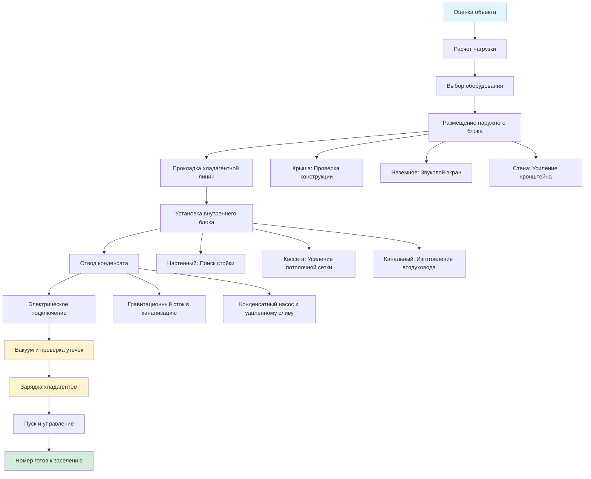

## Обзор мини-сплит систем в гостиничном хозяйстве

Мини-сплит системы обеспечивают гибкое и энергоэффективное климатическое управление для номеров отелей, особенно полезны при реновации и в объектах, где центральное воздуховодное распределение невозможно. Эти системы состоят из наружных конденсационных блоков, подключенных к внутренним воздухообрабатывающим устройствам через хладагентные линии, предлагая как бесканальные, так и канальные конфигурации, чтобы соответствовать различным архитектурным ограничениям.

Основное преимущество для гостиничных приложений заключается в индивидуальном управлении комнатой, сниженной сложности установки по сравнению с традиционными канальными системами и возможности реализации зонального комфорта без крупных структурных изменений.

## Бесканальные и канальные опции мини-сплит

**Бесканальные мини-сплит системы** устанавливают настенные, потолочные кассеты или напольные внутренние блоки непосредственно в номерах отеля. Они полностью исключают воздуховоды, что идеально подходит для:

- Переоборудования исторических зданий с ограниченным пространством потолка
- Бутик-отелей с уникальными архитектурными особенностями
- Проектов реновации с минимизацией помех для гостей
- Объектов с недостаточным вертикальным пространством

**Канальные мини-сплит системы** подключаются к короткопролетным воздуховодам, спрятанным над потолками или в софитах, обеспечивая:

- Заподлицо потолочные решетки для эстетической интеграции
- Несколько точек подачи в более крупных помещениях
- Лучшую осушку через более длительный контакт воздуха с катушками
- Снижение видимости настенного оборудования

Мощность охлаждения типичных номеров варьируется от 2,6 до 5,3 кВ, с мощностью нагрева в зависимости от технологии компрессора и условий наружной температуры.

## Преимущества для реновации отелей

Мини-сплит системы превосходны в сценариях реновации:

**Гибкость установки**: Хладагентные магистрали (обычно 1/4" жидкостные и 3/8" до 1/2" всасывающие линии) требуют только 7,6 сантиметровых проходок через стены, по сравнению с 30-60 сантиметровыми воздуховодными шахтами для традиционных систем. Это сохраняет структурную целостность и минимизирует нарушение строительства.

**Поэтапная реализация**: Отели могут модернизировать номер за номером или этаж за этажом без отключения целых крыльев, поддерживая доход во время реновации.

**Рекуперация энергии**: Замена устаревших PTAC блоков на инверторные мини-сплит может снизить потребление энергии на 30-50% за счет:

- Работы компрессора с переменной производительностью, соответствующей нагрузке
- Устранения инфильтрации наружного воздуха вокруг стенных втулок
- Более высокие значения SEER (18-30 vs. 8-12 для PTAC)

**Сниженный шум**: Современные внутренние блоки мини-сплит работают на уровне 19-35 дBA, значительно тише, чем блоки PTAC (40-50 dBA), улучшая комфорт гостей.

## Многозонные конфигурации для люксов

Номера люкс получают выгоду от многозонных мини-сплит систем, подключающих несколько внутренних блоков (2-8 зон) к одному наружному конденсационному блоку. Мощность наружного блока должна удовлетворять:

$$Q_{наружный} = \sum_{i=1}^{n} Q_{внутренний,i} \times CF$$

где $Q_{наружный}$ — мощность наружного блока, $Q_{внутренний,i}$ — мощность каждого внутреннего блока, и $CF$ — коэффициент подключения (обычно 1,0-1,3 в зависимости от производителя и предположений одновременной работы).

**Пример распределения зон** для люкса с двумя спальнями:

- Гостиная: 3,5 кВ потолочная кассета
- Главная спальня: 2,6 кВ настенный блок
- Вторая спальня: 2,6 кВ настенный блок
- Наружный блок: 10,6 кВ (коэффициент подключения 1,2)

Каждая зона поддерживает независимое управление температурой, приспосабливаясь к различным моделям занятости и предпочтениям гостей.

## Требования по управлению конденсатом

Надлежащий отвод конденсата критичен для надежной работы:

**Гравитационный отвод**: Внутренние блоки требуют минимум уклон 1/40 на линиях конденсата к точкам слива. В многоэтажных установках вертикальные стояки заканчиваются в напольные сливы или подключение к санитарным системам.

**Системы конденсатных насосов**: Когда гравитационный отвод невозможен, интегральные или вспомогательные конденсатные насосы поднимают воду к удаленным точкам слива. Насосы должны обрабатывать пиковое производство конденсата:

$$\dot{m}_{конденсат} = \frac{Q_{скрытый}}{h_{fg}}$$

где $\dot{m}_{конденсат}$ — расход массы конденсата (кг/ч), $Q_{скрытый}$ — скрытая мощность охлаждения (кДж/ч), и $h_{fg}$ — скрытая теплота парообразования (приблизительно 2 448 кДж/кг при стандартных условиях).

Для блока 3,5 кВ с 30% скрытой мощностью: $\dot{m}_{конденсат} = \frac{1 050}{2 448} = 0,43$ кг/ч (приблизительно 0,43 л/ч).

**Размер линии конденсата**: Минимум 1,9 см внутреннего диаметра трубопровода предотвращает блокировку воздухом и обеспечивает положительный слив. Линии должны быть изолированы при прокладке через кондиционируемые пространства, чтобы предотвратить вторичное образование конденсата.

**Защита от перелива**: Вторичные поддоны конденсата с независимым сливом или выключатели переполнения предотвращают повреждение водой от закупорок основного слива — существенно для потолочных кассет над номерами гостей.

## Соображения по размещению наружного блока

Расположение наружного конденсационного блока значительно влияет на производительность системы, эстетику и обслуживание:

**Размещение на крыше**: Распространено для многоэтажных отелей, требует:

- Оценки конструкции для веса оборудования и вибрации
- Ограничения длины хладагентной линии (обычно максимум 45-60 м)
- Соображения вертикального подъема, влияющие на возврат масла компрессора
- Акустические барьеры, если рядом люксы пентхауса или крышные удобства

**Наземное размещение**: Подходит для низкоэтажных объектов:

- Экраны звукоослабления, поддерживающие минимум 0,9 м зазора для воздушного потока
- Охранное ограждение, предотвращающее вандализм или манипуляции
- Приподнятые платформы в подверженных наводнениям районах (минимум 30 см выше базовой отметки наводнения)
- Интеграция озеленения при сохранении доступа обслуживания

**Крепление на внешней стене**: Используется в ограниченных приложениях:

- Усиленные кронштейны, способные поддерживать блоки 45-140 кг плюс снег/ледяные нагрузки
- Накладки виброизоляции, снижающие передачу вибраций через конструкцию
- Зазор от открывающихся окон (минимум 3 м) и воздушных поступлений (6 м)
- Эстетическое экранирование, совместимое с фасадом здания

**Ограничения длины линии и высоты**: Производительность хладагентного контура ухудшается за пределами, указанными производителем. Для разницы высот более 15 м, ловушки масла каждые 9-12 м вертикального подъема обеспечивают надлежащую смазку компрессора.

## Доступ для обслуживания и техническое обслуживание

Доступный дизайн облегчает плановое обслуживание и экстренное обслуживание:

**Зазоры обслуживания внутреннего блока**: Поддерживайте минимум 30 см зазора над потолочными кассетами для доступа к фильтру, 15 см по бокам для электрических отключателей и полный зазор панели спереди для очистки катушки.

**Обслуживание фильтра**: Установите расписание очистки фильтров 2-4 недели на основе занятости и местного качества воздуха. Моющиеся сетчатые фильтры снижают эксплуатационные затраты по сравнению с одноразовыми фильтрующими материалами.

**Портов обслуживания хладагента**: Размещайте наружные блоки с адекватным зазором (90 см на стороне обслуживания) для подключения манометрического коллектора, рекуперации хладагента и замены компрессора при необходимости.

**Доступ во время занятости гостей**: Планируйте профилактическое обслуживание в периоды низкой занятости. Настенные блоки позволяют быстрое обслуживание фильтра без перемещения гостей; потолочные кассеты могут требовать свободного номера во время расширенной очистки катушки.

**Интеграция удаленного мониторинга**: Подключайте мини-сплит системы к системам управления зданием (BMS) через BACnet, Modbus или собственные протоколы, обеспечивая:

- Обнаружение неисправностей и диагностику, снижающие время отклика обслуживания
- Мониторинг энергии и ограничение спроса в периоды пик
- Автоматизацию отката на основе занятости, когда номера пусты
- Прогнозное планирование обслуживания на основе часов работы

## Сравнение конфигураций мини-сплит

| Конфигурация | Тип внутреннего блока | Типичная мощность | Приложения | Преимущества | Ограничения |
|--------------|------------------|------------------|--------------|------------|-------------|
| **Однозонный бесканальный** | Настенный | 2,6-5,3 кВ | Стандартные номера | Самая низкая стоимость, простая установка | Видимое оборудование, прямой воздушный поток |
| **Однозонный канальный** | Скрытый воздуховод | 2,6-7,0 кВ | Номера, требующие эстетической интеграции | Заподлицо решетки, распределенный воздух | Более высокая стоимость установки, требует пространства потолка |
| **Однозонная кассета** | Потолочная кассета | 2,6-7,0 кВ | Номера с адекватной высотой потолка | 360° воздушный поток, равномерное распределение | Требует 30 см глубины плены |
| **Многозонная (2-4 зоны)** | Смешанные типы | 5,3-14,1 кВ всего | Номера люкс, многокомнатные блоки | Независимое управление зоной, единый наружный блок | Сложная хладагентная разводка |
| **Многозонная (5-8 зон)** | Смешанные типы | 14,1-28,2 кВ всего | Крупные люксы, этажи бутик-отеля | Максимальная гибкость, централизованное оборудование | Размер наружного блока, продвинутые элементы управления |

## Рабочий процесс установки

## Сводка проектных соображений

Успешная реализация мини-сплит в отелях требует балансировки производительности, эстетики и операционной эффективности. Ключевые приоритеты проектирования включают:

1. **Правильный выбор размера оборудования** для избежания цикличной работы и проблем с контролем влажности
2. **Минимизация длины хладагентных линий** для поддержания эффективности и возврата масла
3. **Обеспечение положительного отвода конденсата** с резервной защитой от переполнения
4. **Размещение наружных блоков** для технического обслуживания при минимизации передачи шума
5. **Интеграция элементов управления** для управления энергией и комфортом гостей

При надлежащем проектировании и обслуживании мини-сплит системы обеспечивают превосходный комфорт, энергетическую производительность и операционную гибкость по сравнению с традиционными PTAC блоками или центральными системами в гостиничных приложениях.
