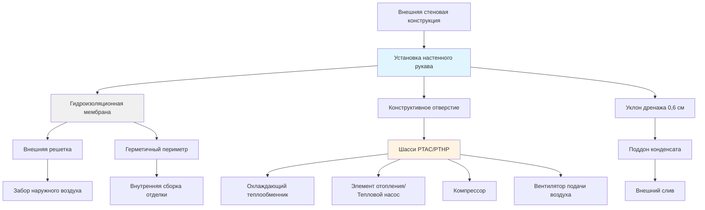

## Типы блоков PTAC и PTHP и их возможности

Упакованные терминальные кондиционеры воздуха (PTAC) и упакованные терминальные тепловые насосы (PTHP) представляют наиболее широко развернутые системы климатического контроля в гостиничной индустрии. Эти автономные блоки интегрируют все компоненты холодильного цикла в единый шасси, установленный через внешнюю стену.

**Блоки PTAC** обеспечивают охлаждение и электрическое сопротивление или отсутствие отопления. Стандартные мощности охлаждения варьируются от 20,6 до 44,0 кДж/ч, при этом наиболее распространены 26,4 и 35,2 кДж/ч для типичных гостиничных номеров. Требуемую мощность охлаждения можно оценить, используя:

$$Q_{cooling} = Q_{sensible} + Q_{latent} = (1.08 \times CFM \times \Delta T) + (0.68 \times CFM \times \Delta W)$$

где $\Delta T$ — разность температур (°C) и $\Delta W$ — разность коэффициента влажности (г/кг).

**Блоки PTHP** используют холодильный цикл с реверсированием как для охлаждения, так и для отопления, обеспечивая превосходную эффективность отопления по сравнению с электрическим сопротивлением. Работа теплового насоса становится менее эффективной при температуре наружного воздуха примерно 2°C и ниже, после чего автоматически включается дополнительное электрическое сопротивительное отопление.

Современные блоки оснащены цифровыми органами управления с программируемыми терморегуляторами, датчиками присутствия для работы в режиме пониженного потребления и различными режимами вентиляции. Премиальные модели включают:

- Компрессоры переменной скорости для улучшенного комфорта и эффективности
- Вентиляторы рекуперации тепла для подачи свежего воздуха с рекуперацией энергии
- Встроенные системы очистки воздуха
- Возможности удаленного мониторинга для управления объектами

## Требования к установке настенного рукава

Настенный рукав служит постоянным конструктивным компонентом, в котором размещается шасси PTAC/PTHP. Надлежащая установка требует тщательного внимания к целостности ограждающей конструкции здания.

**Расположение рукава** должно учитывать конструктивные соображения, при этом нижняя часть рукава обычно находится на высоте 30–45 см над готовым полом, чтобы позволить размещение мебели при сохранении доступности для обслуживания. Рукава не должны пересекать конструктивные элементы без инженерного одобрения.

**Гидроизоляция** критична для предотвращения проникновения воды и утечек воздуха. Последовательность установки включает:

1. Черновое отверстие размером на 1,3 см больше, чем размеры рукава
2. Применение самоклеящейся гидроизоляционной мембраны по периметру отверстия
3. Установку рукава с непрерывным валиком герметика на границе раздела со стеной
4. Крепление внешней решетки с герметичными крепежными проходами
5. Установку внутренней отделки с прокладкой герметика к отделке стены

**Уклон рукава** должен быть направлен на внешнюю сторону с уклоном 0,6 см для обеспечения дренажа конденсата. Неправильный уклон приводит к накоплению воды внутри блока, что вызывает коррозию и микробный рост.

**Электрические соображения** требуют выделенных цепей 208–230 В, обычно 20 А для блоков до 35,2 кДж/ч и 30 А для больших емкостей. Розетки должны быть размещены таким образом, чтобы позволить полное удаление шасси без отключения питания во время обслуживания.

## Акустические характеристики и комфорт гостя

Акустические характеристики напрямую влияют на удовлетворение гостей и являются критерием выбора. Шум блоков PTAC/PTHP исходит от работы компрессора, двигателя вентилятора и турбулентности потока воздуха.

**Уровни звука** оцениваются в двух условиях:
- **Звук при работе** (компрессор работает): типично 45–55 дБА, премиальные блоки достигают 42–48 дБА
- **Режим только вентилятора**: типично 38–45 дБА

Гостиничные номера должны иметь целевой максимальный уровень звука 40–45 дБА для учреждений среднего уровня и 35–40 дБА для высококлассных гостиниц. Блоки с рейтингом выше 50 дБА вызывают частые жалобы гостей.

**Стратегии снижения шума** включают:
- Изолирующее крепление компрессора для минимизации передачи вибраций
- Акустическую изоляцию внутри корпуса блока
- Конструкции лопастей вентилятора с развертыванием для уменьшения турбулентности воздуха
- Работу переменной скорости, избегающую высокошумных режимов полной мощности

## Стандарты энергоэффективности

Министерство энергетики США устанавливает минимальные стандарты эффективности для оборудования PTAC и PTHP в соответствии с 10 CFR Part 431. Текущие стандарты, внедренные в 2022 году, представляют значительные улучшения по сравнению с предыдущими требованиями.

| Диапазон мощности | PTAC EER охлаждения | PTHP EER охлаждения | PTHP COP отопления |
|---|---|---|---|
| < 20,6 кДж/ч | 11,9 | 11,9 | 3,2 |
| 20,6–29,3 кДж/ч | 11,3 | 11,3 | 3,2 |
| 29,3–38,1 кДж/ч | 10,7 | 10,8 | 3,2 |
| 38,1–44,0 кДж/ч | 10,0 | 10,1 | 3,0 |

**Коэффициент энергоэффективности охлаждения (EER)** рассчитывается как:

$$EER = \frac{Q_{cooling} \text{ (кДж/ч)}}{P_{input} \text{ (Вт)}}$$

**Коэффициент эффективности (COP)** для режима отопления:

$$COP = \frac{Q_{heating} \text{ (кДж/ч)}}{P_{input} \text{ (Вт)} \times 3.412}$$

Модели премиальной эффективности превышают минимальные стандарты на 15–25%, при этом блоки достигают значений EER 12,5–13,5 для емкости 26,4 кДж/ч. Экономия энергозатрат в течение 10–12-летнего срока службы блока обычно оправдывает 20–30% более высокую первоначальную стоимость оборудования.

## Соображения по обслуживанию и замене

Системы PTAC/PTHP требуют регулярного обслуживания для поддержания производительности и продления срока службы. Автономная конструкция позволяет обслуживать отдельные блоки без влияния на другие гостиничные номера.

**Интервалы планового обслуживания:**
- **Очистка/замена фильтра**: Ежемесячно в периоды интенсивного использования, ежеквартально в периоды низкой загрузки
- **Очистка теплообменника**: Ежегодно для испарителя и конденсатора
- **Обработка поддона конденсата**: Ежеквартальное применение таблеток биоцида
- **Полное обследование**: Ежегодно, включая проверку холодильного заряда, натяжение электрических соединений, калибровку управления

**Срок службы** варьируется от 10–15 лет в зависимости от интенсивности использования, качества обслуживания и условий окружающей среды. Установки в прибрежных районах испытывают ускоренную коррозию, сокращающую срок службы до 8–10 лет без специального защитного покрытия.

**Стратегии замены** делятся на две категории:

1. **Реактивная замена**: Блоки заменяются при выходе из строя, что приводит к вызовам аварийного обслуживания и беспокойству гостей
2. **Циклы плановой замены**: Систематическая замена на основе возраста блока, обычно 12 лет, позволяющая получить скидки при массовых закупках и запланировать установку в периоды низкой загрузки

Плановый подход снижает общие затраты жизненного цикла на 15–20% за счет избежания премий за аварийное обслуживание и улучшенного массового ценообразования.

**Замена только шасси в сравнении с полной заменой**: Современные стандарты рукавов позволяют замену только шасси, когда рукава остаются в пригодном для эксплуатации состоянии. Полная замена становится необходимой при:
- Коррозии рукава, нарушающей конструктивную целостность
- Повреждении водой стеновой конструкции
- Изменениях требований к размеру блока
- Размеры рукава несовместимы с предложениями текущих продуктов

## Приложения по классу гостиницы

Критерии выбора PTAC/PTHP значительно различаются в зависимости от сегмента гостиничного рынка на основе ожиданий гостей, операционных приоритетов и бюджетных ограничений.

**Экономические/ограниченные сервисные гостиницы** (придорожные мотели, бюджетные сети):
- Блоки стандартной эффективности (соответствие минимуму DOE)
- Емкость 26,4–35,2 кДж/ч
- Базовые механические органы управления приемлемы
- Акустические характеристики 48–52 дБА приемлемы
- Минимизация первоначальной стоимости приоритизируется
- PTAC с электрическим сопротивлением отопления распространен

**Гостиницы среднего уровня** (деловые гостиницы, сервис-сервис бренды):
- Эффективность выше минимума (EER 11,5–12,5)
- Цифровые органы управления с программируемым режимом пониженного потребления
- Целевые акустические характеристики 44–48 дБА
- PTHP предпочтителен для снижения операционных затрат
- Типичны 10-летние циклы замены

**Высококлассные/полнофункциональные гостиницы** (высокопроизводительные сети, бутик-отели):
- Модели премиальной эффективности (EER 12,5+)
- Сверхтихая работа (40–44 дБА)
- Продвинутые органы управления с датчиком присутствия
- Конструкции внешней решетки с эстетическим дизайном
- Более частые циклы замены (8–10 лет)
- Часто заменяются центральными системами при капитальных ремонтах

**Гостиницы для длительного проживания**:
- PTHP настоятельно рекомендуется из-за более длительных периодов проживания
- Улучшенная фильтрация для лучшего качества воздуха
- Желательны возможности индивидуального измерения
- Долговечность приоритизируется над первоначальной стоимостью

Подход PTAC/PTHP остается доминирующим при строительстве новых гостиниц для объектов высотой менее 4 этажей благодаря низкой первоначальной стоимости, простоте установки, индивидуальному управлению номерами и простым требованиям к обслуживанию. Альтернативы с центральными системами становятся экономически конкурентоспособными в основном в высотных зданиях или объектах, где превосходная акустика оправдывает значительный премиум затрат.
