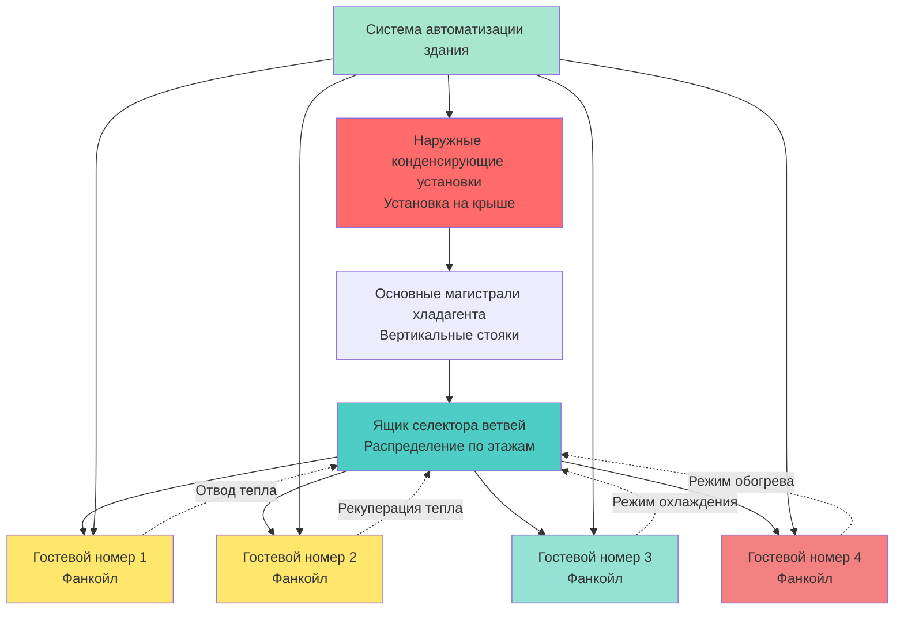

Системы переменного расхода хладагента (VRF) стали преобразующей технологией для приложений HVAC в гостиницах, обеспечивая беспрецедентную гибкость, энергоэффективность и контроль комфорта гостей. Эти системы используют компрессоры с переменной скоростью и электронные расширительные клапаны для точного модулирования расхода хладагента к отдельным гостевым номерам в зависимости от реальной потребности.

## Архитектура системы VRF для гостиниц

Установки VRF в гостиницах обычно используют распределенную архитектуру с центральными наружными конденсирующими установками, соединенными с несколькими внутренними фанкойлами через сеть трубопроводов хладагента. Конфигурация состоит из:

**Наружные блоки**: Высокопроизводительные конденсирующие установки (типичная мощность 71-255 кВт) установленные на крышах или в механических мастерских, оборудованные компрессорами с переменной скоростью с инвертором и несколькими контурами хладагента для резервирования.

**Распределение трубопроводов хладагента**: Основные магистрали проходят вертикально через механические шахты, а ответвленные контуры проходят горизонтально по коридорам для обслуживания отдельных гостевых номеров. Трубопроводы могут протягиваться на расстояние до 305 м от наружных блоков с разницей высот до 110 м, обеспечивая гибкие планировки зданий.

**Внутренние фанкойлы**: Скрытые потолочные кассеты, канальные агрегаты или настенные терминалы установленные в каждом гостевом номере, обычно мощностью 2,1-5,3 кВт. Агрегаты работают независимо с отдельными термостатами, позволяя точный контроль температуры.

**Ящики селектора ветвей (BS Box)**: Распределительные ящики, которые распределяют хладагент от основных магистралей к отдельным внутренним агрегатам, обеспечивая одновременное охлаждение и обогрев по различным зонам.

## Рекуперация тепла между номерами

Системы VRF с рекуперацией тепла представляют значительный прогресс для гостиниц, захватывая тепловую энергию, отклоняемую номерами в режиме охлаждения, и перенаправляя ее в номера, требующие обогрева. Эта способность одновременного охлаждения и обогрева обеспечивает существенную экономию энергии.

Процесс рекуперации тепла работает через управление контуром хладагента. Когда номер A требует охлаждения (отклоняя тепло) и номер B требует обогрева, система передает тепловую энергию непосредственно между зонами через сеть хладагента, обходя наружный блок полностью. Только разница между нагрузками обогрева и охлаждения требует работы наружного блока.

Экономия энергии от рекуперации тепла составляет 20-40% по сравнению с обычными системами, с наибольшими преимуществами в переходные сезоны, когда некоторые номера требуют обогрева (ориентированные на север, свободные) в то время как другие нуждаются в охлаждении (занятые, ориентированные на юг).

Эффективность системы можно quantified:

$$\eta_{HR} = \frac{Q_{recovered}}{Q_{heating} + Q_{cooling}} \times 100\%$$

где $\eta_{HR}$ представляет эффективность рекуперации тепла, $Q_{recovered}$ - тепловая энергия передаваемая между зонами, а $Q_{heating}$ и $Q_{cooling}$ - общие нагрузки обогрева и охлаждения.

## Возможности индивидуального управления номерами

Системы VRF обеспечивают гибкость управления гостевым номером, несравнимую с обычными системами. Каждый номер функционирует как независимая зона с выделенным управлением термостатом, позволяя гостям регулировать температуру с шагом 0,3°C и выбирать режимы работы (охлаждение, обогрев, авто, только вентилятор).

Расширенная интеграция обеспечивает:

**Управление на основе занятости**: Датчики открытия дверей и датчики движения взаимодействуют с контроллером сети VRF для реализации стратегий снижения нагрузки когда номера не заняты, уменьшая потребление энергии на 25-35% без ущерба для комфорта гостя.

**Удаленное управление**: Интеграция с системой управления имуществом (PMS) позволяет персоналу горничной предварительно кондиционировать номера перед прибытием гостя и менеджерам объектов внедрять энергетическую политику во время продолжительных периодов вакантности.

**Тихая работа**: Внутренние блоки работают с уровнями звука 25-35 дBA на низкой скорости, необходимые для удовлетворения гостей. Работа с переменной скоростью поддерживает уровни звука ниже критериев NC-30 для спальных зон.

## Преимущества энергоэффективности

Системы VRF достигают исключительной эффективности через несколько механизмов:

**Модуляция переменной производительности**: Компрессоры с инвертором регулируют выходную мощность от 10-100% для точного соответствия нагрузкам здания, исключая потери от циклирования присущие системам с фиксированной производительностью. Значения сезонного коэффициента энергоэффективности (SEER) достигают 18-22, по сравнению с 12-14 для обычных сплит-систем.

**Производительность при частичной нагрузке**: Гостиницы редко работают на пиковых расчетных условиях. Системы VRF поддерживают высокую эффективность при частичной нагрузке через снижение производительности компрессора и управление расходом хладагента. Рейтинги интегрированного значения при частичной нагрузке (IPLV) 20-25 EER отражают реальную производительность.

Годовое потребление энергии может быть оценено:

$$E_{annual} = \sum_{i=1}^{8760} \frac{Q_i}{COP_i \times PLR_i}$$

где $Q_i$ - часовая нагрузка охлаждения/обогрева, $COP_i$ - коэффициент производительности при условиях работы, и $PLR_i$ - модификатор эффективности коэффициента частичной нагрузки.

**Сниженные потери в распределении**: Трубопроводы хладагента испытывают минимальные тепловые потери по сравнению с охлажденной водой или канальными воздушными системами. Плотность энергии хладагента позволяет использовать меньшие размеры труб (1,3-5,1 см медные) в сравнении с гидравлическими трубопроводами 10-30 см.

## Сравнение систем

| Параметр | Система VRF | Обычный PTAC | 4-трубный фанкойл |
|----------|------------|------------|--------------|
| SEER/EER | 18-22 / 13-15 | 9-11 / 9-10 | 12-14 / 11-12 |
| Индивидуальное управление номерами | Полностью переменное | Вкл/Выкл или 2-ступень | Модулирующий клапан |
| Рекуперация тепла | Да (модели HR) | Нет | Нет |
| Уровень шума (dBA) | 25-35 | 45-52 | 35-42 |
| Местоположение обслуживания | Доступ из помещения | Через стену | Доступ из помещения |
| Воздух вентиляции | Отдельная система DOAS требуется | Встроенный вариант | Отдельная система |
| Заряд хладагента (кг/кВт) | 1,7-2,9 | 1,4-1,8 | N/A (водяная система) |
| Размер трубопровода (типичный) | 1,3-2,9 см медь | Заводское исполнение | 1,9-3,2 см вода |

## Анализ первоначальной стоимости и стоимости эксплуатации

Системы VRF требуют более высоких первоначальных инвестиций по сравнению с обычными вариантами HVAC для гостиниц:

**Премия первоначальной стоимости**: Расходы на установку VRF составляют 9000-14000 долл. США за номер по сравнению с 5000-7500 долл. США для агрегатов PTAC и 7000-10500 долл. США для 4-трубных фанкойлов. Премия отражает специальное оборудование, установку трубопровода хладагента и интеграцию средств управления.

**Экономия стоимости эксплуатации**: Годовая экономия энергии 30-45% обычно обеспечивает периоды простой окупаемости 4-7 лет. Гостиница на 200 номеров, потребляющая 450000 кВт·ч/год на HVAC по 0,12 долл. США/кВт·ч может экономить 18000-24000 долл. США в год при внедрении VRF.

Анализ затрат жизненного цикла за 20-летний срок службы оборудования демонстрирует экономическое превосходство VRF:

$$LCC = FC + \sum_{t=1}^{20} \frac{OC_t + MC_t}{(1+r)^t}$$

где $LCC$ - стоимость жизненного цикла, $FC$ - первоначальная стоимость, $OC_t$ - стоимость эксплуатации в год t, $MC_t$ - стоимость обслуживания, и $r$ - коэффициент дисконтирования (обычно 3-5%).

**Рассмотрения обслуживания**: Системы VRF требуют специальной подготовки техников и протоколов обнаружения утечек хладагента. Средние годовые расходы на обслуживание составляют 175-290 долл. США за номер по сравнению с 115-200 долл. США для агрегатов PTAC, компенсируемые продленным сроком службы оборудования (20-25 лет VRF против 10-15 лет PTAC).

## Интеграция с системой автоматизации здания

Современные системы VRF беспрепятственно интегрируются с системами автоматизации зданий (BAS) гостиниц через стандартизированные протоколы связи:

**Интеграция BACnet/Modbus**: Контроллеры сети VRF взаимодействуют с центральными платформами BAS, обеспечивая возможности мониторинга, сигнализации и управления на уровне всей системы. Интеграция обеспечивает энергетические панели отображающие потребление в реальном времени по зонам, этажам или всему имуществу.

**Связь с системой управления имуществом**: Интеграция PMS синхронизирует работу HVAC с данными бронирования. Системы автоматически регулируют уставки в зависимости от графиков регистрации заезда/выезда, оптимизируя использование энергии при обеспечении комфорта гостей при прибытии.

**Возможность реагирования на спрос**: Сетевые интерактивные элементы управления позволяют участие в программах реагирования на спрос коммунальных предприятий. В периоды пиковых нагрузок системы VRF могут снизить производительность охлаждения на 15-30% через временное регулирование уставок в свободных номерах, генерируя доход от возмещений при сохранении комфорта занятых номеров.

**Централизованная диагностика**: Удаленный мониторинг выявляет утечки хладагента, требования по обслуживанию фильтров и деградацию производительности компрессора до возникновения сбоев, уменьшая вызовы аварийного обслуживания и продлевая срок службы оборудования.

Сочетание превосходной эффективности, гибкого управления и операционного интеллекта позиционирует технологию VRF как предпочтительное решение HVAC для нового строительства гостиниц и крупных ремонтов где установка трубопровода хладагента возможна.
