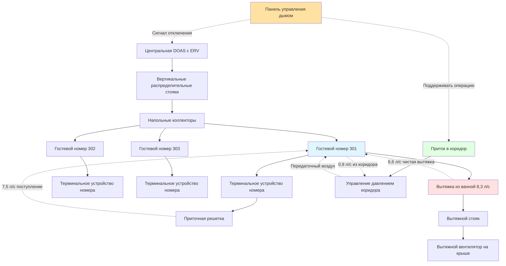

## Обзор

Вентиляция гостевых номеров отеля представляет уникальные задачи, требующие тщательного баланса между энергоэффективностью, качеством внутреннего воздуха, комфортом гостей и требованиями безопасности жизнедеятельности. В отличие от жилых объектов, номера отеля характеризуются переменной заполняемостью, транзитными гостями с разнообразными требованиями и строгими нормативными требованиями к вытяжке и управлению дымом.

Основная задача вентиляции в гостиничном проекте вытекает из прерывистой заполняемости в сочетании с ожиданиями непрерывной работы HVAC. Отель на 200 номеров может иметь коэффициент заполняемости от 30% до 100% в течение года, при этом гости ожидают немедленного комфорта при входе в номер.

## Стратегии вентиляции гостевых номеров

### Системы приточного воздуха (DOAS)

Конфигурации DOAS обеспечивают непрерывную вентиляцию независимо от терминальных устройств в номере. Центральные воздухообрабатывающие установки подают кондиционированный наружный воздух в каждый гостевой номер со скоростью 15-25 CFM (м³/ч: 25-42), как указано в ASHRAE 62.1 для гостевых номеров отелей/мотелей.

Количество наружного воздуха в номер определяется следующим образом:

$$Q_{oa} = R_p \times P + R_a \times A$$

где $Q_{oa}$ — расход наружного воздуха (CFM), $R_p$ — норма наружного воздуха на человека (2,36 л/с на человека), $P$ — расчётная заполняемость (обычно 2 человека), $R_a$ — норма наружного воздуха на площадь (0,647 л/с на м²), и $A$ — площадь номера (м²).

Для стандартного гостевого номера площадью 32,5 м²:

$$Q_{oa} = 2,36 \times 2 + 0,647 \times 32,5 = 4,72 + 21,03 = 25,75 \text{ л/с (14,7 CFM)}$$

Системы DOAS включают рекуператоры энергии (ERV) с достижением 60-80% эффективности по чувствительному и скрытому теплу, что значительно снижает нагрузки на кондиционирование.

### Индивидуальная вентиляция номеров

Фанкойлы четырехтрубные или кондиционеры оконные (PTAC) с воздухозаборниками наружного воздуха и управляемыми жалюзи обеспечивают индивидуальный контроль номера. Этот подход позволяет модулировать вентиляцию на основе заполняемости через:

- Датчики положения двери, активирующие вентиляцию при входе в номер
- Датчики присутствия, поддерживающие минимальную вентиляцию во время пустоты номера
- Датчики CO₂, обеспечивающие вентиляцию с контролем по требованию

Энергетический штраф за непрерывную доставку наружного воздуха в пустые номера значительный:

$$E_{penalty} = 0,321 \times Q_{oa} \times \Delta T \times h_{unoccupied}$$

где $E_{penalty}$ — годовой энергетический штраф (кДж), $\Delta T$ — разность температур между наружным воздухом и заданием (°C), и $h_{unoccupied}$ — годовые часы пустоты номера.

### Сравнение систем вентиляции

| Стратегия | Энергоэффективность | Контроль IAQ | Капитальные затраты | Обслуживание |
|----------|------------------|-------------|--------------|-------------|
| **DOAS с ERV** | Отличная | Отличная | Высокие | Средние |
| **DOAS без ERV** | Справедливая | Отличная | Средние | Низкие |
| **Индивидуальные воздухозаборники** | Хорошая (с управлением) | Хорошая | Низкие | Средние |
| **Только инфильтрация** | Плохая | Плохая | Очень низкие | Отсутствует |
| **Передаточный воздух из коридора** | Хорошая | Справедливая | Низкие | Низкие |

## Вытяжка из ванной комнаты и подпиточный воздух

Требования к вытяжке из ванной комнаты обычно указывают 8,3 л/с (50 CFM) непрерывно или 3,3 л/с (20 CFM) непрерывно с 8,3 л/с (50 CFM) прерывистой работой. Выброшенный воздух должен компенсироваться, чтобы предотвратить чрезмерное разрежение номера.

Возможные пути поступления компенсирующего воздуха включают:

1. **Прямое поступление наружного воздуха** — наружный воздух, поступающий в номер, равен или превышает расход вытяжки
2. **Передаточный воздух из коридора** — подрезка дверей или передаточные решетки позволяют инфильтрации воздуха из коридора
3. **Сбалансированная вентиляция** — система подпиточного воздуха, обслуживающая несколько номеров

Давление в номере относительно коридора должно поддерживать легкое избыточное давление (+5-15 Па) для предотвращения миграции запахов из коридора. Соотношение давления определяется:

$$\Delta P = \frac{(Q_{supply} - Q_{exhaust})^2 \times \rho}{2 \times C^2 \times A^2}$$

где $\Delta P$ — разность давления (Па), $Q_{supply}$ и $Q_{exhaust}$ — расходы (л/с), $\rho$ — плотность воздуха (кг/м³), $C$ — коэффициент расхода, и $A$ — площадь утечки (м²).

Для номера с поступлением 18,9 л/с (40 CFM) и вытяжкой 16,5 л/с (35 CFM) через подрезку двери 2,5 см (примерно 155 см²):

$$\Delta P \approx +7,5 \text{ Па (избыточное давление)}$$

## Соотношения давления в коридоре и номере

Правильный каскад давления обеспечивает контроль запахов и управление дымом. Типичная иерархия поддерживает:

- **Гостевые номера**: +5-15 Па относительно коридора
- **Коридоры**: +15-25 Па относительно наружного воздуха
- **Лестничные клетки**: +40-50 Па относительно коридоров (активно управление давлением)

Такой каскадный порядок предотвращает миграцию загрязнений и поддерживает задачи управления дымом.

## Интеграция управления дымом

Системы вентиляции отеля интегрируются с управлением дымом согласно требованиям NFPA 92 и Международного строительного кодекса. Ключевые рассмотрения включают:

**Остановка приточного воздуха**: Системы приточного воздуха в номерах отключаются при тревоге пожара, чтобы предотвратить распределение дыма через воздуховоды.

**Продолжение вытяжки**: Вентиляторы вытяжки из ванной комнаты могут продолжать работу, если обслуживают отдельные номера с огнестойкими проходками воздуховодов.

**Управление давлением в коридоре**: Системы приточного воздуха в коридоре поддерживают избыточное давление для предотвращения инфильтрации дыма в пути эвакуации.

**Управление давлением в лестничной клетке**: Специальные системы управления давлением в лестничной клетке поддерживают минимум 50 Па при закрытых дверях, минимум 25 Па при открытой двери.

## Баланс между энергоэффективностью и IAQ

Напряженность между энергосбережением и качеством внутреннего воздуха требует интеллектуального управления:

**Вентиляция на основе заполняемости**: Сокращение наружного воздуха до 2,36-4,72 л/с (5-10 CFM) во время пустоты при сохранении 14,15-18,87 л/с (30-40 CFM) при заполняемости снижает годовую энергию вентиляции на 40-60%.

**Вентиляция с контролем по требованию (DCV)**: Датчики CO₂ модулируют наружный воздух на основе измеренной концентрации, целевая концентрация 800-1000 ppm.

**Рекуперация энергии**: Рекуператоры, восстанавливающие 70% энергии кондиционирования из выбросного воздуха, снижают нагрузки вентиляции на:

$$Q_{recovered} = 0,321 \times Q_{oa} \times \Delta T \times \varepsilon$$

где $\varepsilon$ — эффективность рекуператора (0,70 типичная).

Для 14,15 л/с (30 CFM) наружного воздуха с разностью температур 16,7°C (30°F):

$$Q_{recovered} = 0,321 \times 14,15 \times 16,7 \times 0,70 = 53,2 \text{ кДж/ч на номер}$$

## Ожидания гостей относительно свежего воздуха

Современные гости ожидают немедленного качества воздуха при входе в номер, особенно в городских или высокопроходимых местах. Данные опросов указывают:

- 78% гостей считают качество воздуха важным для удовлетворения
- 65% замечают затхлый или спёртый запах в течение первых 5 минут
- 42% потребовали бы смену номера из-за плохого качества воздуха

Удовлетворение этих ожиданий требует:

1. **Циклы продувки перед заселением** — ускоренная вентиляция за 30 минут до заселения
2. **Возможность быстрой смены воздуха** — минимальная способность 2,4-3,6 воздухообмена в час
3. **Улучшенная фильтрация** — фильтры MERV 11-13 для удаления частиц
4. **Непрерывная низкоуровневая вентиляция** — минимум 4,72-7,08 л/с (10-15 CFM) при пустоте номера

Скорость воздухообмена в гостевом номере определяет время очистки от запахов:

$$t = \frac{\ln(C_0/C_f)}{ACH} \times 60$$

где $t$ — время для достижения целевой концентрации (минуты), $C_0$ — начальная концентрация загрязнения, $C_f$ — конечная концентрация, и $ACH$ — воздухообмены в час.

Для снижения концентрации запаха на 90% при 5 воздухообменах в час:

$$t = \frac{\ln(1/0,1)}{5} \times 60 = \frac{2,3}{5} \times 60 = 28 \text{ минут}$$

Данный расчёт демонстрирует, почему циклы ускоренной вентиляции перед заселением критически важны для удовлетворения гостей.

## Лучшие практики

Успешная вентиляция гостевых номеров отеля интегрирует несколько стратегий:

- Проектирование на 150% норматива минимума наружного воздуха для учета DCV сокращения
- Предоставление мониторинга давления в отдельных номерах в люксовых объектах
- Установка таймеров вытяжки из ванной с минимальной работой 20 минут после заселения
- Commissioning соотношений давления при различных сценариях заполняемости
- Задание акустических критериев (NC 30-35), совместимых с непрерывной вентиляцией
- Планирование доступа для обслуживания компонентов вентиляции в номере

Эти подходы обеспечивают удовлетворение гостей при поддержании операционной эффективности и соответствия нормативам.
