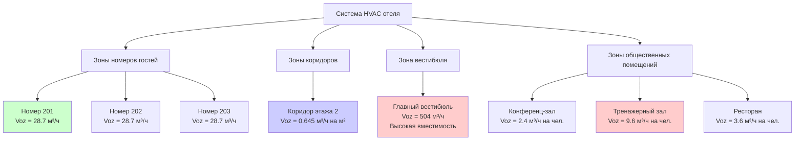

Стандарт ASHRAE 62.1, *Вентиляция для приемлемого качества воздуха в помещении*, устанавливает минимальные требования к вентиляции объектов отелей для обеспечения здоровья, комфорта и приемлемого качества воздуха в помещении. Разработчики и операторы отелей должны понимать эти требования для достижения соответствующих требованиям энергоэффективных систем вентиляции.

## Требования к наружному воздуху в номерах гостей

ASHRAE 62.1 устанавливает требования к наружному воздуху для номеров гостей отелей на основе двух компонентов: плотности размещения и площади помещения.

**Процедура расчета вентиляции:**

$$V_{oz} = R_p \times P_z + R_a \times A_z$$

Где:
- $V_{oz}$ = требование по наружному воздуху для зоны (м³/ч)
- $R_p$ = норма наружного воздуха на человека (2.4 м³/ч на человека для номеров)
- $P_z$ = расчетное население зоны (проектная вместимость)
- $R_a$ = норма наружного воздуха на площадь (0.645 м³/ч на м² для номеров)
- $A_z$ = площадь помещения зоны (м²)

**Пример расчета:**

Для номера площадью 37 м² с 2 проживающими:

$$V_{oz} = (2.4 \text{ м³/ч на человека} \times 2) + (0.645 \text{ м³/ч на м²} \times 37 \text{ м²})$$

$$V_{oz} = 4.8 + 23.9 = 28.7 \text{ м³/ч}$$

Это представляет собой минимум наружного воздуха, требуемый на уровне зоны дыхания. Фактический забор наружного воздуха системой должен учитывать эффективность вентиляции системы.

## Нормы вентиляции ASHRAE 62.1 для помещений отелей

| Тип помещения | Норма наружного воздуха на человека (м³/ч на чел.) | Норма наружного воздуха на площадь (м³/ч на м²) | Проектная плотность размещения (чел./100 м²) |
|-----------|--------------------------------------|----------------------------------|-------------------------------------------|
| Номера гостей | 2.4 | 0.645 | 5 |
| Коридоры | 0 | 0.645 | 0 |
| Вестибюли | 3.6 | 0.645 | 30 |
| Конференц-залы | 2.4 | 0.645 | 50 |
| Тренажерные залы | 9.6 | 0.645 | 40 |
| Прачечные | 0 | 1.290 | 0 |
| Общественные туалеты | 0 | 1.290 | 70 |

## Требования к вентиляции коридоров

Коридоры отелей требуют вентиляции только на основе площади помещения, без компонента по численности людей из-за временного использования:

$$V_{oz,коридор} = 0.645 \text{ м³/ч на м}^2 \times A_z$$

Коридоры должны находиться под избыточным давлением относительно номеров гостей, чтобы предотвратить распространение запахов. Воздух, передаваемый из номеров в коридоры, может способствовать вентиляции коридоров при надлежащей конструкции. Обеспечьте поступление воздуха в коридор достаточным разбавлением и направлением потока воздуха в сторону от критических помещений.

## Требования к вентиляции вестибюлей и общественных зон

Вестибюли испытывают высокую переменную вместимость, требующую значительно большего количества наружного воздуха:

$$V_{oz,вестибюль} = (3.6 \text{ м³/ч на чел.} \times P_z) + (0.645 \text{ м³/ч на м}^2 \times A_z)$$

Для вестибюля площадью 279 м² с проектной вместимостью 90 человек (30 человек на 100 м²):

$$V_{oz,вестибюль} = (3.6 \times 90) + (0.645 \times 279) = 324 + 180 = 504 \text{ м³/ч}$$

Общественные зоны, включая конференц-залы, тренажерные центры и рестораны, имеют специфические требования, описанные в таблице 6.2.2.1 ASHRAE 62.1.

## Эффективность вентиляции системы

Требуемый выше наружный воздух на уровне зоны дыхания должен быть скорректирован с учетом эффективности распределения воздуха, используя эффективность распределения воздуха в зоне ($E_z$) и эффективность вентиляции системы ($E_v$).

**Расход наружного воздуха в зоне:**

$$V_{oz} = \frac{V_{bz}}{E_z}$$

Где $E_z$ обычно равна 1.0 при подаче воздуха через потолок холодного воздуха или 0.8 для других конфигураций.

**Забор наружного воздуха системой:**

$$V_{ot} = \frac{\sum{\text{все зоны } V_{oz}}}{E_v}$$

Эффективность вентиляции системы $E_v$ учитывает неравномерное распределение наружного воздуха по зонам. Для многозонных рециркуляционных систем:

$$E_v = \frac{1 + X_s - Z_d}{1 + X_s}$$

Где:
- $X_s$ = некорректированная доля наружного воздуха на уровне системы
- $Z_d$ = доля наружного воздуха в критической зоне (наибольшее отношение $V_{oz}/V_{dz}$)

Этот расчет обеспечивает адекватное поступление наружного воздуха во все зоны, особенно в те, которые имеют высокие требования к наружному воздуху относительно подачи воздуха.

## Применение вентиляции с управлением по спросу

Вентиляция с управлением по спросу (DCV) снижает энергопотребление благодаря регулировке наружного воздуха в соответствии с фактической вместимостью, а не проектными значениями. ASHRAE 62.1 допускает DCV в помещениях с переменной непредсказуемой вместимостью.

**Подходящие применения в отелях:**
- Конференц-залы и переговорные
- Банкетные залы и залы для мероприятий
- Тренажерные залы
- Рестораны и столовые

**Реализация DCV:**

Используйте датчики CO₂ для оценки вместимости и соответствующей регулировки вентиляции:

$$V_{oz} = R_p \times P_{фактическая} + R_a \times A_z$$

Где $P_{фактическая}$ получена из измеренной концентрации CO₂. Датчики должны быть надлежащим образом расположены и откалиброваны. Вентиляция на основе площади ($R_a \times A_z$) остается постоянной независимо от вместимости.

Номера гостей обычно не требуют DCV из-за относительно постоянной вместимости и скромных требований к наружному воздуху.

## Требования к документированию и пусконаладке

ASHRAE 62.1 раздел 8 требует полного документирования, включая:

**Документация при проектировании:**
- Расчеты забора наружного воздуха для всех зон
- Расчеты эффективности вентиляции системы
- Спецификации оборудования с расходами воздуха
- Последовательности управления заслонками наружного воздуха
- Расположение датчиков DCV и уставки

**Документация при установке:**
- Чертежи "как построено" с фактическим расположением заслонок и датчиков
- Сведения о стационарной установке для измерения наружного воздуха
- Проверка минимальных положений заслонок

**Процедуры пусконаладки:**
1. Проверка расходов забора наружного воздуха при проектных условиях
2. Испытание и балансировка всех расходов подачи в зоны
3. Подтверждение надлежащей работы заслонок и минимальных положений
4. Калибровка датчиков CO₂ при наличии DCV
5. Проверка последовательностей управления при всех режимах работы
6. Документирование доли наружного воздуха при различных нагрузках на систему

**Эксплуатация и техническое обслуживание:**
- Предоставление операторам здания сведений о проектных требованиях к наружному воздуху
- Установление графиков замены фильтров
- Создание процедур осмотра и обслуживания заслонок
- Реализация протоколов калибровки датчиков CO₂ (минимум ежегодно)

Надлежащая пусконаладка гарантирует, что спроектированная система вентиляции работает как предусмотрено, обеспечивая адекватный наружный воздух на протяжении всего периода занятости здания при минимизации потерь энергии. Переаттестация каждые 3–5 лет поддерживает производительность на протяжении жизненного цикла здания.

---

*Соответствие ASHRAE 62.1 обеспечивает здоровое качество воздуха в номерах отелей при оптимизации энергоэффективности благодаря надлежащему проектированию системы, точным расчетам и полной проверке при пусконаладке.*
