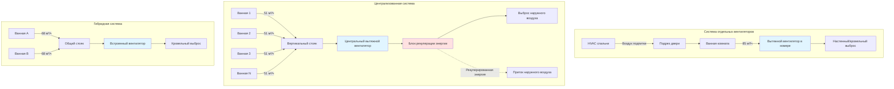

# Системы вытяжки в ванных комнатах гостиниц

Системы вытяжки в ванных комнатах гостиниц удаляют влагу, запахи и загрязнители из ванных комнат гостей, поддерживая приемлемые уровни шума и минимизируя потребление энергии. Эти системы сталкиваются с уникальными проблемами по сравнению с жилыми приложениями, включая более высокую текучесть проживания гостей, более строгие ограничения шума (обычно NC 30–35) и необходимость надежной работы в сотнях номеров. Подходы к проектированию варьируются от отдельных вытяжных вентиляторов в номерах до централизованных многоэтажных систем вытяжки, каждая из которых имеет отличные характеристики производительности, требования к обслуживанию и последствия для энергопотребления.

## Требования к скорости вытяжки

### Минимальные скорости вытяжки по кодексу

**Международный механический код (IMC) Раздел 403:**
- Прерывистая вытяжка: минимум 85 м³/ч (50 CFM)
- Непрерывная вытяжка: минимум 34 м³/ч (20 CFM)

**ASHRAE 62.1 Таблица 6-4 (Гостевые номера гостиниц/мотелей):**
- Вытяжка из туалетной комнаты: 42 м³/ч (25 CFM) на номер (непрерывная)
- В сочетании с требованием вентиляции спальни: 8,5 м³/(ч·чел) + 0.065 м³/(ч·м²)

**Расчет эффективной вытяжки:**

$$Q_{exhaust} = \max(Q_{IMC}, Q_{ASHRAE})$$

Где:
- $Q_{IMC}$ = требуемая по кодексу скорость вытяжки (34 м³/ч непрерывная или 85 м³/ч прерывистая)
- $Q_{ASHRAE}$ = требуемая стандартом скорость вытяжки (42 м³/ч)

Для типичного номера гостиницы площадью 32,5 м² с ванной комнатой:

$$Q_{required} = 8,5 \times 2 + 0.065 \times 32,5 = 19,1 \text{ м³/ч}$$

Комбинированная вытяжка из ванной комнаты обычно обеспечивает 42–51 м³/ч этого общего требования вентиляции.

### Емкость удаления влаги

**Генерация влаги во время принятия душа:**

$$m_{moisture} = \rho_{air} \times Q \times (W_{bathroom} - W_{supply})$$

Где:
- $\rho_{air}$ = плотность воздуха (1,2 кг/м³ при стандартных условиях)
- $Q$ = скорость вытяжки (м³/ч)
- $W_{bathroom}$ = коэффициент влажности в ванной комнате (г влаги/кг сухого воздуха)
- $W_{supply}$ = коэффициент влажности приточного воздуха (г влаги/кг сухого воздуха)

**Типичная генерация при принятии душа:** 0,135–0,227 кг/ч влаги
**Требуемая скорость удаления при 85 м³/ч:** 0,18–0,27 кг/ч (адекватна для типичного душа)
**Требуемая скорость удаления при 34 м³/ч:** 0,07–0,11 кг/ч (предельна, требует более длительного времени работы)

## Стратегии эксплуатации

### Непрерывная вытяжка

**Характеристики:**
- постоянная работа 34–51 м³/ч
- обеспечивает базовую вентиляцию номера
- интегрирована с подачей воздуха в номер HVAC
- более низкая скорость вентилятора, более тихая работа

**Преимущества:**
- постоянный контроль запахов и влаги
- не требует взаимодействия с гостем
- упрощенное управление
- способствует общей вентиляции номера в соответствии с ASHRAE 62.1

**Недостатки:**
- постоянное энергопотребление
- круглогодичный штраф на отопление/охлаждение
- сложность рекуперации энергии (низкий перепад давления)

**Типичное применение:** пятизвездочные гостиницы, люксы, отели продленного проживания.

### Прерывистая вытяжка

**Характеристики:**
- 85–119 м³/ч во время занятости ванной комнаты
- активируется выключателем света, датчиком присутствия или датчиком влажности
- таймер отключения: 15–30 минут после освобождения
- вентилятор работает в цикле в зависимости от требуемого спроса

**Стратегии управления:**

1. **Активация выключателем света:**
   - простейший вариант управления
   - вентилятор работает, пока горит свет
   - таймер отключения продолжает работу после выключения света

2. **Активация датчиком влажности:**
   - пороговое значение обычно 60–65% ОВ
   - вентилятор работает до тех пор, пока влажность не упадет ниже заданного значения
   - предотвращает ненужную работу
   - более сложное управление, более высокая стоимость

3. **Активация датчиком присутствия:**
   - потолочный датчик PIR или встроенный в вентилятор
   - обнаруживает вход в ванную комнату
   - таймер поддерживает работу после ухода

**Преимущества:**
- более низкое среднее энергопотребление
- снижение штрафа на отопление/охлаждение
- больший расход при пиковом спросе (более быстрое удаление влаги)

**Недостатки:**
- требует дополнительной вентиляции для соответствия ASHRAE 62.1
- больший потенциал шума при полной скорости
- сложность управления и обслуживания

**Типичное применение:** гостиницы среднего уровня, бюджетные отели, модернизация.

## Конфигурации систем

### Отдельные вытяжные вентиляторы в номерах

**Конфигурация:**
- навесной или потолочный вентилятор на ванную комнату
- прямой выброс на улицу или в коридор
- автономный двигатель и корпус
- независимая работа для каждого номера

**Выбор размера вентилятора:**

$$SP_{required} = \Delta P_{duct} + \Delta P_{terminal} + \Delta P_{hood}$$

Где:
- $\Delta P_{duct}$ = потеря давления на трение в воздуховоде (обычно 0,12–0,36 кПа)
- $\Delta P_{terminal}$ = потеря давления в настенной решетке или кровельном патрубке (0,05–0,12 кПа)
- $\Delta P_{hood}$ = перепад давления на решетке (0,05–0,07 кПа)

**Типичное статическое давление:** 0,24–0,6 кПа при номинальном расходе

**Преимущества:**
- простая установка
- отсутствие перекрестного загрязнения между номерами
- локализованное обслуживание (отказ влияет только на один номер)
- более низкая первоначальная стоимость для малых объектов

**Недостатки:**
- многочисленные внешние пронизи
- более высокое общее энергопотребление вентилятора (несколько малых вентиляторов менее эффективны)
- сложность реализации рекуперации энергии
- переменный внешний вид

### Централизованные системы вытяжки

**Конфигурация:**
- центральный вытяжной вентилятор (крыша или механическое помещение)
- вертикальные или горизонтальные воздуховодные стояки
- ответвления к отдельным ванным комнатам
- работа с постоянным или переменным объемом

**Расчет давления в системе:**

$$SP_{total} = \Delta P_{branch} + \Delta P_{riser} + \Delta P_{fittings} + \Delta P_{intake}$$

Типичное давление централизованной системы: 1,2–3,6 кПа

**Преимущества:**
- одна внешняя пронизь (кровельное окончание)
- более высокая эффективность вентилятора (больший вентилятор, лучшая производительность при частичной нагрузке)
- возможна рекуперация энергии
- консистентный архитектурный вид
- центральный доступ к обслуживанию

**Недостатки:**
- более высокая первоначальная стоимость (установка воздуховодов)
- риск перекрестного загрязнения без обратных клапанов
- отказ системы влияет на несколько номеров
- сложность балансировки

**Требования балансировки:**
- измерение расхода в каждом номере на решетке
- балансировочные заслонки на ответвлениях
- целевой расход ±10% от расчетного для каждого номера
- переберансировка после замены фильтра или модификаций

### Гибридные системы

**Конфигурация:**
- общий вытяжной стояк (1–2 ванные комнаты на стояк)
- отдельные встроенные вентиляторы или общий вентилятор
- сокращенные пронизи по сравнению с отдельными вентиляторами
- сокращенная сетка воздуховодов по сравнению с полностью централизованной системой

**Применение:** объекты высотой 4–10 этажей, проекты реновации с конструктивными ограничениями.

## Пути подачи воздуха подпитки

### Подрезы дверей

**Требуемая подрезь для воздуха подпитки:**

$$A_{required} = \frac{Q}{V_{max}}$$

Где:
- $Q$ = скорость вытяжки (м³/ч)
- $V_{max}$ = максимально допустимая скорость (обычно 1,0–1,5 м/с)
- $A_{required}$ = свободная площадь (м²)

**Для вытяжки 85 м³/ч при скорости 1,25 м/с:**

$$A_{required} = \frac{85}{1,25 \times 3,6} = 0,0189 \text{ м}^2 = 189 \text{ см}^2$$

**Типичные размеры двери:**
- ширина двери: 76–91 см
- требуемая подрезь: 1,9–2,5 см
- обеспечивает 142–232 см² свободной площади

**Соображения:**
- акустическая передача через подрезь
- пропускание света (приватность гостей)
- контроль дыма (требования пожарного кодекса могут ограничить подрезь)
- предотвращение попадания вредителей

### Переходные решетки

**Альтернатива подрезам:**
- решетка установлена в дверь ванной комнаты или стену
- акустические лабиринты снижают передачу звука
- типичный размер: 20×15 см до 30×20 см
- свободная площадь: 260–520 см² (с демпфером/лабиринтом)

**Потеря давления через переходную решетку:**

$$\Delta P = \left(\frac{Q}{C \times A}\right)^2$$

Где:
- $C$ = коэффициент расхода (0,6–0,8 для лабиринтной решетки)
- $A$ = свободная площадь (м²)

Целевая потеря давления: <0,12 кПа для предотвращения посвистывания.

### Пути подачи приточного воздуха

**Прямая подача в ванную комнату:**
- 17–34 м³/ч кондиционированного воздуха в ванную комнату
- снижает штраф вытяжки
- обеспечивает легкое положительное давление при выключенной вытяжке
- требует отдельного приточного воздуховода

**Подача в прилегающую спальню:**
- приточный воздух поступает в спальню из HVAC блока
- переводится в ванную комнату через подрез двери
- наиболее распространенный подход в гостиницах
- спальня слегка положительна относительно ванной комнаты

## Акустическое проектирование

### Критерии шума для ванных комнат гостей

| Место | Лимит NC | Лимит дБА | Целевой дизайн |
|-------|----------|-----------|-----------------|
| Люксовая ванная гостиницы | NC 30 | 35 дБА | NC 28 |
| Ванная среднего уровня гостиницы | NC 35 | 40 дБА | NC 33 |
| Ванная бюджетной гостиницы | NC 40 | 45 дБА | NC 38 |
| Прилегающая спальня | NC 30 | 35 дБА | NC 28 |

### Генерация звука вентилятором

**Уровень мощности звука производимого вентилятора:**

$$L_w = L_{w,ref} + 10 \log_{10}\left(\frac{Q}{Q_{ref}}\right) + 20 \log_{10}\left(\frac{SP}{SP_{ref}}\right)$$

Где:
- $L_{w,ref}$ = справочный уровень мощности звука (дБ)
- $Q$, $Q_{ref}$ = фактический и справочный расходы
- $SP$, $SP_{ref}$ = фактическое и справочное статические давления

**Меры ослабления звука:**
1. Выбор вентиляторов с низким рейтингом сонов (1,0–2,0 сонов для гостиничных приложений)
2. Встроенные в воздуховод вентиляторы (отделение от занятых пространств)
3. Гибкие воздуховодные соединители (виброизоляция)
4. Облицованные воздуховоды (стекловолокно или пенопласт, затухание 30–61 дБ)
5. Пониженная скорость вентилятора (непрерывная низкоскоростная работа)

**Затухание шума в воздуховоде:**

$$L_{p,room} = L_w - 10 \log_{10}(4 \pi r^2) - \alpha L - TL_{ceiling}$$

Где:
- $L_w$ = уровень мощности звука вентилятора (дБ)
- $r$ = расстояние от решетки (м)
- $\alpha$ = затухание в воздуховоде (дБ/м)
- $L$ = длина воздуховода (м)
- $TL_{ceiling}$ = потеря передачи звука потолком (дБ)

**Типичное затухание:** 1,6–4,9 дБ/м для гибкого воздуховода диаметром 15 см с изоляцией.

### Шум, передаваемый через конструкцию

**Требования виброизоляции:**
- гибкий воздуховодный соединитель на вентиляторе: минимум 10–15 см в длину
- отказоустойчивое потолочное крепление: изоляторы из пружины или резины
- конструктивное разделение: избегать жесткого соединения со стеной спальни

**Для крышных централизованных вентиляторов:**
- виброизоляторы: пружинные опоры с отклонением 2,5–5 см
- инерционная основа для вентиляторов >0,75 кВт
- гибкие воздуховодные соединения на входе/выходе вентилятора

## Рекуперация энергии

### Рекуперация чувствительного тепла из выбросов ванной комнаты

**Энергетический штраф от вытяжки ванной комнаты:**

$$Q_{heat} = \rho \times C_p \times Q_{exhaust} \times \Delta T$$

Где:
- $\rho$ = плотность воздуха (1,2 кг/м³)
- $C_p$ = удельная теплоемкость (1,006 кДж/(кг·°C))
- $Q_{exhaust}$ = скорость вытяжки (м³/ч)
- $\Delta T$ = разность температур (°C)

**Для непрерывной вытяжки 51 м³/ч при разности температур 21°C:**

$$Q_{heat} = 1,2 \times 1,006 \times 51 \times 21 \times \frac{1}{3,6} = 35,5 \text{ кВт на номер}$$

Для гостиницы из 200 номеров: 7,1 кВт непрерывная нагрузка.

**Годовая стоимость энергии (электрическое отопление):**

$$Cost = \frac{Q_{heat} \times Hours \times \$/kWh}{1000}$$

Гостиница из 200 номеров, 0,12 $/кWh: 2000–3000 $/год штраф на отопление/охлаждение.

### Стратегии рекуперации энергии

**1. Центральный рекуператор энергии (ERV):**
- требуется централизованная система вытяжки
- комбинированная вытяжка ванной комнаты + приток наружного воздуха
- 60–80% чувствительная эффективность
- 50–70% скрытая эффективность
- окупаемость: 5–8 лет для систем непрерывной вытяжки

**2. Тепловой насос выбросного воздуха:**
- тепловой насос извлекает энергию из выбросного воздуха
- предварительно нагревает горячее водоснабжение или подает тепло
- коэффициент производительности (COP): 2,5–3,5
- применение ограничено крупными объектами (100+ номеров)

**3. Вытяжка с управлением по требованию:**
- прерывистая работа на основе занятости/влажности
- снижает средний объем вытяжки
- энергосбережение 30–50% по сравнению с непрерывной работой
- более низкая стоимость оборудования рекуперации

## Рекомендации по проектированию

### Управление давлением

**Целевое давление в ванной комнате:**
- 12–24 Па отрицательное относительно спальни
- предотвращает миграцию запахов
- обеспечивает правильное направление потока через подрез двери

**Проблемы при чрезмерном отрицательном давлении:**
- трудность закрывания двери (>36 Па разницы)
- посвистывание на подрезе (>48 Па)
- неадекватный путь воздуха подпитки

### Предотвращение конденсации

**Требования по изоляции воздуховода:**
- внешние воздуховоды: минимум RSI 1,4 (5 см стекловолокна)
- внутренние вертикальные стояки: минимум RSI 0,7 (2,5 см стекловолокна)
- предотвращает конденсацию во время влажной работы

**Накопление влаги в централизованных системах:**
- наклон горизонтальных участков 0,6 см на 30 см в направлении стока
- установка сливных ног в низких точках
- конденсатные сливы у основания вертикальных стояков

### Противопожарные и дымовые соображения

**Требования противопожарных клапанов:**
- обычно не требуются для вытяжки <950 м³/ч
- требуются на проемах в стенах/полах с огнестойкостью
- проверьте местные поправки к кодексу

**Взаимодействие управления дымом:**
- вытяжные вентиляторы ванной комнаты могут продолжать работу во время пожарной сигнализации
- обеспечивает удаление дыма с этажа пожара
- согласуйте с описанием системы контроля дыма

### Доступ для обслуживания

**Критические точки обслуживания:**
- двигатель вентилятора и рабочее колесо (ежегодная проверка)
- доступ для очистки воздуховода (каждые 3–5 лет для централизованных систем)
- очистка решетки вытяжки (ежеквартально служебным персоналом)
- замена фильтра для ERV систем (ежеквартально до полугода)

**Проектирование для удобства обслуживания:**
- панели доступа во всех местах расположения вентиляторов
- доступные заслонки и органы управления
- четкая маркировка назначения номеров на централизованных системах

## Проверка производительности

### Измерения при наладке

**Проверка отдельного номера:**
- расход вытяжки на решетке: ±10% от расчетного
- статическое давление в ванной комнате: -12 до -24 Па относительно спальни
- уровень звука в ванной комнате: соответствие критериям NC
- функция таймера отключения (прерывистые системы)

**Проверка системы:**
- полный расход системы: ±10% от расчетного
- потребление энергии вентилятором: ±10% от установленного
- эффективность рекуперации энергии: >90% от номинальной (при наличии)

**Тестовые приборы:**
- балометр (измерение расхода на решетке)
- манометр (измерение давления)
- звукомер (акустическая проверка)

Системы вытяжки в ванных комнатах гостиниц требуют тщательной интеграции производительности вентиляции, энергоэффективности и акустического комфорта. Успешные проекты балансируют соответствие кодексу, опыт гостя и рабочие расходы посредством надлежащего выбора системы, правильного выбора размера и внимания к путям воздуха подпитки и контролю шума. Возможности рекуперации энергии существуют для объектов с централизованными системами непрерывной вытяжки, в то время как стратегии прерывистой вытяжки обеспечивают энергосбережение для объектов, приоритизирующих более низкую первоначальную стоимость и простоту эксплуатации.
