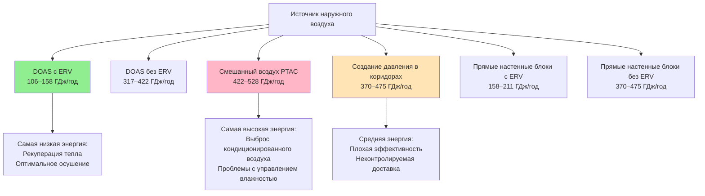

## Обзор

Подача наружного воздуха в номера отелей представляет уникальные инженерные проблемы, требующие баланса между требованиями качества воздуха в помещении, энергоэффективностью, вариативностью занятости и потребностями распределённого управления. Выбор метода подачи наружного воздуха существенно влияет на производительность системы, потребление энергии и комфорт занимающих помещения при различных режимах работы.

## Системы дополнительного наружного воздуха (DOAS)

DOAS представляет наиболее энергоэффективный подход для отелей, разделяя вентиляцию от нагрузок чувствительного охлаждения. Центральный воздухообрабатывающий агрегат кондиционирует 100 % наружного воздуха до нейтральных или слегка прохладных условий, доставляя его независимо в номера.

**Конфигурация системы**

DOAS обычно работает при температуре подачи воздуха 13–16 °C с осушением до 0,008–0,009 кг воды/кг сухого воздуха. Необходимый расход наружного воздуха на один номер определяется по формуле:

$$Q_{oa} = N \cdot V_{oa,person} + A \cdot V_{oa,area}$$

где $N$ = количество занимающих (обычно 2 на номер), $V_{oa,person}$ = 2,4 л/(с·чел) минимум (ASHRAE 62.1), $A$ = площадь номера, и $V_{oa,area}$ = 0,305 л/(с·м²).

Для типичного номера площадью 37 м²:

$$Q_{oa} = 2(2,4) + 37(0,305) = 4,8 + 11,3 = 16,1 \text{ л/с}$$

**Интеграция рекуперации энергии**

DOAS достигает максимальной эффективности при сочетании с вентиляторами рекуперации энергии (ERV) с эффективностью 70–80 % по чувствительной теплоте и влажности. Годовая рекуперация энергии:

$$Q_{recovered} = Q_{oa} \cdot \rho \cdot c_p \cdot (T_{oa} - T_{ra}) \cdot \varepsilon \cdot h_{annual}$$

где $\varepsilon$ = эффективность рекуперации тепла, $h_{annual}$ = часы работы. Для отеля на 200 номеров, работающего 8760 часов в год в смешанном климате, рекуперация энергии может обеспечить сбережение 800–1200 ГДж/год.

**Преимущества**

- Независимое управление вентиляцией и тепловыми нагрузками
- Оптимальная производительность осушения
- Сниженные требования к мощности внутридомового оборудования
- Централизованная фильтрация и обработка воздуха
- Превосходная энергоэффективность с рекуперацией тепла

**Ограничения**

- Более высокая стоимость первоначальной установки
- Требует выделенной инфраструктуры воздуховодов
- Сложная интеграция управления с комнатными блоками HVAC
- Требования к площади механического оборудования

## Системы смешанного воздуха с экономайзерами

Традиционные упакованные терминальные кондиционеры воздуха (PTAC) или фанкойлы включают наружный воздух через экономайзеры смешанного воздуха, объединяя наружный и рециркуляционный воздух до охлаждающих катушек.

**Режимы работы экономайзера**

Система работает в трёх различных режимах в зависимости от наружных условий:

1. **Минимум наружного воздуха**: $Q_{oa} = Q_{oa,min}$ при $T_{oa} > T_{return}$
2. **Охлаждение экономайзером**: $Q_{oa} = Q_{oa,min}$ to $Q_{total}$ при $T_{oa,opt} < T_{oa} < T_{return}$
3. **100 % наружный воздух**: $Q_{oa} = Q_{total}$ при $T_{oa} < T_{oa,opt}$

Оптимальная температура наружного воздуха для активации экономайзера:

$$T_{oa,opt} = T_{setpoint} - \frac{Q_{internal}}{\dot{m} \cdot c_p}$$

Для типичного номера с внутренними теплогеневыми 1,58 кДж/с и общим расходом воздуха 16 л/с:

$$T_{oa,opt} = 22 - \frac{1,58}{0,0161 \cdot 1,21 \cdot 1,005} = 22 - 77 = -55°C$$

**Сложности внедрения**

- Ограниченная эффективность экономайзера в применениях PTAC из-за настенного монтажа
- Осложнения с управлением влажностью во время работы экономайзера
- Трудность поддержания минимума наружного воздуха при низких нагрузках охлаждения
- Требования защиты от замерзания в холодном климате

## Методы создания избыточного давления в коридорах

Создание избыточного давления в коридорах обеспечивает подачу кондиционированного наружного воздуха в коридоры номеров при избыточном давлении (+0,005–0,012 кПа относительно номеров), позволяя контролируемую инфильтрацию через щели под дверями.

**Расчёты расходов воздуха**

Требуемый расход воздуха для создания давления в коридоре зависит от утечки через щель под дверью:

$$Q_{leak} = C \cdot A \cdot \sqrt{\Delta P}$$

где $C$ = 40–50 м³/(ч·см²·кПа^0,5^) для щели под дверью, $A$ = площадь щели (обычно 1,3–1,9 см × 91 см = 0,012–0,017 м²), $\Delta P$ = разность давлений.

Для разности давлений 0,007 кПа и щели 0,015 м²:

$$Q_{leak} = 45 \cdot 0,015 \cdot \sqrt{0,007} = 1,77 \text{ м³/ч на номер}$$

**Факторы производительности системы**

- Воздухообмены в коридоре: 8–12 ACH типичные для адекватного распределения
- Частота открывания дверей влияет на стабильность давления
- Взаимодействие с шахтой лифта влияет на поддержание давления
- Значительно варьируется с качеством закрывания дверей и утечками здания

**Преимущества и ограничения**

Преимущества включают отсутствие в-номерных воздуховодов, простоту внедрения в существующих зданиях и сниженную сложность оборудования отдельных номеров. Ограничения включают неконтролируемые скорости доставки, низкую эффективность распределения воздуха ($E_v$ = 0,6–0,8 по сравнению с 1,0 для прямой подачи), возможность передачи запахов между номерами и трудность проверки соответствия нормам.

## Подача наружного воздуха непосредственно в номера

Прямые системы доставляют наружный воздух через выделенные воздуховоды или сквозные отверстия непосредственно в отдельные номера, обеспечивая контролируемую вентиляцию независимо от систем теплового кондиционирования.

**Настенные блоки без воздуховодов**

Настенные вентиляторы наружного воздуха интегрируют вентилятор подачи, фильтрацию и дополнительную рекуперацию тепла в компактные блоки, установленные через внешнюю стену. Типичные характеристики:

- Диапазон расходов: 9,4–37,7 м³/ч на один блок
- Уровни звука: 25–35 дБА на минимальной скорости
- Эффективность рекуперации тепла: 65–75 % (при наличии)
- Потребление электроэнергии: 15–40 Вт

**Распределение с воздуховодами**

Системы центральных вентиляторов распределяют наружный воздух через низконапорные воздуховоды (50–100 Па статического давления). Особенности проектирования включают:

- Балансировочные заслонки отдельных номеров или VAV терминалы
- Шумоглушение: NC 30–35 максимум в занятых пространствах
- Калибровка воздуховодов для скорости 2,5–3,6 м/с для минимизации шума
- Коэффициенты эффективности распределения воздуха

## Эффективность распределения воздуха

Коэффициент эффективности вентиляции $E_v$ количественно оценивает, насколько хорошо подаваемый наружный воздух достигает зоны дыхания:

$$V_{bz} = \frac{V_{oz}}{E_v}$$

где $V_{bz}$ = расход наружного воздуха в зоне дыхания, $V_{oz}$ = требуемый наружный воздух.

| Метод доставки | $E_v$ | Влияние на зону дыхания |
|---|---|---|
| Потолочный диффузор (хорошо смешанный) | 1,0 | Базовый уровень |
| Вентиляция с вытеснением | 1,2 | Снижение требуемого воздуха на 17 % |
| Передача через щель под дверью | 0,7 | Увеличение требуемого воздуха на 43 % |
| Прямой выход PTAC | 0,8 | Увеличение требуемого воздуха на 25 % |

Плохая эффективность распределения значительно увеличивает требуемые количества наружного воздуха и связанные с ними энергетические штрафы.

## Энергетические последствия

Годовое потребление энергии значительно варьируется в зависимости от метода доставки. Сравнительный анализ для отеля на 200 номеров в смешанном климате (3700 ПДд, 700 ПОд):

**Энергетические компоненты**

Общая энергия кондиционирования наружного воздуха:

$$E_{oa} = E_{sensible} + E_{latent} + E_{fan}$$

Чувствительное отопление/охлаждение:

$$E_{sensible} = Q_{oa} \cdot \rho \cdot c_p \cdot \sum_{h=1}^{8760}|T_{oa} - T_{supply}| \cdot (1 - \varepsilon)$$

Скрытое охлаждение (осушение):

$$E_{latent} = Q_{oa} \cdot \rho \cdot h_{fg} \cdot \sum_{h=1}^{8760}(W_{oa} - W_{supply})_{+}$$

где $h_{fg}$ = 2450 кДж/кг теплота парообразования воды, $(...)_+$ указывает только положительные значения.

Энергия вентилятора зависит от давления в системе:

$$E_{fan} = \frac{Q_{oa} \cdot \Delta P \cdot h_{annual}}{3600 \cdot \eta_{fan}}$$

Для DOAS с общим давлением 622 Па и КПД вентилятора 55 % при расходе 16 л/с на номер:

$$E_{fan} = \frac{0,0161 \cdot 622 \cdot 8760}{3600 \cdot 0,55} = 52 \text{ кВт·ч/(номер·год)}$$

## Сравнение методов доставки

| Метод | Первоначальная стоимость | Эксплуатационная стоимость | Управление качеством воздуха | Возможность модификации | Управление пользователем |
|---|---|---|---|---|---|
| DOAS с ERV | Высокая | Очень низкая | Отличное | Сложная | Ограниченное |
| DOAS без ERV | Средняя–высокая | Средняя | Отличное | Сложная | Ограниченное |
| Смешанный воздух PTAC | Низкая | Высокая | Удовлетворительное | Простая | Хорошее |
| Создание давления в коридорах | Низкая–средняя | Средняя | Плохое | Простая | Отсутствует |
| Прямые настенные блоки (ERV) | Средняя | Низкая | Хорошее | Простая | Отличное |
| Прямые настенные блоки (без ERV) | Низкая–средняя | Средняя–высокая | Хорошее | Простая | Отличное |

## Критерии выбора

Выбор оптимального метода подачи наружного воздуха зависит от множества проектных факторов:

**Новое строительство**: DOAS с рекуперацией энергии обеспечивает наиболее низкую стоимость жизненного цикла, несмотря на более высокие первоначальные затраты, особенно в экстремальных климатических условиях, требующих значительного осушения или отопления.

**Проекты реконструкции**: Настенные блоки прямой подачи воздуха обеспечивают оптимальный баланс производительности и возможности установки, когда центральные системы не могут быть внедрены.

**Проекты с ограниченным бюджетом**: Создание избыточного давления в коридорах обеспечивает соответствие минимуму норм при наиболее низкой стоимости, но снижает энергоэффективность и качество воздуха в помещении.

**Премиум-объекты**: DOAS с интеграцией управления отдельных номеров обеспечивает превосходный комфорт, управление влажностью и энергоэффективность, поддерживая премиум-позиционирование.

Инженерный анализ должен оценить тяжесть климата, стоимость коммунальных услуг, характеристики занятости, конфигурацию здания и долгосрочные эксплуатационные приоритеты для определения оптимального решения для каждого конкретного применения.
