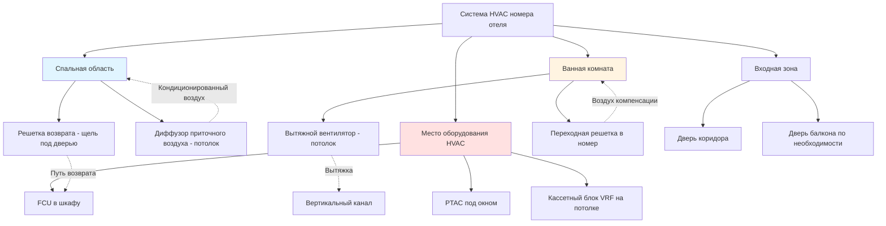

Проектирование HVAC в гостевых комнатах напрямую влияет на удовлетворенность гостей, онлайн-отзывы и повторные посещения. Успешные системы балансируют индивидуальное управление комфортом, тихую работу, энергоэффективность и интеграцию с системой автоматизации здания. Задача состоит в том, чтобы обеспечить персонализированное управление климатом в сотнях номеров, сохраняя при этом эксплуатационные расходы и надежность.

## Ожидания гостей в отношении комфорта и стандарты

Современные гости отелей ожидают точного управления температурой, тихой работы и быстрого отклика на настройки. ASHRAE Standard 55 устанавливает параметры теплового комфорта, но проектирование в гостинично-ресторанной сфере обычно превосходит эти минимумы.

**Требования управления температурой:**
- Диапазон установки: 18-27°C
- Стабильность температуры: ±0,6°C
- Время восстановления: достижение установленной температуры за 30 минут
- Отключение при отсутствии: 13°C отопление / 29°C охлаждение

**Условия проектирования:**
- Внутренние: 22°C по сухому термометру, 50% ОВ
- Наружные: местные условия по ASHRAE 1%
- Занятость: 2 человека на номер
- Вентиляция: минимум 15 CFM (25,5 м³/ч) на одного человека в соответствии с ASHRAE 62.1

Расчет охлаждающей нагрузки номера:

$$Q_{total} = Q_{sensible} + Q_{latent}$$

$$Q_{sensible} = Q_{envelope} + Q_{occupants} + Q_{lighting} + Q_{equipment} + Q_{infiltration}$$

Типичное распределение нагрузки для стандартного номера (27,9 м²):

$$Q_{total} = 2,64 - 3,52 \text{ кДж/с (охлаждение)}$$

$$Q_{heating} = 1,76 - 2,64 \text{ кДж/с}$$

## Варианты управления температурой на уровне номера

### Пакетные терминальные кондиционеры (PTAC)

Блоки PTAC доминируют в отелях средней и экономной категории благодаря низкой первоначальной стоимости, возможности индивидуального учета и упрощенному обслуживанию. Каждый блок обслуживает один номер с установкой в стенную проёмку.

**Преимущества:**
- Индивидуальное управление и возможность раздельного счета
- Не требуется центральная установка или воздуховоды
- Замена и техническое обслуживание по номерам
- Привычное управление для гостей

**Недостатки:**
- Более высокие эксплуатационные расходы (EER 9,5-11,5 типично)
- Шум от компрессора и вентилятора
- Ограниченная фильтрация (MERV 4-6)
- Инфильтрация уличного шума через жалюзи

### Вентиляторные доводчики (FCU)

Четырёхтрубные системы вентиляторных доводчиков обеспечивают превосходный комфорт и эффективность для престижных отелей. Центральные холодильные машины и котлы подают охлажденную и горячую воду в термоэлементы в номерах.

**Преимущества производительности:**
- Тихая работа (NC 25-30 достижимо)
- Лучшая фильтрация (MERV 8-11)
- Более высокая эффективность центральных установок
- Одновременная доступность отопления/охлаждения

**Расчет нагрузки для определения размера FCU:**

$$\dot{Q}_{coil} = \dot{m} \times c_p \times \Delta T$$

Для охлажденной воды (5,6°C перепад):

$$\text{л/мин} = \frac{Q_{\text{кДж/с}}}{c_p \times \Delta T}$$

### Системы переменного хладагентного потока (VRF)

Системы VRF все чаще используются в люксовых и бутик-отелях, обеспечивая индивидуальное управление номерами с высокой эффективностью и рекуперацией тепла между номерами.

**Характеристики системы:**
- Рейтинги SEER 18-20+
- Модулирующая мощность 10-100%
- Одновременное отопление/охлаждение
- Распределенные наружные блоки

## Критерии шума для удовлетворения гостей

Акустическая производительность критически влияет на качество сна и удовлетворенность гостей. Целевой максимум NC-35 в спальных зонах, NC-30 для люксовых отелей.

**Стратегии контроля шума:**

1. **Выбор оборудования:**
   - PTAC: рейтинг звука ≤45 дBA на расстоянии 1 м
   - FCU: ≤35 dBA на низкой скорости, ≤40 dBA на высокой скорости
   - Крытые блоки VRF: ≤28 dBA на низкой скорости

2. **Детали установки:**
   - Виброизолирующие прокладки под все оборудование
   - Гибкие соединения на трубопроводах
   - Акустическая футеровка в воздухообработчиках
   - Правильное крепление для избежания структурного передачи шума

3. **Проектирование воздуховодов (FCU/центральные системы):**
   - Максимальная скорость: 4 м/с в номере
   - Облицованные воздуховоды: 2,5 см стекловолокна, плотность 24 кг/м³
   - Избегать фитингов рядом с диффузорами
   - Звукопоглощающие элементы где необходимо

## Распределение воздуха и размещение диффузоров

Эффективное распределение воздуха устраняет сквозняки, предотвращает замыкание и обеспечивает равномерную температуру по всему номеру.

**Руководство по размещению диффузоров:**

| Местоположение | Тип | Рекомендации |
|---|---|---|
| Над кроватью | Щелевой или круглый | Избежать прямого потока воздуха на занятых |
| Входная зона | Диффузор на потолке | Дальность достижения спальной зоны |
| Стена с окном | Линейная щель | Противодействие тепловым нагрузкам оболочки |
| Выпуск PTAC | Регулируемые жалюзи | Управление гостя направлением |

**Принципы распределения воздуха:**

- Скорость приточного воздуха в зоне занятости: <0,25 м/с
- Температурный перепад: 8-11°C охлаждение, 17-22°C отопление
- Дальность диффузора: 0,75 × длина номера при 0,25 м/с концевой скорости
- Место возврата: низко на стене или щель под дверью (≥2,5 см зазор, 0,05 м² свободной площади)

## Интеграция вытяжки ванной комнаты

Вытяжка ванной комнаты удаляет влажность и запахи, поддерживая небольшое отрицательное давление относительно спальни. Правильная интеграция предотвращает проблемы с качеством воздуха в помещении и рост плесени.

**Требования вытяжки:**
- Расход воздуха: 24 м³/ч непрерывно или 33 м³/ч прерывисто
- Звук: ≤1,5 сонов (≈30 dBA) для удовлетворения гостей
- Активация датчиком влажности обычна в престижных отелях
- Вертикальная вытяжка на кровлю, без общих пленумов

**Интеграция с системой HVAC номера:**

Вытяжка ванной создает требование воздуха компенсации. Три подхода адресуют это:

1. **Переходная решетка:** Решетка 15 × 30 см в двери ванной позволяет воздуху номера течь в ванную (самый простой и распространенный)

2. **Выделенный наружный воздух:** Центральная система DOAS подает воздух компенсации прямо в ванную (предотвращает разрежение номера)

3. **Путь возврата воздуха:** Решетка низко на стене возвращает воздух ванной в блок HVAC (опасения влажностью, не рекомендуется)

**Расчет контроля влажности:**

Вытяжка ванной должна удалять влажность от душа:

$$\dot{m}_{moisture} = \frac{Q_{latent}}{h_{fg}}$$

Для вытяжки 33 м³/ч удаляющей 0,58 кДж/с скрытого тепла:

$$\Delta \omega = \frac{0,58}{0,68 \times 0,00925 \times 2501} \approx 0,045 \text{ кг}_в/\text{кг}_{da}$$

## Управление инфильтрацией через дверь балкона

Номера отелей с дверями балконов испытывают значительные нагрузки инфильтрации, особенно в высотных зданиях со стековым эффектом и давлением ветра.

**Расчет нагрузки инфильтрации:**

$$Q_{inf} = \dot{V} \times \rho \times c_p \times \Delta T$$

Для инфильтрации 47 м³/ч при 11°C перепаде:

$$Q_{sensible} = 47 \times 1,2 \times 1000 \times 11 / 3600 = 0,17 \text{ кДж/с}$$

$$Q_{latent} = 47 \times 1,2 \times \Delta \omega \times 2501 / 3600$$

**Стратегии снижения:**

1. **Уплотнитель:** Компрессионные уплотнения минимум 5 мм ширины контакта
2. **Проектирование вестибюля:** Утопленная дверь с нишей снижает прямой ветер
3. **Наддув:** Небольшое положительное давление в номере (2,5-5 Па) при занятости
4. **Выбор двери:** Много-точечная блокировка, терморазрывы, низкоэмиссионное стекло
5. **Размеры оборудования:** Добавить 20-30% мощности для номеров с балконами

**Давление стекового эффекта:**

Высотные отели испытывают вертикальные перепады давления:

$$\Delta P = C_s \times h \times \Delta T$$

Где $C_s = 0,018$ для метрических единиц, $h$ = высота (м), $\Delta T$ = разница внутренней и наружной температуры.

60-й этаж зимой (21°C внутри, -7°C снаружи, 60 м высота):

$$\Delta P = 0,018 \times 60 \times 28 = 30 \text{ Па}$$

Это значительное давление приводит инфильтрацию через любые пути утечки двери балкона.

## Критерии проектирования по классу отеля

| Параметр | Экономный | Средний | Престижный | Люкс |
|---|---|---|---|---|
| **Тип системы** | PTAC | PTAC/FCU | FCU/VRF | FCU/VRF |
| **Мощность охлаждения** | 2,64 кДж/с | 2,93 кДж/с | 3,52 кДж/с | 3,52+ кДж/с |
| **Мощность отопления** | 1,76 кДж/с | 2,20 кДж/с | 2,64 кДж/с | 2,64+ кДж/с |
| **Уровень шума** | NC-40 | NC-35 | NC-30 | NC-25 |
| **Термостат** | Ручной | Программируемый | Цифровой | Умный/приложение |
| **Вентиляция** | 15 CFM/чел. | 15 CFM/чел. | 20 CFM/чел. | 25 CFM/чел. |
| **Фильтрация** | MERV 4-6 | MERV 6-8 | MERV 8-11 | MERV 11-13 |
| **Управление** | Базовое | По присутствию | Интегрировано в BMS | Полная автоматизация |
| **Время восстановления** | 60 мин | 45 мин | 30 мин | 20 мин |

## Интеграция управления энергией

Современные системы HVAC отелей интегрируются с системами управления имуществом (PMS) для автоматизированной экономии энергии:

**Управление по присутствию:**
- Активация по карте: HVAC переключается в режим занятости
- Обнаружение выезда: глубокое отключение в течение 30 минут
- Продолжительное отсутствие: система выключается через 24 часа

**Потенциал сбережений:**

Отключение при отсутствии от 22°C отопления / 29°C охлаждения:

$$\text{Годовые сбережения} = \sum (Q_{reduced} \times \text{Часы пусто} \times \text{Тариф})$$

Типичный отель с 60% занятостью экономит 25-35% энергии HVAC с контролем по присутствию.

**Продвинутые стратегии:**
- Контакты окна/двери активируют отключение при открытии
- Датчики движения обнаруживают фактическое присутствие против только карты
- Машинное обучение AI оптимизирует предкондиционирование перед заездом
- Ответ на спрос снижает нагрузку во время пиковых тарифов

Успешное проектирование HVAC гостевых номеров требует балансирования первоначальной стоимости, эксплуатационной эффективности, доступности обслуживания и удовлетворения гостей. Выбор системы зависит от классификации отеля, местного климата, стоимости энергии и приоритетов собственника. Надлежащее проектирование, установка и пуск в эксплуатацию гарантируют, что гости испытают комфорт, который они ожидают, в то время как операторы достигают приемлемых затрат жизненного цикла.
