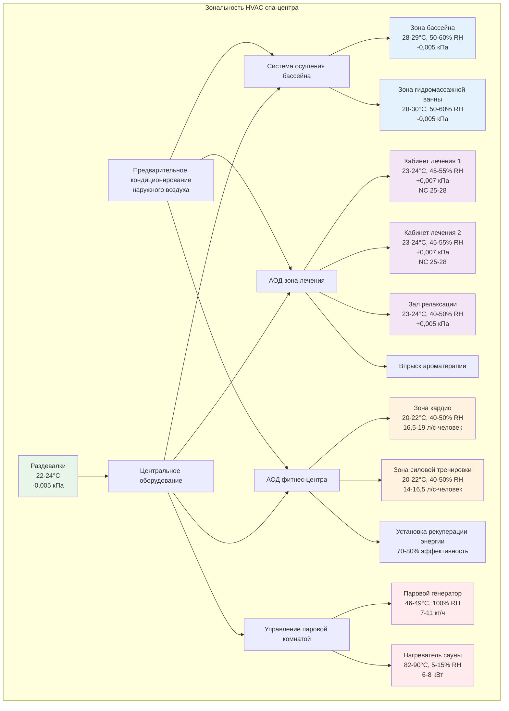

Курортные спа-центры предъявляют наиболее строгие требования к управлению окружающей средой в дизайне гостеприимства. Эти помещения сочетают экстремальные влажностные нагрузки от бассейнов и паровых комнат, строгие стандарты качества воздуха в зонах лечения, требования к точности температуры для комфорта гостей и эстетические ограничения, которые ограничивают видимость и шум оборудования. Успешное проектирование спа HVAC интегрирует контроль влажности, тепловой комфорт, управление качеством воздуха и энергоэффективность при сохранении спокойной атмосферы, необходимой для впечатления гостей.

## Осушение в зонах бассейна и гидромассажной ванны

Среды наториумов и спа-бассейнов генерируют массивные влажностные нагрузки, требующие специализированных систем осушения. Скорости испарения воды зависят от температуры воды, температуры воздуха, относительной влажности и скорости воздуха над поверхностями воды. Рассчитайте скорость испарения, используя:

$$E = A \times (1 + 0,1V) \times (P_w - P_a) \times F$$

где $E$ — скорость испарения (кг/ч), $A$ — площадь поверхности воды (м²), $V$ — скорость воздуха над водой (м/с), $P_w$ — давление насыщенного пара при температуре воды (кПа), $P_a$ — парциальное давление пара в воздухе помещения (кПа), и $F$ — коэффициент активности (0,5 для неоккупированного, 1,0 для оккупированного, 1,5 для активного использования).

Типичный спа-бассейн площадью 37 м² при температуре 30°C в помещении с температурой 28°C и 60% RH с умеренной активностью генерирует:

$$P_w = 4,25 \text{ кПа (при 30°C)}$$
$$P_a = 0,60 \times 3,77 = 2,26 \text{ кПа (при 28°C, 60% RH)}$$
$$E = 37 \times (1 + 0,1 \times 2,5) \times (4,25 - 2,26) \times 1,0 = 83 \text{ кг/ч}$$

Эта нагрузка влажности 83 кг/ч требует осушающей способности 232 кДж/ч (2 790 кДж/кг × 83 кг/ч), что превосходит возможности обычных систем кондиционирования воздуха. Специализированные системы осушения бассейнов решают эту нагрузку посредством:

**Осушители на основе хладагента**: Самодостаточные установки охлаждают воздух ниже точки росы для конденсации влаги, затем переохлаждают, используя тепло конденсатора хладагента. Эти системы достигают 13-18 кг/ч удаления влаги на установку при восстановлении 60-70% охлаждающей энергии как переохлаждения. Типичные установки требуют 5-6 установок для спа-бассейна площадью 37 м², обеспечивая избыточность и энергоэффективность благодаря модульному каскадированию.

**Осушение с десикантами**: Твердые или жидкие десиканты поглощают влагу из воздуха, затем регенерируются с использованием отходящего тепла или природного газа. Эти системы превосходны в низкотемпературных приложениях (спа-бассейны ниже 28°C), где системы на хладагенте теряют эффективность. Потребление энергии составляет 2 800-3 900 кДж на кг удаленной влаги, на 20-30% выше, чем у систем на хладагенте, но необходимо для глубокого осушения (ниже 50% RH).

**Интеграция наружного воздуха**: Системы осушения должны обрабатывать наружный воздух отдельно перед подачей в зону бассейна. В влажном климате необработанный наружный воздух при 32°C, 70% RH (влажностное отношение 0,0155 кг/кг) при смешивании с воздухом в бассейне существенно увеличивает влажностную нагрузку. Специализированные системы наружного воздуха (DOAS) с рекуперацией энергии предварительно кондиционируют воздух вентиляции до 10-13°C, 90% RH перед подачей.

Дизайн помещения балансирует комфорт против риска конденсации. Поддерживайте зоны бассейна при 28-29°C (1-2°C выше температуры воды) с 50-60% RH для предотвращения поверхностной конденсации на окнах, стенах и потолках. Более низкая влажность (40-50% RH) предотвращает конденсацию, но увеличивает скорости испарения и потребление энергии.

## Кондиционирование спа-кабинетов лечения

Кабинеты лечения требуют точного управления окружающей средой, недоступного из стандартных систем отеля. Сеансы массажной терапии, косметических процедур, телесных процедур и гидротерапии требуют стабильных температур, безтяговой подачи воздуха и бесшумной работы для поддержания расслабляющей атмосферы.

Контроль температуры поддерживает 23-24°C во время процедур, регулируемый до 24-26°C для горячего каменного массажа или 22-23°C для активных процедур. Индивидуальный контроль помещения позволяет терапевтам настраивать условия в соответствии с типом процедуры и предпочтениями клиента. Температура подаваемого воздуха должна оставаться в пределах 4-6°C от заданной температуры помещения для предотвращения термальных восходящих потоков и сквозняков на раздетых клиентов.

Распределение воздуха использует потолочную вентиляцию вытеснения или низкоскоростные настенные диффузоры, позиционированные вдалеке от кровать для массажа. Скорость подаваемого воздуха на уровне клиента должна оставаться ниже 0,1 м/с для предотвращения ощущения сквозняка. Это требует увеличенного воздуховода и диффузоров, работающих с перепадом давления 0,005-0,007 кПа, в сравнении с 0,012-0,019 кПа в обычных помещениях.

Акустические требования требуют NC 25-28 для премиальных спа, требуя:
- Вентиляторы переменной скорости с акустически облицованными корпусами
- Облицованный воздуховод с акустической изоляцией воздуховода на всех путях подачи и возврата
- Низкоскоростной дизайн (2,0-3,0 м/с в воздуховодах в сравнении с 4,0-6,0 м/с в обычных помещениях)
- Виброизоляция всего оборудования с использованием пружинных изоляторов 38-50 мм прогиба
- Звукоизолированные жалюзи на приточных отверстиях наружного воздуха

Контроль влажности поддерживает 45-55% RH для предотвращения ощущения сухой кожи во время длительных процедур при предотвращении избыточной влажности. Кабинеты лечения, примыкающие к влажным зонам (гидротерапия, паровые комнаты), требуют положительного давления (+0,007 кПа) для предотвращения миграции влаги и поддержания качества воздуха.

## Вентиляция саун и паровых комнат

Сауны и паровые комнаты представляют противоположные вентиляционные задачи: сауны требуют минимальную вентиляцию для поддержания сухого тепла, в то время как паровые комнаты требуют существенный выброс для контроля избыточной влажности.

**Традиционные сауны**: Сухие сауны работают при 82-90°C с 5-15% RH, генерируя незначительную влажностную нагрузку. Вентиляция служит только для подачи свежего воздуха (1-2 воздухообмена в час) и удаления запахов тела. Воздух подачи входит близ уровня пола (45-60 см над полом) для избежания охлаждающего эффекта на занимающихся, выходя через регулируемые отверстия близ потолка. Естественная конвекция управляет циркуляцией воздуха; механическая вентиляция должна подавать воздух при низкой скорости (<0,5 м/с) для избежания нарушения термальной стратификации, существенной для впечатления от сауны.

Мощность нагревателя составляет 6-8 кВт для объемов 1,7-2,3 м³, размер для достижения 82-88°C за 30-40 минут с холодного начала. Электроснабжение должно вмещать постоянные нагрузки 70-100 А при 240В. Управление поддерживает заданное значение ±3°C посредством модулирующих твердотельных реле, циклирующих элементы нагревателя.

**Паровые комнаты**: Паровые генераторы впрыскивают 7-11 кг/ч пара в объемы 2,3-2,8 м³, поддерживая 46-49°C при 100% RH. Это создает 19-32 кДж/ч чувствительной и скрытой нагрузки, требующей специализированного выброса. Рассчитайте требуемый поток выброса:

$$Q_{exhaust} = \frac{S_{steam} \times 2790}{(\omega_{room} - \omega_{supply}) \times 60}$$

где $S_{steam}$ — скорость впрыска пара (кг/ч), $\omega_{room}$ и $\omega_{supply}$ — влажностные отношения. Для 9 кг/ч генерации пара с выбросом на открытый воздух:

$$Q_{exhaust} = \frac{9 \times 2790}{(0,45 - 0,01) \times 60} = 1140 \text{ м³/ч}$$

Системы выброса требуют 1400-1700 м³/ч (800-1000 CFM) для типичных жилых размерных паровых комнат, увеличиваясь пропорционально для коммерческих установок. Воздух замещения должен быть нагрет до 38-43°C перед введением для предотвращения сквозняков и поддержания температуры помещения. Выбросные вентиляторы, рассчитанные на пар, с герметичными моторами и коррозионно-стойкой конструкцией выживают в условиях 46°C, 100% RH.

Стены, потолки и двери требуют барьеры пара и изоляция (R-3,5 м²·К/Вт минимум) для предотвращения конденсации в смежных помещениях. Наклонные потолки (6 мм на метр минимум) направляют конденсат на стены, а не капают на занимающихся.

## Требования к вентиляции фитнес-центров

Фитнес-центры генерируют экстремальные чувствительные и скрытые нагрузки от активности занимающихся, тепла оборудования и влаги от пота. Рассчитайте проектные нагрузки, используя метаболические скорости, надлежащие интенсивности активности:

| Активность | Чувствительная (кДж/ч-человек) | Скрытая (кДж/ч-человек) | Всего (кДж/ч-человек) |
|------------|----------------------------------|-------------------------|-----------------------|
| Силовая тренировка | 1110 | 2590 | 3700 |
| Кардиотренажеры | 590 | 3110 | 3700 |
| Класс аэробики | 590 | 3260 | 3850 |
| Йога/Пилатес | 740 | 1330 | 2070 |

Фитнес-центр площадью 186 м² с 15 кардиотренажерами, 10 силовыми станциями и 25 пиковыми занимающимися генерирует:

$$Q_{sensible} = (15 \times 590) + (10 \times 1110) = 19980 \text{ кДж/ч}$$
$$Q_{latent} = (15 \times 3110) + (10 \times 2590) = 72650 \text{ кДж/ч}$$

Скрытая нагрузка 72650 кДж/ч (26 кг/ч влаги) преобладает в дизайне, требуя либо низких температур подаваемого воздуха (9-11°C) для одновременного чувствительного и скрытого охлаждения, либо специализированного осушения с переохлаждением.

Скорости вентиляции существенно превышают минимумы код для управления CO₂ и запахами тела. ASHRAE 62.1 требует 9,4 л/с на человека для фитнес-центров, но приемлемое качество воздуха требует 14-19 л/с на человека во время пиковой использования. Для 25 занимающихся:

$$Q_{OA} = 25 \times 16,5 = 412 \text{ м³/ч (242 CFM)}$$

Этот наружный воздух представляет 40-60% от полного подаваемого воздуха в приложениях фитнеса в сравнении с 10-15% в офисах, увеличивая нагрузки кондиционирования наружного воздуха. Вентиляторы рекуперации энергии (ERV) с 70-80% чувствительной и скрытой эффективностью уменьшают энергию кондиционирования на 50-65% в сравнении с невосстановленным наружным воздухом.

Распределение воздуха требует высоких скоростей смены воздуха (8-12 ACH) для управления термальной стратификацией и обеспечения охлаждения занимающихся посредством движения воздуха. Диффузоры подачи направляют воздух к оборудованию и зонам активности при 0,25-0,5 м/с скорости на 1,8 м выше пола, создавая ощущение движения воздуха, которое улучшает восприятие комфорта несмотря на повышенные температуры сухого термометра. Проектная температура подаваемого воздуха 10-12°C ниже заданной температуры помещения для удовлетворения скрытых нагрузок при обеспечении адекватного чувствительного охлаждения.

## Ароматерапия и контроль запахов

Спа-центры внедряют ароматерапию для терапевтической выгоды и атмосферы при требовании надежного контроля запахов для предотвращения перекрестного загрязнения между модальностями лечения и поддержания стандартов качества воздуха.

**Распределение ароматерапии**: Системы диффузии эфирных масел впрыскивают микрочастицы в подаваемый воздух или обеспечивают локализованную диффузию в кабинетах лечения. Центральная диффузия требует:
- Точки впрыска, посвященные после фильтров для предотвращения накопления масла на средах
- Форсунки впрыска из нержавеющей стали или стекла, устойчивые к химии эфирных масел
- Программируемое управление интенсивностью запаха и расписанием
- Ежегодная очистка воздуховода для удаления остатка масла

Типичные скорости диффузии составляют 0,5-2,0 мл/ч на 93 м³ кондиционируемого помещения. Чрезмерное применение создает головные боли и раздражение дыхательных путей; недостаточное применение не достигает терапевтических или целей атмосферы. Системы отдельного помещения избегают перекрестного загрязнения, но увеличивают требования к обслуживанию.

**Стратегия контроля запахов**: Спа-окружающая среда генерирует запахи от процедур (горячие масла, травяные препараты), пот занимающихся и химические вещества бассейна. Эффективный контроль запахов требует:

**Иерархия давления**: Поддерживайте положительное давление в чистых зонах (кабинеты лечения, залы релаксации) относительно генерирующих запахи пространств (фитнес-центры, раздевалки, влажные зоны). Типичные дифференциалы давления:
- Кабинеты лечения: +0,007 до +0,012 кПа относительно коридоров
- Коридоры: +0,005 кПа относительно раздевалок
- Раздевалки: -0,005 кПа (отрицательная) для содержания запахов
- Зоны бассейнов: -0,005 до -0,010 кПа (отрицательная) для содержания запахов хлорамина

**Смены воздуха и фильтрация**: Высокие скорости вентиляции (6-10 ACH) в зонах источников запахов в сочетании с фильтрацией MERV 13-14 и активированными угольными фильтрами контролируют твердые частицы и газообразные загрязнители. Угольные фильтры требуют замены каждые 6-12 месяцев в зависимости от интенсивности нагрузки; мониторинг перепада давления указывает насыщение.

**Стратегия выброса**: Специализированный выброс из раздевалок, санузлов и зон фитнеса предотвращает рециркуляцию запахов. Только-выбросная вентиляция в этих зонах (без механической подачи) создает отрицательное давление, вытягивающее воздух из смежных коридоров с положительным давлением, устанавливая естественный поток воздуха от чистого к загрязненному.

## Переход качества воздуха внутри помещений на открытом воздухе

Курортные спа часто включают элементы на открытом воздухе—кабинеты лечения на открытом воздухе, сады медитации, бесконечные бассейны—требуя дизайн HVAC, управляющий переходами между кондиционированными и некондиционированными пространствами без компрометирования эффективности или комфорта.

**Открытые зоны лечения**: Открытые или полуоткрытые кабинеты лечения в мягком климате полагаются на лучистое отопление/охлаждение с минимальной механической вентиляцией. Инфракрасные лучистые обогреватели (3-5 кВт на кабинет) обеспечивают точечное отопление в прохладную погоду без нарушения естественной вентиляции. Нагретые потолки или полы (27-32°C температура поверхности) расширяют использование переходного сезона. Потолочные вентиляторы (47-94 л/с) обеспечивают движение воздуха и контроль насекомых без заключения пространства.

**Переходные зоны**: Тамбуры и воздушные завесы разделяют высокой влажности зоны бассейнов от сухих внутренних пространств. Воздушные завесы, установленные в дверных проемах, подают 6,7-8,0 м/с скорость выхода, создавая невидимый барьер, который уменьшает миграцию влаги на 60-80% при открывании дверей. Тамбуры с двумя комплектами дверей и промежуточным кондиционированием обеспечивают превосходное разделение, но требуют 5,6-9,3 м² на проем.

**Интеграция экономайзера наружного воздуха**: Расположение курортов в мягком климате пользуются наружным воздухом для бесплатного охлаждения, когда условия позволяют. Однако спа-бассейны и фитнес-центры предъявляют требования контроля влажности в течение всего года, ограничивая работу экономайзера. Оцените выгоду экономайзера, используя интегрированное значение частичной нагрузки (IPLV), учитывающее фактические часы работы при различных условиях открытого воздуха, в сравнении с дополнительной энергией контроля влажности. В морских климатах (24-29°C, 60-80% RH большинство года) работа экономайзера сохраняет минимальную энергию из-за требований охлаждения скрытого содержания влаги.

## Проектные условия для спа-помещений

| Тип помещения | Температура (°C) | Относительная влажность (%) | Вентиляция (л/с-человек или ACH) | Критерии шума | Давление |
|---------------|------------------|-----------------------------|------------------------------------|---------------|----------|
| Кабинеты лечения | 23-24 | 45-55 | 12 л/с-человек | NC 25-28 | +0,007 кПа |
| Зал релаксации | 23-24 | 40-50 | 9,4 л/с-человек | NC 28-30 | +0,005 кПа |
| Зона бассейна | 28-29 | 50-60 | 6-8 ACH | NC 35-40 | -0,005 кПа |
| Зона гидромассажной ванны | 28-30 | 50-60 | 8-10 ACH | NC 35-40 | -0,005 кПа |
| Паровая комната | 46-49 | 100 | 10-15 ACH | NC 40-45 | Нейтральная |
| Сауна | 82-90 | 5-15 | 1-2 ACH | NC 40-45 | Нейтральная |
| Фитнес-центр | 20-22 | 40-50 | 16,5-19 л/с-человек | NC 35-40 | Нейтральная |
| Раздевалки | 22-24 | 40-50 | 0,28 л/с-м² | NC 35-40 | -0,005 кПа |
| Коридоры | 22-24 | 40-55 | 0,011 л/с-м² | NC 35-40 | +0,005 кПа |

## Зональность HVAC спа-центра

Системы HVAC для курортов и спа-центров требуют специализированной экспертизы за пределами обычного дизайна гостеприимства. Сочетание экстремальных влажностных нагрузок, требований к точному кондиционированию, строгих акустических критериев и эстетических ограничений требует интегрированного дизайна, решающего вопросы термодинамики, качества воздуха, управления и впечатления гостей. Успешные установки балансируют техническую производительность с простотой эксплуатации, обеспечивая спа-окружающую среду поддержание своей терапевтической атмосферы при достижении целей энергоэффективности. Избыточность оборудования, сложное управление и всесторонние программы обслуживания доказали необходимость для устойчивой производительности в этих требовательных приложениях.
