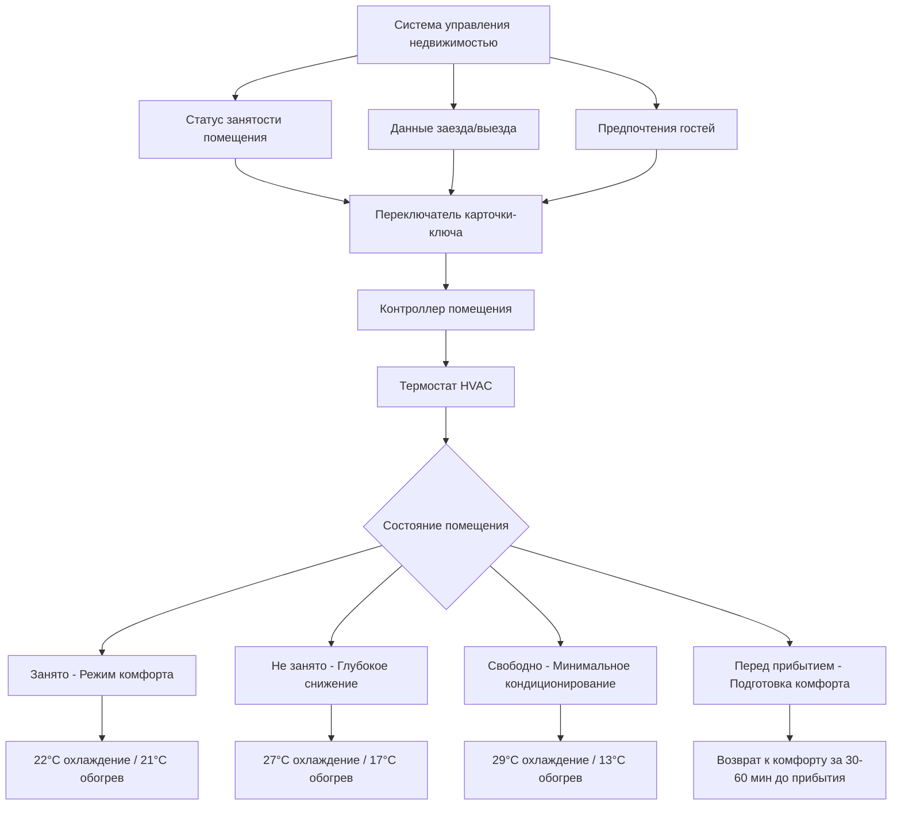

Интеграция HVAC с карточкой-ключом представляет одну из наиболее эффективных стратегий экономии энергии в гостинично-ресторанных учреждениях. Путём связывания детектирования занятости помещения с системами климат-контроля, отели снижают энергопотребление в периоды отсутствия гостей при обеспечении немедленного комфорта при возвращении. Эта технология балансирует снижение эксплуатационных затрат с требованиями к впечатлению гостя.

## Работа и типы переключателей карточки-ключа

Переключатели карточки-ключа определяют занятость помещения на основе вставления и удаления ключевой карты гостя. Когда гости вставляют карту в настенный переключатель, электроэнергия поступает на систему HVAC для нормальной работы. При удалении карты при выходе из помещения переключатель сигнализирует термостату перейти в режим энергосбережения со снижением.

**Распространённые типы переключателей:**

| Тип переключателя | Принцип работы | Типичные применения | Время отклика |
|------------|---------------------|---------------------|---------------|
| Механический контакт | Физическое вставление карты замыкает цепь | Бюджетные отели, модернизация | Мгновенное |
| Магнитный язычок | Магниты в карте активируют язычки | Среднего класса объекты | <1 секунда |
| RFID датчик приближения | Электронное обнаружение близости карты | Люксовые отели, современные системы | <0,5 секунды |
| Считыватель смарт-карты | Аутентификация зашифрованных данных карты | Приложения с высокой безопасностью | 1-2 секунды |

Механический тип контакта обеспечивает простоту и надёжность, но не предоставляет верификацию безопасности. RFID системы датчиков приближения позволяют работать без касания и интегрируются бесшовно с контролем доступа, хотя с более высокой начальной стоимостью.

## Интеграция системы управления недвижимостью

Современные системы HVAC с карточкой-ключом интегрируются с системами управления недвижимостью отеля (PMS) для оптимизации использования энергии на протяжении всего жизненного цикла гостя. Эта интеграция обеспечивает скоординированный контроль на основе данных бронирования, графика уборки и предпочтений гостей.

## Последовательности снижения и повышения

Экономия энергии от систем с карточкой-ключом получается из температурных снижений в периоды отсутствия людей. Величина и время этих снижений существенно влияют на энергопотребление и удовлетворённость гостей.

**Типичные последовательности снижения:**

1. **Немедленное снижение (0-5 минут после удаления ключа):** Небольшое снижение на 1-2°C для сохранения близких к комфортным условий при кратких отсутствиях
2. **Промежуточное снижение (5-30 минут):** Умеренное снижение на 2-3°C при продолжительных отъездах
3. **Глубокое снижение (30+ минут):** Полное снижение на 4-5°C для максимальной экономии энергии

Последовательность повышения при вставлении ключа восстанавливает условия комфорта. Современные системы используют предсказательные алгоритмы, которые корректируют время повышения на основе наружных условий и производительности системы.

Время, требуемое для восстановления комфорта, зависит от нагрузки помещения и производительности оборудования:

$$t_{восстановления} = \frac{m \cdot c_p \cdot \Delta T}{Q_{производительность} \cdot 3600}$$

Где:
- $t_{восстановления}$ = время восстановления (часы)
- $m$ = масса воздуха в помещении (кг)
- $c_p$ = удельная теплоёмкость воздуха (1,006 кДж/кг·K)
- $\Delta T$ = разность температур (K)
- $Q_{производительность}$ = производительность агрегата HVAC (кВт)

Для типичного номера отеля площадью 37 м² с производительностью HVAC 2,93 кВт (10 000 БТЕ/ч), восстанавливающимся из снижения на 4,4 K (8°F):

$$t_{восстановления} = \frac{480 \text{ кг} \cdot 1,006 \text{ кДж/кг·K} \cdot 4,4 \text{ K}}{2,93 \text{ кВт} \cdot 3600 \text{ с/ч}} = 0,20 \text{ часа} \approx 12 \text{ минут}$$

## Автоматизация HVAC при заезде и выезде

Интеграция PMS обеспечивает автоматический контроль HVAC на основе графиков прибытия и убытия гостей. Это предварительное кондиционирование оптимизирует использование энергии при обеспечении комфорта помещения при заезде.

**Автоматизация заезда:**
- Система получает ожидаемое время прибытия из PMS
- HVAC начинает предварительное кондиционирование за 30-60 минут до запланированного заезда
- Помещение достигает уставки комфорта к прибытию гостя
- Устраняет потери энергии от непрерывного кондиционирования пустых номеров

**Автоматизация выезда:**
- PMS сигнализирует завершение выезда системе HVAC
- Контроллер переходит из режима "занято" в режим "свободно"
- Глубокое снижение применяется немедленно, а не ждёт удаления карты
- Помещение поддерживается при минимальном кондиционировании до следующего бронирования

Отели с непоследовательным временем заезда наиболее выигрывают от предварительного кондиционирования по прибытию, так как номера остаются в глубоком снижении до необходимости, а не кондиционируются весь день.

## Возможности переопределения для VIP гостей

Гости с высокой стоимостью и программы VIP требуют возможностей переопределения для отключения энергосберегающих снижений. Эти переопределения сохраняют непрерывный комфорт независимо от статуса карточки-ключа.

**Методы реализации переопределения:**

1. **Переопределение флага PMS:** Статус VIP в PMS автоматически отключает снижение для назначенных номеров
2. **Ручной переключатель переопределения:** Переключатель в номере позволяет гостям отключить контроль по карточке-ключу
3. **Переопределение с ограничением по времени:** Инициированное гостем переопределение сохраняет режим комфорта на заранее установленную длительность (4-24 часа)
4. **Управление мобильным приложением:** Гости контролируют температуру в номере удалённо через мобильное приложение отеля

Ручной переключатель переопределения обычно включает кнопку "гость в номере", которая поддерживает режим комфорта без вставления карты. Это приспосабливает гостей, которые предпочитают непрерывное кондиционирование или имеют несколько занимающих лиц.

## Экономия энергии от управления по карточке-ключу

Управление HVAC по карточке-ключу обеспечивает существенную экономию энергии через снижение работного времени в периоды отсутствия людей. Фактическая экономия зависит от климата, схемы занятости гостей и величины снижения.

**Экономия энергии по типам системы:**

| Климатическая зона | Тип системы | Среднее ежедневное время без гостей | Экономия энергии | Годовое снижение стоимости на номер |
|--------------|-------------|----------------------------|----------------|-------------------------------|
| Жаркий-влажный | Только охлаждение | 8-12 часов | 30-40% | 8 500-13 200 руб. |
| Жаркий-сухой | Только охлаждение | 10-14 часов | 35-45% | 9 450-15 100 руб. |
| Смешанный | Тепловой насос | 8-10 часов | 25-35% | 7 550-11 300 руб. |
| Холодный | Преимущественно отопление | 6-8 часов | 20-30% | 6 600-10 400 руб. |

Процент экономии энергии можно рассчитать на основе длительности снижения и снижения нагрузки:

$$E_{экономия} = \frac{t_{без\_людей} \cdot (Q_{занято} - Q_{снижение})}{24 \cdot Q_{занято}} \cdot 100\%$$

Где:
- $E_{экономия}$ = процент экономии энергии
- $t_{без\_людей}$ = среднее ежедневное время без людей (часы)
- $Q_{занято}$ = нагрузка HVAC при уставке "занято" (кВт)
- $Q_{снижение}$ = нагрузка HVAC при уставке снижения (кВт)

Для номера отеля со средним ежедневным временем без гостей 10 часов со снижением нагрузки на 70% при снижении:

$$E_{экономия} = \frac{10 \cdot (Q_{занято} - 0,3 \cdot Q_{занято})}{24 \cdot Q_{занято}} \cdot 100\% = \frac{10 \cdot 0,7}{24} \cdot 100\% = 29\%$$

## Вопросы проектирования системы

Эффективная интеграция HVAC с карточкой-ключом требует внимательного отношения к впечатлению гостя и надёжности системы. Плохо реализованные системы создают неудовлетворённость гостей, которая перевешивает преимущества экономии энергии.

**Критические факторы проектирования:**

- **Отказоустойчивая работа:** Система по умолчанию переходит в режим "занято" при отказе связи для предотвращения дискомфорта гостя
- **Возможность обхода:** Персонал по обслуживанию может получить доступ в номеры без срабатывания датчика занятости для обслуживания
- **Постепенное снижение:** Поэтапные изменения температуры предотвращают абrupt потерю комфорта когда гости забывают карточки
- **Индикация статуса:** Визуальная обратная связь подтверждает режим системы без необходимости взаимодействия с термостатом

Системы с карточкой-ключа работают лучше всего в отелях ограниченного обслуживания, где гости проводят значительные дневные часы вне номеров. Объекты с долгосрочными проживаниями имеют сниженную экономию из-за более высокой средней схемы занятости.

Окупаемость инвестиций для систем HVAC с карточкой-ключом обычно составляет от 1,5 до 3 лет в жарких климатах с высокими нагрузками охлаждения, и от 2,5 до 4 лет в умеренных климатах. Затраты на установку варьируются от 7 100-18 900 руб. на номер в зависимости от существующей инфраструктуры и сложности интеграции.

При сочетании с другими мерами по экономии энергии, такими как датчики присутствия, управление освещением и эффективное оборудование, интеграция HVAC с карточкой-ключом формирует часть комплексной стратегии управления энергией, которая может снизить общее энергопотребление отеля на 40-50% в сравнении с неконтролируемой работой.
