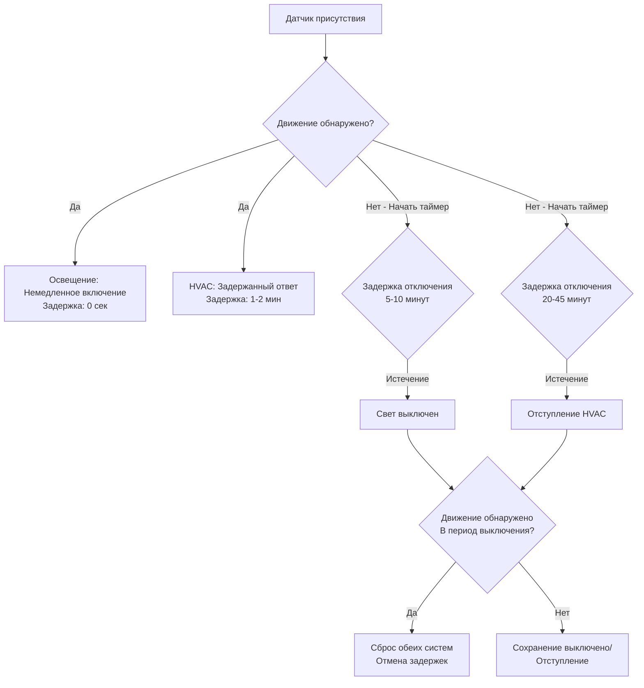

## Обзор технологии датчиков

Датчики присутствия обеспечивают автоматическое управление отступлением HVAC в периоды отсутствия гостей, снижая потребление энергии при сохранении комфорта при возвращении в номер. Гостиницы используют датчики присутствия как альтернативу интеграции с системой управления имуществом (PMS) или дополнение к ней, особенно в объектах без инфраструктуры PMS или требующих резервного обнаружения присутствия. Выбор датчика включает балансирование точности обнаружения, приватности гостей, предотвращения ложных срабатываний и соображений стоимости.

Три основные технологии доминируют в датчиках присутствия гостиниц: пассивная инфракрасная (PIR), ультразвуковая и двухтехнологичные системы, комбинирующие оба подхода. Каждая технология проявляет отличительные характеристики, влияющие на пригодность для приложений в гостевых номерах.

## Технология датчиков пассивной инфракрасной радиации

PIR датчики обнаруживают изменения инфракрасного излучения, вызванные теплыми телами, движущимися в пределах поля обнаружения. Температура человеческого тела (примерно 37°C) контрастирует с типичными температурами в комнатах (20-24°C), создавая обнаруживаемые изменения сигнатуры IR при движении гостей. PIR датчики содержат пироэлектрические элементы за сегментированными линзами Френеля, фокусирующими инфракрасное излучение на элементы детектора. Движение через сегменты линзы генерирует дифференциальные сигналы, вызывающие индикацию присутствия.

### Характеристики обнаружения PIR

Чувствительность PIR зависит от направления движения относительно датчика. Движение непосредственно в сторону или от датчика генерирует минимальное изменение сигнала, в то время как боковое движение через зоны обнаружения производит сильный ответ. Эта направленная чувствительность требует стратегического размещения, обеспечивающего пересечение гостями зон обнаружения при нормальной деятельности в номере.

Температурный градиент между занимающим комнату и фоном влияет на надежность обнаружения. В очень теплых климатических условиях, где температура в комнатах при отступлении приближается к температуре тела, чувствительность PIR снижается. Комнаты при температуре отступления 29°C обеспечивают только 8°C градиента по сравнению с 17°C градиентом при температуре размещения 20°C, потенциально вызывая отказы обнаружения.

Дальность обнаружения варьируется в зависимости от высоты монтажа и конструкции линзы. Датчики, установленные на стене, обычно охватывают 4,5-6 м при высоте монтажа 1,2 м, в то время как потолочные установки достигают 6-9 м охвата при высоте 2,4-3 м. Приложения в гостевых номерах предпочитают монтаж на стене на высоте термостата (120-130 см) для эстетической интеграции и сфокусированного охвата занятых зон.

### Преимущества и ограничения PIR

PIR датчики предлагают низкую стоимость (300-600 руб. за датчик), простую установку, низкое потребление энергии (0,5-2 Вт) и проверенную надежность в приложениях HVAC. Они не вводят излучаемых сигналов, избегая потенциального радиочастотного помехоустойчивости или проблем приватности от активных технологий зондирования.

Ограничения включают неспособность обнаруживать неподвижных занимающих помещение. Гости, спящие, читающие или работающие за столами без движения, вызывают ложное обнаружение вакансии. Временные задержки снижают это, требуя устойчивого отсутствия перед инициацией отступления, но консервативные задержки (30-45 минут) снижают энергосбережение, в то время как агрессивные задержки (10-15 минут) увеличивают риск ложной вакансии.

Температурные эффекты ухудшают производительность в экстремальных условиях. Высокие температуры в комнатах во время летних периодов отступления снижают надежность обнаружения. Прямой солнечный свет на датчиках создает ложные срабатывания из-за быстрых изменений температуры на стенах или мебели. Место установки должно избегать прямого солнечного воздействия и источников тепла (освещение, электроника).

## Ультразвуковая технология датчиков

Ультразвуковые датчики испускают высокочастотные звуковые волны (25-40 кГц), неслышимые человеком, и обнаруживают сдвиги частоты в отраженных сигналах, вызванные движущимися объектами — эффект Доплера. Занимающие номер люди, движущиеся в сторону датчика или от него, создают сдвиги частоты, пропорциональные скорости движения, вызывающие индикацию присутствия.

### Принципы ультразвукового обнаружения

Ультразвуковые датчики передают непрерывные или импульсные ультразвуковые волны, заполняющие зону обнаружения. Неподвижные объекты отражают волны на передаваемой частоте, в то время как движущиеся объекты создают отраженные волны со сдвинутой частотой. Электроника датчика сравнивает передаваемые и принимаемые частоты, обнаруживая сдвиги, указывающие на движение.

Паттерн обнаружения фундаментально отличается от PIR. Ультразвуковые датчики обнаруживают любое движение в пределах зоны охвата независимо от направления, включая движение непосредственно в сторону или от датчика. Эта всенаправленная чувствительность обеспечивает более полный охват, но увеличивает восприимчивость к ложным срабатываниям от воздушного потока HVAC, движущего занавески, бумаги или движения двери.

Ультразвуковая длина волны (примерно 1,3 см при 27 кГц) отражается от малых объектов, которые PIR игнорирует. Подача воздуха HVAC, движущая занавески или драпировки, открытие/закрытие двери и даже работа потолочного вентилятора могут вызвать индикацию присутствия. Приложения в гостевых номерах требуют тщательного выбора места установки и настройки чувствительности для минимизации ложных срабатываний.

### Характеристики ультразвуковой производительности

Дальность и охват превышают датчики PIR. Единые ультразвуковые датчики охватывают 9-12 м с широкими паттернами пучка (120-180°), потенциально мониторируя весь гостевой номер с одного места установки. Потолочный монтаж обеспечивает оптимальный охват, распределяя обнаружение по всему объему комнаты, а не фокусируя на определенных зонах.

Факторы окружающей среды влияют на производительность иначе, чем PIR. Температура, влажность и атмосферное давление влияют на скорость распространения звуковой волны, но редко вызывают значительные ошибки обнаружения в пределах типичных рабочих диапазонов HVAC. Акустическое поглощение мебелью, коврами и драпировками снижает эффективный диапазон, но улучшает производительность, уменьшая отражения от соседних пространств.

Потребление энергии (2-5 Вт) превышает датчики PIR из-за непрерывной или частой ультразвуковой передачи. Аккумуляторные беспроводные датчики предпочитают технологию PIR для продолжительного времени работы батареи, в то время как датчики, питаемые от сети, размещают ультразвуковые энергетические требования.

## Двухтехнологичные сенсорные системы

Двухтехнологичные датчики комбинируют PIR и ультразвуковое обнаружение в единое устройство, требуя обе технологии для подтверждения присутствия (логика AND) или позволяя любой технологии указывать присутствие (логика OR). Логика AND минимизирует ложные срабатывания, так как обе независимые технологии должны обнаружить движение, в то время как логика OR максимизирует надежность обнаружения, так как достаточно одной технологии.

### Конфигурация логики AND

Логика AND требует одновременного обнаружения PIR инфракрасной радиации и ультразвукового доплеровского обнаружения перед подтверждением присутствия. Это драматически снижает ложные срабатывания от воздушных потоков (ультразвук только), прямого солнечного света (только PIR) или электрических помех (маловероятно воздействие на обе технологии одновременно). Частота ложных срабатываний снижается в 10-100 раз по сравнению с однотехнологичными датчиками.

Приложения в гостевых номерах предпочитают логику AND для управления отступлением. Ложные срабатывания присутствия тратят энергию, предотвращая отступление в периоды вакансии, в то время как ложная вакансия вызывает дискомфорт, инициируя отступление при присутствии. Логика AND приоритизирует избежание ложной вакансии — если какая-либо технология обнаруживает движение, номер остается в режиме занятости, защищая комфорт гостя. Отступление инициируется только когда обе технологии подтверждают отсутствие.

Задержка обнаружения увеличивается с логикой AND, так как гости должны генерировать движение, обнаруживаемое обоими типами датчиков. PIR требует бокового движения, в то время как ультразвук обнаруживает любое движение, включая прямой подход. Нормальная деятельность гостей в номере (ходьба, приближение, поворот) обычно вызывает срабатывание обоих датчиков в течение 5-10 секунд, приемлемо для приложений HVAC.

### Конфигурация логики OR

Логика OR указывает присутствие при обнаружении движения либо PIR, либо ультразвуком, максимизируя надежность обнаружения за счет повышенного потенциала ложных срабатываний. Эта конфигурация подходит для управления освещением, где события ложного отключения расстраивают жильцов больше, чем события ложного включения тратят энергию. Приложения HVAC редко используют логику OR, так как ложные срабатывания присутствия предотвращают энергосберегающее отступление.

## Стратегии размещения датчиков

Оптимальное размещение датчиков обеспечивает надежное обнаружение присутствия по всему гостевому номеру, избегая ложных срабатываний от соседних пространств, внешних условий или работы HVAC. Гостевые номера гостиниц представляют уникальные проблемы, включая вариацию мебели между номерами, дверные проемы в ванные комнаты, требующие обнаружения, и ожидания гостей по приватности, ограничивающие мониторинг в стиле видеонаблюдения.

### Местоположение датчиков, установленных на стене

Монтаж на стене на высоте термостата (120-130 см) обеспечивает удобную интеграцию с управлением HVAC, достигая эффективного охвата обнаружения. Датчики монтируются на внутренних стенах, перпендикулярных пути входа гостей, обеспечивая пересечение датчиком зон обнаружения при входе в номер. Монтаж напротив входной двери захватывает максимальное боковое движение, когда гости пересекают номер.

Избегайте монтажа на наружных стенах, где колебания температуры влияют на производительность PIR и ультразвуковые сигналы отражаются от стекла окна, создавая помехи. Северные стены в северном полушарии (южные стены в южном полушарии) минимизируют солнечное нагревание, влияющее на чувствительность температуры PIR.

Проверка охвата требует измерения паттернов обнаружения в репрезентативных номерах с учетом расстановки мебели. Датчики должны обнаруживать занимающих помещение на кровати (спящие, читающие), столе (работающие) и сидячих местах (расслабляющиеся). Мертвые зоны за мебелью или в ванных комнатах могут позволить необнаруженное присутствие, вызывающее преждевременное отступление.

### Потолочные конфигурации

Потолочный монтаж обеспечивает превосходный охват, особенно для ультразвуковых датчиков с всенаправленными паттернами обнаружения. Датчики монтируются в геометрическом центре комнаты или смещены к области кровати, где гости проводят большинство времени. Высота потолка влияет на охват — стандартные потолки высотой 2,4-2,7 м подходят для потолочного монтажа, в то время как более высокие потолки (>3 м) могут превышать оптимальный диапазон, требуя нескольких датчиков или монтажа на стене.

PIR потолочные датчики используют 360° паттерны обнаружения, охватывающие всю комнату с одного местоположения. Регулировки чувствительности предотвращают ложные срабатывания от диффузоров HVAC или потолочных вентиляторов. Монтаж над кроватью обеспечивает обнаружение спящих занимающих помещение, которые иногда совершают движения, генерирующие обнаруживаемое движение.

Эстетические соображения предпочитают потолочный монтаж в престижных объектах, где открытые датчики, установленные на стене, портят внешний вид номера. Утопленные датчики интегрируются с плоскостью потолка, соответствуя спринклерам, колонкам или детекторам. Заподлицо монтаж требует координации во время строительства для размещения клеммных коробок и доступа к проводке.

### Рассмотрения охвата ванной комнаты

Ванные комнаты представляют проблемы обнаружения, так как гости занимают эти пространства 5-15% времени номера. Датчики, не обнаруживающие присутствие в ванной, инициируют преждевременное отступление, вызывающее дискомфорт при возвращении гостей в спальню. Два подхода решают проблему обнаружения в ванной:

**Обнаружение с одной точки** размещает датчики с прямой видимостью в ванную, охватывая унитаз, раковину и области душа. Открытые планировки ванных позволяют обнаружение датчиками, установленными в спальне, в то время как закрытые ванные требуют выделенных датчиков или переключателей положения двери, указывающих присутствие в ванной.

**Переключатели положения двери** обеспечивают простое, надежное обнаружение присутствия в ванной. Магнитные контактные переключатели обнаруживают закрытие двери, предполагая присутствие в ванной при закрытии двери. Этот подход генерирует ложное обнаружение присутствия при закрытии двери без присутствия, но избегает ложной вакансии при фактическом использовании.

## Временные настройки задержки

Временные задержки определяют длительность, требуемую перед подтверждением датчиком присутствия (задержка включения) или вакансии (задержка отключения). Приложения HVAC используют асимметричные задержки с минимальной задержкой включения (0-2 минуты) и расширенной задержкой отключения (15-45 минут), оптимизируя комфорт гостей и энергосбережение.

### Конфигурация задержки включения

Задержка включения предотвращает немедленный ответ системы на кратковременное обнаружение движения, фильтруя преходящие сигналы от насекомых, воздушных потоков или деятельности в соседних пространствах. Системы HVAC переносят более длительные задержки включения, чем освещение, так как тепловая масса обеспечивает буфер 15-30 минут перед восприятием гостями изменений температуры. Типичные задержки включения 1-2 минуты подтверждают устойчивое присутствие, позволяя быстрое восстановление комфорта при входе гостей в номеры.

Время восстановления из отступления определяет приемлемую задержку включения. Оборудование должно восстановить комфортные условия перед восприятием гостями дискомфорта, требуя:

$$t_{on-delay} + t_{recovery} < t_{tolerance}$$

где $t_{tolerance}$ представляет порог дискомфорта гостей, обычно 15-20 минут в гостиничных условиях, ожидающих немедленного комфорта. Для систем, требующих 10 минут времени восстановления, максимальная задержка включения достигает 5-10 минут. Системы с более высокой производительностью достигают более быстрого восстановления, позволяя более длительные задержки включения, улучшающие иммунитет от ложных срабатываний.

### Оптимизация задержки отключения

Длительность задержки отключения критически влияет как на комфорт гостей, так и на энергосбережение. Чрезмерно короткие задержки (5-10 минут) инициируют отступление в периоды неподвижной деятельности (сон, чтение, работа), вызывая дискомфорт и жалобы гостей. Чрезмерно длительные задержки (60+ минут) предотвращают отступление в периоды фактической вакансии (гости на завтраке, встречах, осмотре достопримечательностей), исключая потенциал энергосбережения.

Оптимальная задержка отключения балансирует риск ложной вакансии против длительности периода вакансии. Анализ паттернов присутствия в гостевых номерах выявляет типичные периоды вакансии во время занятых проживаний:

- Утренний уход на завтрак/встречи: 2-4 часа
- Дневной осмотр достопримечательностей/деловые: 4-8 часов
- Вечерний обед: 1-3 часа
- Краткие экскурсии: 0,5-2 часа

Настройки задержки отключения 20-30 минут захватывают 80-90% фактических периодов вакансии, минимизируя ложную вакансию при неподвижном присутствии. Более консервативные задержки 45 минут снижают риск ложной вакансии до <5%, но жертвуют энергосбережением, не захватывая более короткие периоды вакансии.

Статистический анализ определяет оптимальную задержку на основе паттернов присутствия объекта:

$$t_{off-delay} = \mu_{vacant} - 2\sigma_{stationary}$$

где $\mu_{vacant}$ представляет среднюю длительность периода вакансии и $\sigma_{stationary}$ представляет стандартное отклонение максимальных неподвижных периодов. Эта настройка захватывает большинство периодов вакансии при сохранении низкой вероятности ложной вакансии (<2,3% для порога 2-сигма).

## Интеграция с системами освещения

Датчики присутствия, выполняющие двойную функцию управления HVAC и освещением, обеспечивают повышенное энергосбережение и упрощенную установку. Сеть единого датчика мониторирует присутствие для обоих систем зданий, снижая стоимость оборудования и архитектурный эффект. Однако HVAC и освещение проявляют различные требования времени отклика и допуска на ложные срабатывания, требуя тщательного проектирования стратегии управления.

### Координация логики управления

Системы освещения требуют немедленного ответа на изменения присутствия — гости, входящие в темные номеры, ожидают мгновенного включения света, в то время как выходящие гости приемлют немедленное отключение. Системы HVAC переносят задержки 5-15 минут в обоих направлениях из-за тепловой массы буферизирования. Датчики присутствия, используемые совместно, реализуют отдельные временные задержки для каждой системы, оптимизируя производительность:

Задержка отключения освещения обычно варьируется 5-10 минут, обеспечивая период благодати для неподвижных занимающих помещение, сохраняя энергию в краткие отсутствия (посещения ванной). Задержка отключения HVAC продлевается 20-45 минут, учитывая более длительные неподвижные периоды (сон, работа), где движение освещения может произойти, но HVAC должна поддерживать комфорт.

### Синергия энергосбережения

Комбинированное управление освещением и HVAC усиливает энергосбережение за пределами индивидуальных выгод системы. Нагрузки освещения генерируют внутренние выигрыши тепла, способствующие нагрузкам охлаждения — снижение работы освещения через управление присутствием снижает как энергию освещения, так и пропорциональную энергию охлаждения. Вычислите комбинированное сбережение:

$$E_{total} = E_{lighting} + E_{HVAC} + E_{cooling-from-lights}$$

где энергия охлаждения, приписываемая теплоотдачам освещения, приближается:

$$E_{cooling-from-lights} = E_{lighting} \times \frac{COP_{cooling}^{-1}}{3.412} \times f_{gain}$$

с $COP_{cooling}$, представляющим эффективность оборудования охлаждения, 3.412, преобразующим кВт⋅ч в кДж, и $f_{gain}$, представляющим доля энергии освещения, входящая в кондиционируемое пространство (обычно 0,7-0,9, учитывая потери через потолки). Для типичного гостевого номера с 300 Вт освещением и COP 3,0:

$$E_{cooling-from-lights} = 0.3 \text{ кВт} \times \frac{3.0^{-1}}{3.412} \times 0.8 = 0.070 \text{ кВт}$$

Общая сохраняемая нагрузка достигает 370 Вт (300 Вт освещение + 70 Вт охлаждение), на 23% больше, чем только сбережение от освещения. Эта синергия увеличивает рентабельность управления присутствием.

## Соображения приватности

Ожидания гостей по приватности в гостевых номерах ограничивают приемлемые методы обнаружения присутствия. Датчики должны обеспечивать надежное управление HVAC без возможностей видеонаблюдения, сбора данных, которые могли бы отслеживать деятельность гостей, или работы, указывающей на мониторинг. Датчики гостиничного уровня отличаются от коммерческих офисных датчиков, требующих повышенной защиты приватности.

### Технологии, сохраняющие приватность

PIR и ультразвуковые датчики квалифицируются как технологии, сохраняющие приватность, так как они обнаруживают движение без идентификации людей, захвата изображений или записи паттернов деятельности, выходящих за пределы простого состояния присутствия. В отличие от камер или акустических мониторов, датчики движения обеспечивают двоичный (занято/вакантно) выход без подробной информации о деятельности.

Обработка данных датчика происходит локально в электронике датчика или контроллере термостата — активность журналы не передаются на серверы объекта, позволяя анализ поведения. Состояние присутствия может сообщаться в системы автоматизации здания для мониторинга энергии, но отдельные события движения остаются неизвестными. Эта архитектура предотвращает постфактум анализ паттернов поведения гостей.

Видимое обозначение датчика повышает доверие гостей через прозрачность. LED индикаторы, показывающие статус датчика (движение обнаружено, система активна), демонстрируют работу датчика без создания восприятия видеонаблюдения. Маркировка идентифицирует датчики как "детектор присутствия" или "автоматическое управление", а не "детектор движения", которое предполагает контроль безопасности, а не управление энергией.

### Чувствительность и ложная вакансия

Соображения приватности предпочитают консервативную чувствительность датчика, снижающую обнаружение малых движений, потенциально указывающих на определенную деятельность. Более низкая чувствительность обнаруживает только существенное движение (ходьба, стояние, широкие жесты), игнорируя малые движения (жесты рукой, смещение при сидении). Это снижает гранулярность обнаружения, защищая приватность деятельности, сохраняя адекватный охват для управления HVAC.

Допуск ложной вакансии увеличивается в гостиничных приложениях по сравнению с коммерческими зданиями. Офисные занимающие помещение переносят агрессивные задержки отключения (5-10 минут) и события ложной вакансии, так как понимают цели энергосбережения. Гостиничные гости ожидают непоколебимого комфорта и интерпретируют события ложной вакансии как неисправность системы или неадекватное обслуживание. Консервативные задержки отключения 30-45 минут минимизируют жалобы гостей, несмотря на сниженное энергосбережение.

## Сравнение технологии датчиков

Различные технологии датчиков проявляют отличительные характеристики, влияющие на пригодность приложения гостиницы:

| Технология | Метод обнаружения | Паттерн охвата | Частота ложных срабатываний | Уровень приватности | Стоимость | Потребление энергии |
|------------|-----------------|------------------|-------------------|---------------|------|-------------------|
| PIR | Изменения инфракрасной радиации | Направленный (90-120°) | Низкая-умеренная | Высокая | 300-600 руб. | 0,5-2 Вт |
| Ультразвук | Сдвиг частоты Доплера | Всенаправленный (180-360°) | Умеренная-высокая | Высокая | 750-1800 руб. | 2-5 Вт |
| Двойная технология (AND) | PIR + Ультразвук комбинированные | Всенаправленный | Очень низкая | Высокая | 1200-2700 руб. | 2-5 Вт |
| Двойная технология (OR) | PIR или ультразвук | Всенаправленный | Высокая | Высокая | 1200-2700 руб. | 2-5 Вт |
| На основе камеры | Аналитика видео | Широкое поле зрения | Очень низкая | Низкая | 3000-9000 руб. | 5-15 Вт |
| Переключатель двери | Закрытие контакта | Только дверной проем | Низкая | Очень высокая | 150-450 руб. | 0,1 Вт |

PIR датчики подходят для экономичных гостиниц, требующих адекватной производительности при минимальной стоимости. Однотехнологичная надежность оказывается приемлемой в комбинации с консервативными временными задержками (30-45 минут), минимизирующими влияние ложной вакансии.

Двухтехнологичные (AND логика) датчики обеспечивают оптимальную производительность для престижных объектов, где комфорт гостей оправдывает премиальную стоимость. Частота ложной вакансии ниже 1% исключает жалобы гостей, сохраняя энергосбережение в периоды фактической вакансии.

Переключатели двери дополняют датчики движения, обеспечивая определенное обнаружение переходов между занятостью и вакансией. Комбинированные системы "дверь + датчик движения" достигают наивысшей надежности — переключатели двери обнаруживают переходы между занятостью и вакансией, в то время как датчики движения подтверждают устойчивое присутствие во время проживания.

## Энергосбережение от управления присутствием

Управление HVAC на основе присутствия снижает потребление энергии в периоды, когда номера пусты во время занятых проживаний гостей. Сбережение зависит от длительности отсутствия гостей, климатических условий, температур отступления и эффективности оборудования.

### Методология расчета экономии

Вычислите дневное потребление энергии, сравнивая управление занятостью (постоянный уставок 22°C) против управления на основе присутствия (22°C занято, 27°C охлаждение отступления или 16°C отступления отопления):

$$E_{savings} = \sum_{i=1}^{n} Q_i \times t_i \times \frac{1}{COP}$$

где $Q_i$ представляет нагрузку номера при условии $i$, $t_i$ представляет длительность в каждом состоянии и $COP$ отражает эффективность оборудования. Нагрузка номера варьируется с температурой уставки следуя:

$$Q_{cooling} = UA(T_{outdoor} - T_{setpoint}) + Q_{internal}$$

Во время сезона охлаждения с $T_{outdoor} = 35°C$:

- Нагрузка при занятости: $Q_{occupied} = UA(35 - 22) + Q_{internal} = 13 \times UA + Q_{internal}$
- Нагрузка отступления: $Q_{setback} = UA(35 - 27) + Q_{internal} = 8 \times UA + Q_{internal}$

Снижение нагрузки достигает:

$$\frac{Q_{setback}}{Q_{occupied}} = \frac{8 \times UA + Q_{internal}}{13 \times UA + Q_{internal}}$$

Для типичного гостевого номера с доминирующей нагрузкой оболочки ($UA = 110$ кДж/ч⋅°C, $Q_{internal} = 290$ кДж/ч):

$$\frac{Q_{setback}}{Q_{occupied}} = \frac{8 \times 110 + 290}{13 \times 110 + 290} = \frac{1170}{1620} = 0.72$$

Отступление снижает нагрузку охлаждения на 28% в периоды вакансии. Для гостя отсутствующего 6 часов ежедневно (25% дня):

$$E_{daily-savings} = 0.28 \times 0.25 \times E_{daily-occupied} = 0.07 \times E_{daily-occupied}$$

Годовое энергосбережение достигает 7% при условии постоянных паттернов отсутствия гостей круглогодично. Фактическое сбережение варьируется сезонно:

- **Летнее охлаждение-доминирующее**: 8-12% сбережение (более высокое снижение нагрузки от отступления)
- **Весна/осень переходное**: 15-20% сбережение (минимальные нагрузки кондиционирования, отступление предотвращает ненужную работу)
- **Зимнее отопление-доминирующее**: 10-15% сбережение (умеренное снижение нагрузки, более длительные периоды вакансии)

### Влияние климата на потенциал сбережения

Тяжесть климата влияет на энергосбережение отступления через изменения температурного градиента внешней-внутренней среды. Жаркие влажные климаты проявляют высокие нагрузки охлаждения, как при присутствии (22°C), так и при отступлении (27°C), так как внешние условия (35°C) превышают обе уставки существенно. Умеренные климаты показывают большее пропорциональное сбережение, так как температура отступления (27°C) приближается к температуре внешней среды, снижая или исключая требование охлаждения.

Вычислите потенциал сбережения для конкретного климата:

$$\text{Savings\%} = \frac{\Delta T_{occupied} - \Delta T_{setback}}{\Delta T_{occupied}} \times f_{vacant}$$

где $\Delta T$ представляет температурный градиент внешней-внутренней среды и $f_{vacant}$ представляет доля времени вакансии во время проживания гостей.

**Жаркий влажный климат** (Майами, лето):
- При присутствии: $\Delta T = 35 - 22 = 13°C$
- Отступление: $\Delta T = 35 - 27 = 8°C$
- Потенциал сбережения: $\frac{13-8}{13} \times 0.25 = 9.6\%$

**Умеренный климат** (Сан-Франциско, лето):
- При присутствии: $\Delta T = 24 - 22 = 2°C$
- Отступление: $\Delta T = 24 - 27 = -3°C$ (охлаждение не требуется)
- Потенциал сбережения: $\frac{2-0}{2} \times 0.25 = 25\%$

Умеренные климаты демонстрируют более высокие пропорциональные сбережения, несмотря на более низкое абсолютное потребление энергии. Объекты в этих климатических условиях достигают превосходного возврата от систем управления присутствием.

## Лучшие практики внедрения

Успешное развертывание датчиков присутствия требует подходящего выбора технологии, тщательного размещения, надлежащей конфигурации временных задержек и постоянной проверки производительности. Объекты, реализующие комплексные программы управления присутствием, достигают 8-15% снижения общей энергии HVAC, сохраняя или улучшая оценки удовлетворения гостей.

### Ввод системы в эксплуатацию

Введите в эксплуатацию системы датчиков присутствия, проверяя охват обнаружения в репрезентативных образцовых номерах (минимум 10% от общего количества номеров, минимум 5 номеров). Процедуры тестирования включают:

1. **Проверка охвата**: Пройдите по номеру, включая кровать, стол, сидячие места и ванную, подтверждая ответ датчика в течение 10 секунд
2. **Обнаружение при неподвижности**: Оставайтесь неподвижным в каждой занятой зоне на длительность, превышающую задержку отключения, намеренно вызывая ложную вакансию для подтверждения работы временной задержки
3. **Подтверждение отступления**: Проверьте инициирование оборудования HVAC отступления в течение 2 минут от истечения задержки отключения
4. **Проверка восстановления**: Вызовите обнаружение присутствия, подтверждая выход оборудования из отступления в течение длительности задержки включения плюс время отклика оборудования (обычно 2-3 минуты всего)
5. **Тестирование интеграции**: Подтвердите независимый ответ систем освещения и HVAC по определенным временным задержкам

Документируйте результаты ввода в эксплуатацию, включая местоположения датчиков, паттерны охвата, настройки временных задержек и любые мертвые зоны, требующие переустановки мебели или дополнительных датчиков.

### Постоянный мониторинг и оптимизация

Мониторируйте производительность управления присутствием через анализ данных системы автоматизации зданий. Ключевые показатели производительности включают:

- **Частота ложной вакансии**: Жалобы гостей, приписываемые преждевременному отступлению (<2% целевой показатель)
- **Захват периода вакансии**: Процент фактического времени вакансии, достигающего отступления (>80% целевой показатель)
- **Энергосбережение**: Измеренное потребление против исходного управления только занятостью (>8% целевой показатель)
- **Частота отказов датчика**: Отказавшие или деградировавшие датчики, требующие замены (<1% ежегодно)

Анализируйте производительность отдельных номеров, идентифицируя выбросы, указывающие на проблемы размещения датчика, отказы оборудования или необычные паттерны поведения гостей. Номеры, показывающие отсутствие событий отступления в течение расширенных периодов, предполагают отказы датчика, требующие обслуживания. Номеры с очень частыми циклами отступления могут указывать на ложные срабатывания, требующие регулировки чувствительности.

Сезонная оптимизация регулирует временные задержки на основе климатических условий и изменений поведения гостей. Пиковые сезоны зимы и лета видят более высокие коэффициенты занятости и более длительные проживания, оправдывающие более короткие задержки отключения (20-30 минут). Переходные сезоны с кратковременными проживаниями и частой сменой гостей приносят пользу от более длительных задержек (40-45 минут), избегая отступления в краткие проживания.
