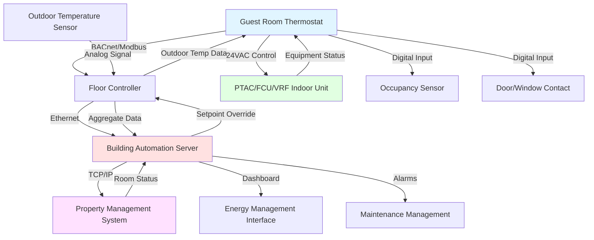

## Обзор технологии термостатов

Термостаты номеров отелей служат двум целям: обеспечивают гостей интуитивным контролем климата и позволяют управлению зданием контролировать энергопотребление. Современные термостаты уравновешивают удовлетворение гостей с операционной эффективностью посредством сложных стратегий управления, невидимых для пользователей. Термостат представляет основной интерфейс между гостями и системами HVAC, поэтому надежность, быстродействие и удобство использования имеют критическое значение для впечатлений гостя.

Выбор термостата влияет на потребление энергии, требования к обслуживанию и возможности интеграции. Цифровые термостаты доминируют в новых установках благодаря превосходной точности управления, возможностям связи и программируемым функциям. Аналоговые термостаты остаются в бюджетных отелях и старых установках, где простота и низкая стоимость перевешивают продвинутую функциональность.

## Цифровые и аналоговые термостаты

### Характеристики цифровых термостатов

Цифровые термостаты применяют электронные датчики температуры (термисторы или датчики на интегральных микросхемах) с точностью ±0,1–0,3°C по сравнению с ±1–1,7°C для механических термостатов. Эта точность обеспечивает более плотный контроль температуры с более узкими гистерезисами, снижая колебания температуры и улучшая комфорт. Цифровые дисплеи отображают текущую температуру, уставку и статус системы прямо, исключая замешательство гостей относительно положения термостата в сравнении с фактическими условиями.

Управление на основе микропроцессора реализует сложную логику, включая адаптивные алгоритмы, интеграцию обнаружения занятости, составление расписания по времени суток и удаленную связь. Цифровые термостаты хранят рабочие параметры в энергонезависимой памяти, сохраняя настройки при отключении питания без вмешательства гостя. Подсветка дисплея улучшает видимость ночью, что важно для гостей отеля, незнакомых с планировкой комнаты.

Цифровые термостаты поддерживают несколько входов датчиков, включая удаленные настенные датчики, датчики воздуха возврата и датчики наружной температуры для повышения точности управления. Алгоритмы предсказания запускают оборудование до превышения пределов гистерезиса на основе измерений скорости изменения, это снижает перерегулирование температуры и частоту циклирования.

Стоимость находится в диапазоне $80–$300 за единицу в зависимости от функций и возможностей связи. Установка требует низковольтной проводки, идентичной аналоговым термостатам, но может включать кабельную сеть для связи BACnet или Modbus. Сложность программирования требует обученных специалистов для первоначальной настройки и устранения неисправностей.

### Работа аналогового термостата

Аналоговые (механические) термостаты используют биметаллические спирали или заполненные жидкостью мехи, которые расширяются и сжимаются при изменении температуры. Механическое движение приводит в действие ртутные переключатели или контакты с защелкиванием, которые управляют оборудованием HVAC. Простая конструкция обеспечивает надежную работу с минимальными режимами отказа — термостаты функционируют десятилетиями без деградации электронных компонентов.

Датчик температуры работает только в месте расположения термостата без возможности удаленного датчика. Механический гистерезис создает встроенный гистерезис 0,6–1,1°C, предотвращающий чрезмерное циклирование. Регулировка уставки использует вращающийся диск или ползунок с отмеченной шкалой температуры. Гости интуитивно понимают работу благодаря физической обратной связи — положение диска прямо соответствует установке температуры.

Аналоговые термостаты не имеют возможности связи, что предотвращает интеграцию с системами автоматизации зданий или системами управления недвижимостью. Управление энергией требует ручной регулировки или электромеханических таймеров, которые физически вращают диски по расписанию. Это ограничение ограничивает аналоговые термостаты отелями без требований централизованного управления.

Преимущества в стоимости очевидны при $15–$40 за единицу, но отсутствие интеграционной возможности снижает долгосрочную ценность в управляемых объектах. Аналоговые термостаты подходят небольшим мотелям, гостиницам расширенного проживания с долгосрочными гостями, управляющими своим собственным использованием энергии, и проектам реновации, где существующая проводка не может поддерживать цифровые элементы управления.

## Сравнение типов термостатов

| Функция | Цифровой термостат | Аналоговый термостат |
|---------|-------------------|-------------------|
| Точность температуры | ±0,1–0,3°C | ±1–1,7°C |
| Контроль гистерезиса | Программируемый 0,3–3°C | Фиксированный 0,6–1,1°C (механический) |
| Тип дисплея | ЖК/LED с подсветкой | Механический диск или ползунок |
| Удаленная связь | BACnet, Modbus, проприетарные | Нет |
| Ограничение уставки | На основе программного обеспечения, невидимое | Механические стопы, видимые |
| Интеграция занятости | Поддерживается через цифровые входы | Только ручная регулировка |
| Мониторинг энергии | Возможен с соответствующим оборудованием | Недоступен |
| Первоначальная стоимость | $80–$300 | $15–$40 |
| Сложность установки | Умеренная (проводка + программирование) | Низкая (только проводка) |
| Требования к обслуживанию | Калибровка датчика, обновления программного обеспечения | Минимальные, механическая регулировка |
| Типичный срок службы | 10–15 лет | 20–30 лет |
| Интерфейс гостя | Кнопки/сенсорный экран, интуитивный | Физический диск, очень интуитивный |

## Ограничение диапазона уставки для экономии энергии

Неограниченная регулировка уставки позволяет гостям выбирать экстремальные температуры, которые тратят энергию и нагружают оборудование. Эффективные стратегии ограничения сдерживают работу без видимого ограничения для гостей.

### Прозрачные подходы к ограничению

Продвинутые цифровые термостаты отображают полный диапазон температур (15–29°C), но внутренне ограничивают фактические выходы управления более узкими диапазонами (20–24°C охлаждение, 18–23°C отопление). Когда гость устанавливает охлаждение 18°C, термостат отображает 18°C и активирует оборудование немедленно, обеспечивая восприятие чувствительности. Внутренняя логика фиксирует фактическую уставку управления при 20°C минимум, предотвращая чрезмерное охлаждение при удовлетворении ожиданий гостя.

Этот подход сохраняет восприятие услуги премиум-класса при достижении экономии энергии. Оборудование реагирует слышимо и видимо на ввод гостя, создавая психологический комфорт через восприятие контроля. Фактическая температура стабилизируется при контролируемом минимуме, а не при экстремальной уставке, снижая потребление энергии на 15–25% по сравнению с неограниченной работой.

Реализация требует тщательной калибровки диапазонов ограничения на основе климата и мощности оборудования. Пределы, установленные слишком плотно, вызывают жалобы гостей, если номера не достигают комфортных условий при экстремальной погоде. Пределы, установленные слишком свободно, обеспечивают минимальную пользу энергии. Типичные пределы охлаждения ограничивают 20°C минимум, 24°C максимум; пределы отопления охватывают 18–23°C.

Рассчитайте потенциальную экономию энергии от ограничения уставки:

$$E_{saved} = \frac{Q \times \Delta T_{limit}}{COP \times 3.412} \times t_{occupied}$$

где $Q$ представляет нагрузку помещения в кДж/ч, $\Delta T_{limit}$ — разница температур между неограниченной и ограниченной уставками (обычно 1,7–3°C), COP — коэффициент производительности оборудования, и $t_{occupied}$ представляет годовые часы занятости. Для типичного номера с емкостью 3,5 кВт, COP 3.0, ограничение уставок на 2,2°C за 5000 часов занятости в год:

$$E_{saved} = \frac{3.5 \times 2.2}{3.0 \times 3.412} \times 5000 = 3,566 \text{ кВт·ч/год}$$

### Методы физического ограничения

Механические стопы физически предотвращают вращение диска или движение ползунка за определенные пределы. Этот подход применяется как к аналоговым, так и к цифровым термостатам посредством винтов блокировки уставки или съемных ограничителей диапазона. Гости сразу же встречают физическое сопротивление при попытке превышения пределов, создавая разочарование и отрицательное восприятие.

Физическое ограничение подходит для бюджетных объектов, приоритизирующих контроль затрат над удовлетворением гостя, или пространств, где экстремальные уставки подвергают риску оборудование. Конференц-залы, служебные зоны и складские помещения выигрывают от заблокированных диапазонов уставок, предотвращающих случайную неправильную регулировку.

Защищенные паролем цифровые меню обеспечивают регулируемые пределы, изменяемые персоналом обслуживания. Это позволяет сезонную регулировку — более широкие диапазоны при экстремальной погоде, когда оборудование справляется с нагрузками, более узкие диапазоны при мягкой погоде, максимизирующие эффективность. Доступ в меню требует комбинаций кнопок или программного обеспечения конфигурации, предотвращающих модификацию гостем.

## Настройки гистерезиса для эффективности

Гистерезис представляет диапазон температур между точками активации отопления и охлаждения. Более широкие гистерезисы снижают частоту циклирования оборудования и потребление энергии, но увеличивают колебание температуры, потенциально влияя на комфорт.

### Проектирование гистерезиса в режиме занятости

Номера с занятыми гостями обычно поддерживают гистерезис 1,1–1,7°C в режиме авто. Уставка 22°C инициирует охлаждение, когда температура в номере достигает 23–24°C, и отопление, когда температура падает до 21–21,1°C. Эта толерантность предотвращает одновременное отопление и охлаждение при приспособлении к нормальному дрейфу температуры от солнечного излучения, инфильтрации и метаболических нагрузок занятости.

Рассчитайте влияние гистерезиса на частоту циклирования:

$$f_{cycle} = \frac{Q_{loss}}{C_{room} \times \Delta T_{deadband}}$$

где $Q_{loss}$ представляет среднюю скорость теплопотери/прироста в кДж/ч, $C_{room}$ — тепловая емкость помещения в кДж/°C (обычно 1,200–2,000 кДж/°C для обставленных номеров), и $\Delta T_{deadband}$ — ширина гистерезиса в °C. Номер, теряющий 880 кДж/ч с тепловой емкостью 1,600 кДж/°C и гистерезисом 1,1°C, циклирует:

$$f_{cycle} = \frac{880}{1600 \times 1.1} = 0.5 \text{ цикл/час}$$

Увеличение гистерезиса до 1,7°C снижает циклирование до 0,31 цикла/час, уменьшая пуски компрессора и энергию вентилятора. Чрезмерно широкие гистерезисы (>2,2°C в режиме занятости) создают заметные колебания температуры, побуждающие жалобы гостей и регулировки термостата, которые сводят на нет намерение экономии энергии.

Четырехтрубные и системы VRF, поддерживающие одновременное отопление и охлаждение, все еще реализуют гистерезис посредством логики управления. Хотя оборудование физически предоставляет одновременную работу, элементы управления предотвращают расточительные сценарии, когда соседние номера работают в противоположных режимах с воздухом, смешивающимся через коридоры или общие плены.

### Расширение гистерезиса в режиме неисполнения

Пустые номера реализуют широкие гистерезисы (8,3–14°C), минимизирующие работу оборудования при предотвращении экстремальных условий. Снижение охлаждения на 27–28°C и снижение отопления на 13–16°C создает нейтральную зону, где HVAC остается выключенным, пока температура не дрейфует к экстремумам. Эта стратегия снижает потребление энергии на 30–45% в периоды вакантности.

Ширина гистерезиса уравновешивает экономию энергии против времени восстановления, когда гости приходят. Более широкие гистерезисы максимизируют экономию, но расширяют продолжительность восстановления — номер при 28°C требует 30–60 минут для достижения комфортного состояния 22°C в зависимости от мощности оборудования и наружных условий. Отели должны гарантировать завершение восстановления перед доступом гостя в номер, чтобы предотвратить отрицательные первые впечатления.

Оптимальные температуры снижения варьируются по климатическим зонам:

- **Жаркие влажные климаты**: 27–28°C снижение охлаждения ограничивает накопление влаги, предотвращая рост плесени
- **Жаркие сухие климаты**: 28–29°C снижение приемлемо из-за низких проблем с влажностью
- **Холодные климаты**: 13–14°C снижение отопления предотвращает повреждение замораживанием сантехники
- **Мягкие климаты**: 27°C охлаждение / 16°C отопление обеспечивает баланс

## Возможности переопределения и ограничения по продолжительности

Возможность переопределения гостем определяет, могут ли пользователи отменить автоматизированные стратегии снижения в течение их пребывания.

### Функции переопределения с таймером

Переопределение с таймером позволяет гостю регулировку в течение ограниченной продолжительности (2–4 часа) перед восстановлением режима энергосбережения. Когда гости возвращаются в номера в полдень и требуют немедленное охлаждение, термостат реагирует на изменения уставки, но автоматически восстанавливает снижение после предустановленного интервала, если не происходит дополнительного ввода.

Этот подход предполагает отсутствие гостя при продолжительной неактивности. Сложные алгоритмы комбинируют продолжительность переопределения с входами датчика занятости — если обнаружено движение, переопределение продлевается неопределенно; если нет движения в течение 2 часов, система предполагает, что гость уехал и инициирует снижение. Ложные срабатывания от входа уборки требуют задержек переактивации 15–30 минут, предотвращающих помехи при правомерной занятости.

Восприятие гостем остается критическим. Переопределения с таймером должны работать невидимо без отсчета отображения или объявления предстоящего снижения. Постепенный дрейф температуры в сторону снижения в течение 15–20 минут, а не резкие изменения при истечении таймера, поддерживает комфорт при достижении энергетических целей.

### Стратегии ручного переопределения

Полное ручное переопределение обеспечивает неограниченный контроль гостем до выезда. Это максимизирует удовлетворение в роскошных объектах, где впечатление гостя перевешивает затраты на энергию. Персонал может удаленно мониторить статус переопределения через BAS, определяя номера с постоянными экстремальными уставками для контакта гостя или расследования обслуживания.

Частичное переопределение позволяет регулировку в пределах ограниченных диапазонов (±1,7–3°C от автоматической уставки) или ограничивает полномочия регулировки в течение определенного времени. Ночное снижение с 2–6 часов ограничивает охлаждение до 23°C минимум даже с гостевым переопределением, снижая нагрузку во время периодов пиковой ставки. Спящие гости обычно принимают немного более теплые условия, особенно когда изменение температуры происходит постепенно.

Подходы без переопределения применяются только к неисполненным этажам, услуживаемым не полностью номерам или экстремальным бюджетным объектам, принимающим отрицательную обратную связь гостей. Заблокированные термостаты разочаровывают пользователей и генерируют жалобы, подходят только там, где контроль затрат абсолютно превосходит удовлетворение.

## Протоколы связи

Современные системы управления отелем интегрируют комнатные термостаты с центральной автоматизацией здания, используя стандартизованные протоколы.

### Интеграция BACnet

BACnet (Building Automation and Control Networks) обеспечивает связь открытого протокола, поддерживающую интеграцию мультивендоров. Термостаты реализуют BACnet MS/TP (Master-Slave/Token-Passing) через проводку RS-485 или BACnet/IP через инфраструктуру Ethernet.

Объекты BACnet раскрывают точки данных термостата для мониторинга и управления:

- Аналоговый вход: температура в номере, наружная температура, влажность
- Аналоговое значение: уставка, настройки гистерезиса
- Аналоговый выход: положение клапана, положение заслонки
- Двоичный вход: статус занятости, контакт окна, режим обслуживания
- Двоичный выход: статус вентилятора, запрос отопления, запрос охлаждения
- Многоуровневое значение: режим работы (выкл/отопл/охл/авто)

Центральные системы считывают условия в номере, регулируют уставки на основе данных занятости PMS и тренды потребления энергии для анализа. Ориентированная на объекты структура BACnet обеспечивает согласованный интерфейс среди различных производителей термостатов, упрощая расширение системы и замену оборудования.

Интервалы опроса 1–5 минут обеспечивают адекватное разрешение для мониторинга номеров без чрезмерного сетевого трафика. Критические тревоги (отказ оборудования, экстремальная температура) передаются немедленно через отчетность Change-of-Value (COV).

### Связь Modbus

Протокол Modbus RTU работает через сети многодроп RS-485, соединяющие несколько термостатов с центральными контроллерами. Простая связь на основе регистра отображает параметры термостата на числовые адреса, читаемые и записываемые главными устройствами.

Реализация Modbus стоит меньше, чем BACnet, благодаря более простым стекам протоколов и пониженным требованиям к процессору в полевых устройствах. Однако отсутствие стандартизации объектов означает, что каждый производитель определяет уникальные карты регистров, требующие пользовательской конфигурации для интеграции. Это создает привязку к поставщику и усложняет установки смешанных производителей.

Типичное отображение регистра Modbus:

- Регистр 40001: температура в номере (°C × 10)
- Регистр 40002: температура уставки (°C × 10)
- Регистр 40003: режим работы (0=выкл, 1=отопл, 2=охл, 3=авто)
- Регистр 40004: режим вентилятора (0=авто, 1=вкл)
- Регистр 40005: статус занятости (0=пусто, 1=занято)
- Регистр 40101: выход отопления (0-100%)
- Регистр 40102: выход охлаждения (0-100%)

Скорость связи обычно работает при 9600 или 19200 бодах, адекватной для приложений номеров, требующих подсекундного времени отклика. Топология сети поддерживает до 32–247 устройств на сегмент в зависимости от оборудования драйвера.

### Проприетарные протоколы

Многие производители реализуют проприетарную связь, поддерживающую продвинутые функции, недоступные в открытых протоколах. Сеть Carrier Comfort Network, Honeywell RedLINK и протоколы LG BECON оптимизируют производительность для конкретных типов оборудования, но предотвращают интеграцию мультивендоров.

Проприетарные протоколы подходят для проектов одного производителя, где оптимизация производительности и глубина функций перевешивают преимущества открытой системы. Установки VRF часто используют производительные протоколы, обеспечивающие управление температурой хладагента, распределение мощности наружного блока и продвинутую диагностику, невозможную через универсальные интерфейсы BACnet или Modbus.

Устройства шлюза переводят между проприетарными и открытыми протоколами, когда интеграция с третьей стороной BAS становится необходимой. Шлюзы вводят стоимость ($500–$2,000 за шлюз) и потенциальную задержку связи, но сохраняют как производительные возможности, так и интеграцию системы здания.

## Архитектура системы интеграции термостата

## Рассмотрения проектирования интерфейса гостя

Успешные интерфейсы термостата обеспечивают интуитивную работу незнакомыми пользователями в течение секунд первого взаимодействия.

### Принципы визуального проектирования

Высококонтрастные дисплеи остаются читаемыми при варьирующемся освещении от темных ночных условий до ярко светлых в полдень солнечного облучения. Белый на черном или черный на белом ЖК-дисплеях превосходят серый на сером или цветные дисплеи для разборчивости. Активация подсветки нажатием кнопки или датчиком движения помогает ночной видимости без непрерывного освещения, беспокоящего сон.

Большие цифры (1,3–2 см высоты), показывающие текущую температуру и уставку, обеспечивают чтение со всего помещения или слабовидящими гостями. Индикаторы режима на основе значков (снежинка для охлаждения, пламя для отопления, символ вентилятора) преодолевают языковые барьеры для международных путешественников. Минимизируйте текст, используя везде, где возможно, универсально признанные символы.

Размер кнопки или датчика касания должен приспосабливаться к работе гостями с ограниченной ловкостью, в перчатках или в темноте. Минимальный интервал кнопки 1,3 см предотвращает случайную активацию соседней кнопки. Тактильная обратная связь через механический щелчок или вибрация подтверждает успешное нажатие кнопки без требования визуальной проверки.

### Операционная простота

Ограничьте первичный интерфейс четырьмя существенными функциями: увеличение температуры, уменьшение температуры, выбор режима и управление вентилятором. Продвинутые функции (составление расписания, управление влажностью, напоминания о фильтрах) скрывайте в дополнительных меню, доступных посредством длительного нажатия или комбинаций кнопок.

Регулировка температуры должна реагировать в течение 0,1 секунды с обновлением дисплея и активацией оборудования в течение 2–3 секунд, обеспечивая акустическую обратную связь, что система получила команду. Даже если фактическое изменение температуры воздуха происходит медленно из-за тепловой массы, немедленная работа вентилятора создает восприятие отзывчивой системы.

Выбор режима циклирует через логическую последовательность: Выкл → Отопл → Охл → Авто → Выкл. Одна кнопка режима упрощает работу по сравнению с отдельными кнопками отопления и охлаждения. Режим авто особенно подходит для переходных сезонов и климатов с ежедневными колебаниями температуры, требующими как отопления, так и охлаждения.

### Требования к доступности

Соответствие ADA (Закон об американцах с инвалидностью) требует тактильное различие между элементами управления и функциональными частями, различимыми исключительно на ощупь. Приподнятые или утопленные кнопки обеспечивают операцию слабовидящими гостями. Элементы управления установлены на высоте 38–122 см над полом, обеспечивают доступ для пользователей инвалидных колясок.

Голосовое управление через в-номерные помощники (Amazon Alexa, Google Assistant) обеспечивает альтернативный интерфейс для гостей с ограничениями подвижности. Голосовые команды регулируют температуру, меняют режимы и запрашивают текущие условия без физического взаимодействия с термостатом. Реализации, озабоченные конфиденциальностью, обрабатывают команды локально без облачной передачи.

Ярко напечатанные ярлыки и высококонтрастные цветовые схемы помогают гостям с низким зрением. Избегайте полагаться только на цвет для передачи информации — используйте текст, символы или положение в дополнение к кодированию цветом. Красный обычно указывает отопление, синий охлаждение, но символы должны сопровождать цвета для дальтонизма.

## Энергетическая эффективность посредством проектирования термостата

Правильно сконфигурированные термостаты обеспечивают 25–40% экономию энергии по сравнению с базовым управлением вкл/выкл.

### Адаптивные алгоритмы управления

Основанные на микропроцессоре термостаты реализуют адаптивные алгоритмы, обучающиеся тепловым характеристикам номера с течением времени. Путем измерения скоростей подъема и спада температуры при различных условиях элементы управления предсказывают требования к мощности отопления и охлаждения, оптимизирующие работу оборудования.

Адаптивное предсказание запускает оборудование до превышения гистерезиса на основе прогнозов скорости изменения. Если температура в номере повышается на 0,3°C в час в сторону уставки охлаждения, термостат активирует охлаждение, когда текущая температура плюс прогнозируемый подъем равен пределу гистерезиса. Это предотвращает перерегулирование при сохранении комфорта.

Автоматическая настройка управления PID (Пропорциональное-Интегральное-Производное) регулирует положения модулирующего клапана или заслонки на основе величины и продолжительности ошибки. Пропорциональное действие обеспечивает выход, пропорциональный текущей ошибке, интегральное действие исключает смещение установившегося состояния и производное действие подавляет колебание. Постоянные PID автоматически настраиваются во время первоначальной работы, устанавливая оптимальный отклик для конкретного номера и характеристик оборудования.

### Оптимизация на основе занятости

Интеграция с датчиками занятости, контактами дверей и системами PMS обеспечивает разумную работу, соответствующую фактическим потребностям. Рассчитайте экономию, основанную на занятости:

$$E_{savings} = P_{HVAC} \times (1 - OF) \times h_{year} \times SF$$

где $P_{HVAC}$ представляет среднюю мощность HVAC в кВт, $OF$ — коэффициент занятости (обычно 0,60–0,75 для отелей), $h_{year}$ равен 8760 часам ежегодно, и $SF$ — коэффициент экономии снижения (0,30–0,45). Для номера, усредняющего 1.2 кВт нагрузку HVAC с 65% занятостью и 35% экономией снижения:

$$E_{savings} = 1.2 \times (1 - 0.65) \times 8760 \times 0.35 = 1,287 \text{ кВт·ч/год}$$

При стоимости электроэнергии $0.12/кВт·ч, годовая экономия равна $154 за номер. Отель с 200 номерами достигает $30,800 годовой экономии, оправдывающей реализацию сложного управления.

## Установка и ввод в эксплуатацию

Правильная установка гарантирует точное управление и надежную работу в течение всего срока службы термостата.

Устанавливайте термостаты на высоте 122–152 см над готовым полом на внутренних стенах в стороне от:
- Прямого солнечного света из окон
- Диффузоров подаваемого воздуха, создающих ложные показания температуры
- Источников тепла (телевизоры, лампы, наружные стены)
- Источников холода (наружные стены в холодных климатах)
- Дверей ванных комнат, выпускающих влажный воздух

Точность месторасположения значительно влияет на точность управления. Термостат, установленный в 30 см от диффузора подачи, читает на 1–2°C холоднее, чем средняя температура номера во время работы охлаждения, вызывая недостаточное кондиционирование и жалобы гостей.

Проверьте правильную калибровку при вводе в эксплуатацию, сравнивая показание термостата с точным эталонным термометром в нескольких температурах во всем рабочем диапазоне. При необходимости отрегулируйте смещение калибровки для достижения точности ±0,3°C.

Протестируйте связь с BAS, команду изменения уставки из центральной системы и мониторинга отклика термостата. Проверьте интеграцию PMS, имитируя события выезда и подтверждая автоматическую активацию снижения в пределах определенных временных лимитов.

Документируйте параметры конфигурации термостата, включая ограничения уставки, настройки гистерезиса, постоянные PID и адреса связи для будущего использования при устранении неисправностей и замене.
