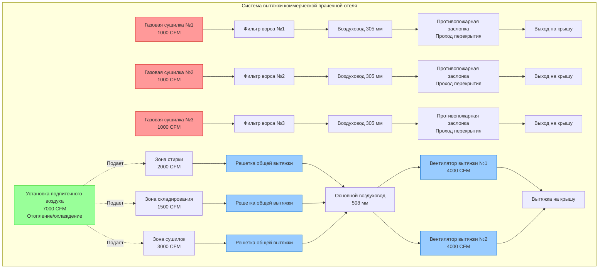

## Обзор

Коммерческие прачечные отелей генерируют значительное количество тепла, влаги и ворса, которые должны эффективно удаляться через правильно спроектированные системы вытяжки. Системы вытяжки сушилок требуют особого внимания к пожарной безопасности посредством контроля ворса, в то время как общая вытяжка помещения управляет явными тепловыми нагрузками от работы оборудования. Комбинация высокотемпературного оборудования и горючего ворса создает пожарные опасности, которые требуют соответствия NFPA 90A и требованиям производителя.

## Требования к вытяжке сушилок

### Расчеты расхода вытяжки

Производители сушилок указывают требуемые расходы вытяжки на основе теплового входа и производительности удаления влаги. Для газовых сушилок расход вытяжки можно оценить:

$$Q_{dryer} = Q_{comb} + Q_{evap}$$

где $Q_{comb}$ представляет продукты сгорания и $Q_{evap}$ представляет воздух, насыщенный влагой, из сушки ткани.

Для типичной газовой сушилки с емкостью 45 кг и входом 584 кВт:

$$Q_{dryer} = 1356-2034 \text{ CFM (2300-3450 м³/ч) на сушилку}$$

Электрические сушилки требуют более низких расходов вытяжки, так как продукты сгорания отсутствуют:

$$Q_{electric} = 679-1017 \text{ CFM (1150-1725 м³/ч) на сушилку}$$

### Подбор размера воздуховода и скорость

Воздуховоды вытяжки сушилки должны поддерживать минимальную скорость для предотвращения накопления ворса при избежании чрезмерного перепада давления. Требуемый диаметр воздуховода:

$$D = \sqrt{\frac{4Q}{\pi V}}$$

где $V$ = скорость в воздуховоде (365-549 м/с рекомендуется для транспорта ворса).

Для 1000 CFM (1699 м³/ч) вытяжки сушилки при 457 м/с:

$$D = \sqrt{\frac{4 \times 1000}{\pi \times 1500}} = 0,92 \text{ ft} = 280 \text{ мм}$$

Стандартная практика использует минимум 305 мм в диаметре для коммерческих вытяжек сушилок. Воздуховоды должны быть металлические (оцинкованная сталь или алюминий), гладкая внутренняя поверхность, со всеми стыками в направлении потока воздуха для предотвращения накопления ворса.

## Сбор ворса и пожарная безопасность

### Требования к экранам ворса

Каждая сушилка требует:

- **Первичный экран ворса** на выходе сушилки (очищается после каждой загрузки)
- **Вторичный фильтр ворса** в воздуховоде вытяжки (проверяется еженедельно, очищается ежемесячно)
- **Третичный сбор ворса** на входе вентилятора вытяжки (в коммерческих установках)

Накопление ворса представляет серьезную пожарную опасность. Ворс имеет температуру воспламенения приблизительно 232-260°C, что намного ниже температур вытяжки сушилки при интенсивном использовании.

### Мероприятия по предотвращению пожаров

Критические требования пожарной безопасности включают:

1. **Только металлические воздуховоды** - Нет гибких пластиковых или фольговых воздуховодов в коммерческих приложениях
2. **Минимальная длина воздуховода** - Кратчайший практический маршрут наружу
3. **Максимальная эквивалентная длина** - Обычно 15-23 м включая фитинги
4. **Зазоры до горючих материалов** - Минимум 15 см или согласно производителю
5. **Без обратных дроссельных заслонок** в вытяжке сушилки (риск накопления ворса)
6. **Регулярная проверка и очистка** - Минимум ежеквартально, ежемесячно предпочтительнее

### Требования к противопожарным заслонкам согласно NFPA 90A

NFPA 90A раздел 5.3.3 требует противопожарные заслонки там, где воздуховоды вытяжки сушилки проходят через огнестойкие конструкции:

- **Противопожарные заслонки с классом 1,5 часа** на проходах перекрытие/потолок
- **Противопожарные заслонки с классом 3 часа** на проходах вертикальных шахт
- **Температура плавкого звена** - 74°C или 100°C в зависимости от местоположения
- **Доступ для проверки** - Требуется на всех местах установки заслонок

Исключение: Отдельные вытяжки сушилок могут опускать противопожарные заслонки, если воздуховоды изготовлены из непрерывно сварной стали и проходы защищены утвержденными системами герметизации сквозных проходов.

## Общая вытяжка помещения

### Требования к удалению тепла

Коммерческие прачечные генерируют 4,4-7,3 кВт на сушилку от радиационной и конвекционной теплоотдачи оборудования. Требования к общей вытяжке:

$$Q_{room} = \frac{Q_{sensible}}{1.08 \times \Delta T}$$

Для прачечной с 10 сушилками, генерирующими 584 кВт общего явного тепла с приемлемым повышением температуры 8°C:

$$Q_{room} = \frac{200,000}{1.08 \times 15} = 12,346 \text{ CFM (20,950 м³/ч)}$$

Эта общая вытяжка **в дополнение к** выделенным расходам вытяжки сушилок.

### Рекомендуемые воздухообмены

Промышленные стандарты предлагают:

| Тип помещения | Воздухообмены в час | Примечания |
|------------|---------------------|-------|
| Зона сушилок | 20-30 ACH | Зона с высокой генерацией тепла |
| Зона стирки | 15-20 ACH | Умеренная генерация влаги |
| Зона складирования | 10-15 ACH | Более низкая нагрузка, ориентирована на комфорт |
| Хранилище грязного белья | 15-20 ACH | Приоритет контроля запахов |

## Требования к вытяжке по оборудованию

| Тип оборудования | Расход вытяжки (CFM) | Размер воздуховода | Тип подключения |
|----------------|-------------------|-----------|-----------------|
| Газовая сушилка 23 кг | 1017-1356 (1725-2300 м³/ч) | 254 мм | Прямой, выделенный |
| Газовая сушилка 45 кг | 1356-2034 (2300-3450 м³/ч) | 305 мм | Прямой, выделенный |
| Газовая сушилка 91 кг | 2034-2712 (3450-4600 м³/ч) | 356 мм | Прямой, выделенный |
| Электрическая сушилка 23 кг | 509-679 (865-1150 м³/ч) | 203 мм | Прямой, выделенный |
| Электрическая сушилка 45 кг | 679-1017 (1150-1725 м³/ч) | 254 мм | Прямой, выделенный |
| Паровой пресс | 255-509 (433-865 м³/ч) | Вытяжка из кожуха | Общая вытяжка |
| Станции глажения | 170-340 за станцию (289-577 м³/ч) | Вытяжка из кожуха | Общая вытяжка |

## Эффект стека и предотвращение обратного потока

### Проблемы эффекта стека

Многоэтажные отели создают значительные перепады давления из-за эффекта стека:

$$\Delta P_{stack} = 7.64 \times h \times \left(\frac{1}{T_o} - \frac{1}{T_i}\right)$$

где $h$ = высота (м), $T_o$ и $T_i$ = наружная и внутренняя абсолютные температуры (K).

Для подвальной прачечной на 12 м ниже плоскости нейтрального давления зимой (21°C в помещении, -18°C наружу):

$$\Delta P_{stack} = 7.64 \times 40 \times \left(\frac{1}{460} - \frac{1}{530}\right) = 0.09 \text{ in. w.c. (22 Па)}$$

Это отрицательное давление противодействует потоку вытяжки и должно быть преодолено статическим давлением вентилятора вытяжки.

### Стратегии предотвращения обратного потока

1. **Выделенные системы подпиточного воздуха** - Обеспечивают 90% объема вытяжки в виде кондиционированного подпиточного воздуха
2. **Барометрические дроссельные заслонки** - Предотвращают чрезмерное отрицательное давление
3. **Производительность вентилятора вытяжки** - Размер для пиковой нагрузки плюс эффект стека
4. **Отдельные системы вытяжки** - Вытяжка сушилки независима от общей вытяжки
5. **Гравитационные заслонки на выходах** - Предотвращают обратный поток при выключении вентиляторов (только общая вытяжка)

## Подбор вентилятора вытяжки

### Выбор типа вентилятора

- **Центробежный восходящий** - Наиболее распространен для установок на крыше
- **Встроенный центробежный** - Для приложений с горизонтальным выходом
- **Обратно загнутые лопасти** - Предпочтительны для эффективности и обработки ворса

### Критерии подбора размера

Подберите вентиляторы вытяжки для:

$$SP_{total} = \Delta P_{duct} + \Delta P_{hood} + \Delta P_{stack} + \Delta P_{margin}$$

Типичные требования статического давления:

- Вытяжка сушилки: 254-635 Па
- Общая вытяжка помещения: 127-381 Па

### Требования к избыточности

Критические прачечные отелей требуют:

- **Избыточность N+1** для общей вытяжки (минимум 2 вентилятора, каждый 60-75% производительности)
- **Отдельные вытяжки сушилок** обычно не избыточны (специфичны для оборудования)
- **Регулируемое управление скоростью** для поддержания давления помещения при частичной нагрузке
- **Резервное питание** для вентиляторов вытяжки в критических объектах

## Схема расположения системы вытяжки прачечной

## Лучшие практики установки

### Установка воздуховода

- **Непрерывный уклон** в сторону выхода (минимум 6 мм на метр)
- **Гладкие внутренние стыки** для предотвращения накопления ворса
- **Минимизация отводов** - Каждый отвод на 90° добавляет 1,5-3 м эквивалентной длины
- **Расстояние опор** - Максимум 3 м между центрами для горизонтальных участков
- **Доступ для очистки** - Каждые 6 м и у каждого отвода
- **Высота выхода** - Минимум 3 м выше крыши, 0,9 м выше парапета

### Доступ для обслуживания

Предусмотрите дверцы доступа в:

- Все фильтры ворса (требуется ежедневный/еженедельный доступ)
- Противопожарные заслонки (ежегодная проверка)
- Моторы и приводы вентиляторов вытяжки
- Места очистки воздуховода

### Требования к введению в эксплуатацию

1. **Проверка расхода воздуха** - Измерение фактического CFM на каждой сушилке
2. **Испытание статического давления** - Проверка производительности вентилятора и сопротивления воздуховода
3. **Проверка фильтра ворса** - Подтверждение установки и доступности
4. **Испытание противопожарной заслонки** - Проверка плавких звеньев и закрытия
5. **Испытание блокировок** - Отключение сушилки при отказе вытяжки (если предусмотрено)
6. **Документирование** - Предоставление графика обслуживания и руководств по эксплуатации и техническому обслуживанию

Надлежащее проектирование системы вытяжки для коммерческих прачечных отелей обеспечивает пожарную безопасность, производительность оборудования и комфорт занимающихся, обеспечивая при этом соответствие кодексам и эксплуатационную эффективность.
