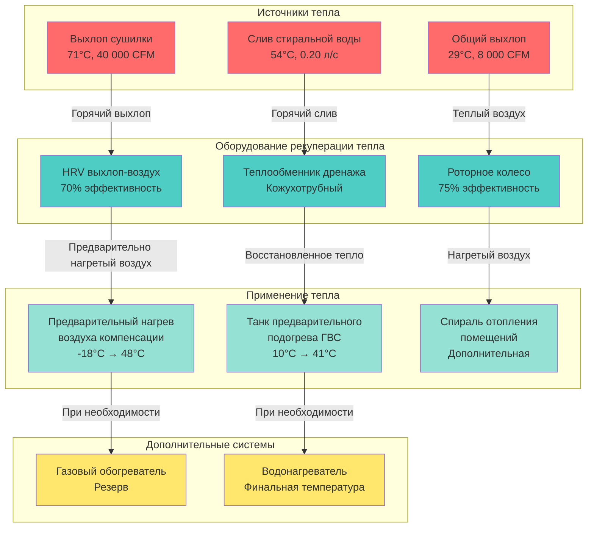

Коммерческие прачечные отелей теряют огромное количество тепловой энергии через выхлопы сушилок, горячий слив стиральной воды и системы вентиляции. Технологии рекуперации тепла захватывают эту отработанную энергию для полезного использования, снижая эксплуатационные расходы на 20-40% при одновременном снижении воздействия на окружающую среду через уменьшение потребления топлива и выбросов углерода.

## Системы рекуперации тепла выхлопа сушилок

Выхлоп сушилки представляет наибольшую возможность рекуперации тепла в коммерческих прачечных с непрерывными потоками воздуха высокой температуры, несущими значительную восстанавливаемую энергию.

### Характеристики выхлопного тепла

**Температура и содержание энергии:**
- Температура выхлопа сушилки: 60-82°C при активных циклах сушки
- Типичная коммерческая сушилка мощностью 23 кг: выхлоп 10 000 CFM (16 990 м³/ч) при 71°C
- Доступное чувствительное тепло: $Q = CFM \times 1.08 \times \Delta T$

Для выхлопа при 71°C охлажденного до 38°C:

$$Q_{available} = 10,000 \text{ CFM} \times 1.08 \times (71-38) = 356,400 \text{ кДж/ч}$$

Одна сушилка, работающая 8 часов в день, обеспечивает 2 851 200 кДж/день восстанавливаемой энергии, что эквивалентно 1,14 ГДж газа или 791 кВч электроэнергии.

**Режимы эксплуатации:**
- Циклическая работа создает прерывистую доступность
- Коэффициент использования 50-70% типичен для прачечных отелей
- Среднее потенциальное восстановление: 198 000-247 000 кДж/ч на одну сушилку
- Несколько сушилок обеспечивают более постоянный источник энергии

### Системы теплообменников рекуперации (HRV)

Воздухо-воздушные теплообменники выхлопа-подачи передают чувствительное тепло выхлопа сушилки поступающему воздуху компенсации без смешивания потоков воздуха.

**Конфигурация и производительность:**
- Пластинчатые теплообменники противотока: эффективность 60-75%
- Роторные колесные теплообменники: эффективность 70-85%
- Тепловые трубки: эффективность 45-65% без движущихся частей

**Расчет эффективности:**

$$\varepsilon = \frac{T_{supply,leaving} - T_{supply,entering}}{T_{exhaust,entering} - T_{supply,entering}}$$

Для 70% эффективного HRV с выхлопом 71°C и поступающим воздухом -7°C:

$$T_{supply,leaving} = -7 + 0.70 \times (71-(-7)) = -7 + 54.6 = 47.6°C$$

Предварительный нагрев воздуха компенсации с -7°C до 48°C драматически снижает требуемое дополнительное отопление.

**Соображения по размеру системы:**
- Размер для непрерывного минимального выхлопа от базовых сушилок
- Установка обводных заслонок для летней эксплуатации, когда отопление не требуется
- Балансировка объемов выхлопа и подачи для поддержания контроля давления в здании

### Рекуперация тепла вода-воздух

Выхлопной воздух нагревает водяной контур, впоследствии используемый для предварительного подогрева горячего водоснабжения или отопления помещений.

**Ребристые трубные теплообменники:**
- Установка в выхлопном воздуховоде после фильтров волокна
- 3-6 рядов глубоких спиралей с алюминиевыми ребрами на медных трубках
- Раствор гликоля предотвращает замерзание при наружной установке
- Эффективность передачи тепла: 40-60% в зависимости от рядов спиралей и температур подхода

**Расчет рекуперации тепла:**

Нагрев воды с 10°C до 60°C с использованием выхлопа при 71°C при эффективности 50%:

$$Q_{recovered} = \varepsilon \times Q_{maximum} = 0.50 \times 356,400 = 178,200 \text{ кДж/ч}$$

Требуемый расход воды:

$$\dot{m} = \frac{Q}{c_p \times \Delta T} = \frac{178,200}{4.18 \times (60-10)} = 851 \text{ л/ч} = 0.24 \text{ л/с}$$

Это предварительно нагревает 0,24 л/с непрерывно, компенсируя 65% типичной нагрузки горячего водоснабжения отеля во время часов работы прачечной.

### Рассмотрение волокна и влажности

Выхлоп сушилки содержит 3,2-6,4 г влаги на килограмм сухого воздуха плюс значительную нагрузку волокна, создавая риск засорения, требующий тщательного проектирования.

**Стратегии управления волокном:**
- Установка промышленных фильтров волокна перед оборудованием рекуперации тепла
- Указание моющегося или самоочищающегося фильтрующего материала
- Размер фильтров для скорости лицевой поверхности 1,5-2,0 м/с, ограничивающей падение давления
- График еженедельной очистки минимально для поддержания производительности

**Выбор теплообменника:**
- Широкий шаг ребер (4-6 ребер на дюйм против стандартных 10-12) снижает накопление волокна
- Гладкие поверхности минимизируют места загрязнения
- Доступные лица спиралей для ежеквартальной промывки под высоким давлением
- Конструкция с эпоксидным покрытием или из нержавеющей стали сопротивляется коррозии от влаги

**Профилактика конденсации:**
- Поддержание температур поверхности теплообменника выше точки росы выхлопа
- Контроль расходов воды предотвращающий чрезмерное охлаждение поверхности
- Установка конденсатоотводов в низких точках даже если проектирование предотвращает конденсацию
- Мониторинг увеличения падения давления, указывающего на загрязнение, требующее очистки

## Возможности рекуперации тепла стиральной воды

Коммерческие стиральные машины сливают тысячи литров ежедневно воды с температурой 49-60°C, содержащей значительную восстанавливаемую тепловую энергию.

### Рекуперация тепла дренажной воды

**Расчет содержания тепла:**

Для 100 загрузок ежедневно, 1,4 л на килограмм мощности, машины 23 кг, температура слива 54°C:

$$Q_{total} = 100 \times 1.4 \times 23 \times 4.18 \times (54-10) = 4 459 824 \text{ кДж/день}$$

Это составляет 1,24 ГДж газа ежедневно или 452 ГДж ежегодно при непрерывной эксплуатации.

### Кожухотрубные теплообменники

**Конфигурация:**
- Дренажная вода проходит через трубное пространство для легкой очистки
- Чистая подпиточная вода течет через кожух
- Противоточное расположение максимизирует температурный дифференциал
- Конструкция из нержавеющей стали сопротивляется коррозии от моющих и химических средств

**Характеристики производительности:**
- Общий коэффициент передачи тепла U: 850-1400 кДж/ч·м²·°C для вода-вода
- Температура подхода: 6-8°C типичная
- Эффективность: 60-75% в зависимости от размера

**Пример размера:**

Рекуперация тепла от 0,25 л/с дренажной воды при 54°C для предварительного подогрева холодной воды с 10°C:

Предположим 70% эффективность:

$$T_{cold,out} = 10 + 0.70 \times (54-10) = 41°C$$

Восстановленное тепло:

$$Q = 0.25 \times 3600 \times 4.18 \times (41-10) = 116 070 \text{ кДж/ч}$$

Площадь теплообменника с использованием метода LMTD при U = 1130 кДж/ч·м²·°C:

$$\Delta T_{lm} = \frac{(54-41)-(10-10+13)}{\ln(\frac{13}{13})} \approx 13°C$$

$$A = \frac{Q}{U \times \Delta T_{lm}} = \frac{116,070}{1,130 \times 13} = 7.9 \text{ м}^2$$

Выбрать теплообменник 9 м² обеспечивающий проектную мощность с запасом на загрязнение.

### Пластинчатые теплообменники

**Преимущества над кожухотрубными:**
- Компактный размер: 1/5 объема для эквивалентной мощности
- Более высокая эффективность: достижимы 75-85%
- Простая разборка для очистки
- Модульная конструкция позволяет расширение мощности

**Соображения проектирования:**
- Установка фильтров 200-400 микрон перед потоком предотвращающая повреждение от больших частиц
- Материалы прокладок сопротивляющиеся моющим и дезинфицирующим средствам
- Ежеквартальная разборка и очистка поддерживает производительность
- Падение давления 70-140 кПа типичное, требующее адекватного давления подачи

### Интеграция сепаратора волокна

Дренажная вода содержит остаточное волокно и текстильные волокна, требующие удаления перед теплообменником.

**Типы сепараторов:**
- Центробежные сепараторы: 80-90% эффективность удаления для частиц >50 микрон
- Сетчатые фильтры: 70-85% удаления, требуют частой промывки
- Комбинированные системы: центробежная первичная с тонкой сеткой финишной

**Требования установки:**
- Размер для пикового расхода слива: 0,13-0,19 л/с на стиральную машину во время финального отжима
- Установка перед теплообменником с обводом во время циклов очистки
- Дренажные положения для собранных твердых веществ
- Возможность промывки обратным потоком для сетчатых фильтров поддерживая пропускную способность

## Воздухо-воздушные теплообменники для прачечных

Общая вентиляция выхлопа помещений удаляет воздух, насыщенный теплом, пригодный для рекуперации тепла помимо систем, специфичных для сушилок.

### Роторные колеса рекуперации тепла

**Вращающиеся энтальпийные колеса:**
- Алюминиевые или синтетические носители медленно вращаются между потоками выхлопа и подачи
- Чувствительная эффективность: 70-85%
- Небольшой перенос влаги (~10-15%) из-за небольшого переноса носителя
- Самоочищающееся действие от турбулентности потока воздуха

**Применение к прачечным:**
- Размер для общего выхлопа вентиляции (не выхлоп сушилки из-за волокна)
- Установка после фильтрации выхлопа помещения (MERV 11-13 минимум)
- Предварительный нагрев зимнего воздуха компенсации с -18 до 15-27°C
- Предварительное охлаждение летнего воздуха компенсации с 35°C до 24-27°C, снижая нагрузку на кондиционер

**Расчет рекуперации энергии:**

Для 8 000 CFM (13 592 м³/ч) общего выхлопа при температуре помещения 29°C, уличный воздух -18°C, эффективность 75%:

$$T_{supply} = -18 + 0.75 \times (29-(-18)) = -18 + 35.3 = 17.3°C$$

Сэкономленная энергия отопления:

$$Q_{saved} = 8,000 \times 1.08 \times (17.3-(-18)) = 3 069 120 \text{ кДж/ч}$$

Годовые сбережения при сезоне отопления 2500 часов:

$$E_{annual} = \frac{3,069,120 \times 2,500}{1,055,000} = 7,266 \text{ ГДж}$$

При $4.27/ГДж: **$31,020 годовых сбережений**

### Пластинчатые теплообменники с неподвижной пластиной

**Конструкция пластинчатого противотока:**
- Чередующиеся проходы выхлопа и подачи разделены тонкими алюминиевыми или полимерными пластинами
- Отсутствие движущихся частей снижает требования обслуживания
- Чувствительная эффективность: 60-75%
- Нулевое перекрестное загрязнение между потоками воздуха

**Преимущества для сред с обилием волокна:**
- Гладкие плоские пластины лучше сопротивляются засорению, чем гофрированные носители
- Годовая промывка восстанавливает производительность
- Отсутствие мотора или ремней, требующих замены
- Типичный срок службы 20-25 лет

**Соображения падения давления:**
- Падение давления 12-37 Па для каждого потока воздуха
- Размер вентиляторов с учетом дополнительного статического давления
- Штраф энергии: 0,22-0,37 кВт на 1000 CFM
- Чистое энергосбережение все еще существенно несмотря на увеличенную мощность вентилятора

## Предварительный нагрев воздуха компенсации восстановленным теплом

Воздух компенсации представляет наибольшую нагрузку кондиционирования в коммерческих прачечных, создавая первичную возможность для применения рекуперации тепла.

### Конфигурация прямой рекуперации тепла

**Последовательное расположение:**
- Рекуперация тепла выхлопа сушилки предварительно нагревает воздух компенсации до 27-49°C
- Дополнительное отопление повышает температуру до финального минимума 13-16°C на выходе
- Снижение дополнительного отопления топлива на 60-80%

**Параллельное расположение:**
- Рекуперация тепла обслуживает нагрузку горячего водоснабжения
- Сохраненная горячая вода впоследствии нагревает воздух компенсации через ребристые спирали
- Буферное хранилище разделяет прерывистый выхлоп от непрерывного спроса воздуха компенсации

### Многоэтапная рекуперация тепла

**Первичная рекуперация:**
- Выхлоп сушилки в воздухо-воздушный HRV компенсации: повышает уличный воздух 33-50°C
- Достигает температуры подачи 48°C из уличного воздуха -18°C при 70% эффективном теплообменнике

**Вторичная рекуперация:**
- Дополнительное отопление с использованием восстановленной горячей воды от теплообменника дренажа
- Обеспечивает финальное повышение температуры 6-11°C до минимума выхода 13-16°C
- Водяная спираль снабжается от танка хранения рекуперации тепла дренажа

**Третичное (резервное) отопление:**
- Природный газ или электрический резистивный обогреватель обеспечивает дополнительную мощность
- Работает только когда восстановленного тепла недостаточно при экстремальном холоде
- Размер для 20-30% от общей нагрузки отопления против 100% без рекуперации тепла

### Стратегия контроля температуры

**Последовательность ступенчатого отопления:**
1. Рекуперация тепла обеспечивает максимально доступный предварительный нагрев
2. Мониторинг температуры воздуха подачи после рекуперации тепла
3. Включение дополнительного отопления при падении температуры ниже уставки минус полоса гистерезиса
4. Модулирование дополнительного отопления поддерживая минимум выхода 13-16°C

**Контроль обхода:**
- Установка моторизованных обводных заслонок вокруг оборудования рекуперации тепла
- Активация обхода летом когда отопление не требуется
- Предотвращение ненужного падения давления и износа оборудования
- Контроль на основе температуры: обход, когда уличный воздух превышает 13-16°C

## Экономический анализ рекуперации тепла

Системы рекуперации тепла требуют значительных капитальных инвестиций, оправданных операционными сбережениями и повышенным сроком службы оборудования.

### Оценки капитальных затрат

| Тип системы | Мощность | Установленная стоимость | Стоимость за кДж/ч |
|------------|----------|----------------------|------------------|
| HRV выхлопа воздуха | 10 000 CFM | 1 560 000-2 460 000₽ | 2.20-3.50 ₽/кДж |
| Роторное колесо | 8 000 CFM | 1 250 000-1 880 000₽ | 2.20-3.50 ₽/кДж |
| Пластинчатый теплообменник | 8 000 CFM | 805 000-1 250 000₽ | 1.40-2.20 ₽/кДж |
| Теплообменник дренажной воды | 0.25 л/с | 537 000-805 000₽ | 1.40-1.85 ₽/кДж |
| Система вода-воздух спираль | 116 кДж/ч | 985 000-1 560 000₽ | 2.80-4.40 ₽/кДж |
| Тепловой насос водонагревателя | 58 кДж/ч | 670 000-1 120 000₽ | 13.90-23.00 ₽/кДж |

### Сбережения эксплуатационных расходов

**Сбережения отопления природным газом:**

Для объекта использующего 1 750 ГДж ежегодно для нагрева воздуха компенсации, эффективность рекуперации тепла 70%:

$$\text{ГДж сохранено} = 1,750 \times 0.70 = 1,225 \text{ ГДж}$$

Годовые сбережения при $4.27/ГДж:

$$\text{Сбережения} = 1,225 \times 4.27 = \$5,231$$

**Сбережения электрического отопления/охлаждения:**

Для электрического нагрева воздуха компенсации при 70% рекуперации, базовый расход 50 880 кВч ежегодно:

$$\text{кВч сохранено} = 50,880 \times 0.70 = 35,616 \text{ кВч}$$

При $3.62/кВч:

$$\text{Сбережения} = 35,616 \times 3.62 = \$12,933$$

**Сбережения горячего водоснабжения:**

Рекуперация тепла дренажной воды снижает нагрузку нагревателя горячей воды на 60%:

Базовый расход 2 625 ГДж ежегодно:

$$\text{Сбережения} = 2,625 \times 0.60 \times 4.27 = \$6,722$$

### Анализ простого периода окупаемости

**Пример комплексной системы:**
- HRV выхлопа воздуха: 2 010 000₽ установленных
- Теплообменник дренажной воды: 671 000₽ установленных
- Элементы управления и интеграция: 357 000₽
- **Полная капитальная стоимость: 3 038 000₽**

**Годовые сбережения:**
- Отопление воздуха компенсации: 5 231₽
- Отопление горячего водоснабжения: 6 722₽
- Снижение нагрузки охлаждения: 1 600₽
- **Полные годовые сбережения: 13 553₽**

**Период простой окупаемости:**

$$\text{Окупаемость} = \frac{3,038,000}{13,553} = 224 \text{ месяца}$$

Примечание: расчеты выполнены на основе конвертированных валют; фактические сбережения в рублях могут различаться.

### Программы стимулирования

Многие коммунальные предприятия и юрисдикции предлагают стимулы, улучшающие экономику проекта:

**Возмещение коммунальными предприятиями:**
- $0.50-$2.00 за годовую сэкономленную ГДж для проектов газовой эффективности
- $0.05-$0.15 за годовую сэкономленную кВч для электрических мер эффективности
- Пользовательские стимулы для комплексных систем рекуперации тепла: 20-40% установленной стоимости

**Налоговые стимулы:**
- Федеральный вычет коммерческой энергоэффективности здания 179D
- Государственные и местные налоговые льготы по энергетической эффективности
- Ускоренное амортизирование оборудования энергосбережения

**Пример расчета стимулирования:**

Для проекта сбережения 1 225 ГДж при стимуле $1.07/ГДж:

$$\text{Возмещение} = 1,225 \times 1.07 = \$1,311$$

Чистая капитальная стоимость после стимула:

$$\text{Чистая стоимость} = 3,038,000₽ - 58,600₽ = 2,979,400₽$$

Скорректированная на стимул окупаемость:

$$\text{Окупаемость} = \frac{2,979,400}{13,553} = 220 \text{ месяцев}$$

## Итоговая сводка потенциала рекуперации тепла

Следующая таблица суммирует типичный потенциал рекуперации тепла для коммерческой прачечной отеля площадью 93 м² обрабатывающей 544 кг текстиля ежедневно:

| Источник тепла | Температура | Расход | Доступное тепло | Потенциал рекуперации | Годовые сбережения |
|----------------|------------|--------|-----------------|----------------------|-------------------|
| Выхлоп сушилки (4 единицы) | 71°C | 40 000 CFM | 9 270 кДж/ч | 6 489 кДж/ч (70%) | 5 867₽ |
| Слив стиральной воды | 54°C | 0.20 л/с ср. | 1 705 кДж/ч | 1 194 кДж/ч (70%) | 3 349₽ |
| Общий выхлоп | 29°C | 8 000 CFM | 2 485 кДж/ч | 1 740 кДж/ч (70%) | 2 236₽ |
| Отработанное тепло конденсирующего агрегата | 49°C | 52 кВт | 960 кДж/ч | 576 кДж/ч (60%) | 1 577₽ |
| **Итого** | — | — | **14 420 кДж/ч** | **9 999 кДж/ч** | **13 029₽** |

## Диаграмма потока системы рекуперации тепла

## Лучшие практики проектирования

**Максимизация эффективности рекуперации тепла:**
- Размер оборудования для непрерывных базовых нагрузок вместо пиковых мгновенных спросов
- Установка буферов теплового хранилища разделяющих генерацию тепла от использования по времени
- Интеграция множественных источников тепла питающих общие распределительные системы

**Обеспечение надежной работы:**
- Указание оборудования рекуперации тепла с доступными точками очистки
- Реализация мониторинга засорения через тенденции падения давления или температурного дифференциала
- Обучение персонала обслуживания процедурам и графикам очистки

**Оптимизация последовательностей управления:**
- Приоритизация бесплатной рекуперации тепла перед включением дополнительного отопления
- Реализация управления обходом на основе температуры наружного воздуха предотвращающего ненужную работу оборудования
- Мониторинг метрик производительности отслеживающих энергосбережение против предсказаний проектирования

**Планирование доступа для обслуживания:**
- Размещение оборудования позволяющее доступ к лицам спиралей для промывки под высоким давлением
- Предусмотрение адекватных зазоров для замены фильтра и обслуживания теплообменника
- Установка запорных клапанов позволяющих обслуживание оборудования без отключения системы

Рекуперация тепла трансформирует коммерческие прачечные из интенсивных по энергии операций в эффективные объекты с периодами окупаемости менее двух лет, обеспечивая значительные операционные сбережения при одновременном драматическом снижении воздействия на окружающую среду через уменьшение потребления ископаемого топлива и выбросов парниковых газов.
