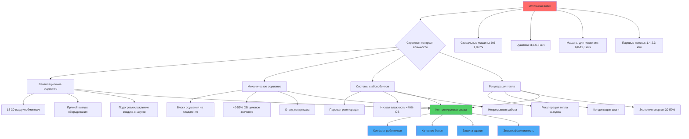

Коммерческие прачечные отелей генерируют огромные нагрузки по влажности, создавая сложные условия окружающей среды. Надлежащий контроль влажности защищает здоровье работников, предотвращает повреждение конструкций, поддерживает качество белья и контролирует энергозатраты благодаря стратегическому осушению и проектированию вентиляции.

## Источники влаги в прачечных операциях

Прачечные генерируют влагу из нескольких одновременных источников. Стиральные машины выделяют пар во время высокотемпературных циклов стирки и операций слива. Сушилки выбрасывают значительное количество водяного пара даже при правильно вентилируемых системах из-за неполного улавливания и утечек в уплотнениях дверей. Оборудование для глажения, включая машины для глажения белья и паровые прессы, генерируют непрерывный выход влаги во время работы.

Работа с влажным бельем между стадиями стирки и сушки способствует выделению влаги через испарение. Типичная стиральная машина вместимостью 45 кг извлекает примерно 60-70% воды во время циклов отжима, оставляя 14-18 кг воды в ткани, которая испаряется при передаче и сушке.

Скорость выделения влаги из оборудования прачечной варьируется в зависимости от типа и вместимости:

| Тип оборудования | Вместимость | Выделение влаги | Часы работы |
|---|---|---|---|
| Стирально-центрифужная машина | 45 кг | 0,9-1,8 кг/ч | Прерывистая |
| Барабанная сушилка (невентилируемая часть) | 55 кг | 3,6-6,8 кг/ч | Непрерывная |
| Машина для глажения белья | ширина 120 см | 6,8-11,3 кг/ч | Непрерывная |
| Паровой пресс | Одна головка | 1,4-2,3 кг/ч | Прерывистая |
| Паровой туннель финишера | Промышленный | 9,1-13,6 кг/ч | Непрерывная |

## Целевые уровни влажности для комфорта работников

Коммерческие прачечные должны поддерживать относительную влажность между 40-55% для оптимального комфорта и производительности работников. Более высокие уровни влажности создают условия теплового стресса в сочетании с повышенными температурами от работающего оборудования. Эффективная температура (комбинация температуры сухого термометра и влажности) не должна превышать 26,7°C в рабочих зонах.

Рекомендации OSHA по тепловому стрессу применяются, когда температура влажного термометра земного шара (WBGT) превышает пороговые значения. При умеренных скоростях работы, типичных для прачечных операций, WBGT должен оставаться ниже 26,7°C. Зависимость между температурой, влажностью и тепловым стрессом следует:

$$\text{WBGT} = 0,7 T_{wb} + 0,2 T_{g} + 0,1 T_{db}$$

где $T_{wb}$ = температура влажного термометра (°C), $T_{g}$ = температура земного шара (°C), и $T_{db}$ = температура сухого термометра (°C).

Поддержание более низких уровней влажности (40-45% ОВ) позволяет использовать более высокие приемлемые температуры воздуха без превышения пределов теплового стресса. Это обеспечивает операционную гибкость во время периодов пиковой продукции, когда тепловые выделения от оборудования максимальны.

## Предотвращение конденсации на поверхностях

Конденсация происходит на поверхностях ниже точки росы окружающего воздуха. В прачечных с воздухом 21°C при 60% ОВ точка росы составляет примерно 14°C. Любая поверхность при или ниже этой температуры будет испытывать конденсацию, включая:

- Внешние стены с недостаточной теплоизоляцией
- Трубопроводы холодного водоснабжения без изоляции
- Металлические воздуховоды с подающим воздухом
- Окна и металлические рамы дверей
- Неизолированные бетонные плиты пола

Стратегии предотвращения включают повышение температур поверхностей благодаря теплоизоляции и поддержание более низких уровней влажности в помещении. Требуемое значение теплопроводности (R-значение) для предотвращения конденсации следует:

$$R_{min} = \frac{T_{indoor} - T_{outdoor}}{h_{i}(T_{indoor} - T_{dp})}$$

где $h_{i}$ = коэффициент теплопередачи внутренней поверхности (обычно 8,5 Вт/м²·°C). Для внутреннего воздуха 21°C при 50% ОВ (точка росы 10,7°C) и внешней температуры -6,7°C, минимальное значение R для стены составляет примерно RSI 1,1 для предотвращения конденсации.

Конденсация на холодных поверхностях способствует росту плесени на строительных материалах и создает скользкие поверхности на полах. Накопление влаги в полостях стен снижает характеристики теплоизоляции и вызывает структурное разрушение со временем.

## Варианты осушения для прачечных

Коммерческие прачечные используют несколько стратегий осушения в зависимости от климата, размера объекта и соображений энергозатрат:

**Вентиляционное осушение** вводит наружный воздух для разбавления и удаления влаги, когда наружный воздух имеет более низкую абсолютную влажность, чем внутренний воздух. Этот подход работает эффективно в холодном и умеренном климате, но неэффективен в жаркой и влажной среде, где наружный воздух содержит больше влаги, чем внутренний воздух.

Требуемая скорость вентиляции для контроля влажности следует:

$$Q = \frac{M}{0,68 \times \Delta W \times \rho_{air}}$$

где $Q$ = расход воздуха (м³/ч), $M$ = скорость выделения влаги (кг/ч), $\Delta W$ = разница влажности между внутренним и наружным воздухом (г/кг), и $\rho_{air}$ = плотность воздуха (1,2 кг/м³ при стандартных условиях).

**Механическое осушение** с использованием систем на основе хладагента активно удаляет влагу путем охлаждения и конденсации. Эти системы обеспечивают круглогодичный контроль влажности независимо от наружных условий. Осушители должны выбираться для общей нагрузки влажности, включая выделение оборудованием, вентиляцию наружного воздуха и инфильтрацию.

**Осушение с использованием абсорбентов** использует гигроскопические материалы для поглощения влаги из воздуха благодаря химическому притяжению. Системы с абсорбентами превосходны в приложениях, требующих очень низких уровней влажности (ниже 40% ОВ) или когда доступно отработанное тепло для регенерации. Коммерческие прачечные с паровыми котлами могут использовать низконапорный пар для эффективной регенерации абсорбента.

**Осушение с рекуперацией тепла** улавливает отработанное тепло из выпуска сушилки для предварительного подогрева поступающего воздуха снаружи при одновременной конденсации влаги из потока выпуска. Этот подход снижает как отопительные, так и охлаждающие нагрузки при контроле влажности.

## Вентиляция для удаления влаги

Эффективное проектирование вентиляции создает направленный поток воздуха из чистых областей (прием и складирование белья) в загрязненные области (сортировка и стирка грязного белья). Это предотвращает перекрестное загрязнение при удалении влаги в точках генерации.

Вытяжная вентиляция должна улавливать влагу непосредственно в источниках оборудования. Сушилки требуют выделенных систем выпуска с надлежащим размером воздуховодов и завершением. Оборудование для глажения получает выгоду от вытяжных колпаков над головой, улавливающих восходящие паровые шлейфы.

Минимальная вентиляция наружного воздуха соответствует требованиям ASHRAE 62.1:

- Зона стирки: 0,065 м³/ч на м² площади пола
- Зона глажения/прессования: 0,097 м³/ч на м²
- Зона складирования/сортировки: 0,032 м³/ч на м²

Общие скорости вентиляции обычно варьируются от 15-30 воздухообменов в час в зависимости от плотности оборудования и нагрузок влажности. Более высокие скорости применяются к объектам с плохим улавливанием выпуска оборудования или большими объемами производства.

Распределение подающего воздуха должно доставлять кондиционированный воздух на высоте работников для обеспечения охлаждения и разбавления. Потолочные диффузоры с высокой скоростью выброса преодолевают тепловую стратификацию от тепловыделений оборудования.

## Влияние влажности на качество белья

Избыточная влажность влияет на качество белья несколькими механизмами. Высокие уровни влажности при хранении способствуют росту плесени, вызывая обесцвечивание и деградацию ткани. Белье, хранящееся выше 60% ОВ в течение продолжительных периодов, развивает затхлый запах, требующий переформатирования.

Операции глажения и прессования требуют контролируемой влажности для оптимальных результатов. Машины для глажения белья работают наиболее эффективно при содержании влаги в белье 8-12%. Более низкая влажность требует систем распыления, добавляющих воду при глажении. Более высокая влажность снижает производительность и качество продукции.

Влажность влияет на генерацию статического электричества при складировании и упаковке. Относительная влажность ниже 35% создает чрезмерное электростатическое прилипание, усложняя автоматизированные системы складирования и ручное обращение. Поддержание 40-50% ОВ минимизирует статические проблемы при предотвращении роста плесени.

Эффективный контроль влажности в коммерческих прачечных отелей требует интегрированного проектирования, учитывающего скорости выделения влаги, выбор системы осушения, схемы вентиляционного потока и взаимосвязь между условиями окружающей среды и комфортом работников и качеством белья. Надлежащее внедрение снижает операционные затраты при улучшении производительности и качества продукции.
