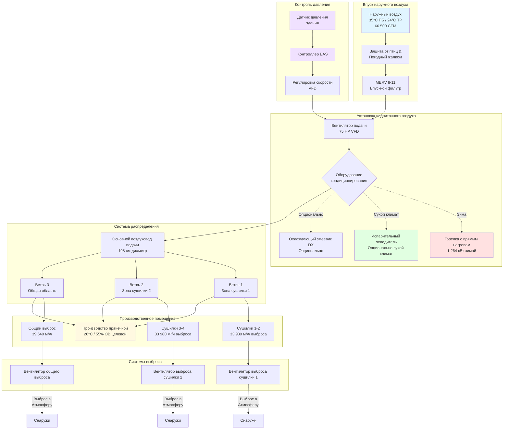

Системы подпиточного воздуха выполняют критические функции в коммерческих прачечных отелей, заменяя огромные объемы выброса из сушилок и общей вентиляции при одновременном поддержании надлежащей герметизации здания. Недостаточный подпиточный воздух создает отрицательное давление, втягивающее неондиционированный наружный воздух через непредусмотренные проходы, нарушая температурный контроль, увеличивая энергопотребление и создавая небезопасные условия эксплуатации.

## Требования к объему подпиточного воздуха

Объем подпиточного воздуха должен быть равен или немного превышать общий объем выброса для поддержания контролируемой герметизации здания, предотвращая инфильтрацию и избегая чрезмерного положительного давления.

### Расчет общего объема выброса

**Выброс из сушилок** доминирует в общих требованиях по выбросу объекта:

Коммерческие сушилки требуют 150–250 CFM выброса на фунт номинальной производительности для поддержания надлежащего удаления влаги и предотвращения перегрева. Типичная коммерческая сушилка емкостью 50 фунтов выбрасывает 7 500–12 500 CFM (12 700–21 200 м³/ч) при работе в зависимости от спецификаций производителя и скоростей подачи газа.

Многочисленные установки сушилок усложняют это требование. Прачечная среднего размера отеля с четырьмя сушилками емкостью 50 фунтов, работающими одновременно, выбрасывает:

$$Q_{dryers} = 4 \text{ сушилки} \times 10 000 \text{ CFM/сушилка} = 40 000 \text{ CFM (67 960 м}^3\text{/ч)}$$

**Общий выброс помещения** обеспечивает дополнительное удаление тепла и влаги сверх точек выброса сушилок. ASHRAE рекомендует 15–25 воздухообменов в час для промышленных прачечных в зависимости от плотности тепла и скорости образования влаги.

Для прачечной площадью 5 000 ft² (465 м²) с высотой потолка 14 футов (4,27 м):

$$V = 5 000 \text{ ft}^2 \times 14 \text{ ft} = 70 000 \text{ ft}^3 \text{ (1 982 м}^3\text{)}$$

При 20 воздухообменах в час:

$$Q_{general} = \frac{70 000 \text{ ft}^3 \times 20 \text{ ACH}}{60 \text{ мин/ч}} = 23 333 \text{ CFM (39 640 м}^3\text{/ч)}$$

**Общий выброс объекта:**

$$Q_{total} = Q_{dryers} + Q_{general} = 40 000 + 23 333 = 63 333 \text{ CFM (107 600 м}^3\text{/ч)}$$

### Определение размера подпиточного воздуха

Проектный объем подпиточного воздуха при 100–110% от общего выброса для поддержания легкого положительного давления:

$$Q_{makeup} = Q_{total} \times 1.05 = 63 333 \times 1.05 = 66 500 \text{ CFM (112 900 м}^3\text{/ч)}$$

Этот 5–10% избыток создает положительное давление 4,99–12,47 Па относительно наружного воздуха, достаточное для предотвращения инфильтрации через проникновения в оболочку здания без создания чрезмерной герметизации, влияющей на работу дверей или прилегающих пространств.

Международный механический кодекс (IMC) Раздел 508.1 требует подпиточного воздуха для систем выброса, превышающих 2 000 CFM, требуя выделенного введения наружного воздуха вместо заимствования из соседних помещений.

## Кондиционирование температуры и влажности

Температура и влажность подпиточного воздуха непосредственно влияют на нагрузки дополнительного кондиционирования помещения и комфорт рабочих, требуя тщательного анализа экономики кондиционирования в сравнении с введением неондиционированного наружного воздуха.

### Требования к зимнему нагреву

Холодный наружный воздух требует нагрева для предотвращения экстремального понижения температуры в производственных зонах и теплового дискомфорта рабочих вблизи точек выброса подпиточного воздуха.

**Минимально приемлемая температура выброса:** 13–16°C предотвращает холодные сквозняки, минимизируя энергию нагрева. Более низкие температуры выброса создают жалобы рабочих и проблемы конденсации оборудования.

**Расчет мощности нагрева** для 66 500 CFM в холодном климате (–18°C зимний расчет):

Повышение температуры с –18°C наружного воздуха до 16°C выброса (34°C повышение):

$$Q_{heating} = \text{CFM} \times 1.08 \times \Delta T = 66 500 \times 1.08 \times (60°F) = 4 309 200 \text{ BTU/ч (1 264 кВт)}$$

Это представляет мощность нагрева 4,3 млн BTU/ч (1 264 кВт), обычно обеспечиваемую горелками природного газа в конфигурациях прямого или косвенного нагрева.

Умеренные климаты (–7°C зимний расчет) снижают требования к нагреву:

$$Q_{heating} = 66 500 \times 1.08 \times 40 = 2 872 800 \text{ BTU/ч (842 кВт)}$$

### Соображения летнего охлаждения

**Неондиционированный наружный воздух** при 35°C сухого термометра вводит существенную нагрузку явного тепла, требующую дополнительного охлаждения помещения:

$$Q_{sensible} = 66 500 \times 1.08 \times (95 - 78) = 1 221 210 \text{ BTU/ч (358 кВт)}$$

Эта нагрузка явного тепла 1,22 млн BTU/ч (358 кВт) добавляется непосредственно к тепловыделению оборудования, требуя систем охлаждения большего размера.

**Частичное охлаждение** до 27–29°C температуры выброса значительно снижает нагрузку кондиционирования помещения, ограничивая стоимость капитала установки подпиточного воздуха:

Охлаждение с 35°C до 28°C (7°C снижение):

$$Q_{reduced} = 66 500 \times 1.08 \times (82 - 78) = 287 280 \text{ BTU/ч (84 кВт)}$$

Это снижает нагрузку охлаждения помещения на 933 930 BTU/ч (274 кВт) по сравнению с неондиционированным подпиточным воздухом, обычно оправдывая оборудование механического охлаждения в объектах с высокой нагрузкой.

**Соображения влажности:** Наружный воздух при точке росы 24°C (35°C ПБ, 55% ОВ типичное летнее условие) вводит существенную скрытую нагрузку. Осушение до точки росы 13°C удаляет влагу до введения в помещение, но требует дорогостоящего оборудования, обычно зарезервированного для критических применений, таких как фармацевтическое производство, а не для коммерческих прачечных.

### Испарительное охлаждение в сухих климатах

Засушливые регионы с наружными условиями ниже 30–40% относительной влажности представляют отличные возможности для испарительного охлаждения, обеспечивающего снижение температуры на 8–14°C при 10–20% стоимости капитала механического охлаждения.

**Прямое испарительное охлаждение** пропускает подпиточный воздух через смоченный материал:

При 35°C сухого термометра, 25% ОВ (18°C мокрого термометра), прямое испарительное охлаждение достигает примерно 27°C температуры выброса:

$$T_{discharge} \approx T_{wb} + 0.15 \times (T_{db} - T_{wb}) = 18 + 0.15 \times 17 = 20.5°C$$

Практические системы достигают 21–24°C выброса из-за ограничений эффективности прокладок.

**Сравнение эксплуатационных затрат:**

- Механическое охлаждение: 4–6 долл. США/час электричества на требование охлаждения 100 тонн
- Испарительное охлаждение: 0,50–1,00 долл. США/час (энергия вентилятора + потребление воды)
- Годовая экономия в жарко-сухих климатах: 12 000–18 000 долл. США за сезон охлаждения 3 000 часов

Испарительное охлаждение увеличивает влажность, но остается приемлемым в применениях прачечных, где влажность помещения уже работает на уровне 55–65% из процессной влаги.

## Установки подпиточного воздуха с прямым и косвенным нагревом

Выбор метода нагрева влияет на стоимость установки, эксплуатационную эффективность, управление продуктами сгорания и качество воздуха в помещении.

### Установки подпиточного воздуха с прямым нагревом

**Принцип работы:** Природный газ или пропан сжигается непосредственно в воздушном потоке с продуктами сгорания (водяной пар, диоксид углерода, следовые газы сгорания), смешивающимися с подаваемым воздухом и выбрасываемыми в кондиционированное помещение.

**Преимущества эффективности:**
- Тепловая эффективность: 90–95% (минимальное тепло теряется в дымоход)
- Не требуется отдельное вентилирование, снижая стоимость установки на 3 000–8 000 долл. США
- Компактная площадь основания: 30–40% меньше, чем эквиваленты косвенного нагрева
- Более низкая стоимость капитала: 8 000–15 000 долл. США экономии для установки 4 млн BTU/ч

**Соображения по продуктам сгорания:**

Каждый кубический фут природного газа производит приблизительно 0,5 кг водяного пара во время сгорания. При нагреве 4,3 млн BTU/ч (4 300 000 BTU/ч ÷ 1 000 BTU/ft³ = 4 300 ft³/ч потребления газа):

$$m_{H_2O} = 4 300 \text{ ft}^3/\text{ч} \times 0.5 \text{ кг/ft}^3 = 2 150 \text{ кг/ч водяного пара}$$

Это массивное добавление влаги (2 150 кг/ч), выбрасываемое в воздушный поток подпиточного воздуха, способствует влажности помещения. Однако воздушный поток 66 500 CFM разбавляет концентрацию влаги:

$$RH_{increase} = \frac{2 150 \text{ кг/ч}}{66 500 \text{ CFM} \times 60 \text{ мин/ч} \times 0.035 \text{ кг/м}^3} \times 0.01 = 1.6\%$$

Вклад влаги остается минимальным в применениях подпиточного воздуха с большим объемом.

**Генерация диоксида углерода** требует проверки, чтобы убедиться, что уровни CO₂ в помещении остаются ниже порога 1 000 ppm ASHRAE. Высокая скорость введения наружного воздуха (66 500 CFM) предотвращает накопление CO₂ в правильно спроектированных системах.

### Установки подпиточного воздуха с косвенным нагревом

**Принцип работы:** Горелка природного газа нагревает теплообменник с вентилированием продуктов сгорания в атмосферу. Подаваемый воздух проходит через теплообменник без контакта с продуктами сгорания.

**Характеристики проектирования:**
- Тепловая эффективность: 75–82% (тепло теряется через дымовые газы)
- Требуется отдельное вентилирование: дымоход диаметром 30–61 см, дополнительная стоимость установки 5 000–12 000 долл. США
- Большая площадь основания, вмещающая теплообменник и камеру сгорания
- Более высокая стоимость капитала, но нет продуктов сгорания в подаваемом воздухе

**Предпочтение применения:**

Установки косвенного нагрева подходят для применений, требующих абсолютного исключения продуктов сгорания:
- Медицинские учреждения с чувствительными группами населения
- Пищевая промышленность, требующая одобрения USDA
- Объекты с недостаточным объемом подпиточного воздуха для разбавления продуктов сгорания

Коммерческие прачечные обычно допускают установки прямого нагрева из-за больших объемов воздуха и промышленного характера.

## Распределение воздуха в помещениях прачечной

Стратегическое распределение подпиточного воздуха предотвращает короткое замыкание от подачи к выбросу при одновременном обеспечении эффективного заменяющего воздуха в точках выброса сушилок.

### Стратегия распределения

**Выброс вблизи мест расположения сушилок** обеспечивает замещающий воздух ближайший к источникам выброса, предотвращая чрезмерные скорости воздуха по полу производства:

- Расположение дефлекторов подпиточного воздуха в пределах 4,6–7,6 м от соединений выброса сушилок
- Предпочитаются множественные точки выброса над одним большим выбросом
- Четыре сушилки требуют минимум три–четыре места выброса подпиточного воздуха

**Выброс с высокой скоростью** позволяет увеличить дальность броска с крыши или установок подпиточного воздуха на стене:

Скорость выброса: 366–549 м/мин позволяет расстояния броска 12–18 м перед снижением скорости ниже 46 м/мин. Это позволяет использовать меньше точек выброса, снижая стоимость воздуховода.

**Избегайте прямого попадания** на рабочих или производственное оборудование:
- Выброс на 2,4–3,7 м над высотой пола
- Угол выброса 15–25° от горизонтали, предотвращающий прямой нисходящий поток воздуха
- Установка регулируемых дефлекторов для полевой регулировки после ввода в эксплуатацию

### Определение размера воздуховода

**Скорость подачи воздуховода** составляет 549–762 м/мин в основных воздуховодах, уменьшаясь до 366–457 м/мин в ответвлениях. Высокая скорость минимизирует размер воздуховода, но увеличивает потери давления, требуя тщательного определения размера вентилятора.

Для системы 66 500 CFM при скорости основного воздуховода 610 м/мин:

$$A_{duct} = \frac{66 500 \text{ CFM}}{2 000 \text{ FPM}} = 33.25 \text{ ft}^2 (3.09 \text{ м}^2)$$

Диаметр круглого воздуховода:

$$D = \sqrt{\frac{4A}{\pi}} = \sqrt{\frac{4 \times 33.25}{3.14}} = 6.5 \text{ ft} = 78 \text{ inches (198 см)}$$

Большие размеры воздуховодов (152–198 см диаметр) требуют специальной фабрики и анализа структурной поддержки.

**Теплоизоляция воздуховода** предотвращает конденсацию во время эксплуатации летнего охлаждения (если оборудована) и снижает прибыль/убыток тепла в неондиционированных местах. Указывают изоляцию R-6 (RSI 1,06) минимум для подачи воздуховодов в неондиционированных местах.

## Балансировка с выбросом для легкого отрицательного давления

Несмотря на то, что подпиточный воздух превышает объем выброса по проектированию, комиссионирование и операционные регулировки обеспечивают надлежащие отношения давления, предотвращая инфильтрацию при избегании чрезмерной герметизации.

### Целевые отношения давления

**Производственная зона к наружному воздуху:** +4,99–12,47 Па
- Положительное давление предотвращает инфильтрацию неондиционированного наружного воздуха, пыли, насекомых через проникновения в оболочку
- Минимальное положительное давление избегает принуждения кондиционированного воздуха наружу через двери при открывании

**Прилегающие офис/вспомогательные области к производству:** +4,99–7,48 Па
- Предотвращает миграцию тепла, влаги, пуха из производства в комфортные кондиционированные помещения
- Поддерживает отдельный экологический контроль

### Измерение давления и регулировка

**Процедура комиссионирования:**

1. Работают все сушилки и системы общего выброса в расчетных условиях
2. Активируют систему подпиточного воздуха на расчетный объем
3. Измеряют давление здания в множественных местах с использованием манометра или цифрового датчика давления (минимальное разрешение ±0,25 Па)
4. Регулируют объем подпиточного воздуха через VFD или входные заслонки для достижения целевого давления
5. Документируют окончательные скорости потока воздуха и показания давления

**Общие проблемы давления:**

Чрезмерное отрицательное давление (ниже –4,99 Па):
- Увеличивают объем подпиточного воздуха на 5–10%
- Проверяют, что все установки подпиточного воздуха работают
- Проверяют неожиданные системы выброса (выброс туалета, выброс пятен)

Чрезмерное положительное давление (выше +24,94 Па):
- Снижают объем подпиточного воздуха
- Проверяют сокращение эксплуатации выброса
- Проверяют, что заслонки выброса сушилок полностью открыты

### Управление переменным объемом

**Подпиточный воздух на основе спроса** снижает энергию вентилятора при частичной нагрузке:

Контролируют эксплуатацию сушилки через датчики тока или интеграцию системы управления. Когда сушилки отключаются, пропорционально снижают объем подпиточного воздуха, поддерживая постоянное отношение давления.

Четыре сушилки при 10 000 CFM каждая плюс 23 333 CFM общего выброса:
- Все сушилки работают: 66 500 CFM подпиточного воздуха
- Три сушилки работают: 56 000 CFM подпиточного воздуха (одна сушилка отключена = 10 000 CFM сокращение × коэффициент 1,05)
- Две сушилки работают: 45 500 CFM подпиточного воздуха

Преобразователи частоты (VFD) на вентиляторах подпиточного воздуха модулируют воздушный поток непрерывно. Потребление энергии вентилятора изменяется с кубом изменения скорости:

Снижение воздушного потока с 66 500 до 45 500 CFM (68% расчета):

$$P_{reduced} = P_{design} \times \left(\frac{45 500}{66 500}\right)^3 = P_{design} \times 0.68^3 = 0.31 \times P_{design}$$

Это снижение мощности на 69% в течение 30–40% часов работы дает существенную годовую экономию энергии: 4 000–8 000 долл. США ежегодно для типичных установок.

## Требования подпиточного воздуха по размеру прачечной

Следующая таблица содержит типичные требования подпиточного воздуха в зависимости от пропускной способности объекта:

| Размер прачечной | Дневная производительность (кг/день) | Типичные сушилки | Общий выброс (м³/ч) | Подпиточный воздух (м³/ч) | Зимний нагрев (кВт) | Примечания |
|------------------|--------------------------------------|-----------------|---------------------|--------------------------|-------------------|-----------|
| Малый отель | 227–363 | 2 × 16 кг | 30 570–37 420 | 32 260–39 070 | 352–410 | Одна MAU, прямой нагрев |
| Средний отель | 363–680 | 3–4 × 23 кг | 64 530–84 940 | 67 960–91 070 | 761–996 | Одна большая или двойная MAU |
| Большой отель | 680–1 360 | 6–8 × 23 кг | 118 860–161 400 | 125 680–173 100 | 1 406–1 904 | Множество MAU, контроль зон |
| Курортный комплекс | 1 360–2 720 | 10–16 × 34 кг | 212 350–339 800 | 224 280–357 200 | 2 519–4 011 | Центральная установка, рекуперация тепла |
| Коммерческая прачечная | 2 720–6 800 | 20–40 × 45 кг | 509 400–1 018 800 | 535 300–1 070 100 | 6 006–12 007 | Множество зон, управление по спросу |

*Мощность нагрева принимает температуру зимнего расчета –18°C до 18°C выброса. Уменьшают пропорционально для более теплых климатов.*

*Объемы выброса включают выброс сушилок плюс общий выброс помещения при 18–22 ACH в зависимости от плотности тепла объекта.*

## Компоновка системы и интеграция

Архитектура системы подпиточного воздуха варьируется в зависимости от размера объекта и распределения оборудования.

**Ключевые элементы проектирования:**

1. **Расположение впуска:** Позиционируют минимум 9 м от точек выброса выхлопа, предотвращая циркуляцию. Располагают на высоте 2,4–3,7 м над землей, избегая помех снежного заноса в холодных климатах.

2. **Размещение оборудования:** Установки подпиточного воздуха на крыше минимизируют трассировку воздуховода подачи и обеспечивают легкий доступ к наружному воздуху. Установки на уровне грунта требуют защиты от погодных условий и более длинной маршрутизации воздуховода подачи.

3. **Координация множественных установок:** Крупные объекты получают выгоду от множественных меньших установок подпиточного воздуха (3 × 37 500 м³/ч) в сравнении с одной большой установкой (112 900 м³/ч), обеспечивающей избыточность и зональный контроль.

4. **Интеграция с охлаждением помещений:** Система подпиточного воздуха координирует с рециркулирующимися воздухоохладителями, обеспечивая дополнительное охлаждение и осушение. Подпиточный воздух управляет вентиляционной нагрузкой, в то время как оборудование рециркуляции управляет тепловой нагрузкой.

5. **Рассмотрение рекуперации энергии:** Рекуперация тепла из выброса сушилок для предварительного нагрева подпиточного воздуха достигает экономии энергии нагрева на 40–60%, но требует тщательного анализа загрязнения пухом, рисков перекрестного загрязнения и требований к техническому обслуживанию, часто ограничивающих применение в коммерческих прачечных.

Правильно спроектированные системы подпиточного воздуха превращают коммерческие прачечные из неудобных, энергоемких сред в управляемые производственные объекты, поддерживающие безопасность рабочих, долговечность оборудования и операционную эффективность, при одновременном управлении энергетическими затратами через стратегическое кондиционирование и стратегии контроля.
