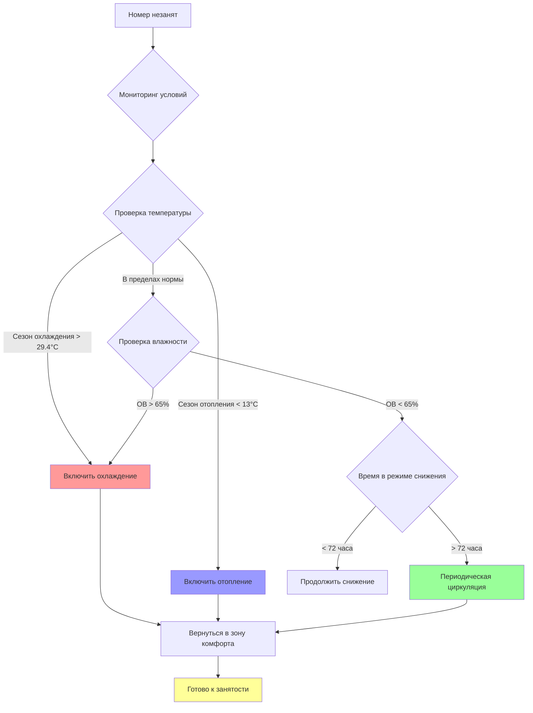

## Ожидания гостей по комфорту при прибытии

Гости отеля ожидают немедленного комфорта при входе в номер, независимо от того, как долго номер был незанят. Это ожидание создает фундаментальную проблему для систем управления энергией, которые используют снижение температуры при вакантности. Отраслевой стандарт приемлемых условий в номере при заезде требует температуры в зоне комфорта и свежего циркулирующего воздуха.

Максимальное время восстановления от режима сокращения нагрузки до комфортных условий для занятого номера не должно превышать 15-20 минут для стандартных номеров и 30 минут для люксов. Этот период восстановления должен учитывать как удаление явного, так и скрытого тепла, поскольку уровни влажности напрямую влияют на ощущаемый комфорт даже при приемлемой температуре.

Индекс комфорта во время восстановления можно оценить по формуле:

$$CI = 0.7 \times T_{db} + 0.3 \times T_{wb}$$

где $CI$ представляет индекс комфорта в °C, $T_{db}$ — температура сухого термометра, а $T_{wb}$ — температура влажного термометра. Жалобы гостей обычно возникают, когда $CI$ при входе превышает 25.6°C.

## Пределы температуры и влажности при сокращении нагрузки

Надлежащие стратегии снижения температуры балансируют экономию энергии с необходимостью поддержания условий, которые позволяют быстрое восстановление и предотвращают повреждение строительной конструкции. Пределы снижения температуры должны быть установлены на основе климата, конструкции здания и возможности восстановления.

### Пределы снижения температуры в сезон охлаждения

В сезон охлаждения незанятые номера должны поддерживать температуру не выше 27.8-29.4°C в влажном климате и до 31.1°C в сухом климате. Более высокие установки рискуют накоплением влаги, которое приводит к конденсации, развитию плесени и появлению неприятных запахов. Связь между повышением температуры и накоплением влаги следует следующей формуле:

$$\frac{dRH}{dt} = k \times (T_{setback} - T_{dewpoint})$$

где $k$ — константа, зависящая от герметичности конструкции и наружных условий. Когда $T_{setback}$ приближается к $T_{dewpoint}$, относительная влажность повышается быстро.

### Пределы снижения температуры в сезон отопления

Температура снижения зимой не должна опускаться ниже 13-15.6°C в большинстве климатов. Более низкие температуры рискуют:

- Замерзанием воды в сантехнических приборах вблизи наружных стен
- Конденсацией на холодных внутренних поверхностях
- Продленным временем восстановления, влияющим на удовлетворение гостей
- Чрезмерным тепловым напряжением на строительные материалы

Минимальная безопасная температура снижения рассчитывается как:

$$T_{min} = T_{dewpoint} + \Delta T_{safety} + 2.8°C$$

где $\Delta T_{safety}$ представляет запас безопасности выше точки росы для предотвращения конденсации, обычно 5.6-8.3°C.

## Предотвращение экстремальных условий

Экстремальные условия развиваются, когда параметры снижения температуры слишком агрессивны или когда мониторинг окружающей среды не работает. Надлежащие защиты включают:

**Пределы переопределения температуры**: Установите абсолютные максимальную и минимальную температуры, при превышении которых система возвращается к нормальной работе независимо от статуса занятости. Эти установки переопределения обычно составляют 32.2°C для охлаждения и 10°C для отопления.

**Мониторинг влажности**: Установите датчики влажности в репрезентативных номерах для обнаружения накопления влаги. Когда относительная влажность превышает 65% более чем на 2 часа, охлаждение должно включиться для удаления влаги даже в незанятых помещениях.

**Защита конструкции**: Номера на верхних этажах, угловые помещения и помещения с большими стеклянными площадями требуют менее агрессивного снижения температуры из-за более высоких солнечных нагрузок и нагрузок конструкции.

## Проблемы плесени и влаги от глубокого снижения температуры

Агрессивные стратегии снижения температуры во влажном климате создают идеальные условия для развития плесени, когда относительная влажность превышает 70% в течение продолжительного времени. Плесень развивается наиболее активно, когда:

- Температура в номере повышается выше 26.7°C во влажных условиях
- В ванных комнатах отсутствует надлежащая вентиляция во время вакантности
- Свежий воздух полностью перекрыт на более чем 48 часов
- На холодных поверхностях (окна, наружные стены) образуется конденсация

Индекс развития плесени экспоненциально растет выше 70% ОВ:

$$MGI = e^{0.15 \times (RH - 70)} \times \frac{t}{24}$$

где $MGI$ — индекс развития плесени, а $t$ — время в часах выше порога. Значение $MGI$, превышающее 1.0, указывает на условия, благоприятные для видимого развития плесени.

Стратегии профилактики включают:

- Вентиляторы вытяжки в ванных комнатах на таймерах (2-часовые циклы каждые 24 часа во время продолжительной вакантности)
- Режим осушения при ОВ выше 60%
- Циркуляция воздуха минимум каждые 12 часов
- Регулярные проверки обслуживающим персоналом номеров, свободных более 3 дней

## Предотвращение жалоб гостей

Жалобы гостей, связанные с комфортом в номере, обычно вытекают из:

1. **Недостаточного охлаждения/отопления при прибытии** (45% жалоб)
2. **Затхлых или спертых запахов** (30% жалоб)
3. **Чрезмерной влажности или "липкого" ощущения** (15% жалоб)
4. **Колебаний температуры во время начального пребывания** (10% жалоб)

Минимизация жалоб требует:

**Кондиционирование перед прибытием**: Начните восстановление номера за 30-60 минут до предполагаемого времени заезда. Системы управления имуществом могут запустить это на основе данных резервирования.

**Режим ускоренного восстановления**: Используйте максимальную скорость вентилятора и полную мощность отопления/охлаждения во время начального восстановления, затем модулируйте на бесшумную работу после достижения установки.

**Управление качеством воздуха**: Подайте наружный воздух во время восстановления для удаления накопленных запахов. Требуемый объем продувки:

$$V_{purge} = \frac{V_{room} \times N_{changes}}{60}$$

где $V_{purge}$ — время продувки в минутах, $V_{room}$ — объем номера в м³, а $N_{changes}$ — количество воздухообменов (обычно 2-3).

## Специальные рассмотрения VIP и люксов

Премиум-размещение требует более консервативных стратегий снижения температуры из-за более высоких ожиданий гостей и больших площадей, требующих более длительного времени восстановления.

| Параметр | Стандартный номер | Люкс/VIP |
|-----------|------------------|----------|
| Максимальное снижение температуры охлаждения | 29.4°C | 26.7°C |
| Минимальное снижение температуры отопления | 15.6°C | 18.3°C |
| Максимальная ОВ при снижении | 65% | 60% |
| Целевое время восстановления | 20 минут | 15 минут |
| Воздухообмены при вакантности | 0.5 ACH | 1.0 ACH |
| Кондиционирование перед прибытием | 30 минут | 60 минут |
| Абсолютный предел ОВ | 70% | 65% |

**Координация многозонности**: Люксы с несколькими HVAC-зонами требуют скоординированного восстановления для обеспечения того, чтобы все помещения одновременно достигли условий комфорта. Жилые зоны должны начать восстановление на 5-10 минут раньше спален, чтобы учесть более высокие нагрузки от занятости.

**Усиленный мониторинг**: VIP-номера выигрывают от непрерывного мониторинга, а не периодического отбора проб, с предупреждениями, отправляемыми инженерному персоналу, если условия отклоняются от приемлемых диапазонов.

**Резервные системы**: Критичные VIP-размещения должны иметь резервную способность кондиционирования или опции ручного переопределения для обеспечения немедленного комфорта независимо от статуса автоматической системы.

Энергетический штраф за эти улучшенные параметры комфорта составляет примерно 15-25% выше, чем для стандартных номеров, но эти инвестиции оправданы премиальными тарифами и ожиданиями гостей по люкс-размещению.
