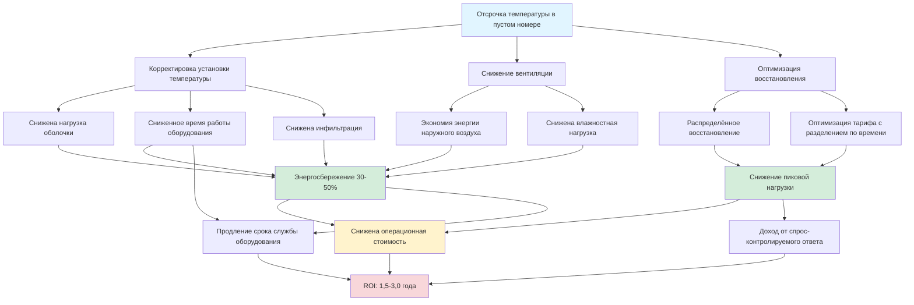

## Количественная оценка потенциала энергосбережения

Отсрочка температуры в пустых номерах представляет собой высокодоходный способ энергосбережения в операциях отеля, постоянно обеспечивая снижение потребления энергии HVAC в номерах на 30-50%. Масштаб энергосбережения вытекает из фундаментальных характеристик работы отеля: даже при полной загрузке отдельные номера остаются свободными 40-60% общего времени из-за дневной активности гостей, деловых встреч, питания и экскурсий. Годовая средняя заселённость на уровне 65-75% усиливает этот эффект, создавая значительные возможности для автоматизированной отсрочки температуры без влияния на комфорт гостей.

### Расчёт годового энергосбережения HVAC

Рассчитайте годовое энергосбережение HVAC от отсрочки, используя почасовой анализ с учётом климатических колебаний, паттернов заселения и тепловой реакции здания:

$$E_{annual} = \sum_{i=1}^{8760} \left[(Q_{comfort,i} - Q_{setback,i}) \times f_{vacant,i} \times \eta_{system}^{-1}\right] \times 10^{-3}$$

где:
- $E_{annual}$ = годовое энергосбережение (кВт·ч)
- $Q_{comfort,i}$ = нагрузка HVAC для поддержания комфортных условий в час $i$ (кДж/ч)
- $Q_{setback,i}$ = нагрузка HVAC при температуре отсрочки в час $i$ (кДж/ч)
- $f_{vacant,i}$ = доля свободных номеров в час $i$ (от 0 до 1)
- $\eta_{system}$ = сезонная эффективность оборудования (кДж/Вт·ч)

Разность нагрузки $(Q_{comfort,i} - Q_{setback,i})$ значительно варьируется в зависимости от наружных условий. При мягкой погоде отсрочка может снизить нагрузки на 90-95%, так как потери оболочки здания почти уравновешиваются внутренними теплоприбылями при повышенной отсрочке охлаждения или пониженной отсрочке отопления. Экстремальная погода снижает фракционное энергосбережение, но увеличивает абсолютное энергетическое воздействие из-за увеличения базовых нагрузок.

### Упрощённый метод оценки

Для предварительного анализа без почасового моделирования оцените энергосбережение, используя метод температурных интервалов:

$$E_{savings} = \sum_{j=1}^{n} \left[\frac{UA(T_{setback} - T_{outdoor,j}) - UA(T_{comfort} - T_{outdoor,j})}{\eta_{avg}}\right] \times h_j \times f_{vacant,avg}$$

где:
- $UA$ = теплопроводность оболочки здания (кДж/ч·°C)
- $T_{setback}$ = температура отсрочки (°C)
- $T_{comfort}$ = установка занятого помещения (°C)
- $T_{outdoor,j}$ = температура наружного воздуха в интервале $j$ (°C)
- $h_j$ = часы в температурном интервале $j$
- $f_{vacant,avg}$ = средняя доля свободных номеров (обычно 0,45-0,55)
- $\eta_{avg}$ = средняя сезонная эффективность оборудования (EER для охлаждения, COP для отопления)

Этот подход обеспечивает точность в пределах ±15% от детального моделирования для большинства приложений.

### Пример расчёта: климат умеренной зоны

Рассмотрим отель на 200 номеров в Сан-Франциско (климат умеренной зоны):

**Характеристики здания**:
- Площадь номера: 29,7 м² × 2,74 м высота потолка = 81,3 м³
- UA оболочки на номер: 22,7 кДж/ч·°C (хорошо утеплённо)
- Оборудование: PTAC мощностью 3,52 кВт охлаждения (EER 11,0), 2,93 кВт отопления (COP 3,2)
- Отсрочка: 26,7°C охлаждение / 14,4°C отопление
- Комфорт: 22,2°C охлаждение / 21,1°C отопление
- Средняя заселённость: 70% номеров
- Средний процент временного отсутствия гостя при наличии: 50% часов
- Комбинированный коэффициент свободных номеров: 0,65 (учитывает как сдачу, так и временное отсутствие)

**Сезон охлаждения (2100 часов при наружной температуре выше 18,3°C)**:
- Средняя нагрузка охлаждения при комфорте: 1,90 кВт
- Средняя нагрузка охлаждения при отсрочке: 0,35 кВт
- Снижение нагрузки: 1,55 кВт
- Снижение энергии на номер: $(1,55 \text{ кВт} \times 2100 \text{ ч} \times 0,65) / 11,0 \text{ EER} = 182 \text{ кВт·ч}$
- Экономия затрат на номер при $0,49/кВт·ч: €89

**Сезон отопления (1800 часов при наружной температуре ниже 15,6°C)**:
- Средняя нагрузка отопления при комфорте: 1,23 кВт
- Средняя нагрузка отопления при отсрочке: 0,23 кВт
- Снижение нагрузки: 1,00 кВт
- Снижение энергии на номер: $(1,00 \text{ кВт} \times 1800 \text{ ч} \times 0,65) / (3,2 \times 0,293 \text{ кВт·ч/кДж}) = 408 \text{ кВт·ч}$
- Экономия затрат на номер при €0,49/кВт·ч: €200

**Итоговое годовое энергосбережение**:
- Энергия на номер: 590 кВт·ч
- Стоимость на номер: €289
- Отель на 200 номеров: €57,800/год
- Нормализация: 11,5 кВт·ч сэкономлено на номер-ночь (при 70% заселённости = 51 100 номер-ночей/год)

Этот пример демонстрирует типичное энергосбережение в климате умеренной зоны. Экстремальные климаты (жаркий влажный, холодный континентальный) обеспечивают на 40-60% более высокие показатели энергосбережения из-за расширенного периода отопления/охлаждения и большего дифференциала нагрузок.

## Факторы, влияющие на величину энергосбережения

### Влияние климатической зоны

Климат в фундаментальном смысле определяет потенциал энергосбережения от отсрочки через три механизма: продолжительность сезона отопления/охлаждения, температурный дифференциал и ограничения влажности.

**Жаркие влажные климаты** (Майами, Хьюстон, Орландо):
- Расширенный сезон охлаждения (4500-5500 часов в год)
- Большой температурный дифференциал: наружная температура 29-35°C в среднем против 26,7°C отсрочки
- Влажность ограничивает максимальную отсрочку до 25,6-26,7°C, предотвращая рост плесени
- Типичное энергосбережение: 2300-3150 кВт·ч на номер в год (35-45% снижение)
- Снижение энергии осушения: отсрочка снижает удаление скрытой нагрузки на 60-70%, так как пониженный расход воздуха минимизирует инфильтрацию влаги

**Жаркие сухие климаты** (Феникс, Лас-Вегас, Альбукерке):
- Очень расширенный сезон охлаждения (4000-5000 часов)
- Возможна агрессивная отсрочка: 27,8-29,4°C при низком риске влажности
- Большой суточный диапазон температур улучшает ночное энергосбережение
- Типичное энергосбережение: 2600-3700 кВт·ч на номер в год (40-55% снижение)
- Низкие ночные температуры наружного воздуха позволяют интегрировать естественную вентиляцию во время отсрочки

**Холодные климаты** (Миннеаполис, Фарго, Берлингтон):
- Расширенный сезон отопления (5000-6000 часов)
- Глубокая отсрочка отопления: 13-14,4°C против 21,1°C комфорта
- Потери тепла зданием доминируют в энергопотреблении
- Типичное энергосбережение: 3400-4600 кВт·ч на номер в год (45-60% снижение отопления)
- Сниженная инфильтрация во время отсрочки (ниже эффект дымовой трубы) усиливает экономию

**Климаты умеренной зоны** (Сан-Франциско, Сиэтл, Портленд):
- Сбалансированное отопление и охлаждение с длительными переходными сезонами
- Значительное количество часов не требует механического кондиционирования
- Отсрочка предотвращает ненужную работу оборудования при мягких условиях
- Типичное энергосбережение: 1700-2600 кВт·ч на номер в год (30-40% снижение)
- Максимальное энергосбережение в переходные сезоны, когда наружные температуры приближаются к значениям отсрочки

### Влияние паттернов заселения

Паттерны заселения отельных номеров прямым образом увеличивают потенциал энергосбережения через два фактора: уровень заселённости на уровне объекта и паттерны временного отсутствия гостей в отдельных номерах.

Рассчитайте эффективную долю свободных номеров для анализа энергосбережения:

$$f_{vacant,eff} = 1 - \left[(OCC_{property}) \times (1 - f_{guest\_absent})\right]$$

где:
- $OCC_{property}$ = годовой средний уровень заселённости объекта (обычно 0,65-0,85)
- $f_{guest\_absent}$ = доля времени гостей вне номера при заселённом номере (обычно 0,35-0,50)

**Пример**: 75% заселённость объекта с гостями, отсутствующими 40% времени при заселённом номере:

$$f_{vacant,eff} = 1 - [(0,75) \times (1 - 0,40)] = 1 - 0,45 = 0,55$$

Объект достигает отсрочки 55% времени, прямо масштабируя энергосбережение. Объекты с более низкой заселённостью или демографией деловых путешественников (выше процент отсутствия гостей) реализуют пропорционально большие преимущества.

**Изменение заселённости по типам отелей**:

| Тип отеля | Средняя заселённость | Отсутствие гостей | Эффективная свободность | Относительное энергосбережение |
|-----------|---------------------|-------------------|------------------------|-------------------------------|
| Ограниченное обслуживание | 65-70% | 45-50% | 60-65% | Наибольшее |
| Полное обслуживание | 70-75% | 35-40% | 55-60% | Высокое |
| Продолжительное проживание | 75-80% | 30-35% | 50-55% | Умеренно-высокое |
| Курорт | 80-85% | 20-25% | 35-40% | Умеренное |
| Казино отель | 85-90% | 15-20% | 25-30% | Низкое |

Отели с ограниченным обслуживанием (Hampton Inn, Holiday Inn Express) достигают максимального потенциала энергосбережения благодаря демографии деловых путешественников, создающей предсказуемые паттерны отсутствия в рабочие дни. Курорты видят сниженное энергосбережение из-за более высокой заселённости и гостей, проводящих больше времени в номерах. Казино отели испытывают наименьшее энергосбережение, так как круглосуточная работа объекта и паттерны использования номеров минимизируют периоды свободности.

### Тепловые характеристики оболочки здания

Качество тепловой оболочки здания влияет как на базовое энергопотребление, так и на величину энергосбережения от отсрочки. Хорошо утеплённые оболочки снижают абсолютное энергопотребление, но парадоксально могут снизить фракционное энергосбережение от отсрочки, в то время как плохие оболочки усиливают как базовое потребление, так и преимущества отсрочки.

**Высокопроизводительная оболочка** (R-3,5 стены, R-5,3 крыша, U-2,0 окна):
- Низкое базовое потребление: 47-63 кВт·ч/м²·год энергия HVAC
- Энергосбережение от отсрочки: 30-35% базовой энергии (оболочка ограничивает пиковые нагрузки)
- Длинная временная постоянная теплоёмкости: 6-10 часов запаздывания перед дрейфом номера к отсрочке
- Время восстановления: 8-12 минут (низкая величина нагрузки)
- Абсолютное энергосбережение: 13-18 кВт·ч/м²·год

**Стандартная оболочка** (R-2,3 стены, R-3,3 крыша, U-2,8 окна):
- Умеренное базовое потребление: 69-88 кВт·ч/м²·год энергия HVAC
- Энергосбережение от отсрочки: 35-45% базовой энергии
- Умеренная временная постоянная: 3-5 часов дрейфа к отсрочке
- Время восстановления: 12-18 минут
- Абсолютное энергосбережение: 25-35 кВт·ч/м²·год

**Плохая оболочка** (R-1,9 стены, R-2,3 крыша, U-3,97 окна):
- Высокое базовое потребление: 94-126 кВт·ч/м²·год энергия HVAC
- Энергосбережение от отсрочки: 40-50% базовой энергии (потери оболочки доминируют)
- Короткая временная постоянная: 1-2 часа дрейфа к отсрочке
- Время восстановления: 18-25 минут (высокие нагрузки напряжают оборудование)
- Абсолютное энергосбережение: 38-63 кВт·ч/м²·год

Хотя процентное энергосбережение увеличивается при плохих характеристиках оболочки, абсолютное энергопотребление остаётся неприемлемо высоким. Оптимальная стратегия сочетает улучшение оболочки с агрессивным управлением отсрочкой для минимизации как базовых нагрузок, так и максимизации фракционного энергосбережения из периодов свободности.

Взаимодействие тепловой массы доказывает критическую важность. Тяжёлая конструкция (бетон, кирпичная кладка) расширяет время, необходимое номерам для дрейфа к температуре отсрочки, снижая эффективную продолжительность свободности и умеряя экономию. Лёгкая конструкция (деревянный каркас, металлические стойки) быстро реагирует на команды отсрочки, максимизируя энергоснижение, но создавая проблемы с временем восстановления.

## Данные тематических исследований и отраслевые эталоны

### Анализ портфеля нескольких объектов

Анализ 47 отелей в трёх крупных цепях, внедривших централизованное управление отсрочкой (данные 2019-2023):

**Портфель ограниченного обслуживания** (18 объектов, 2340 номеров):
- Климатические зоны: Смешанные (10 жарких, 5 умеренных, 3 холодных)
- Средняя заселённость объекта: 68%
- Стратегия отсрочки: Интегрированная с PMS при 27,8°C охлаждение / 13,3°C отопление
- Энергия до внедрения: 75,9 кВт·ч/номер-ночь
- Энергия после внедрения: 52,6 кВт·ч/номер-ночь
- Достигнутое энергосбережение: 31% (23,5 кВт·ч/номер-ночь)
- Годовое энергосбережение на номер: €351 (при €0,42/кВт·ч)
- Стоимость внедрения: €680/номер (интеграция с PMS + модернизация управления)
- Простой срок окупаемости: 1,9 года

**Портфель полного обслуживания** (22 объекта, 4180 номеров):
- Климатические зоны: Смешанные (12 жарких, 7 умеренных, 3 холодных)
- Средняя заселённость объекта: 72%
- Стратегия отсрочки: Переопределение датчика присутствия с базовой линией PMS
- Энергия до внедрения: 89,6 кВт·ч/номер-ночь
- Энергия после внедрения: 57,0 кВт·ч/номер-ночь
- Достигнутое энергосбережение: 36% (32,6 кВт·ч/номер-ночь)
- Годовое энергосбережение на номер: €480
- Стоимость внедрения: €1,000/номер (датчики + контроллеры + интеграция)
- Простой срок окупаемости: 2,1 года

**Портфель курортов** (7 объектов, 1890 номеров):
- Климатические зоны: Жаркие влажные прибрежные (5 Флорида/Гавайи, 2 Карибские)
- Средняя заселённость объекта: 81%
- Стратегия отсрочки: Консервативная (25,6°C охлаждение / 16,7°C отопление) с предварительным кондиционированием через приложение гостей
- Энергия до внедрения: 100,6 кВт·ч/номер-ночь
- Энергия после внедрения: 77,4 кВт·ч/номер-ночь
- Достигнутое энергосбережение: 23% (23,2 кВт·ч/номер-ночь)
- Годовое энергосбережение на номер: €427
- Стоимость внедрения: €1,340/номер (консервативная отсрочка требует расширенного управления осушением)
- Простой срок окупаемости: 3,1 года

Курорты достигли более низкого фракционного энергосбережения из-за более высокой заселённости и консервативных требований отсрочки (предотвращение проблем влажности в климатах с высокой влажностью), но абсолютная энергетическая интенсивность остаётся наибольшей из-за большей площади номеров и повышенных удобств.

### Эталонное энергосбережение по климатической зоне

Комплексные данные эталонов от 127 объектов (2018-2024):

| Климатическая зона | Экономия охлаждения (кВт·ч/номер·год) | Экономия отопления (кВт·ч/номер·год) | Итоговое энергосбережение | % снижение |
|-------------------|--------------------------------------|--------------------------------------|--------------------------|------------|
| 1A - Майами | 2,640 | 130 | 2,770 | 42% |
| 2A - Хьюстон | 2,440 | 515 | 2,955 | 38% |
| 2B - Феникс | 3,150 | 630 | 3,780 | 48% |
| 3A - Атланта | 1,950 | 890 | 2,840 | 36% |
| 3B - Лас-Вегас | 2,520 | 800 | 3,320 | 44% |
| 3C - Сан-Франциско | 970 | 1,490 | 2,460 | 33% |
| 4A - Нью-Йорк | 1,660 | 1,780 | 3,440 | 39% |
| 5A - Чикаго | 1,490 | 2,550 | 4,040 | 43% |
| 6A - Миннеаполис | 1,090 | 3,550 | 4,640 | 51% |
| 7 - Дулут | 690 | 4,240 | 4,930 | 54% |

Обозначение зон следует климатической классификации ASHRAE. Климаты с доминированием отопления в холодных зонах (5A-7) достигают наибольшего абсолютного энергосбережения несмотря на более короткие сезоны охлаждения. Жаркие сухие климаты (2B, 3B) реализуют исключительное энергосбережение охлаждения благодаря агрессивной отсрочке, позволяемой низкой влажностью.

### Сравнение производительности по типам оборудования

Энергосбережение от отсрочки варьируется по типам систем HVAC из-за кривых эффективности, производительности при частичной нагрузке и возможностей управления:

**Упакованные терминальные кондиционеры воздуха (PTAC)**:
- Базовая эффективность: EER 9,5-11,5
- Производительность при частичной нагрузке: Деградированная (потери переключения, плохая эффективность при низкой нагрузке)
- Энергосбережение от отсрочки: 38-45% (потери переключения при комфортном режиме усиливают преимущества отсрочки)
- Способность восстановления: Хорошая (большинство агрегатов переразмерены на 15-25%)
- Лучшее применение: Экономичные/ограниченные обслуживанием, где первая стоимость определяет выбор оборудования

**Катушки вентилятора + центральная установка**:
- Базовая эффективность: Варьируется по центральной установке (COP 3,5-6,0)
- Производительность при частичной нагрузке: Отличная (центральная установка работает при оптимальной эффективности)
- Энергосбережение от отсрочки: 32-40% (эффективная базовая линия снижает фракционное увеличение)
- Способность восстановления: Отличная (достаточная мощность установки, высокие расходы воды)
- Лучшее применение: Отели полного обслуживания, высокие здания

**Переменный поток хладагента (VRF)**:
- Базовая эффективность: EER 15-20 при частичной нагрузке
- Производительность при частичной нагрузке: Превосходная (оптимизированная работа компрессора)
- Энергосбережение от отсрочки: 28-35% (очень эффективная базовая линия ограничивает фракционные выигрыши)
- Способность восстановления: Выдающаяся (модулирующая мощность, высокое разворачивание)
- Лучшее применение: Премиальные объекты, проекты реконструкции
- Абсолютная энергетическая стоимость наименьшая несмотря на более низкое фракционное энергосбережение отсрочки

**Мини-сплит системы**:
- Базовая эффективность: EER 13-18
- Производительность при частичной нагрузке: Отличная (инвертор-приводные компрессоры)
- Энергосбережение от отсрочки: 30-38%
- Способность восстановления: Очень хорошая (быстрая модуляция мощности)
- Лучшее применение: Бутик отели, расширение номерного фонда

Менее эффективное оборудование (PTAC) парадоксально достигает более высокого фракционного энергосбережения отсрочки, потому что неэффективная базовая работа создаёт больший дифференциал между режимами комфорта и отсрочки. Однако полная энергетическая стоимость остаётся выше, чем у эффективных систем даже после энергосбережения отсрочки. Оптимальная стратегия указывает высокоэффективное оборудование И внедряет агрессивное управление отсрочкой для минимизации как базовых нагрузок, так и максимизации фракционного энергосбережения из периодов свободности.

## Взаимодействие с оболочкой здания

### Влияние тепловой массы на энергосбережение

Тепловая масса здания создаёт запас энергии, который умеряет колебания температуры во время отсрочки и восстановления, влияя как на величину энергосбережения, так и на временное распределение.

**Лёгкая конструкция** (деревянный каркас, стальные стойки, гипсокартон):
- Тепловая масса: 27-43 кДж/м²·°C
- Тепловая реакция: Быстрая (90% дифференциала отсрочки в течение 45-60 минут)
- Эффективные часы отсрочки: Максимум (почти полная продолжительность свободности способствует экономии)
- Время восстановления: Короткое (8-15 минут типично)
- Коэффициент энергосбережения: 1,0 (базовая линия для сравнения)

**Средняя масса** (бетонный пол, кирпичная кладка снаружи, гипс внутри):
- Тепловая масса: 81-135 кДж/м²·°C
- Тепловая реакция: Умеренная (90% дифференциала отсрочки в течение 2-3 часов)
- Эффективные часы отсрочки: Снижено на 10-15% (короткие свободности способствуют минимальному энергосбережению)
- Время восстановления: Умеренное (12-20 минут)
- Коэффициент энергосбережения: 0,85-0,90

**Тяжёлая масса** (бетонная конструкция, кирпичная кладка внутри, плиточные полы):
- Тепловая масса: 162-270 кДж/м²·°C
- Тепловая реакция: Медленная (90% дифференциала отсрочки в течение 4-6 часов)
- Эффективные часы отсрочки: Снижено на 20-30% (только расширенные свободности достигают полной отсрочки)
- Время восстановления: Расширено (18-30 минут)
- Коэффициент энергосбережения: 0,70-0,80

Временная постоянная тепловой массы $\tau$ управляет скоростью дрейфа температуры:

$$\tau = \frac{(M_{air} C_{p,air} + M_{mass} C_{p,mass})}{UA}$$

где $M_{mass}$ представляет эффективную тепловую массу (мебель, стены, пол) и $UA$ — теплопроводность оболочки. Номера с большой $\tau$ требуют расширенных периодов свободности перед реализацией полного энергосбережения отсрочки, но выигрывают от более медленного дрейфа температуры при кратких сбоях оборудования HVAC.

Оптимальная стратегия отсрочки учитывает характеристики тепловой массы. Лёгкая конструкция оправдывает агрессивную отсрочку даже при потенциально коротких свободностях. Тяжёлая конструкция оправдывает более глубокую отсрочку температуры (максимизирующую энергетический дифференциал), применяемую только к подтверждённым расширенным свободностям (номера в ожидании, выезд на несколько дней).

### Влияние инфильтрации и вентиляции

Утечка воздуха и расход вентиляционного воздуха модифицируют энергосбережение отсрочки через изменение инфильтрации, связанное с температурой, и намеренное введение наружного воздуха.

**Изменение инфильтрации с температурой**:

Скорость инфильтрации варьируется с дифференциалом температуры внутри-снаружи через эффект дымовой трубы:

$$Q_{inf} = C \times A_{leak} \times \sqrt{\Delta T \times H}$$

где $C$ — коэффициент потока, $A_{leak}$ — эффективная площадь утечки, $\Delta T$ — температурный дифференциал, и $H$ — высота здания. Отсрочка снижает $\Delta T$, снижая инфильтрацию и связанную с ней энергетическую нагрузку.

Для 10-этажного отеля при наружной температуре −6,7°C:
- Режим комфорта (21,1°C внутри): $\Delta T = 27,8°C$ → Базовая инфильтрация
- Режим отсрочки (14,4°C внутри): $\Delta T = 21,1°C$ → Инфильтрация снижена на 13%

Это снижение инфильтрации усиливает энергосбережение отсрочки на 5-8% в холодных климатах, где эффект дымовой трубы управляет значительной утечкой воздуха. Плотная конструкция (ниже 1,27 м³/(ч·м²) при 50 Па давления) минимизирует этот эффект; утечные здания усиливают компонент энергосбережения инфильтрации.

**Вентиляция наружного воздуха во время отсрочки**:

ASHRAE 90.1 и государственные энергетические коды позволяют исключить или значительно снизить вентиляцию наружным воздухом в периоды неорганизованности. Объедините отсрочку с снижением вентиляции для максимального энергосбережения:

**Режим занятого помещения вентиляция**:
- Требование кода: 2,4 м³/ч на человека + 0,32 м³/(ч·м²) (ASHRAE 62.1)
- Типичный номер отеля: 2 человека, 29,7 м² → 8,5 м³/ч наружного воздуха
- Энергия вентиляции при 35°C наружного воздуха, 23,9°C внутри: 1,35 кДж/с явная + 0,93 кДж/с скрытая = 2,28 кДж/с полная
- Годовая энергия вентиляции (2500 часов охлаждения): 158 кВт·ч при EER 11

**Режим отсрочки вентиляция**:
- Код позволяет нулевой наружный воздух при неорганизованности
- Альтернатива: 0,32 м³/(ч·м²) для давления оболочки и контроля запаха → 8,9 м³/ч
- Энергия вентиляции при 35°C наружного воздуха, 26,7°C отсрочки: 0,58 кДж/с (снижение на 75%)
- Экономия от снижения вентиляции: 119 кВт·ч/год (6-8% от полной энергии HVAC)

Объекты, внедрившие спрос-контролируемую вентиляцию с датчиками CO₂, автоматически снижают наружный воздух во время отсрочки, захватывая эту экономию без отдельного программирования управления. Системы с фиксированным наружным воздухом требуют отдельных управляющих последовательностей для модуляции или закрытия жалюзи во время свободности.

## Преимущества снижения пиковой нагрузки

### Влияние платежей за пиковую мощность

Структуры тарифов на коммерческое электричество обычно включают платежи за пиковую мощность ($48-150/кВт·месяц) на основе пикового среднего значения за 15 минут энергопотребления. Оборудование HVAC доминирует в пиковой нагрузке в отелях, создавая значительное воздействие платежей за мощность, которое управление отсрочкой прямо адресует.

Рассчитайте ежемесячное снижение пиковой мощности от распределённого восстановления:

$$D_{reduction} = \sum_{rooms} P_{equip} \times (1 - f_{simultaneous})$$

где $P_{equip}$ — мощность оборудования и $f_{simultaneous}$ — доля номеров, восстанавливающихся одновременно.

**Без интеллектуального координирования восстановления**:
- Отель на 200 номеров с PTAC на 1,1 кВт/номер
- Наихудший сценарий: Все свободные номера начинают восстановление в 14:00 для заезда в 15:00
- Одновременное восстановление: 130 номеров × 1,1 кВт = 143 кВт переходная пиковая нагрузка
- Базовая нагрузка здания: 62 кВт
- Полная пиковая нагрузка: 205 кВт
- Ежемесячный платёж за пиковую мощность при €90/кВт: €18,450

**С алгоритмом распределённого восстановления**:
- Система инициирует восстановление в окне 90 минут перед заездом
- Максимальное одновременное восстановление: 35 номеров
- Пик восстановления: 35 номеров × 1,1 кВт = 38,5 кВт
- Полная пиковая нагрузка: 100,5 кВт
- Ежемесячное снижение пиковой мощности: 104,5 кВт
- Экономия платежей за мощность: €9,405/месяц = €112,860/год

Одно энергосбережение может оправдать внедрение системы управления отсрочкой на рынках с высокими платежами за пиковую мощность (Калифорния, Нью-Йорк, Массачусетс). Объекты на тарифах с фиксированной ставкой или только энергией всё равно выигрывают от энергосбережения, но теряют этот дополнительный источник стоимости.

### Интеграция с сетью и спрос-контролируемый ответ

Расширенные системы управления отсрочкой участвуют в программах спрос-контролируемого ответа (ДР) коммунальных предприятий, генерируя доход через снижение нагрузки во время сетевого стресса, сохраняя комфорт гостей.

**Стратегия интеграции с ДР**:

1. **Нормальная работа**: Стандартная отсрочка при свободности, восстановление перед приездом
2. **Умеренное событие ДР** (10% снижение нагрузки запрос): Отсрочка начала восстановления на 30-45 минут для номеров без предстоящих приездов (номера с постоянными гостями, временно отсутствующими)
3. **Критическое событие ДР** (20%+ снижение): Повысьте отсрочку до 28,9°C охлаждение / 12,2°C отопление для всех свободных номеров, приостановите восстановление для номеров без немедленных приездов
4. **Чрезвычайное событие** (30%+ снижение): Временно поднимите установки в занятых номерах на 1,1-1,7°C (уведомите гостей через приложение), приостановите всю кондиционирование свободных номеров

Участие в ДР генерирует €18-48/кВт·год в выплатах стимула плюс избежанные энергетические расходы во время пиковых периодов цен. Отель на 200 номеров, со средней 130 свободными номерами в течение пиковых периодов (65 кВт нагрузка HVAC доступной для сокращения), зарабатывает €1,170-3,120 в годовых выплатах ДР при поддержке надёжности сети.

### Оптимизация тарифа с разделением по времени

Тарифы с разделением по времени (ВВУ) электричества назначают цены в 2-4× выше в периоды пиков (обычно 12-21:00 в рабочие дни). Оптимизируйте время восстановления отсрочки для минимизации потребления в пиковый период:

**Стандартное восстановление** (без оптимизации ВВУ):
- Целевой приезд: 15:00
- Начало восстановления: 14:30 (время восстановления 30 минут)
- Энергия в пиковый период: 100% нагрузки восстановления при €0,84/кВт·ч

**Оптимизированное восстановление ВВУ** (стратегия предварительного охлаждения):
- Фаза предварительного охлаждения: 12:00-14:00 (период вне пика при €0,33/кВт·ч)
- Агрессивное предварительное охлаждение до 20°C (на 2,2°C ниже установки)
- Фаза побережья: 14:00-15:00 (тепловая масса переносит номер через период пиков)
- Энергия в пиковый период: Нулевое активное кондиционирование во время максимально дорогих часов
- Экономия энергетических расходов: 60% (€0,50/кВт·ч эффективная против €0,84/кВт·ч пиковой)

Предварительное охлаждение использует тепловую массу здания как запас энергии, смещая электрическую нагрузку с дорогих пиковых периодов на дешёвые часы вне пика. Стратегия работает оптимально с конструкцией средней-тяжёлой массы, обеспечивающей тепловую инерцию. Лёгкие здания требуют непрерывного кондиционирования для поддержания комфорта, ограничивая потенциал оптимизации ВВУ.

## Анализ возврата инвестиций

### Разбор стоимости внедрения

Стоимость системы управления отсрочкой варьируется по сложности интеграции, существующей инфраструктуре и методу определения присутствия:

**Основное обновление PTAC** (без интеграции с PMS):
- Программируемые термостаты с датчиками присутствия: €430-600/номер установлено
- Беспроводной шлюз для мониторинга на уровне здания: €6,000
- Программирование и наладка: €3,600
- Полная стоимость (100 номеров): €50,200 (€502/номер)

**Система интегрированная с PMS** (сетевые контроллеры):
- Продвинутые контроллеры номера с BACnet/IP: €765-1,080/номер установлено
- Сетевая инфраструктура (коммутаторы, кабелирование): €19,100-36,000 объекта
- Модуль интерфейса PMS и лицензирование: €28,700-43,100
- Программирование, наладка, обучение: €19,100
- Полная стоимость (100 номеров): €120,000 (€1,200/номер)

**Комплексное управление энергией** (полная интеграция BAS):
- Контроллеры номера уровня предприятия: €1,075-1,560/номер установлено
- Сервер BAS и рабочая станция: €60,000
- Продвинутое программное обеспечение аналитики и оптимизации: €36,000 + €7,200/год лицензирование
- Интеграция PMS, контроля доступа и BAS: €67,000
- Инженерные, программирование, наладка: €53,000
- Полная стоимость (100 номеров): €275,000 (€2,750/номер)

Большинство объектов внедряют системы среднего уровня интегрированные с PMS, сбалансировав возможность с затратами. Бюджетные отели предпочитают основные модернизации; роскошные объекты оправдывают комплексные системы, позволяющие расширенную оптимизацию и кастомизацию для гостей.

### Анализ энергосбережения и окупаемости

**Пример: Отель ограниченного обслуживания на 150 номеров, Атланта (климатическая зона 3A ASHRAE)**

**Годовое энергосбережение HVAC**:
- Базовая энергия HVAC: 77,7 кВт·ч/номер-ночь
- Энергия при отсрочке: 49,8 кВт·ч/номер-ночь (36% снижение)
- Энергосбережение: 27,9 кВт·ч/номер-ночь
- Годовые номер-ночи (68% заселённость): 37,230
- Энергосбережение: 1,037,500 кВт·ч
- Тариф электроэнергии (смешанная энергия + пиковая мощность): €0,447/кВт·ч
- Годовая экономия стоимости: €146,300

**Стоимость внедрения**:
- Контроллеры интегрированные с PMS: €980/номер × 150 = €147,000
- Сетевая инфраструктура: €33,100
- Интерфейс PMS: €43,700
- Программирование и наладка: €19,100
- **Полные инвестиции: €227,200**

**Финансовые показатели**:
- Простой срок окупаемости: €227,200 / €146,300 = 1,55 года
- 10-летняя чистая текущая стоимость (7% ставка дисконта): €750,500
- Внутренняя норма прибыли (IRR): 72%
- Коэффициент выгода-затраты: 6,4:1

**Анализ чувствительности**:

| Переменная | -20% | Базовый случай | +20% | Влияние на окупаемость |
|------------|------|-----------------|------|----------------------|
| Энергосбережение | 22,3 кВт·ч/рн | 27,9 кВт·ч/рн | 33,5 кВт·ч/рн | 1,94 год / 1,55 год / 1,29 год |
| Тариф электроэнергии | €0,358/кВт·ч | €0,447/кВт·ч | €0,536/кВт·ч | 1,94 год / 1,55 год / 1,29 год |
| Уровень заселённости | 54% | 68% | 82% | 2,00 год / 1,55 год / 1,36 год |
| Стоимость внедрения | €181,760 | €227,200 | €272,640 | 1,24 год / 1,55 год / 1,89 год |

Анализ демонстрирует надёжную экономику в разумных диапазонах предположений. Даже при 20% более низком энергосбережении или 20% более высоких затратах, окупаемость остаётся менее чем 2 года. Объекты на высокостоимостных рынках электроэнергии (Калифорния, Гавайи, Северо-Восток) достигают периодов окупаемости менее 18 месяцев.

### Стоимость сверх энергосбережения

Количественно оцените побочные выгоды, улучшающие полный ROI:

**Продление срока службы оборудования**:
- Сниженное время работы HVAC: на 35-45% меньше рабочих часов
- Ожидаемое продление срока службы оборудования: 25-30%
- Отложенная стоимость замены: €4,300/номер (PTAC) или €8,400/номер (катушка вентилятора) амортизировано на расширенный срок
- Годовая стоимость: €36-72/номер в зависимости от типа системы

**Снижение стоимости обслуживания**:
- Снижена частота замены фильтров: 30% снижение труда
- Более низкие темпы утечки хладагента: Меньше термических циклов снижает напряжение суставов
- Снижены отказы компрессора: Продление срока службы оборудования от сниженного времени работы
- Расчётная экономия обслуживания: €43-60/номер в год

**Улучшение удовлетворённости гостей**:
- Номера при комфортной температуре при приезде
- Сниженный шум от оборудования, не работающего непрерывно
- Стоимость: Трудно количественно оценить, но способствует положительным отзывам и повторному посещению

**Отчётность об устойчивости**:
- Снижение выбросов углерода: 0,36-0,60 тонн CO₂e на номер в год
- Кредиты LEED операции и обслуживания
- Достижение целей корпоративной устойчивости
- Маркетинговая стоимость для экологически сознательных путешественников

Включение этих факторов увеличивает эффективную годовую стоимость на €84-144/номер, снижая периоды окупаемости на 3-6 месяцев и улучшая долгосрочную экономику.

## Блок-схема влияния энергосбережения

## Типичное энергосбережение по типам отелей

| Категория отеля | Номера | Зас% | Климат | Стратегия отсрочки | Базовая (кВт·ч/номер-год) | Энергосбережение (кВт·ч/номер-год) | % снижение | Годовая экономия | Стоимость/номер | Окупаемость |
|-----------------|--------|------|--------|-------------------|--------------------------|-------------------------------------|------------|-----------------|-----------------|------------|
| Эконом | 80 | 62% | Жаркий влажный | PMS 26,7°C/14,4°C | 9,050 | 3,800 | 42% | €40,800 | €683 | 1,7 год |
| Ограниченное обслуживание | 120 | 68% | Умеренный | PMS 26,7°C/13,3°C | 7,570 | 3,180 | 42% | €61,050 | €750 | 1,9 год |
| Полное обслуживание | 280 | 72% | Жаркий сухой | PMS+датчик 27,8°C/13°C | 9,950 | 4,610 | 47% | €206,250 | €1,160 | 2,0 год |
| Премиум | 210 | 74% | Холодный | VRF+PMS 25,6°C/14,4°C | 8,300 | 2,860 | 35% | €96,150 | €1,725 | 4,7 год |
| Курорт | 380 | 81% | Жаркий влажный | Консервативный 25,6°C/16,7°C | 12,900 | 3,550 | 28% | €215,700 | €1,530 | 3,4 год |
| Продолжительное проживание | 95 | 78% | Умеренный | PMS 26,7°C/14,4°C | 7,130 | 2,550 | 36% | €38,750 | €910 | 2,8 год |
| Бутик | 65 | 69% | Умеренный | Мини-сплит+PMS 26,7°C/15,6°C | 7,850 | 2,960 | 38% | €30,750 | €1,245 | 3,3 год |
| Конференц-центр | 450 | 70% | Жаркий сухой | BAS+PMS 27,8°C/13°C | 9,540 | 4,920 | 52% | €354,000 | €1,385 | 2,2 год |

*Предполагается €0,499/кВт·ч средний тариф электроэнергии, включающий энергию и платежи за пиковую мощность. Климатические зоны: жаркий влажный (2A), жаркий сухой (2B/3B), умеренный (3A/3C), холодный (5A/6A).*

Управление отсрочкой температуры в пустых номерах обеспечивает исключительное энергосбережение с быстрой окупаемостью, делая его необходимым для эффективной работы отеля. Правильное внедрение, сбалансировавшее максимизацию энергосбережения с оптимизацией комфорта гостей, обеспечивает постоянную производительность и положительный возврат инвестиций во всех типах отелей и климатических зонах.
