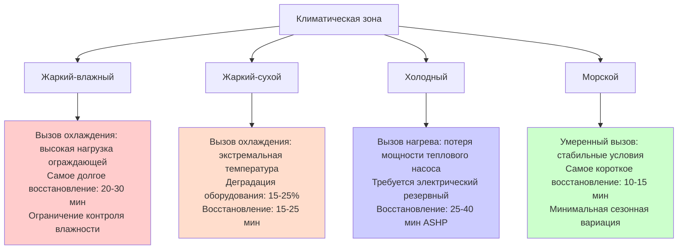
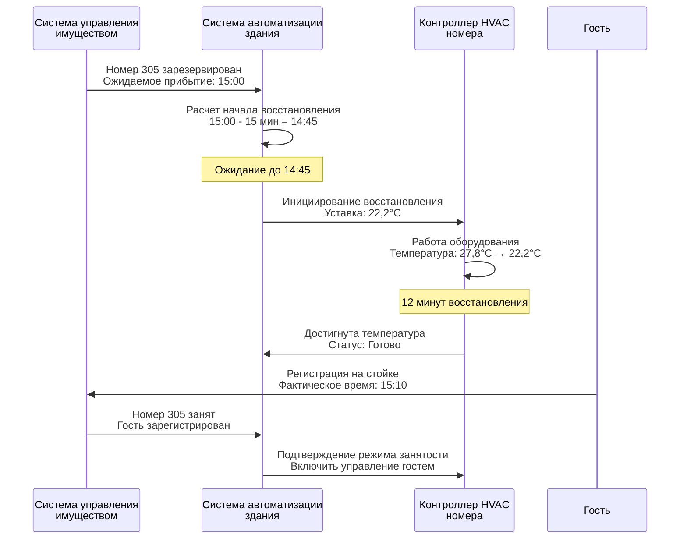
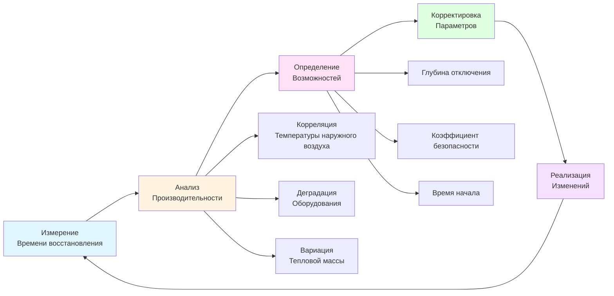

## Основы времени восстановления

Время восстановления представляет собой продолжительность, необходимую для восстановления температуры гостиничного номера из условий отключения до комфортной уставки до прибытия гостя. Этот критический параметр определяет, когда должно начаться предварительное кондиционирование, и непосредственно влияет как на потенциал экономии энергии, так и на удовлетворенность гостей. Недостаточное время восстановления приводит к тому, что гости сталкиваются с неудобными условиями; чрезмерное предварительное кондиционирование тратит энергию, поддерживая режим комфорта во время длительных периодов отсутствия.

Процесс восстановления включает нагрев или охлаждение не только воздуха в помещении, но и всей тепловой массы в пространстве—мебели, постельного белья, стен, полов и содержимого помещения. Эти элементы накапливают значительную тепловую энергию, создавая отставание между изменениями температуры воздуха и фактическими условиями комфорта. Температура воздуха в помещении может достичь уставки в течение минут, в то время как поверхности мебели остаются при температуре отключения, продолжая отбирать тепло у жильцов и создавая восприятие дискомфорта, несмотря на указание термостата о приемлемых условиях.

## Методы расчета времени восстановления

### Упрощенный аналитический подход

Рассчитайте минимальное время восстановления, используя анализ первого закона термодинамики с учетом воздушной массы, тепловой массы содержимого и теплопередачи ограждающей конструкции:

$$t_{recovery} = \frac{M_{air} C_{p,air} \Delta T + \sum M_{mass} C_{p,mass} \Delta T}{Q_{equip} - Q_{envelope}}$$

где:
- $M_{air}$ = масса воздуха в помещении (кг)
- $M_{mass}$ = масса мебели и строительных компонентов (кг)
- $C_{p}$ = удельная теплоемкость (кДж/кг·°C)
- $\Delta T$ = изменение температуры от отключения до комфорта (°C)
- $Q_{equip}$ = чистая мощность оборудования HVAC (кВт)
- $Q_{envelope}$ = теплопередача ограждающей конструкции во время восстановления (кВт)

Числитель представляет полную чувствительную энергию, необходимую для изменения температуры всей массы в пространстве. Знаменатель представляет чистую мощность нагрева или охлаждения, доступную после учета одновременных нагрузок ограждающей конструкции, которые противодействуют процессу восстановления.

### Пример детального расчета

**Характеристики помещения**:
- Размеры: 4,27 м × 6,10 м × 2,74 м высоты потолка = 71,3 м³
- Масса воздуха: $71,3 \times 1,20 = 85,6$ кг
- Эквивалентная тепловая масса мебели: 40% от массы воздуха = 34,2 кг эквивалента воздуха
- Полная эффективная масса: $85,6 + 34,2 = 119,8$ кг

**Восстановление при охлаждении** (от 27,8°C отключения до 22,2°C комфорта):
- Изменение температуры: $\Delta T = 27,8 - 22,2 = 5,6°C$
- Требуемое удаление энергии: $119,8 \times 1,00 \times 5,6 = 670,9$ кДж
- Мощность оборудования: 3,52 кВт (номинальная)
- Температура наружного воздуха: 35°C (условие проектирования)
- Солнечное поступление ограждающей конструкции: 1,23 кВт
- Кондукция ограждающей конструкции: 0,53 кВт
- Полная нагрузка ограждающей конструкции: 1,76 кВт
- Чистая мощность: $3,52 - 1,76 = 1,76$ кВт
- Время восстановления: $670,9 \div (1,76 \times 3600) = 0,106$ ч = 6,4 минуты

**Восстановление при нагреве** (от 13°C отключения до 21,1°C комфорта):
- Изменение температуры: $\Delta T = 21,1 - 13 = 8,1°C$
- Требуемое добавление энергии: $119,8 \times 1,00 \times 8,1 = 970,2$ кДж
- Мощность оборудования: 4,40 кВт (номинальная)
- Температура наружного воздуха: -12,2°C (условие проектирования)
- Потери ограждающей конструкции: 2,49 кВт
- Чистая мощность: $4,40 - 2,49 = 1,91$ кВт
- Время восстановления: $970,2 \div (1,91 \times 3600) = 0,141$ ч = 8,5 минут

### Применение коэффициентов безопасности

Применяйте коэффициенты безопасности к рассчитанному времени восстановления, учитывающие реальные вариации:

| Условие | Коэффициент безопасности | Применение |
|---------|--------------------------|-----------|
| Стандартные условия проектирования | 1,3-1,5× | Учет засорения фильтра, незначительная недозарядка хладагента |
| Экстремальная погода (>37,8°C или <-18°C) | 1,5-2,0× | Деградация мощности оборудования при экстремальных температурах |
| Старое оборудование (>10 лет) | 1,5-1,8× | Потеря мощности от износа компрессора, загрязнения теплообменника |
| Помещения с высокой тепловой массой | 1,4-1,7× | Люксовые номера с обширной мебелью, толстым ковром, тяжелыми шторами |
| Переменное время прибытия | 1,2-1,4× | Обеспечивает достаточный буфер для неопределенности времени прибытия |

Для предыдущих примеров с применением коэффициента 1,4×:
- Время проектирования восстановления при охлаждении: $6,4 \times 1,4 = 9$ минут
- Время проектирования восстановления при нагреве: $8,5 \times 1,4 = 12$ минут

Цель инициирования восстановления за 10-12 минут до ожидаемого прибытия гостя для этого типового помещения при условиях проектирования.

### Методы эмпирической проверки

Проверьте рассчитанное время восстановления путем полевого измерения во время пуско-наладки:

**Шаг 1 - контролируемое тестирование**: Выберите представительные помещения на различных ориентациях здания (север, юг, восток, запад) и проведите тесты при различных условиях температуры наружного воздуха. Установите временные регистраторы данных, записывающие температуру воздуха с интервалом 1 минута.

**Шаг 2 - инициирование восстановления**: Командуйте оборудованием из полного отключения (27,8°C охлаждение или 13°C нагрев) до комфортной уставки (22,2°C охлаждение или 21,1°C нагрев) при мониторинге температуры наружного воздуха и солнечных условий.

**Шаг 3 - измерение отклика**: Записывайте время, необходимое для того, чтобы температура в помещении достигла в пределах 1,1°C от уставки и стабилизировалась (производная <0,3°C за 10 минут).

**Шаг 4 - расчет коэффициента**: Определите отношение измеренного к рассчитанному времени восстановления:

$$k_{empirical} = \frac{t_{measured}}{t_{calculated}}$$

**Шаг 5 - применение коррекции**: Используйте коэффициент, специфичный для объекта, для всех последующих оценок времени восстановления, учитывая фактическую тепловую массу, характеристики ограждающей конструкции и производительность оборудования, специфичные для объекта.

## Факторы, влияющие на время восстановления

### Мощность оборудования и деградация

Номинальная мощность оборудования HVAC представляет производительность при стандартных условиях номинирования (типично 35°C наружного воздуха для охлаждения, 8,3°C для нагрева). Фактическая мощность значительно варьируется в зависимости от условий эксплуатации:

**Зависимость мощности охлаждения от температуры**:
$$Q_{cool,actual} = Q_{cool,rated} \times \left(1 - k_{temp}(T_{outdoor} - 35)\right)$$

где $k_{temp} \approx 0,027$ на °C для типичного оборудования прямого расширения. При температуре наружного воздуха 40,6°C:
$$Q_{cool,actual} = Q_{rated} \times (1 - 0,027 \times 5,6) = 0,85 \times Q_{rated}$$

Оборудование доставляет только 85% номинальной мощности при экстремальной температуре наружного воздуха, что удлиняет время восстановления примерно на 18% исключительно из-за деградации мощности перед рассмотрением повышенных нагрузок ограждающей конструкции.

**Мощность нагрева воздушного теплового насоса**:
$$Q_{heat,actual} = Q_{heat,rated} \times \left(1 + k_{temp}(T_{outdoor} - 8,3)\right)$$

где $k_{temp} \approx -0,045$ на °C. При температуре наружного воздуха -12,2°C:
$$Q_{heat,actual} = Q_{rated} \times (1 - 0,045 \times 20,5) = 0,075 \times Q_{rated}$$

Мощность теплового насоса резко падает до только 7,5% номинальной при суровых холодных условиях, делая системы на основе тепловых насосов непригодными для применений в холодном климате, требующих быстрого восстановления. Электрическое сопротивление или гидравлическое отопление поддерживает постоянную мощность независимо от температуры наружного воздуха.

### Характеристика тепловой массы

Тепловая масса помещения значительно влияет на время восстановления, но широко варьируется в зависимости от отделки и мебели:

| Компонент | Масса (кг/м² пола) | Тепловая емкость (кДж/м² пола·°C) | Воздействие |
|-----------|-------------------|-----------------------------------|-----------|
| Воздух (2,74 м потолок) | 1,02 | 0,24 | Базовый уровень |
| Легкая мебель | 0,45 | 0,18 | +75% тепловой массы |
| Стандартный гостиничный номер | 0,75 | 0,30 | +125% тепловой массы |
| Люксовый номер | 1,20 | 0,48 | +200% тепловой массы |
| Тяжелая мебель/камень | 1,80 | 0,72 | +300% тепловой массы |

Люксовые номера с обширной мебелью, каменными столешницами и толстым ковром/подложкой требуют в 2-3 раза больше времени восстановления, чем легкие экономичные номера идентичной мощности оборудования HVAC. Настраивайте время восстановления по типу номера вместо применения унифицированных значений по всему объекту.

### Величина нагрузки ограждающей конструкции

Теплопередача ограждающей конструкции во время восстановления противодействует работе оборудования, снижая чистую мощность, доступную для изменения температуры:

**Пиковые компоненты нагрузки охлаждения ограждающей конструкции**:
- **Солнечное поступление**: 63-158 Вт/м² площади окна (западная ориентация, без затемнения)
- **Кондукция**: 16-48 Вт/м² площади внешней стены (зависит от R-значения, ΔT)
- **Инфильтрация**: 0,3-0,6 ACH типично, 6-13 Вт/м² площади пола

Полная нагрузка ограждающей конструкции во время восстановления варьируется от 1,1-2,3 кВт для типового 27,9 м² гостиничного номера, потребляя 25-65% мощности оборудования перед любым изменением температуры.

**Стратегии снижения**:
- **Оконные покрытия**: Автоматизированные светонепроницаемые шторы, развернутые во время отключения, снижают солнечное поступление на 60-80%
- **Улучшения ограждающей конструкции**: Стены/окна с более высоким R-значением пропорционально снижают кондукцию
- **Герметизация инфильтрации**: Уплотнители и прокладки улучшают герметичность воздуха на 40-60%

### Эффекты климатических зон

Время восстановления варьируется сезонно и по климатической зоне:



Проектируйте мощность восстановления для наихудших сезонных условий вместо годового среднего. Объекты в жарком климате требуют адекватной мощности охлаждения во время пикового лета; объекты в холодном климате нуждаются в дополнительном нагреве для компенсации деградации мощности теплового насоса.

## Выбор оборудования для быстрого восстановления

### Рассмотрения увеличения мощности

Оборудование, рассчитанное строго по проектной нагрузке охлаждения/нагрева, может обеспечить недостаточную мощность восстановления. Рассмотрите преднамеренное увеличение размера специально для обеспечения быстрого восстановления температуры:

**Стандартное определение размера на основе нагрузки**:
$$Q_{equip} = Q_{load,design} \times 1,15$$

Этот коэффициент безопасности 15% обеспечивает маржу для неопределенности расчетов, но недостаточную мощность для быстрого восстановления из глубокого отключения.

**Определение размера на основе восстановления**:
$$Q_{equip} = \max\left(Q_{load,design} \times 1,15, \frac{Q_{recovery}}{t_{target}}\right)$$

где:
$$Q_{recovery} = \frac{M_{total} C_{p} \Delta T_{setback}}{t_{target}} + Q_{envelope,peak}$$

**Пример расчета**:
- Проектная нагрузка охлаждения: 2,93 кВт
- Тепловая емкость восстановления: 671 кДж (из предыдущего примера)
- Целевое время восстановления: 10 минут = 0,167 ч
- Требуемая мощность восстановления: $671 \div (0,167 \times 3600) = 1,12$ кВт
- Пиковая нагрузка ограждающей конструкции: 1,76 кВт
- Полная мощность восстановления: $1,12 + 1,76 = 2,88$ кВт
- Стандартное определение размера: $2,93 \times 1,15 = 3,37$ кВт ✓
- Проверка восстановления: $3,37 > 2,88$ ✓ (адекватная)

Стандартное определение размера на основе нагрузки обеспечивает адекватное восстановление для этого легкого помещения с отключением 5,6°C. Глубокое отключение (27,8°C до 22,2°C = 5,6°C) или помещения с высокой тепловой массой могут требовать преднамеренного увеличения размера:

- Восстановление глубокого отключения: 805 кДж тепловой емкости
- Требуемая мощность восстановления: $805 \div (0,167 \times 3600) + 1,76 = 3,10$ кВт
- Стандартное определение размера: 3,37 кВт ✓ (маргинально)
- Увеличение на 20%: $2,93 \times 1,20 = 3,52$ кВт ✓ (предпочтительно)

### Сравнение типов систем

Различные типы HVAC-систем обеспечивают различные характеристики производительности восстановления:

| Тип системы | Типичная мощность | Время отклика | Время восстановления | Пригодность |
|----------|------------------|---------------|-----------------|-----------|
| **PTAC** | 2,05-4,40 кВт | Немедленно | 12-18 мин | Хорошо - быстрый отклик, простое управление |
| **PTHP** | 2,05-4,40 кВт | Немедленно | 15-25 мин охл<br/>25-40 мин обогр | Удовлетворительно - медленный нагрев в холодных регионах |
| **2-трубный вентилятор-конвектор** | 118-236 л/мин | 2-5 мин | 10-15 мин | Отличная - постоянная мощность источника |
| **4-трубный вентилятор-конвектор** | 118-236 л/мин | 2-5 мин | 8-12 мин | Отличная - одновременный нагрев/охлаждение |
| **VRF внутренний блок** | 2,05-5,27 кВт | 3-8 мин | 10-18 мин | Отличная - модулирующая мощность |
| **Мини-сплит** | 2,64-7,03 кВт | 2-5 мин | 8-15 мин | Отличная - перегруженная для восстановления |

**Ключевые наблюдения**:

**PTAC/PTHP**: Автономные блоки обеспечивают немедленный отклик (без задержки распределения охлажденной/горячей воды), но ограниченная мощность. Нагрев через тепловой насос страдает серьезной деградацией мощности в холодной погоде, удлиняя время восстановления до неприемлемых уровней ниже -6,7°C наружного воздуха. Объекты в холодном климате должны указывать PTHP с дополнительным электрическим сопротивлением или использовать электрические PTAC с единственным источником нагрева.

**Вентиляторы-конвекторы**: Центральные водяные системы обеспечивают отличную производительность восстановления при сохранении температуры воды во время отключения. Двухтрубные системы, переключающиеся между нагревом и охлаждением сезонно, обеспечивают постоянную мощность. Четырехтрубные системы с одновременной способностью нагрева/охлаждения позволяют оптимизировать переходные сезоны и самое быстрое восстановление (может нагревать тепловую массу при охлаждении воздуха или наоборот).

**VRF-системы**: Переменный поток хладагента обеспечивает отличное восстановление через модулирующую мощность и способность временно работать при 120-130% номинальной мощности во время снижения. Продвинутые VRF-системы с режимом усиления хладагента могут доставлять до 150% мощности в течение коротких периодов (10-15 минут) специально для быстрого восстановления.

**Мини-сплиты**: Бесканальные мини-сплит системы часто установлены при более высокой мощности, чем строго требуется для нагрузки (снизить время работы и улучшить эффективность при частичной нагрузке). Это присущее увеличение размера обеспечивает исключительную производительность восстановления, типично самое быстрое среди всех типов систем.

### Системы ступенчатой мощности

Многоступенчатое или модулирующее оборудование обеспечивает оптимальный баланс между производительностью восстановления и операционной эффективностью:

**Двухступенчатые системы**:
- Ступень 1 (низкая): 60-70% мощности для нормальной работы
- Ступень 2 (высокая): 100% мощности для восстановления и пиковой нагрузки
- Логика управления: Активируйте высокую ступень во время восстановления, вернитесь к низкой ступени, когда в пределах 1,1°C от уставки

**Компрессоры с переменной скоростью**:
- Нормальная работа: 40-100% модуляция мощности, соответствующая нагрузке
- Режим восстановления: 100-120% мощность (номинал переизбытка тока позволяет временный прирост)
- Переход: Постепенное снижение по мере приближения комнаты к уставке предотвращает перерегулирование

Многоступенчатая работа снижает время восстановления на 30-40% по сравнению с одноступенчатым оборудованием идентичной максимальной мощности, поддерживая работу высокой ступени на всем протяжении периода восстановления вместо циклического включения/отключения.

## Интеграция уведомления перед приездом

### Коммуникация системы управления имуществом

Интеграция с системой управления имуществом (PMS) обеспечивает детерминированное прогнозирование прибытия гостя на основе данных резервирования и операций регистрации:

**Стандартные поля данных PMS**:
- Номер бронирования и имя гостя
- Ожидаемые дата и время регистрации
- Назначение номера комнаты
- Статус регистрации (зарезервировано, раннее прибытие, зарегистрировано)
- Дата выезда и статус
- Специальные запросы и индикаторы VIP

**Протокол коммуникации BAS-PMS**:



**Синхронизация коммуникации**: PMS передает обновления в BAS при настраиваемых интервалах:
- **Опрос в 1 минуту**: Реальный отклик, высокий сетевой трафик
- **Опрос в 5 минут**: Стандартная конфигурация, приемлемая задержка
- **Событийный**: PMS немедленно отправляет обновления при операции, оптимальная отзывчивость

### Мобильное приложение предварительного кондиционирования

Современные мобильные приложения гостиниц позволяют гостям инициировать кондиционирование номера перед прибытием:

**Рабочий процесс предварительного кондиционирования, инициированный гостем**:

1. **Обнаружение геозоны**: Мобильное приложение обнаруживает входящего гостя в радиусе геозоны (8-16 км от объекта)
2. **Запрос уведомления**: Приложение уведомляет гостя "Вы приближаетесь к [Название отеля]. Хотели бы вы подготовить номер?"
3. **Подтверждение гостем**: Гость нажимает кнопку подтверждения
4. **Коммуникация приложение-облако**: Мобильное приложение передает запрос предварительного кондиционирования в облачный сервис
5. **Интеграция облако-BAS**: Облачная платформа взаимодействует с BAS отеля через API
6. **Инициирование восстановления**: BAS командует HVAC номера в режим комфорта
7. **Уведомление статуса**: Гость получает подтверждение "Номер 305 подготавливается"
8. **Уведомление завершения**: Приложение уведомляет гостя при достижении номером температуры комфорта

**Преимущества**:
- **Оптимизация энергии**: Кондиционирует только при подтвержденном приближении гостя вместо статистического прогноза
- **Опыт гостя**: Расширяет контроль гостя и передает внимательность
- **Точность прибытия**: Геозоны обеспечивают предупреждение о прибытии 15-30 минут, точны для синхронизации восстановления

**Сложность реализации**: Требует разработки мобильного приложения, интеграции облачной платформы, разработки API для подключения BAS и продолжающихся подписок облачных сервисов. Типичная стоимость $36,000-109,000 начальная разработка плюс $7,300-21,900 годовые коммунальные услуги облака/техническое обслуживание для среднегабаритных отелей.

### Логика системы автоматизации здания

Реализуйте предварительное кондиционирование через последовательности управления BAS, интегрирующие несколько источников данных:

**Логика дерева решений**:

```
IF room_status = "Reserved" THEN
    arrival_time = PMS_expected_checkin

    IF mobile_app_precondition_request THEN
        recovery_start = NOW
        priority = HIGH
    ELSE IF current_time >= (arrival_time - recovery_time - safety_margin) THEN
        recovery_start = current_time
        priority = NORMAL
    ELSE
        recovery_start = (arrival_time - recovery_time - safety_margin)
        priority = NORMAL
    END IF

    # Динамическое время восстановления на основе условий
    recovery_time = base_recovery_time × outdoor_temp_factor × time_of_day_factor

    # Инициирование восстановления
    HVAC_mode = COMFORT
    cooling_setpoint = 22,2°C
    heating_setpoint = 21,1°C
    fan_mode = AUTO

ELSE IF room_status = "Vacant" THEN
    HVAC_mode = SETBACK
    cooling_setpoint = 27,8°C
    heating_setpoint = 13°C

END IF
```

**Адаптивная синхронизация восстановления**: Система обучается фактической продолжительности восстановления по диапазону температуры наружного воздуха и типу помещения, корректируя будущее время начала восстановления для оптимизации производительности:

$$t_{recovery,adjusted} = t_{recovery,base} \times f_{outdoor}(T_{outdoor}) \times f_{learned}$$

где $f_{learned}$ представляет коэффициент коррекции из исторических данных производительности.

## Методы прогнозирования прибытия гостя

### Статистический анализ моделей регистрации

Проанализируйте исторические данные регистрации для разработки вероятностных моделей прибытия:

**Требования сбора данных**:
- Минимум 12 месяцев данных операции регистрации PMS
- Поля: Зарезервированное время регистрации, фактическое время регистрации, день недели, сезон, обозначение группы/частного
- Размер выборки: >5,000 регистраций для статистически значимого анализа

**Разработка распределения прибытия**:

Для объектов с 15:00 стандартной регистрацией типичное распределение:

| Временное окно | Процент | Совокупное | Стратегия |
|----------|---------|-----------|-----------|
| До 13:00 | 5% | 5% | Раннее прибытие - ручное переопределение |
| 13:00-14:00 | 8% | 13% | Начните восстановление для раннего кластера |
| 14:00-15:00 | 22% | 35% | Пиковые ранние прибытия |
| 15:00-16:00 | 30% | 65% | Пик плановой регистрации |
| 16:00-17:00 | 18% | 83% | Позднее прибытие |
| 17:00-18:00 | 10% | 93% | После работы прибытие |
| После 18:00 | 7% | 100% | Вечернее/ночное прибытие |

**Выбор целевой оптимизации**:

**Консервативный подход** (80-й процентиль): Инициируйте восстановление, нацеливаясь на то, чтобы 80% гостей встречали готовые номера. Для распределения выше 80-й процентиль = 16:30. Начните восстановление в 16:15 (предполагая 15-минутное время восстановления).
- 80% гостей встречают немедленный комфорт
- 20% толерантны к краткому периоду восстановления
- Умеренная потеря энергии от раннего кондиционирования

**Сбалансированный подход** (50-й процентиль): Цель медианного прибытия (50% до, 50% после). Медианное прибытие = 15:30. Начните восстановление в 15:15.
- 50% немедленный комфорт, 50% краткое ожидание
- Минимизирует полное потребление энергии
- Приемлемо для стандартных свойств обслуживания

**Агрессивный подход** (30-й процентиль): Минимальное предварительное кондиционирование, нацеливаясь только на ранние прибытия. Начните восстановление в 14:30 для 15:00 цели.
- Только 30% немедленный комфорт
- Максимальная экономия энергии
- Риск неудовлетворенности гостей

### Вариации по дню недели и сезону

Модели прибытия варьируются систематически по дню недели и сезону:

**Модель деловой гостиницы в рабочий день**:
- Понедельник-четверг: Пиковое поздн. полудень (17:00-19:00) при прибытии деловых путешественников после работы
- Пятница: Ранний сдвиг полудня (14:00-16:00) при прибытии выходных досуговых гостей
- Суббота: Переменное прибытие в течение дня
- Воскресенье: Вечернее прибытие (16:00-21:00) для ранних встреч понедельника

**Курортный модель выходных**:
- Пятница: Позднее полудень/вечернее прибытие (16:00-21:00)
- Суббота: Минимальная регистрация (в основном переводы с пятницы)
- Воскресенье: Полудневное выселение, вечернее прибытие (18:00-21:00)

**Сезонные эффекты**:
- **Летний отпуск**: Семейные прибытия сосредоточены в полдень (14:00-16:00)
- **Зимние праздники**: Позднее прибытие после задержек в пути (17:00-21:00)
- **Сезон конференции**: Жесткая группировка вокруг времени начала события

Реализуйте коэффициенты корректировки по дню недели и сезону в алгоритмы синхронизации восстановления:

$$t_{recovery\_start} = t_{checkin,expected} - t_{recovery} - \Delta t_{dayofweek} - \Delta t_{seasonal}$$

### Координация бронирования групп

Групповые прибытия (конференции, туры, свадьбы) требуют координированного восстановления для нескольких номеров:

**Стратегии обработки групп**:

**Последовательное восстановление**: Разнесите время начала восстановления на 2-3 минуты на номер, чтобы предотвратить всплеск электрического спроса и одновременную загрузку системы HVAC.

Пример: 50-комнатная группа, прибывающая 17:00, требуется 12-минутное восстановление:
- Номера 1-10: Начало восстановления 16:45
- Номера 11-20: Начало восстановления 16:47
- Номера 21-30: Начало восстановления 16:49
- Номера 31-40: Начало восстановления 16:51
- Номера 41-50: Начало восстановления 16:53

Все номера достигают комфорта к 17:00 при распределении электрической нагрузки в течение 20-минутного периода вместо мгновенного пика.

**Восстановление на основе приоритета**: Кондиционируйте VIP номера, люксы и предпочтительных членов в первую очередь, затем стандартные номера:
- VIP/Люкс: Начало восстановления 16:30 (раннее)
- Предпочтительный член: Начало восстановления 16:40
- Стандартный гость: Начало восстановления 16:45

**Последовательность по зонам**: Координируйте восстановление по зонам здания для балансировки нагрузки центральной установки HVAC:
- Северный корпус: 16:30-16:40
- Южный корпус: 16:40-16:50
- Восточный корпус: 16:50-17:00

Предотвращает перегрузку распределения охлажденной или горячей воды при одновременном восстановлении большого количества номеров.

## Оптимальный компромисс глубины отключения и времени восстановления

### Оптимизация энергия-комфорт

Глубина отключения напрямую определяет величину экономии энергии и требуемую продолжительность восстановления—глубокое отключение увеличивает экономию, но удлиняет восстановление и рискует дискомфортом гостя:

**Анализ отключения охлаждения**:

| Глубина отключения | Температура отключения | Экономия | Время восстановления | Уровень риска |
|-----------------|------------|---------|-----------------|-----------|
| Консервативное | 22,8°C (3,3°C) | 20-25% | 8-10 мин | Минимальный |
| Стандартное | 26,7°C (4,4°C) | 30-35% | 10-14 мин | Низкий |
| Умеренное | 27,8°C (5,6°C) | 35-40% | 12-18 мин | Умеренный |
| Агрессивное | 28,9°C (6,7°C) | 40-50% | 18-25 мин | Высокий |
| Экстремальное | 30°C (7,8°C) | 45-55% | 25-35 мин | Очень высокий |

**Анализ отключения нагрева**:

| Глубина отключения | Температура отключения | Экономия | Время восстановления | Уровень риска |
|-----------------|------------|---------|-----------------|-----------|
| Консервативное | 16,7°C (4,4°C) | 20-28% | 10-12 мин | Минимальный |
| Стандартное | 15,6°C (5,6°C) | 28-35% | 12-16 мин | Низкий |
| Умеренное | 14,4°C (6,7°C) | 35-42% | 16-22 мин | Умеренный |
| Агрессивное | 13°C (8,1°C) | 42-55% | 22-30 мин | Высокий |
| Экстремальное | 11,1°C (10°C) | 50-60% | 30-45 мин | Очень высокий |

### Рамка принятия решений

Выберите оптимальную глубину отключения, используя многокритериальную оценку:

**Взвешивание критериев**:
1. **Стоимость энергии**: Количество годовой экономии за номер: $\Delta E \times rate \times hours_{vacant}$
2. **Удовлетворенность гостя**: Присвойте стоимость жалобам о температуре и отрицательным отзывам
3. **Напряжение оборудования**: Оцените увеличение стоимости обслуживания от продленной работы на полной мощности
4. **Контроль влажности**: Оцените риск плесени при повышенных температурах отключения в влажном климате
5. **Неопределенность прибытия**: Фактор вариабельности в фактическом и прогнозируемом времени регистрации

**Уравнение оптимизации**:

$$Objective = \max\left(Savings_{energy} - Cost_{comfort\_risk} - Cost_{equipment} - Cost_{humidity}\right)$$

С учетом ограничений:
- $t_{recovery} \leq t_{max,acceptable}$ (типично 20-25 минут)
- $RH_{setback} \leq 60\%$ (профилактика плесени)
- $T_{setback,heat} \geq T_{freeze\_protection}$ (защита труб)

**Пример применения**:

Параметры объекта:
- Тариф энергии: 0,14 $/кВт·ч
- Среднее отсутствие: 55% часов
- Оборудование: PTAC 3,52 кВт охлаждение
- Климат: Жаркий-влажный (юго-восток США)
- Толерантность времени восстановления: Максимум 15 минут

Оцените отключение 26,7°C в сравнении с 27,8°C охлаждение:

**Отключение 26,7°C**:
- Экономия энергии: 32% = 700 кВт·ч/год = $98/номер·год
- Время восстановления: 12 минут (приемлемо)
- Влажность: Пиковая 58% ОВ (приемлемо)
- Жалобы гостей: <0,5% прибытия

**Отключение 27,8°C**:
- Экономия энергии: 38% = 830 кВт·ч/год = $116/номер·год
- Время восстановления: 18 минут (маргинально)
- Влажность: Пиковая 62% ОВ (риск плесени)
- Жалобы гостей: 1,2% прибытия (увеличенные обращения в сервис)

**Заключение**: Выберите отключение 26,7°C для этого объекта—дополнительная экономия энергии $18/год от отключения 27,8°C компенсируется риском влажности и увеличением жалоб гостей. Жаркий-влажный климат делает контроль влажности ограничивающим фактором.

Альтернативный объект в жарком-сухом климате (пустыня юго-запада):
- Влажность отключения 27,8°C: 45% ОВ (приемлемо)
- Риск плесени: Нет
- **Заключение**: Выберите отключение 27,8°C для максимизации экономии энергии без ограничения влажности

### Динамическая корректировка отключения

Реализуйте переменную глубину отключения на основе условий в реальном времени:

**Отключение, отзывчивое к погоде**:
```
IF outdoor_temp < 29,4°C THEN
    cooling_setback = 27,8°C  # Глубокое отключение при мягкой погоде
ELSE IF outdoor_temp >= 29,4°C AND outdoor_temp < 35°C THEN
    cooling_setback = 26,7°C  # Умеренное отключение
ELSE IF outdoor_temp >= 35°C THEN
    cooling_setback = 22,8°C  # Консервативное отключение в экстремальной жаре
END IF
```

Обоснование: Мощность оборудования и вызовы ограждающей конструкции затрудняют восстановление во время экстремальной погоды. Сократите глубину отключения при наиболее суровых условиях наружного воздуха для поддержания приемлемого времени восстановления, несмотря на деградацию оборудования.

**Отключение, отзывчивое к занятости**:
```
IF property_occupancy < 40% THEN
    setback_depth = AGGRESSIVE  # Глубокое отключение при низкой занятости
ELSE IF property_occupancy >= 40% AND property_occupancy < 75% THEN
    setback_depth = STANDARD
ELSE IF property_occupancy >= 75% THEN
    setback_depth = CONSERVATIVE  # Неглубокое отключение при высокой занятости
END IF
```

Обоснование: Периоды высокой занятости увеличивают вероятность ранних прибытий, поздних выселений и неопределенности времени прибытия. Консервативное отключение обеспечивает буфер, гарантирующий готовность номера. Периоды низкой занятости позволяют агрессивную экономию с минимальным риском для гостей.

## Мониторинг и оптимизация времени восстановления

### Метрики производительности

Отслеживайте эффективность системы восстановления путем количественного измерения:

**Основные метрики**:
- **Среднее время восстановления**: Средняя продолжительность от отключения до комфорта во всех событиях восстановления
- **Коэффициент успеха восстановления**: Процент прибытий гостей, встречающих комфортные условия (в пределах ±1,1°C от уставки)
- **Реализация экономии энергии**: Фактическое кВт·ч сокращение в сравнении с теоретическим максимумом
- **Коэффициент жалоб гостей**: Обращения в сервис, связанные с температурой, на 1,000 ночей в номерах

**Диагностические метрики**:
- **Время восстановления по температуре наружного воздуха**: Анализ по интервалам, выявляющий ограничения мощности оборудования
- **Время восстановления по типу номера**: Сравнение стандартных номеров в сравнении с люксами в сравнении со специальными номерами
- **Время восстановления по возрасту системы**: Отслеживание деградации, указывающей на потребность в обслуживании
- **Точность времени предварительного кондиционирования**: Разница между прогнозируемым и требуемым временем восстановления

### Процесс непрерывного совершенствования

Реализуйте замкнутую оптимизацию:



**Цикл квартального обзора**:

1. **Компиляция данных** (Неделя 1): Извлечение данных тренда BAS для событий восстановления, данных регистрации PMS, журналов жалоб гостей
2. **Статистический анализ** (Неделя 2): Расчет метрик, регрессионный анализ, корреляция времени восстановления с температурой наружного воздуха, модели занятости
3. **Возможности оптимизации** (Неделя 3): Определение номеров с чрезмерным временем восстановления, оценка потенциала корректировки глубины отключения
4. **Реализация** (Неделя 4): Обновление параметров управления BAS, пуско-наладка изменений, документирование базовой линии для следующего обзора

**Улучшение машинного обучения**: Продвинутые платформы BAS включают алгоритмы машинного обучения, которые автоматически оптимизируют параметры восстановления:

- **Входные переменные**: Температура наружного воздуха, влажность наружного воздуха, тип номера, время со времени последнего занятия, день недели, сезон
- **Прогноз выхода**: Требуемое время восстановления для конкретных условий
- **Обучающие данные**: Исторические события восстановления с фактическим измеренным сроком
- **Непрерывное обучение**: Модель обновляется ежедневно при поступлении новых данных, улучшая точность со временем

Системы достигают 90-95% точности при прогнозировании времени восстановления в пределах ±2 минут после 6-12 месяцев периода обучения, в сравнении с 70-80% точностью для статических подходов на основе расчетов.

Оптимальное проектирование времени восстановления уравновешивает потенциал экономии энергии от глубокого отключения против требований удовлетворенности гостей для немедленного комфорта при прибытии. Надлежащего размера оборудование, точное прогнозирование прибытия и адаптивные алгоритмы управления позволяют гостиницам достигать экономии 35-45% энергии HVAC при сохранении готовности номеров и стандартов комфорта, ожидаемых современными путешественниками.
