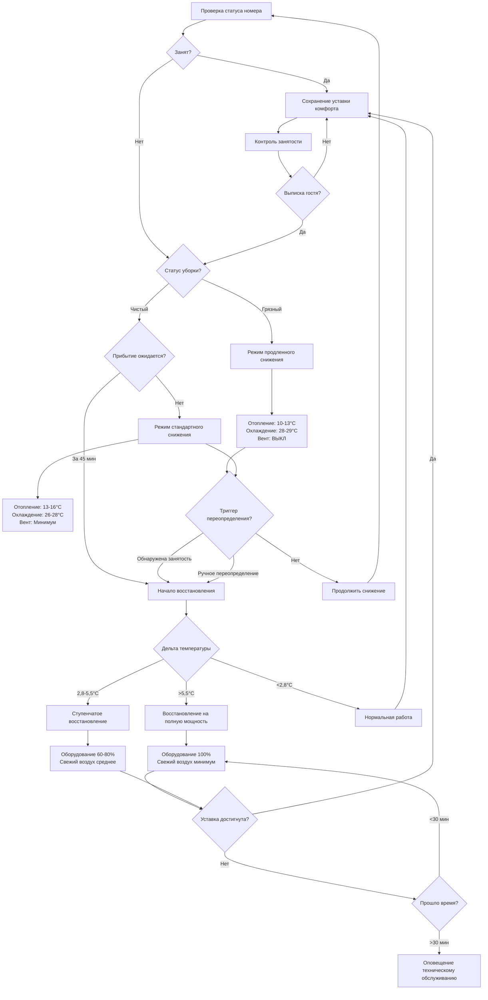

## Основы стратегии снижения температуры

Стратегии снижения температуры в гостничных номерах уравновешивают энергосбережение в период отсутствия гостей с быстрым восстановлением комфортных условий при их возвращении. Правильно реализованное снижение температуры сокращает потребление энергии HVAC на 20-35% при сохранении готовности к немедленному размещению.

Основной принцип заключается в ослаблении ограничений контроля температуры, когда номера не заняты, а затем в активном восстановлении комфортных условий перед приездом гостя или сразу после его прибытия. Это требует координации между датчиками занятости, алгоритмами управления и производительностью оборудования.

## Глубина и пределы снижения температуры отопления

Снижение температуры отопления снижает температуру помещения в период отсутствия гостей, предотвращая условия, которые могут повредить ограждающую конструкцию здания, меблировку или замедлить восстановление.

**Выбор температуры снижения:**

Температура снижения для отопления $T_{sb,heat}$ должна удовлетворять:

$$T_{sb,heat} = T_{occ,heat} - \Delta T_{sb}$$

где $T_{occ,heat}$ — уставка отопления при занятости помещения (обычно 20-22°C) и $\Delta T_{sb}$ — глубина снижения (обычно 4-8°C).

**Ограничения по климату для отопления:**

- **Холодный климат (HDD65 > 2780 градус-дней):** Снижение до 13-16°C для предотвращения конденсации на окнах и сохранения возможности восстановления
- **Умеренный климат (HDD65 1110-2780 градус-дней):** Снижение до 10-14°C с увеличенным временем восстановления
- **Теплый климат (HDD65 < 1110 градус-дней):** Снижение до 7-13°C или отключение отопления в переходные сезоны

**Абсолютные минимальные ограничения:**

- Не ниже 7°C, чтобы предотвратить замерзание труб в периметральных стенах
- Сохранение 5,5°C выше точки росы для предотвращения конденсации на ограждающей конструкции
- Ограничение снижения для сохранения времени восстановления менее 30-45 минут

## Стратегии повышения температуры охлаждения

Повышение температуры охлаждения позволяет температуре помещения повыситься в период отсутствия гостей, сокращая время работы компрессора и потребление энергии.

**Выбор температуры повышения:**

Температура повышения для охлаждения $T_{sf,cool}$ следует:

$$T_{sf,cool} = T_{occ,cool} + \Delta T_{sf}$$

где $T_{occ,cool}$ — уставка охлаждения при занятости (обычно 22-24°C) и $\Delta T_{sf}$ — глубина повышения (обычно 3-7°C).

**Ограничения по климату для охлаждения:**

- **Жаркий влажный климат:** Ограниченное повышение (3-4°C) для контроля латентных нагрузок и риска плесени
- **Жаркий сухой климат:** Значительное повышение (6-8°C) с менее критичной влажностью
- **Умеренный климат:** Сезонная корректировка с более глубоким повышением в мягких условиях

**Повышение температуры с ограничением по влажности:**

Максимальная температура повышения должна удовлетворять:

$$T_{sf,max} = T_{dewpoint} + 11°C$$

Этот запас 11°C предотвращает конденсацию на охлажденных поверхностях во время восстановления и ограничивает рост плесени на мебели и текстиле.

## Сокращение вентиляции во время снижения температуры

Пустые номера требуют минимальной вентиляции для сохранения качества воздуха и давления в здании при сокращении энергии вентилятора и тепловых нагрузок.

**Уровни снижения вентиляции:**

| Режим работы | Свежий воздух | Рециркуляция | Применение |
|---|---|---|---|
| Занят | 12-14 м³/ч (7-8 CFM) | Полная | Гость присутствует |
| Не занят - готов | 2,4-4,7 м³/ч (1,4-2,8 CFM) | Минимальная | Чистая уборка |
| Не занят - продленный | 0 м³/ч | Выключена | Многодневная вакансия |
| Предварительное занятие | 24-47 м³/ч (14-28 CFM) | Полная | За 15 мин до прибытия |

**Влияние на энергию:**

Сокращение вентиляции экономит как энергию вентилятора, так и энергию кондиционирования. Для типичного гостничного номера:

$$E_{save,vent} = \dot{V}_{OA} \cdot \rho \cdot c_p \cdot (T_{OA} - T_{room}) \cdot t_{unocc}$$

где $\dot{V}_{OA}$ — сокращение расхода свежего воздуха (м³/ч), $\rho$ — плотность воздуха (1,2 кг/м³), $c_p$ — удельная теплоемкость (1,005 кДж/кг·°C), и $t_{unocc}$ — время отсутствия гостей (часы).

## Управление влажностью в период отсутствия гостей

Управление влажностью во время снижения температуры предотвращает рост плесени, деградацию материалов и дискомфорт гостей при минимизации потребления энергии.

**Пределы снижения влажности:**

- **Сезон отопления:** Допустить ОВ до 60% во время снижения (предотвращает чрезмерное потребление энергии увлажнением)
- **Сезон охлаждения:** Сохранять ОВ ниже 60% даже во время повышения (предотвращает плесень за 48-72 часа)
- **Влажный климат:** Активная осушка может продолжаться во время повышения охлаждения для сохранения ОВ < 55%

**Стратегия контроля точки росы:**

Вместо контроля относительной влажности продвинутые системы ограничивают температуру точки росы:

$$T_{dewpoint,max} = 16°C \text{ (для предотвращения плесени)}$$

Это позволяет температуре плавать во время снижения при предотвращении накопления влаги на поверхностях.

**Периодические циклы кондиционирования:**

При продленной вакансии (>3 дней) запускать циклы кондиционирования:

- Охлаждение до 22°C в течение 2 часов каждые 24 часа для удаления влаги
- Предотвращает затхлый запах и сохраняет состояние материалов
- Затраты на энергию оправдываются улучшением удовлетворенности гостей

## Сезонные корректировки снижения температуры

Стратегии снижения температуры должны адаптироваться к сезонным внешним условиям и характерам занятости.

**Стратегия зимнего сезона:**

- Более глубокое снижение температуры отопления (4-8°C) благодаря большей разнице внутренней и внешней температуры
- Более длительное приемлемое время восстановления (холодный воздух изначально ощущается менее неприятным)
- Сокращение вентиляции для минимизации инфильтрации холодного воздуха
- Активация снижения сразу после выписки гостя

**Стратегия летнего сезона:**

- Умеренное повышение охлаждения (3-6°C), ограниченное опасностями влажности
- Сокращение требуемого времени восстановления (теплые, влажные номера создают немедленный дискомфорт)
- Продолжение осушки даже во время повышения в влажном климате
- Предварительное охлаждение перед прогнозируемым прибытием

**Стратегия переходного сезона:**

- Минимальное снижение/повышение (2-3°C) с использованием возможностей свободного охлаждения/отопления
- Максимальное использование экономайзера свежего воздуха во время восстановления
- Может полностью отключить механическое охлаждение/отопление в мягких условиях
- Расширенные приемлемые времена восстановления

## Переопределение и триггеры восстановления комфорта

Эффективные системы снижения температуры включают несколько механизмов переопределения и стратегий восстановления для обеспечения комфорта гостей.

**Триггеры инициирования восстановления:**

1. **Запланированное прибытие:** Начало восстановления за 30-45 минут до времени заезда по бронированию
2. **Доступ с карточкой:** Немедленное восстановление при входе гостя в номер (может начаться со снижением)
3. **Датчик занятости:** Восстановление в течение 5 минут после обнаружения занятости
4. **Ручное переопределение гостем:** Немедленный отклик на регулировку термостата
5. **Периодический предпросмотр:** Кратковременный цикл восстановления перед прогнозируемым окном прибытия

**Логика управления восстановлением:**

Система определяет время начала восстановления $t_{start}$ на основе:

$$t_{start} = t_{arrival} - t_{recovery}$$

где время восстановления $t_{recovery}$ оценивается из:

$$t_{recovery} = \frac{(T_{target} - T_{current}) \cdot m \cdot c_p}{Q_{capacity} \cdot 60}$$

с $m$ — массой воздуха в помещении (кг), $c_p$ — удельной теплоемкостью (кДж/кг·°C), и $Q_{capacity}$ — производительностью оборудования (кДж/ч).

**Требования к производительности восстановления:**

- Достижение уставки в течение 30 минут для стандартных номеров (28-37 м²)
- Достижение 90% температурной коррекции в течение 15 минут
- Приоритет явного охлаждения для обеспечения немедленного ощущения комфорта
- Модуляция оборудования на полную мощность во время восстановления

## Рекомендуемые температуры снижения по климату

| Климатическая зона | Снижение отопления | Повышение охлаждения | Макс. ОВ при снижении | Время восстановления |
|---|---|---|---|---|
| **Очень холодный (1-3)** | 13-14°C | 26-27°C | 60% | 30-45 мин |
| **Холодный (4-5)** | 14-17°C | 26-28°C | 60% | 25-35 мин |
| **Смешанный (6)** | 16-18°C | 27-28°C | 55% | 20-30 мин |
| **Жаркий сухой (7)** | 18-20°C | 28-29°C | 60% | 20-30 мин |
| **Жаркий влажный (8-9)** | 18-21°C | 26-27°C | 50% | 25-35 мин |

**Потенциал экономии энергии:**

Годовая экономия энергии от внедрения снижения температуры:

$$E_{save,annual} = \sum_{season} \frac{24 \cdot \Delta T_{sb} \cdot UA \cdot HDD_{season}}{1000} + \frac{24 \cdot \Delta T_{sf} \cdot UA \cdot CDD_{season}}{1000 \cdot SEER}$$

где $UA$ — теплопроводность ограждающей конструкции помещения (кДж/ч·°C), HDD и CDD — градус-дни, и SEER — сезонная эффективность. Типичная экономия составляет 2900-5200 кВт⋅ч на номер в год для полного спектра отелей со средней занятостью 60-70%.

## Рассмотрение при внедрении

**Требования к системе управления:**

- Интеграция с системой управления отелем (PMS) для данных о прибытии/убытии
- Надежное обнаружение занятости (ИК-датчик, дверные контакты или карточные замки)
- Возможность переопределения, доступная для гостей и персонала
- Логирование тенденций для проверки экономии и оптимизации графиков снижения

**Ввод в эксплуатацию и наладка:**

- Измерение фактического времени восстановления в различных условиях и корректировка времени начала
- Проверка управления влажностью для сохранения пределов при продленном снижении
- Тестирование отклика переопределения и интерфейса гостя
- Мониторинг экономии энергии в сравнении с базовой линией для подтверждения производительности

Правильно реализованные стратегии снижения температуры обеспечивают значительную экономию энергии при сохранении немедленного ожидания комфорта гостями отеля, что делает их одними из наиболее рентабельных мер по энергосбережению в учреждениях гостеприимства.
