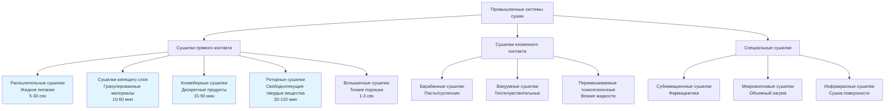

# Промышленные системы сушки

Промышленные системы сушки удаляют влагу из материалов, используя контролируемые тепловые и воздушные процессы. Эти специализированные приложения HVAC требуют точной интеграции принципов передачи тепла, массопередачи и психрометрии для достижения целевого содержания влаги при сохранении качества продукта и энергоэффективности.

## Классификация сушилок и типы систем

## Фундаментальные принципы сушки

### Механизмы передачи тепла и массы

Сушка происходит посредством одновременных процессов передачи тепла и массы, управляемых термодинамическими и транспортными явлениями.

**Конвективная передача тепла:**

Тепловой поток от горячего воздуха к поверхности материала следует:

$$q = hA(T_{air} - T_{surface})$$

Где:
- $q$ = скорость передачи тепла (Вт)
- $h$ = коэффициент конвективной теплопередачи (10-500 Вт/м²·K)
- $A$ = площадь поверхности (м²)
- $T_{air}$, $T_{surface}$ = температура воздуха и поверхности (°C или K)

**Массопередача:**

Скорость удаления влаги определяется:

$$\dot{m}_{evap} = h_m A(C_{surface} - C_{air})$$

Где:
- $\dot{m}_{evap}$ = скорость испарения (кг/с)
- $h_m$ = коэффициент массопередачи (м/с)
- $C_{surface}$, $C_{air}$ = концентрация влаги на поверхности и в воздухе (кг/м³)

**Требуемое тепло испарения:**

Общее тепло для испарения влаги:

$$Q_{evap} = \dot{m}_{evap} \cdot h_{fg}$$

Где $h_{fg}$ = скрытая теплота парообразования ≈ 2260 кДж/кг при атмосферном давлении

### Периоды скорости сушки

**Период постоянной скорости:**

На этапе инициализации скорость сушки остается постоянной:

$$N = \frac{h_c(H_s - H_{air})}{\lambda}$$

Где:
- $N$ = скорость сушки (кг/м²·с)
- $h_c$ = коэффициент конвективной массопередачи (кг/м²·с)
- $H_s$ = влажность при насыщенной поверхности (кг/кг)
- $H_{air}$ = влажность сушильного воздуха (кг/кг)
- $\lambda$ = скрытая теплота парообразования (кДж/кг)

Поверхность остается насыщенной свободной влагой, а температура равна температуре мокрого термометра сушильного воздуха.

**Период падающей скорости:**

После достижения критического содержания влаги $X_c$:

$$\frac{dX}{dt} = -k(X - X_e)$$

Где:
- $X$ = содержание влаги (кг воды/кг сухого твердого вещества)
- $X_e$ = равновесное содержание влаги
- $k$ = постоянная сушки (1/с)
- $t$ = время (с)

Внутренняя диффузия влаги становится скоростьограничивающим фактором; температура материала повышается в сторону температуры воздуха.

### Психрометрические соотношения

**Изменение абсолютной влажности:**

Содержание влаги в воздухе увеличивается по мере прохождения через сушилку:

$$\Delta W = \frac{\dot{m}_{water}}{\dot{m}_{dry\ air}}$$

Где $W$ = коэффициент влажности (кг воды/кг сухого воздуха)

**Изменение энтальпии воздуха:**

$$\Delta h = c_p \Delta T + W \cdot h_{fg}$$

Это представляет комбинированные компоненты явного и скрытого тепла, поглощаемые потоком воздуха.

## Промышленные типы сушилок

### Распылительные сушилки

**Принцип работы:**
Жидкое питание распыляется на мелкие капли, контактирующие с потоком горячего газа, что приводит к быстрому испарению и образованию частиц высушенного порошка.

**Ключевые параметры проектирования:**
- Температура входящего воздуха: 150-300°C
- Температура выходящего воздуха: 80-120°C (контролирует финальную влажность)
- Методы распыления: форсунки давления (10-30 МПа), роторные распылители (10 000-30 000 об/мин)
- Диаметр капли: 10-200 мкм
- Время пребывания: 5-30 секунд

**Применения:**
- Молочный порошок, кофе, моющие средства
- Фармацевтика, керамика
- Химические продукты, требующие мелкого размера частиц

**Преимущества:**
- Непрерывная работа с высокой производительностью
- Короткое время пребывания сохраняет теплочувствительные материалы
- Прямой контроль размера и морфологии частиц

**Ограничения:**
- Высокие капитальные и энергетические затраты
- Требования к большой площади
- Потеря частиц из-за образования мелких частиц

### Сушилки кипящего слоя

**Принцип работы:**
Частицы суспендированы и флюидизированы восходящим потоком горячего воздуха, максимизируя контакт площади поверхности и эффективность теплопередачи.

**Критерии проектирования:**
- Минимальная скорость флюидизации: U_mf = (d_p²(ρ_p - ρ_g)g) / (150μ)
- Рабочая скорость: 1,5-3 × U_mf для стабильной флюидизации
- Глубина слоя: 0,3-1,0 м типовая
- Температура воздуха: 50-150°C (зависит от материала)

**Применения:**
- Гранулированные материалы (фармацевтика, пищевые ингредиенты)
- Полимерные гранулы
- Кристаллические химические вещества

**Преимущества:**
- Отличная передача тепла и массы (h = 100-500 Вт/м²·K)
- Однородная температура частиц
- Компактный дизайн с высокой емкостью

**Ограничения:**
- Ограничения размера частиц (50 мкм - 5 мм)
- Истирание может производить мелкие частицы
- Сложное масштабирование от опытного производства к полномасштабному

### Конвейерные (ленточные) сушилки

**Принцип работы:**
Материал транспортируется через несколько зон на перфорированных лентах с контролируемыми профилями температуры воздуха, влажности и скорости.

**Варианты конфигурации:**
- Циркуляция через: воздух проходит перпендикулярно через слой продукта
-Ударная сушка: высокоскоростные воздушные струи направлены на поверхность продукта
- Многостадийная: прогрессивное снижение температуры и влажности воздуха

**Типовые параметры:**
- Скорость ленты: 0,5-5 м/мин
- Глубина слоя: 20-100 мм
- Скорость воздуха: 0,5-3 м/с
- Время пребывания: 15-90 минут

**Применения:**
- Фрукты, овощи (дегидратация)
- Экструдированные продукты
- Покрытые материалы, требующие щадящей обработки

**Преимущества:**
- Универсален для различных форм продукта
- Независимый контроль зон оптимизирует качество
- Визуальное наблюдение на протяжении всего процесса

**Ограничения:**
- Большое требование к площади пола
- Изменчивость размера партии влияет на производительность
- Обслуживание и очистка ленты

### Роторные сушилки

**Принцип работы:**
Материал перемешивается в ротирующем цилиндрическом корпусе при контакте с потоком горячего газа (сопроцессный или противоток).

**Спецификации проектирования:**
- Соотношение длины к диаметру: 4:1 до 10:1
- Скорость вращения: 4-8 об/мин
- Уклон оболочки: 0-5°
- Время пребывания: τ = L / (N × D × S × 0,19)
  - L = длина (м), N = об/мин, D = диаметр (м), S = уклон (м/м)

**Применения:**
- Минералы, песок, заполнители
- Биомасса и продукты из древесины
- Химические соли и удобрения

**Преимущества:**
- Высокая емкость для свободнотекущих материалов
- Прочная конструкция выдерживает абразивные материалы
- Более низкая капитальная стоимость на единицу емкости

**Ограничения:**
- Более высокое потребление энергии, чем альтернативные конструкции
- Деградация размера продукта через механическое действие
- Образование пыли требует систем сбора

## Сравнение типов сушилок

### Характеристики производительности

| Параметр | Распылительная | Кипящий слой | Конвейерная | Роторная |
|-----------|----------------|--------------|-------------|----------|
| **Форма питания** | Жидкость/суспензия | Гранулы/порошок | Дискретные куски | Свободнотекущие твердые вещества |
| **Время сушки** | 5-30 секунд | 10-60 минут | 15-90 минут | 20-120 минут |
| **Коэффициент теплопередачи (Вт/м²·K)** | 50-150 | 100-500 | 20-80 | 10-50 |
| **Тепловая эффективность (%)** | 40-60 | 60-80 | 50-70 | 40-60 |
| **Капитальная стоимость** | Высокая | Средняя | Средне-высокая | Низко-средняя |
| **Площадь** | Большая | Маленькая | Большая | Средняя |
| **Контроль температуры продукта** | Отличный | Отличный | Хороший | Умеренный |
| **Диапазон размера частиц** | 10-200 мкм | 50 мкм-5 мм | 5-100 мм | 0,1-50 мм |

### Матрица применения

| Отрасль/продукт | Распылительная | Кипящий слой | Конвейерная | Роторная | Ключевые требования |
|-----------------|----------------|--------------|-------------|----------|-------------------|
| **Молочный порошок** | ● | ○ | — | — | Мелкие частицы, безопасность пищевых продуктов |
| **Фармацевтика** | ● | ● | ○ | — | Стерильность, точный контроль |
| **Минералы** | — | ○ | ● | ● | Высокая емкость, стойкость к истиранию |
| **Дегидратация пищи** | ○ | ● | ● | ○ | Сохранение качества |
| **Химические соли** | ● | ● | ○ | ● | Кристаллическая структура |
| **Биомасса/древесина** | — | ○ | ● | ● | Безопасность огня, контроль пыли |

● Основной выбор | ○ Подходящая альтернатива | — Не рекомендуется

## Расчеты скорости сушки

### Материальный баланс

**Скорость удаления влаги:**

$$\dot{m}_{evap} = \dot{m}_{product} \times \frac{X_{initial} - X_{final}}{1 + X_{initial}}$$

Где:
- $\dot{m}_{evap}$ = скорость испарения (кг/с)
- $\dot{m}_{product}$ = скорость питания влажным продуктом (кг/с)
- $X$ = содержание влаги (кг воды/кг сухого твердого вещества)

### Энергетический баланс

**Общее требуемое тепло:**

$$Q_{total} = Q_{evap} + Q_{product} + Q_{losses}$$

**Тепло испарения:**

$$Q_{evap} = \dot{m}_{evap} \times h_{fg}$$

Типично 2260-2400 кДж/кг в зависимости от давления и температуры.

**Явное тепло продукта:**

$$Q_{product} = \dot{m}_{dry} \times c_p \times (T_{final} - T_{initial})$$

**Удельное потребление энергии:**

$$SEC = \frac{Q_{total}}{\dot{m}_{evap}} \text{ (кДж/кг воды)}$$

Целевые значения SEC: 3000-6000 кДж/кг для эффективных промышленных сушилок; теоретический минимум ≈ 2260 кДж/кг.

### Требования по расходу воздуха

**Массовый расход воздуха:**

$$\dot{m}_{air} = \frac{\dot{m}_{evap}}{W_{outlet} - W_{inlet}}$$

Где $W$ = абсолютная влажность (кг воды/кг сухого воздуха)

**Объемный расход:**

$$Q_{air} = \dot{m}_{air} \times v_{specific}$$

Удельный объем получается из психрометрической диаграммы при рабочей температуре и влажности.

## Стандарты инженерии процессов

### Ссылки на проектирование

- **ASME BPE:** Стандарты оборудования биопроцессов для фармацевтической сушки
- **NFPA 61:** Защита от пожаров при сушке сельскохозяйственных продуктов
- **API 686:** Установка оборудования и проектирование установки для нефтяных приложений
- **3-A Санитарные стандарты:** Требования к оборудованию пищевой промышленности

### Соображения безопасности

**Предотвращение пожаров и взрывов:**
- Тестирование температуры минимального воспламенения (MIT) для облаков пыли
- Поддерживайте концентрацию кислорода ниже предельной концентрации кислорода (LOC) при необходимости
- Системы вентиляции взрывов или подавления согласно NFPA 68/69

**Контроль температуры:**
- Максимальные пределы температуры продукта предотвращают деградацию, подгорание или самовоспламенение
- Защита от теплового разгона посредством автоматических систем отключения

### Мониторинг производительности

**Ключевые показатели производительности:**
- Скорость испарения (кг/ч)
- Удельное потребление энергии (кДж/кг_воды)
- Однородность влажности продукта (коэффициент вариации)
- Тепловая эффективность (полезное тепло / общее тепловое входное)
- Время работы и согласованность производительности

## Энергоэффективность и интеграция процессов

### Системы рекуперации тепла

**Рекуперация тепла выхлопного воздуха:**

Эффективность теплообменников:

$$\varepsilon = \frac{T_{exhaust,in} - T_{exhaust,out}}{T_{exhaust,in} - T_{fresh,in}}$$

Типовая эффективность: 50-75% для пластинчатых теплообменников воздух-воздух, до 85% для роторных тепловых колес.

**Многостадийная сушка:**
- Прогрессивное снижение температуры между стадиями
- Первая стадия: высокотемпературное испарение (период постоянной скорости)
- Финальные стадии: низкотемпературное финиширование (период падающей скорости)
- Экономия энергии: 20-40% в сравнении с одностадийной работой

### Стратегии интеграции процессов

| Стратегия | Экономия энергии | Капитальная стоимость | Сложность | Применения |
|-----------|------------------|----------------------|-----------|-----------|
| **Рекуперация тепла выхлопа** | 20-40% | Средняя | Низкая | Все типы сушилок |
| **Интеграция тепловых насосов** | 30-60% | Высокая | Средняя | Низкотемпературная (<80°C) |
| **Многостадийная сушка** | 15-35% | Средне-высокая | Высокая | Крупные установки |
| **Рециркуляция воздуха** | 10-30% | Низкая | Низкая | Незагрязненный выхлоп |
| **Сжатие пара** | 40-70% | Очень высокая | Высокая | Распылительные сушилки |

### Системы продвинутого управления

**Мониторинг влажности в реальном времени:**
- Спектроскопия в ближнем инфракрасном диапазоне (NIR): точность ±0,1% влажности
- Датчики микроволновой резонансности: бесконтактное измерение
- Корреляции потери при сушке для обратной связи управления

**Архитектура каскадного управления:**
- Основной контур: уставка влажности продукта
- Вторичный контур: влажность/температура выходящего воздуха
- Третичный контур: температура/расход входящего воздуха

**Оптимизация рециркуляции:**

Оптимальный коэффициент рециркуляции балансирует энергетические затраты против качества продукта:

$$R_{opt} = \frac{\text{Рециркулируемый воздушный поток}}{\text{Общий воздушный поток}}$$

Экономический оптимум обычно 30-70% в зависимости от стоимости топлива и допуска по влажности.

## Стандарты и требования безопасности

### Ссылки на проектирование

- **ASME BPE:** Оборудование биопроцессов (фармацевтическая сушка)
- **NFPA 61:** Предотвращение пожаров и взрывов пыли (сельскохозяйственные продукты)
- **NFPA 68/69:** Системы защиты от взрывов
- **API 686:** Установка оборудования (нефтяные/химические приложения)
- **3-A Санитарные стандарты:** Оборудование пищевой промышленности
- **Справочник ASHRAE - Приложения HVAC:** Глава о промышленной сушке

### Соображения безопасности

**Предотвращение взрывов:**
- Тестирование температуры минимального воспламенения (MIT) для облаков пыли
- Поддерживайте концентрацию кислорода ниже предельной концентрации кислорода (LOC) при обработке горючих материалов
- Реализуйте вентиляцию взрывов согласно NFPA 68 или подавление согласно NFPA 69

**Пределы температуры:**
- Следите за максимальной температурой продукта для предотвращения деградации, подгорания или самовоспламенения
- Защита от теплового разгона посредством автоматических блокировок отключения

Проектирование системы промышленной сушки требует строгого применения принципов термодинамики, психрометрии и транспортных явлений в сочетании со знанием материала, чтобы достичь указанных целевых показателей влажности при одновременной оптимизации энергоэффективности, качества продукта и безопасности процесса.
