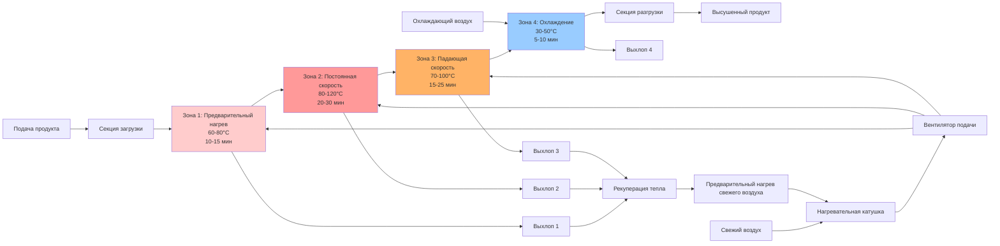

# Конвейерные сушилки: контроль скорости ленты и температуры

Конвейерные сушилки обеспечивают непрерывное удаление влаги посредством контролируемого воздействия материалов на нагретые зоны воздуха. Производительность системы зависит от точной координации скорости ленты, распределения температуры воздуха и времени пребывания для достижения целевого конечного содержания влаги при сохранении качества продукции и энергетической эффективности.

## Фундаментальные механизмы теплопередачи

Теплопередача и массообмен в конвейерных сушилках происходят путем конвекции от горячего воздуха к поверхности продукта и диффузии влаги из внутренней части продукта к поверхности.

### Конвективная теплопередача

Конвективный тепловой поток от воздуха к поверхности продукта:

$$q_{conv} = h \cdot A \cdot (T_{air} - T_{surface})$$

Где:
- $q_{conv}$ = Скорость конвективной теплопередачи (Вт)
- $h$ = Коэффициент конвективной теплопередачи (Вт/м²·К)
- $A$ = Площадь поверхности продукта, подвергающаяся воздействию воздушного потока (м²)
- $T_{air}$ = Объемная температура воздуха (°C)
- $T_{surface}$ = Температура поверхности продукта (°C)

Коэффициент теплопередачи варьируется в зависимости от скорости воздуха и конфигурации потока:

$$h = C \cdot v^n$$

Где:
- $C$ = Константа конфигурации (8-25 для сквозного потока, 30-60 для удара)
- $v$ = Скорость воздуха на поверхности продукта (м/с)
- $n$ = Показатель скорости (0,6-0,8 типичное)

### Энергия испарения влаги

Энергия, необходимая для испарения влаги из продукта:

$$q_{evap} = \dot{m}_{water} \cdot h_{fg}$$

Где:
- $q_{evap}$ = Скорость энергии испарения (Вт)
- $\dot{m}_{water}$ = Массовый расход испарившейся воды (кг/с)
- $h_{fg}$ = Скрытая теплота парообразования (2450 кДж/кг при 50°C, 2260 кДж/кг при 100°C)

### Общий энергетический баланс

Поданная энергия должна быть равна чувствительному нагреву плюс испарение:

$$\dot{m}_{air} \cdot c_{p,air} \cdot (T_{in} - T_{out}) = \dot{m}_{product} \cdot c_{p,product} \cdot \Delta T_{product} + \dot{m}_{water} \cdot h_{fg}$$

Где:
- $\dot{m}_{air}$ = Массовый расход сушильного воздуха (кг/с)
- $c_{p,air}$ = Удельная теплоемкость воздуха (1,006 кДж/кг·К)
- $T_{in}, T_{out}$ = Температура воздуха на входе и выходе (°C)
- $\dot{m}_{product}$ = Массовый расход продукта (кг/с, сухая основа)
- $c_{p,product}$ = Удельная теплоемкость продукта (кДж/кг·К)

## Расчеты скорости ленты и времени пребывания

Скорость ленты определяет время пребывания, доступное для сушки в каждой температурной зоне.

### Соотношение времени пребывания

Общее время пребывания в зоне:

$$t_{residence} = \frac{L_{zone}}{v_{belt}}$$

Где:
- $t_{residence}$ = Время пребывания в зоне (с)
- $L_{zone}$ = Длина зоны вдоль направления ленты (м)
- $v_{belt}$ = Линейная скорость ленты (м/с)

Для многозонных сушилок, общее время пребывания:

$$t_{total} = \sum_{i=1}^{n} \frac{L_i}{v_{belt}}$$

### Требуемая длина ленты

Для достижения целевого снижения влаги требуемая длина ленты:

$$L_{required} = v_{belt} \cdot t_{drying}$$

Где $t_{drying}$ определяется из уравнений скорости сушки на основе характеристик продукта и условий воздуха.

### Выбор скорости ленты

Скорость ленты должна удовлетворять требования производительности:

$$v_{belt} = \frac{\dot{m}_{product}}{\rho_{product} \cdot w_{belt} \cdot h_{layer}}$$

Где:
- $\rho_{product}$ = Объемная плотность продукта (кг/м³)
- $w_{belt}$ = Ширина ленты (м)
- $h_{layer}$ = Глубина слоя продукта на ленте (м)

Типичные скорости ленты варьируются от 0,3-3,0 м/мин (0,005-0,05 м/с) в зависимости от характеристик сушки продукта.

## Конфигурация температурной зоны

Профили с многозонной температурой оптимизируют скорость сушки при предотвращении деградации продукта.

### Конструкция профиля температуры

**Зона 1 - Предварительный нагрев:** Быстрый нагрев без удаления влаги
- Температура: 60-80°C для чувствительных к температуре продуктов
- Назначение: повысить температуру продукта для начала испарения поверхностной влаги
- Время пребывания: 10-15% от общего

**Зона 2 - Сушка с постоянной скоростью:** Максимальная скорость испарения
- Температура: 80-120°C в зависимости от ограничений продукта
- Назначение: удалять поверхностную и свободную влагу с максимальной скоростью
- Время пребывания: 40-50% от общего

**Зона 3 - Сушка с падающей скоростью:** Миграция внутренней влаги ограничена
- Температура: 70-100°C (снижено от Зоны 2)
- Назначение: позволить внутренней влаге мигрировать к поверхности
- Время пребывания: 30-40% от общего

**Зона 4 - Охлаждение:** Возврат к температуре обработки
- Температура: 30-50°C (окружающий воздух или охлажденный воздух)
- Назначение: предотвратить конденсацию и тепловой удар
- Время пребывания: 10-15% от общего

### Стратегия контроля температуры

Температура зоны контролируется для поддержания постоянной температуры воздуха:

$$T_{supply} = T_{setpoint} + \Delta T_{product}$$

Где $\Delta T_{product}$ компенсирует тепло, поглощаемое нагрузкой продукта.

## Диаграмма работы конвейерной сушилки

## Параметры сушки по материалам

Различные материалы требуют определенных комбинаций температуры, скорости ленты и времени пребывания.

### Пищевые продукты

| Материал | Глубина слоя (мм) | Скорость ленты (м/мин) | Темп. Зоны 2 (°C) | Общее время пребывания (мин) | Начальная ВС (%) | Конечная ВС (%) |
|----------|-------------------|----------------------|-------------------|------------------------------|------------------|-----------------|
| Ломтики овощей (морковь, картофель) | 25-40 | 0,5-1,0 | 60-70 | 45-90 | 80-85 | 8-12 |
| Кусочки фруктов (яблоко, манго) | 20-35 | 0,4-0,8 | 55-65 | 60-120 | 75-80 | 18-22 |
| Паста/лапша | 50-80 | 0,8-1,5 | 70-80 | 30-45 | 30-35 | 10-12 |
| Завтраковые крупы | 30-50 | 1,0-2,0 | 120-140 | 15-25 | 25-30 | 2-4 |
| Травы (петрушка, базилик) | 15-25 | 0,3-0,5 | 45-55 | 20-40 | 85-90 | 8-10 |
| Полоски мясной вяленины | Однослойные | 0,6-1,2 | 65-75 | 180-300 | 65-70 | 25-30 |
| Гранулы лука/чеснока | 40-60 | 0,6-1,0 | 70-85 | 50-80 | 80-85 | 4-6 |
| Кофейные зерна (финиш) | 60-100 | 1,5-2,5 | 80-95 | 20-35 | 12-15 | 10-11 |

### Непищевые промышленные продукты

| Материал | Глубина слоя (мм) | Скорость ленты (м/мин) | Темп. Зоны 2 (°C) | Общее время пребывания (мин) | Начальная ВС (%) | Конечная ВС (%) |
|----------|-------------------|----------------------|-------------------|------------------------------|------------------|-----------------|
| Древесная щепа | 80-120 | 0,8-1,5 | 100-120 | 40-60 | 50-60 | 10-15 |
| Бумажные изделия | 30-50 | 1,5-3,0 | 90-110 | 10-20 | 8-12 | 4-6 |
| Текстильные ткани | Одно/двухслойные | 2,0-5,0 | 120-160 | 5-15 | 60-80 | 5-8 |
| Керамические плитки (бисквит) | Однослойные | 0,5-1,2 | 80-100 | 90-180 | 18-22 | 0,5-1,0 |
| Фармацевтические гранулы | 25-40 | 0,4-0,8 | 50-60 | 30-60 | 15-20 | 2-4 |
| Пластиковые гранулы | 40-60 | 1,0-2,0 | 70-90 | 15-30 | 5-8 | 0,2-0,5 |
| Покрытая бумага | Однослойные | 3,0-8,0 | 130-180 | 3-8 | Удаление растворителя | <0,1 |
| Гранулы удобрений | 60-100 | 1,2-2,0 | 95-115 | 25-40 | 12-18 | 1-3 |

**Примечания:**
- ВС = Содержание влаги (мокрая основа)
- Скорости ленты - типичные диапазоны; фактические значения зависят от конкретного продукта и конфигурации сушилки
- Глубина слоя влияет на перепад давления и равномерность сушки
- Время пребывания исключает зону охлаждения

## Скорость воздуха и перепад давления

Скорость воздуха через слой продукта влияет как на скорость теплопередачи, так и на требования к мощности вентилятора системы.

### Скорость воздуха со сквозным потоком

Поверхностная скорость (приближение к ленте):

$$v_{superficial} = \frac{\dot{V}_{air}}{w_{belt} \cdot L_{zone}}$$

Где:
- $\dot{V}_{air}$ = Объемный расход воздуха (м³/с)
- Типичный диапазон: 0,3-1,2 м/с для зернистых продуктов

### Перепад давления через слой продукта

Перепад давления через пористый слой продукта (уравнение Эргуна):

$$\Delta P = \frac{150 \cdot \mu \cdot v \cdot h_{layer} \cdot (1-\varepsilon)^2}{d_p^2 \cdot \varepsilon^3} + \frac{1,75 \cdot \rho_{air} \cdot v^2 \cdot h_{layer} \cdot (1-\varepsilon)}{d_p \cdot \varepsilon^3}$$

Где:
- $\Delta P$ = Перепад давления (Па)
- $\mu$ = Динамическая вязкость воздуха (1,85×10⁻⁵ Па·с при 20°C)
- $v$ = Поверхностная скорость воздуха (м/с)
- $h_{layer}$ = Глубина слоя продукта (м)
- $\varepsilon$ = Пористость слоя (объемная доля пустот, типично 0,4-0,7)
- $d_p$ = Диаметр частицы (м)
- $\rho_{air}$ = Плотность воздуха (кг/м³)

Первый членздоминирует для ламинарного потока (низкая скорость, мелкие частицы), второй членновый для турбулентного потока.

### Требуемая мощность вентилятора

Мощность вентилятора для каждой зоны:

$$P_{fan} = \frac{\dot{V}_{air} \cdot \Delta P_{total}}{\eta_{fan}}$$

Где:
- $P_{fan}$ = Мощность на валу вентилятора (Вт)
- $\Delta P_{total}$ = Полный перепад давления, включая продукт, ленту и воздуховоды (Па)
- $\eta_{fan}$ = Полная эффективность вентилятора (типично 0,65-0,75)

Типичная мощность вентилятора: 0,8-3,5 кВ на метр ширины ленты для сушилок со сквозным потоком.

## Стандарты и руководства промышленной сушки

Конструкция и эксплуатация конвейерной сушилки должны соответствовать соответствующим отраслевым стандартам.

### Стандарты конструкции процесса

**ASHRAE Handbook - HVAC Applications, Chapter 30: Industrial Drying Systems**
- Методы психрометрического анализа
- Корреляции теплопередачи и массообмена
- Критерии конструкции распределения воздуха
- Интеграция рекуперации энергии

**ASABE Standards (American Society of Agricultural and Biological Engineers)**
- S448.2: Thin-Layer Drying of Grain
- D245.7: Moisture Relationships of Plant-Based Agricultural Products
- S352.2: Moisture Measurement for agricultural products

### Стандарты оборудования и безопасности

**NFPA 86: Standard for Ovens and Furnaces**
- Применимо к конвейерным сушилкам, работающим выше 93°C (200°F)
- Требования к воздуху горения
- Предотвращение взрывов при летучих растворителях
- Системы аварийного отключения

**ASME B30.20: Below-the-Hook Lifting Devices**
- Применимо к системам обработки лотков
- Требования к грузоподъемности и маркировке

**FDA CFR Title 21 Part 110: Current Good Manufacturing Practice**
- Поверхности, контактирующие с пищей (материалы ленты)
- Требования гигиеничной конструкции
- Мониторинг и запись температуры

### Руководящие принципы энергетической эффективности

**ISO 50001: Energy Management Systems**
- Структура непрерывного улучшения
- Показатели энергопроизводительности
- Протоколы мониторинга и измерения

**DOE Industrial Technologies Program - Process Heating Assessment**
- Возможности рекуперации тепла
- Утилизация отходящего тепла
- Оптимизация изоляции

## Продвинутые стратегии управления

Современные конвейерные сушилки используют сложное управление для оптимизации качества продукта и энергопотребления.

### Управление с обратной связью по влажности

Датчики влажности в ближней инфракрасной области спектра (NIR) или микроволновые датчики на выпуске сушилки обеспечивают обратную связь для регулировки скорости ленты:

$$v_{belt,adjusted} = v_{belt,setpoint} \cdot \frac{MC_{actual}}{MC_{target}}$$

Это компенсирует вариации входящей влаги продукта или условий окружающей среды.

### Прогнозное управление температурой

Предиктивное управление по модели (MPC) регулирует температуры зон на основе нагрузки продукта и скорости удаления влаги:

$$T_{zone,i} = f(MC_{product,i}, \dot{m}_{water,i}, t_{residence,i})$$

Продвинутые контроллеры изучают поведение продукта и оптимизируют профили температур для минимизации энергии при соответствии спецификациям конечной влаги.

### Переменный объем воздуха

Некоторые системы модулируют расход воздуха в каждой зоне на основе скорости испарения:

$$\dot{V}_{air,zone} = \frac{\dot{m}_{water,zone}}{\rho_{air} \cdot (X_{out} - X_{in})}$$

Где:
- $X_{out}, X_{in}$ = Влажность выходящего и подаваемого воздуха (кг воды/кг сухого воздуха)

Снижение расхода воздуха в периоды падающей скорости сушки уменьшает энергопотребление вентилятора.

## Показатели производительности

Ключевые показатели производительности для систем конвейерных сушилок:

**Тепловая эффективность:**
$$\eta_{thermal} = \frac{\dot{m}_{water} \cdot h_{fg}}{\dot{Q}_{input}} \times 100\%$$

Где $\dot{Q}_{input}$ - общая тепловая энергия, подаваемая на нагревательные катушки.

Типичный диапазон: 40-65% без рекуперации тепла, 60-80% с рекуперацией тепла.

**Удельное энергопотребление:**
$$SEC = \frac{E_{total}}{\dot{m}_{water}}$$

Где:
- $E_{total}$ = Общий энергетический ввод (тепловой + электрический) в час (кВт·ч/ч)
- $\dot{m}_{water}$ = Скорость испарения воды (кг/ч)

Типичный диапазон: 3000-6000 кДж/кг воды (0,8-1,7 кВт·ч/кг воды).

**Мощность испарения:**
$$EC = \frac{\dot{m}_{water}}{A_{belt}}$$

Где $A_{belt}$ = общая площадь поверхности ленты (м²).

Типичный диапазон: 10-40 кг воды/м²·ч в зависимости от продукта и условий воздуха.

Выбор и конструкция конвейерной сушилки требует тщательного баланса скорости ленты, конфигурации температурной зоны, времени пребывания и структур воздушного потока для достижения последовательных результатов сушки при минимизации энергопотребления и сохранении спецификаций качества продукта.
