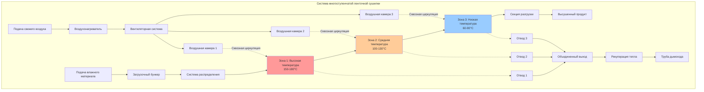

## Основы ленточных сушилок

Ленточные сушилки представляют собой систему непрерывной конвективной сушки, где влажный материал движется на конвейерной ленте через зоны нагрева. Физика работы ленточной сушилки основана на одновременном тепло- и массообмене, где горячий воздух подает скрытую теплоту парообразования, создавая градиент давления пара для отвода влаги из материала.

Фундаментальный механизм сушки работает в двух различных периодах. В период постоянной скорости поверхностная влага испаряется с интенсивностью, контролируемой внешними коэффициентами тепло- и массообмена. После истощения поверхностной влаги диффузия внутренней влаги становится лимитирующей стадией в период убывающей скорости. Проектирование ленточной сушилки должно учитывать оба режима для достижения заданного конечного содержания влаги.

## Анализ тепло- и массообмена

Общее количество тепла для ленточной сушки включает чувствительный нагрев материала и скрытую теплоту испарения влаги:

$$Q_{total} = \dot{m}_{material} c_p (T_f - T_i) + \dot{m}_{water} h_{fg}$$

где:
- $Q_{total}$ = общая тепловая нагрузка (кВт)
- $\dot{m}_{material}$ = расход сухого материала (кг/с)
- $c_p$ = удельная теплоемкость материала (кДж/кг·К)
- $T_f, T_i$ = конечная и начальная температура материала (К)
- $\dot{m}_{water}$ = скорость испарения воды (кг/с)
- $h_{fg}$ = скрытая теплота парообразования (кДж/кг)

Скорость испарения непосредственно коррелирует с коэффициентом конвективного массообмена и движущей силой:

$$\dot{m}_{water} = h_m A_{belt} \rho_{air} (Y_s - Y_\infty)$$

где:
- $h_m$ = коэффициент массообмена (м/с)
- $A_{belt}$ = площадь поверхности ленты (м²)
- $\rho_{air}$ = плотность воздуха (кг/м³)
- $Y_s$ = влажность на поверхности материала (кг/кг)
- $Y_\infty$ = влажность окружающего воздуха (кг/кг)

## Расчет производительности ленточной сушилки

Производительность ленточной сушилки зависит от размеров ленты, скорости, загрузки материала и требуемого времени пребывания:

$$\dot{m}_{capacity} = v_{belt} \cdot W_{belt} \cdot \rho_{loading}$$

где:
- $\dot{m}_{capacity}$ = производственная мощность (кг/ч)
- $v_{belt}$ = скорость ленты (м/мин)
- $W_{belt}$ = ширина ленты (м)
- $\rho_{loading}$ = плотность загрузки материала (кг/м²)

Требуемая длина ленты для достижения целевого снижения влажности следует из кинетики сушки:

$$L_{belt} = v_{belt} \cdot t_{residence} = v_{belt} \cdot \frac{X_i - X_f}{R_{avg}}$$

где:
- $L_{belt}$ = длина ленты (м)
- $t_{residence}$ = время пребывания (мин)
- $X_i, X_f$ = начальное и конечное содержание влаги (по сухому веществу)
- $R_{avg}$ = средняя скорость сушки (кг воды/кг сухого материала·мин)

## Конфигурация ленточной сушилки

## Сравнение типов ленточных сушилок

| Тип ленточной сушилки | Направление воздушного потока | Глубина материала | Типичная скорость | Энергоэффективность | Применение |
|-----------------|------------------|----------------|------------------|-------------------|--------------|
| **Одноступенчатая сквозного потока** | Вертикальный поток через перфорированную ленту | 20-50 мм | 0,5-2,0 м/мин | 65-75% | Гранулированные материалы, пеллеты, экструдаты |
| **Многоступенчатый каскад** | Горизонтальный перекрестный поток | 50-150 мм | 0,3-1,5 м/мин | 70-80% | Частицы, хлопья, измельченные материалы |
| **Многоярусная сквозная циркуляция** | Чередующийся поток вверх/вниз | 30-80 мм | 0,8-3,0 м/мин | 75-85% | Высокопроизводительные операции, теплочувствительные продукты |
| **Ленточная сушилка с ударным потоком** | Высокоскоростные струи, перпендикулярные ленте | 10-30 мм | 1,0-4,0 м/мин | 60-70% | Тонкие слои, требования быстрой сушки |
| **Перфорированная лента с рециркуляцией** | Смешанный поток с рециркуляцией 60-80% | 25-60 мм | 0,5-2,5 м/мин | 80-90% | Энергокритичные приложения, равномерная сушка |

## Стандарты и спецификации проектирования

Проектирование ленточных сушилок соответствует стандартам, установленным ASABE (Американское общество инженеров в области сельского хозяйства и биологических систем) Standard S448 для тонкослойной сушки, и ISO 15003 для непрерывных сушилок. Критические параметры проектирования включают:

**Выбор материала ленты:**
- Перфорированная нержавеющая сталь (AISI 304/316) для агрессивных сред
- Плетеная проволочная сетка (50-200 меш) для мелких частиц
- Модульные пластиковые ленты (UHMW полиэтилен) для низкотемпературных приложений
- Процент открытого сечения: 30-60% для оптимального распределения воздуха

**Проектирование воздушной системы:**
- Скорость воздуха через слой материала: 0,5-2,5 м/с
- Удельный расход воздуха: 2000-6000 м³/ч на м² площади ленты
- Перепад температуры через слой материала: 15-40 К
- Перепад давления через перфорированную ленту и материал: 200-800 Па

**Оптимизация тепловой эффективности:**
Многоступенчатые ленточные сушилки достигают высшей тепловой эффективности за счет прогрессивного снижения температуры. Первая ступень работает при максимальной допустимой температуре, чтобы использовать сушку с постоянной скоростью, в то время как последующие ступени работают при более низких температурах, соответствующих пониженным скоростям сушки. Этот поэтапный подход минимизирует потребление энергии на килограмм испарившейся воды.

Рекуперация тепла из потоков выходящего воздуха через воздух-воздушные теплообменники или системы тепловых насосов может повысить общую тепловую эффективность на 15-30%. Предварительный нагрев свежего воздуха за счет энергии выходящего воздуха пропорционально снижает требования к основному нагреву.

## Время удержания материала

Распределение времени пребывания в ленточных сушилках приблизительно соответствует поведению вытеснительного потока, обеспечивая равномерную обработку всего материала. Для материалов, требующих точного контроля влажности, изменяемость скорости ленты ±2% обеспечивает постоянное время пребывания. Системы отслеживания положения ленты поддерживают боковое положение в пределах ±5 мм, чтобы предотвратить разлив материала и неравномерное распределение воздуха.

Для материалов, склонных к затвердеванию поверхности, начальная относительная влажность в зоне может быть повышена до 40-60% ОВ, предотвращая закупорку поверхности при одновременном разрешении внутренней миграции влаги. Последующие зоны работают при прогрессивно более низкой влажности для завершения сушки без деградации качества.

## Рабочие соображения

Эффективность ленточной сушилки критически зависит от равномерного распределения материала по ширине ленты. Вибрационные питатели или колеблющиеся распределители создают постоянную толщину слоя (максимальное отклонение ±10%). Неравномерная загрузка создает предпочтительное направление воздуха, снижая эффективность сушилки и производя переменное конечное содержание влаги.

Системы разгрузки материала должны предотвращать повторное увлажнение от проникновения окружающего воздуха. Очистители ленты (вращающиеся щетки или воздушные ножи) удаляют прилипшие частицы, поддерживая открытыми отверстия ленты для постоянного сопротивления воздушному потоку на протяжении всей работы.
