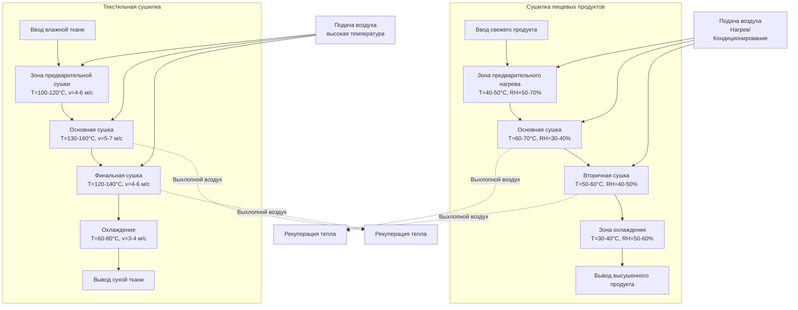

## Основная физика процесса сушки

Конвейерные сушилки для пищевых и текстильных продуктов работают на основе принципов одновременной теплопередачи и массопередачи, где удаление влаги зависит от разницы давления паров между поверхностью продукта и окружающим воздухом. Процесс сушки включает два различных периода: сушка с постоянной скоростью (испарение поверхностной влаги) и сушка с падающей скоростью (диффузия внутренней влаги).

### Уравнения скорости сушки

Скорость массопередачи во время сушки с постоянной скоростью подчиняется:

$$\dot{m}_w = h_m A_s (P_{sat,s} - P_v)$$

Где:
- $\dot{m}_w$ = скорость испарения влаги (кг/с)
- $h_m$ = коэффициент массопередачи (м/с)
- $A_s$ = площадь поверхности продукта (м²)
- $P_{sat,s}$ = давление насыщенного пара на поверхности (Па)
- $P_v$ = парциальное давление пара в воздухе (Па)

Конвективная теплопередача к поверхности продукта:

$$Q = h A_s (T_a - T_s) = \dot{m}_w h_{fg}$$

Где:
- $h$ = коэффициент конвективной теплопередачи (Вт/м²·К)
- $T_a$ = температура воздуха (К)
- $T_s$ = температура поверхности (К)
- $h_{fg}$ = скрытая теплота испарения (Дж/кг)

### Соотношения содержания влаги

Содержание влаги в продукте в пересчёте на сухое вещество:

$$X = \frac{m_w}{m_s}$$

Где:
- $X$ = содержание влаги (кг воды/кг сухого вещества)
- $m_w$ = масса воды (кг)
- $m_s$ = масса сухого вещества (кг)

Время сушки в период падающей скорости:

$$t = \frac{m_s}{K A_s} \ln\left(\frac{X_c - X_e}{X_f - X_e}\right)$$

Где:
- $t$ = время сушки (с)
- $K$ = константа сушки (кг/м²·с)
- $X_c$ = критическое содержание влаги (кг/кг)
- $X_e$ = равновесное содержание влаги (кг/кг)
- $X_f$ = конечное содержание влаги (кг/кг)

## Сушка пищевых продуктов

### Психрометрическое управление

Сушка пищевых продуктов требует точного контроля температуры сухого термометра, относительной влажности и скорости воздуха для предотвращения затвердевания корки (закупоривания поверхности) при максимизации удаления влаги. Оптимальная кривая сушки следует убывающему профилю температуры по мере снижения внутренней влажности.

Для фруктов и овощей начальный этап сушки использует:

$$RH = 40\% - 60\%, \quad T_{db} = 50°C - 70°C, \quad v = 1,5 - 3,0 \text{ м/с}$$

### Специфические характеристики продуктов

**Сушка фруктов и овощей**
Продукты с высоким содержанием сахара требуют более низких температур для предотвращения карамелизации. Температура стеклования $T_g$ определяет критическую точку, в которой продукты переходят из каучукоподобного состояния в стекловидное состояние, влияя на стабильность при хранении:

$$T_g = T_{g,s} + k \cdot X$$

Где $T_{g,s}$ — температура стеклования сухого вещества и $k$ — эмпирическая константа.

**Сушка макаронных изделий**
Макаронные изделия требуют контролируемой влажности для предотвращения образования трещин. Максимально допустимый градиент температуры:

$$\nabla T_{max} = \frac{\sigma_{allow}}{E \alpha}$$

Где:
- $\sigma_{allow}$ = допустимое напряжение (Па)
- $E$ = модуль упругости (Па)
- $\alpha$ = коэффициент теплового расширения (1/К)

## Применение в текстильной промышленности

### Динамика влажности ткани

Сушка текстиля отличается от пищевой промышленности более высокими допустимыми температурами и особенностями механической обработки. Восстановление влаги тканью при равновесии:

$$M_r = \frac{m_w}{m_d} \times 100\%$$

Где $M_r$ — процент восстановления влаги.

### Баланс энергии

Общее количество тепла, необходимое для сушки текстиля:

$$Q_{total} = m_f c_{pf} (T_2 - T_1) + m_w h_{fg} + Q_{air} + Q_{loss}$$

Где:
- $m_f$ = масса ткани (кг)
- $c_{pf}$ = удельная теплоёмкость ткани (Дж/кг·К)
- $T_1, T_2$ = начальная и конечная температуры (К)
- $Q_{air}$ = требование к нагреву воздуха (Дж)
- $Q_{loss}$ = потери тепла (Дж)

### Требования к подаче воздуха

Текстильные сушилки обычно работают с более высокими скоростями воздуха (3-8 м/с) по сравнению с пищевыми применениями для достижения быстрого удаления влаги без деградации продукта. Перепад давления через слой ткани:

$$\Delta P = \frac{\mu v L}{K_{perm}}$$

Где:
- $\mu$ = динамическая вязкость воздуха (Па·с)
- $v$ = поверхностная скорость (м/с)
- $L$ = толщина ткани (м)
- $K_{perm}$ = проницаемость ткани (м²)

## Конфигурация конвейерной сушилки

## Требования к сушке по типам продуктов

| Категория продукта | Начальное влагосодержание (%) | Конечное влагосодержание (%) | Диапазон температур (°C) | Диапазон RH (%) | Скорость воздуха (м/с) | Время пребывания |
|-----------------|----------------|--------------|-----------------|--------------|-------------------|----------------|
| Фрукты (Яблоки, Абрикосы) | 80-85 | 18-24 | 55-70 | 35-50 | 1,5-2,5 | 4-8 часов |
| Овощи (Морковь, Лук) | 85-92 | 4-8 | 50-65 | 40-60 | 2,0-3,0 | 3-6 часов |
| Макаронные изделия (экструдированные) | 30-35 | 10-12 | 40-80* | 60-80* | 0,5-1,5 | 8-24 часа |
| Мясные продукты | 60-75 | 20-30 | 50-70 | 45-65 | 1,0-2,0 | 6-12 часов |
| Хлопчатобумажные ткани | 100-150 | 6-8 | 120-150 | N/A | 4-6 | 2-5 минут |
| Синтетические ткани | 60-80 | 0,4-1,0 | 100-130 | N/A | 5-7 | 1-3 минуты |
| Шерстяные ткани | 80-120 | 13-16 | 80-100 | N/A | 3-5 | 3-8 минут |

*Сушка макаронных изделий использует поэтапные профили температуры/влажности

## Стандарты проектирования и нормы

**Сушка пищевых продуктов:**
- ASABE S448: Тонкослойная сушка зёрен и культур
- ASABE S352.2: Измерение влажности (неиспеченное зерно и семена)
- FDA 21 CFR Part 110: Надлежащая производственная практика
- USDA AMS: Стандарты для фруктов и овощей

**Сушка текстиля:**
- ASTM D1776: Кондиционирование и испытание текстиля
- ASTM D2654: Влажность в текстиле
- ISO 3758: Маркировка по уходу за текстилем
- NFPA 86: Стандарт печей и установок

## Оптимизация энергоэффективности

Удельная скорость извлечения влаги (SMER) определяет эффективность сушилки:

$$SMER = \frac{\dot{m}_w}{P_{total}} \text{ (кг/кВт·ч)}$$

Типичные значения:
- Конвейерные сушилки пищевых продуктов: 0,8-1,2 кг/кВт·ч
- Конвейерные сушилки текстиля: 1,5-2,5 кг/кВт·ч

Рекупeрация тепла из выхлопного воздуха улучшает эффективность:

$$\eta_{recovery} = \frac{T_{exhaust} - T_{ambient}}{T_{supply} - T_{ambient}}$$

Многоступенчатая сушка с рекупeрацией тепла может достичь снижения энергопотребления на 30-50% по сравнению с однопроходными системами.

## Критические параметры управления

**Пищевые продукты:**
- Контролировать температуру ядра для предотвращения теплового повреждения
- Контролировать влажность для предотвращения затвердевания корки
- Проверять распределение времени пребывания
- Дезинфицировать контактные поверхности согласно требованиям FDA

**Текстильные продукты:**
- Поддерживать натяжение ткани для предотвращения деформации
- Контролировать температуру контакта для предотвращения повреждения ткани
- Контролировать усадку и стабильность размеров
- Обеспечивать равномерное распределение воздуха по ширине ткани
