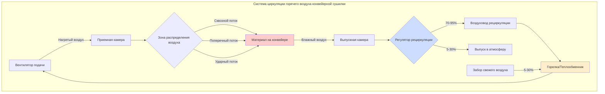

## Циркуляция горячего воздуха в конвейерных сушилках

Циркуляция горячего воздуха представляет собой фундаментальный механизм, обеспечивающий удаление влаги в системах конвейерной сушки. Система циркуляции определяет однородность сушки, энергетическую эффективность и качество продукта посредством контролируемой подачи нагретого воздуха на поверхность материала. Понимание физики конвективной теплопередачи и массопередачи определяет оптимальное проектирование системы.

## Основные принципы теплопередачи и массопередачи

Конвективная сушка происходит, когда горячий воздух контактирует с влажным материалом, одновременно передавая явную теплоту для испарения влаги и выводя водяной пар. Движущий потенциал для удаления влаги зависит от разницы давлений насыщенного пара между поверхностью материала и основной массой воздуха.

Конвективная теплопередача на поверхность материала следует уравнению:

$$Q_{conv} = h_c A (T_{air} - T_{surface})$$

Где $h_c$ — коэффициент конвективной теплопередачи (Вт/м²·К), $A$ — площадь поверхности (м²), $T_{air}$ — температура основной массы воздуха (°C), и $T_{surface}$ — температура поверхности материала (°C).

Коэффициент конвективной теплопередачи зависит от скорости воздуха:

$$h_c = C \cdot Re^m \cdot Pr^{1/3} \cdot \frac{k}{L}$$

Где $Re$ — число Рейнольдса, $Pr$ — число Прандтля, $k$ — теплопроводность (Вт/м·К), $L$ — характерный размер (м), и $C$ и $m$ — эмпирические константы, зависящие от режима потока.

## Требования к температуре сушильного воздуха

Оптимальная температура сушильного воздуха обеспечивает баланс между скоростью удаления влаги и риском деградации продукта. Температура должна создавать достаточную разницу давлений насыщенного пара, избегая при этом теплового повреждения.

Требуемая температура воздуха зависит от целевой скорости удаления влаги:

$$T_{air} = T_{wet-bulb} + \frac{\dot{m}_{evap} \cdot h_{fg}}{h_c A}$$

Где $T_{wet-bulb}$ — температура по мокрому термометру (°C), $\dot{m}_{evap}$ — скорость испарения (кг/с), и $h_{fg}$ — скрытая теплота парообразования (2 260 кДж/кг при атмосферном давлении).

Однородность температуры по ширине конвейера обычно требует контроля в пределах ±2°C для обеспечения последовательного содержания влаги в продукте. Стратификация температуры развивается, когда вертикальные градиенты температуры превышают 5°C на метр высоты воздуховода.

## Оптимизация скорости воздуха

Скорость воздуха напрямую влияет на коэффициент конвективной теплопередачи и толщину пограничного слоя. Более высокие скорости увеличивают скорость сушки, но также увеличивают потребление энергии вентилятором и возмущение материала.

Критическая скорость для проникновения пограничного слоя:

$$v_{critical} = \frac{\mu}{\rho \delta}$$

Где $\mu$ — динамическая вязкость (Па·с), $\rho$ — плотность воздуха (кг/м³), и $\delta$ — желаемая толщина пограничного слоя (м).

Типичные расчетные скорости находятся в диапазоне от 1,5 до 4,0 м/с в зависимости от характеристик материала. Хрупкие материалы требуют скорости ниже 2,0 м/с, в то время как прочные материалы допускают скорости до 6,0 м/с.

Оптимальная скорость максимизирует скорость сушки на единицу энергии:

$$v_{optimal} = \left(\frac{\dot{m}_{evap} \cdot h_{fg}}{\eta_{fan} \cdot \Delta P \cdot A}\right)^{1/3}$$

Где $\eta_{fan}$ — эффективность вентилятора и $\Delta P$ — перепад давления (Па).

## Методы распределения воздуха

Конфигурация распределения воздуха принципиально влияет на однородность сушки и энергетическую эффективность. Три основных метода доминируют в промышленных приложениях.

| Метод распределения | Диапазон скорости воздуха (м/с) | Однородность (±%) | Энергетическая эффективность | Типичные приложения |
|---------------------|----------------------------------|-------------------|-------------------------------|----------------------|
| Сквозной поток (вертикальный) | 0,5 - 2,0 | ±3 | Высокая | Сыпучие материалы, тонкие слои |
| Поперечный поток (горизонтальный) | 1,5 - 4,0 | ±5 | Средняя | Листовые материалы, непрерывные полотна |
| Ударный поток | 3,0 - 8,0 | ±2 | Низкая | Высокостоимостные продукты, быстрая сушка |
| Комбинированный (многозонный) | Переменная | ±3 | Средняя-Высокая | Сложные геометрии, этапная сушка |

Системы со сквозным потоком направляют воздух перпендикулярно конвейерной ленте, проходя через слой материала. Эта конфигурация обеспечивает отличную однородность для проницаемых материалов, но требует перфорированных лент и чистых продуктов для предотвращения закупорки.

Системы с поперечным потоком направляют воздух параллельно поверхности конвейера либо с одной стороны, либо с чередующихся сторон. Этот подход подходит для непроницаемых материалов и минимизирует перепад давления, но создает градиенты скорости по ширине ленты.

Системы ударного потока используют высокоскоростные воздушные струи, направленные на поверхность материала с близкого расстояния (25-75 мм). Ударные струи эффективно пробивают пограничный слой, но потребляют значительную мощность вентилятора.

## Рециркуляция и баланс свежего воздуха

Энергетическая эффективность требует максимальной рециркуляции воздуха при достаточной емкости удаления влаги. Коэффициент рециркуляции определяет расход топлива и размер сушилки.

Требуемая доля свежего воздуха следует из психрометрического анализа:

$$f_{fresh} = \frac{\omega_{sat}(T_{air}) - \omega_{recir}}{\omega_{sat}(T_{air}) - \omega_{ambient}}$$

Где $\omega$ представляет коэффициент влагосодержания (кг воды/кг сухого воздуха), а индексы обозначают условия.

Типичные коэффициенты рециркуляции колеблются от 70% до 95% в зависимости от исходного содержания влаги в материале и чувствительности продукта. Материалы с более высоким содержанием влаги требуют большего введения свежего воздуха для предотвращения насыщения воздуха.

## Путь циркуляции горячего воздуха в конвейерной сушилке

Система циркуляции обеспечивает непрерывный воздушный поток через камеру сушилки. Вентиляторы подачи доставляют нагретый воздух в распределительные камеры, которые направляют воздушный поток через или поверх слоя материала. Влажный выходящий воздух разделяется на рециркуляционный и выпускной потоки в зависимости от психрометрических требований. Рециркуляционный поток возвращается в систему отопления для повторного нагрева перед повторным входом в приемную камеру.

## Стандарты проектирования и лучшие практики

Проектирование промышленных конвейерных сушилок следует рекомендациям, установленным ASHRAE, ASABE и специфическим стандартам производителя. Ключевые параметры проектирования включают:

**Однородность распределения воздуха**: Изменение скорости по ширине ленты не должно превышать ±10% в любом поперечном сечении. Достижение этого требует тщательного проектирования приемной камеры с перфорированными пластинами или массивами диффузоров.

**Контроль температуры**: Контроль температуры по зонам позволяет оптимизировать условия сушки по длине конвейера. Начальные зоны работают при более высоких температурах (150-200°C) для удаления поверхностной влаги, в то время как конечные зоны используют более низкие температуры (80-120°C) для предотвращения пересушивания.

**Управление перепадом давления**: Общий перепад давления в системе обычно составляет от 500 до 1 500 Па. Чрезмерный перепад давления увеличивает потребление энергии вентилятором и эксплуатационные расходы.

**Соображения безопасности**: Взрывоопасная атмосфера может развиваться при сушке горючих материалов. Введение свежего воздуха должно поддерживать концентрацию растворителя или пыли ниже 25% нижнего предела взрываемости (LEL).

## Производительность системы циркуляции

Эффективность циркуляции определяет общую производительность сушилки. Тепловая эффективность системы циркуляции:

$$\eta_{thermal} = \frac{\dot{m}_{evap} \cdot h_{fg}}{\dot{Q}_{fuel}}$$

Где $\dot{Q}_{fuel}$ — скорость входа энергии топлива (кВт).

Хорошо спроектированные системы достигают тепловой эффективности 60-75% при учете всех потерь. Эффективность циркуляционного вентилятора обычно находится в диапазоне от 65-80% в зависимости от конструкции системы и условий эксплуатации.

Однородность распределения воздуха напрямую влияет на последовательность качества продукта. Неравномерная сушка создает градиенты влажности, которые проявляются как вариации качества в конечном продукте. Поддержание однородности скорости в пределах ±5% и однородности температуры в пределах ±2°C обеспечивает приемлемую согласованность продукта для большинства приложений.
