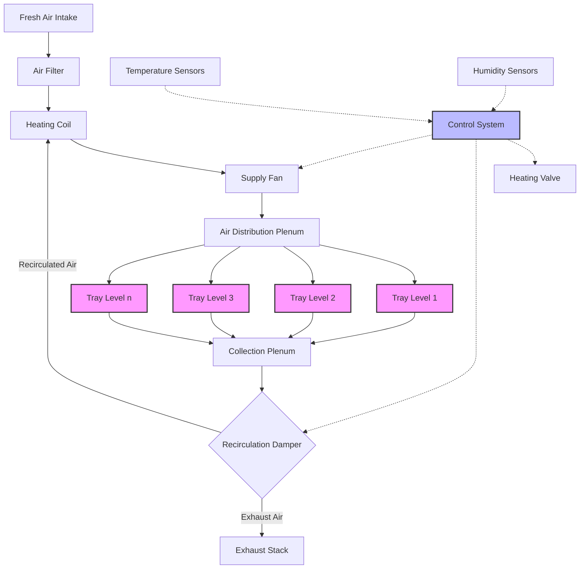

# Сушильные шкафы для промышленных периодических процессов сушки

Сушильные шкафы представляют собой наиболее фундаментальную форму конвективной периодической сушки, использующую циркуляцию нагретого воздуха над материалом, расположенным тонкими слоями на полках. Эти системы работают по принципу одновременного тепло- и массообмена, где тепловая энергия нагретого воздуха испаряет влагу с поверхности материала, а влажный воздух либо вытесняется, либо рециркулируется после осушения.

## Физические принципы сушки в шкафах

Процесс сушки в сушильных шкафах происходит в двух различных фазах, управляемых разными физическими механизмами.

**Период постоянной скорости сушки:** В начале процесса сушки влага мигрирует из внутренней части материала на поверхность быстрее, чем происходит испарение. Поверхность остается насыщенной, а скорость сушки зависит исключительно от внешних условий тепло- и массообмена. Скорость испарения равна:

$$\dot{m}_w = h_m \cdot A \cdot (C_{s} - C_{\infty})$$

Где $h_m$ — коэффициент массопередачи (м/с), $A$ — открытая площадь поверхности (м²), $C_s$ — концентрация пара на насыщенной поверхности (кг/м³), $C_{\infty}$ — концентрация пара в основном потоке воздуха (кг/м³).

**Период падающей скорости сушки:** После достижения критического влажного содержания внутренняя миграция влаги становится ограничивающим фактором. Скорость сушки уменьшается по мере высыхания материала, и механизмы, контролируемые диффузией, преобладают. Эта фаза требует значительно большего времени и определяет общую продолжительность цикла для большинства материалов.

## Теплопередача и энергетические требования

Тепловая энергия, необходимая для сушки, состоит из явного тепла для повышения температуры материала и скрытого тепла для испарения влаги:

$$Q_{total} = m_s \cdot c_p \cdot \Delta T + m_w \cdot h_{fg}$$

Где $m_s$ — масса сухого твёрдого вещества (кг), $c_p$ — удельная теплоёмкость материала (кДж/кг·K), $\Delta T$ — повышение температуры (K), $m_w$ — удаляемая влага (кг), $h_{fg}$ — удельная теплота парообразования (примерно 2500 кДж/кг при атмосферном давлении).

Конвективная теплопередача от воздуха к материалу следует:

$$q = h_c \cdot A \cdot (T_{air} - T_{material})$$

Коэффициент конвективной теплопередачи $h_c$ (Вт/м²·K) критически зависит от скорости воздуха над поверхностью полки. Типичные значения варьируются от 10-50 Вт/м²·K при скоростях воздуха 1-5 м/с.

## Расчет производительности сушильного шкафа

Расчет времени периодической сушки требует интегрирования скорости сушки по диапазону влажного содержания:

$$t_{dry} = \int_{X_1}^{X_2} \frac{m_s}{A \cdot R_c} \, dX$$

Где $X_1$ и $X_2$ — начальное и конечное влажное содержание (кг воды/кг сухого вещества), $R_c$ — критическая скорость сушки (кг/м²·ч).

Для практического проектирования время сушки оценивается отдельно для периодов постоянной и падающей скорости:

$$t_{total} = \frac{m_s(X_i - X_c)}{A \cdot R_c} + \frac{m_s(X_c - X_f)}{A \cdot R_c \cdot \ln\left(\frac{X_c}{X_f}\right)}$$

Где $X_i$, $X_c$, $X_f$ — начальное, критическое и конечное влажное содержание соответственно.

## Конфигурация воздушного потока и психрометрика

Эффективная работа сушильного шкафа требует точного контроля температуры, влажности и скорости воздуха. Воздух может быть организован в несколько конфигураций:

- **Проходящая циркуляция:** Воздух проходит перпендикулярно через перфорированные полки, максимизируя контакт с материалом
- **Поперечный поток:** Воздух движется горизонтально над поверхностями полок, конструкция проще, но менее равномерна
- **Комбинированная:** Начальный проходящий поток переходит в поперечный по мере усадки материала

Психрометрический анализ определяет, возможна ли рециркуляция воздуха. Энергия нагрева свежего воздуха на единицу массы удаленной воды:

$$E_{fresh} = \frac{c_p \cdot (T_{supply} - T_{ambient})}{\omega_{exhaust} - \omega_{ambient}}$$

Рециркуляция снижает потребление энергии, но требует поддержания адекватного движущего потенциала влажности. Оптимальный коэффициент рециркуляции сбалансирован между экономией энергии и снижением скорости сушки.

## Конфигурация системы сушильного шкафа

## Проектные расчеты для конкретных применений

| Применение | Диапазон температур | Скорость воздуха | Критические параметры | Типичная продолжительность цикла |
|-------------|------------------|--------------|---------------------|-------------------|
| Фармацевтические гранулы | 40-60°C | 1,5-2,5 м/с | Равномерная температура, соответствие GMP, валидация | 4-12 часов |
| Продукты питания | 50-80°C | 2-4 м/с | Материалы пищевого класса, простая очистка, низкая влажность | 3-8 часов |
| Химические промежуточные продукты | 60-120°C | 2-5 м/с | Взрывозащищенная конструкция, восстановление растворителя | 6-16 часов |
| Керамические изделия | 80-150°C | 1-3 м/с | Медленная сушка для предотвращения трещин, равномерность | 12-48 часов |
| Электронные компоненты | 40-80°C | 1-2 м/с | Чистый воздух, точный контроль, предотвращение статики | 2-6 часов |

## Стандарты и проектные справочники

Справочник ASHRAE — HVAC Applications содержит рекомендации по проектированию промышленных систем сушки, включая психрометрические расчеты и выбор оборудования. Фармацевтические применения должны соответствовать требованиям FDA cGMP (21 CFR часть 211) и европейским стандартам GMP Приложение 15 для квалификации и валидации.

Стандарты ASME BPE регулируют санитарное проектирование для фармацевтических и биотехнологических применений, устанавливая требования к отделке поверхности, материалам конструкции и легкости очистки. Стандарты требуют максимальную шероховатость поверхности 0,5 мкм Ra для поверхностей, контактирующих с продуктом, и указывают нержавеющую сталь 316L в качестве минимального сортамента материала.

Для безопасности процесса стандарт NFPA 86 Standard for Ovens and Furnaces регулирует предотвращение взрывов в сушилках, обрабатывающих летучие растворители. Стандарт требует непрерывного контроля концентрации растворителя, поддержания уровней ниже 25% нижнего предела взрываемости (LEL), и блокированные циклы продувки.

## Стратегии оптимизации

Максимизация эффективности сушильного шкафа требует:

1. **Оптимизация загрузки:** Глубина материала экспоненциально влияет на время сушки; глубина 10-25 мм обеспечивает оптимальный баланс
2. **Распределение воздуха:** Равномерная скорость по всем полкам предотвращает недосушивание в зонах низкой скорости
3. **Профилирование температуры:** Более высокие начальные температуры ускоряют сушку в период постоянной скорости без повреждения чувствительных к теплу материалов
4. **Контроль влажности:** Снижение отношения влажности выхлопа увеличивает движущий потенциал, но повышает потребление энергии

Тепловая эффективность сушильных шкафов обычно составляет 25-45%, значительно ниже, чем у непрерывных сушилок, из-за потерь при периодическом нагреве и теплоемкости конструкции. Надлежащая теплоизоляция (минимум RSI 1,76 для стен, RSI 2,64 для крыши) и быстрые процедуры загрузки/выгрузки улучшают эффективность.

Сушильные шкафы остаются предпочтительным выбором для небольших партий, частой смены продукции и материалов, требующих осторожного обращения, несмотря на более низкую тепловую эффективность по сравнению с непрерывными системами. Простота конструкции, легкость очистки и гибкость процесса оправдывают их широкое применение в фармацевтической, специализированной химической и пищевой промышленности.

## Компоненты

- Периодические сушильные шкафы
- Тележечные сушильные шкафы
- Полки с циркуляцией воздуха
- Методы нагрева для сушильных шкафов
