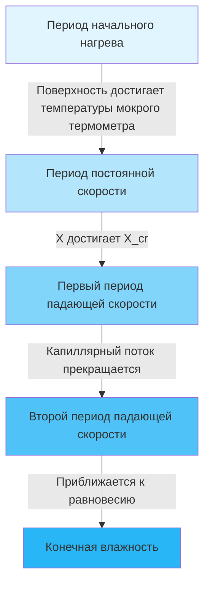

# Основы процесса сушки

Промышленные системы сушки удаляют влагу из материалов посредством одновременного тепло- и массообмена. Понимание физики, управляющей этими процессами, необходимо для проектирования эффективных систем HVAC, которые удовлетворяют производственным требованиям при минимизации потребления энергии.

## Физические принципы сушки

Сушка происходит, когда парциальное давление пара на поверхности материала превышает парциальное давление водяного пара в окружающем воздухе. Эта разница давлений пара приводит к миграции влаги из внутренних слоев материала на поверхность, а затем к испарению в воздушный поток.

Процесс включает три фундаментальных механизма:

- **Передача тепла** от сушильного агента к поверхности материала
- **Внутренняя миграция влаги** посредством диффузии, капиллярных сил или потока пара
- **Массообмен** водяного пара с поверхности в основной воздушный поток

### Тепловой баланс

Энергия, необходимая для сушки, состоит из чувствительного нагрева и скрытой теплоты испарения:

$$Q_{total} = m_s c_p (T_f - T_i) + m_w h_{fg}$$

Где:
- $Q_{total}$ = общая требуемая энергия (кДж)
- $m_s$ = масса сухого вещества (кг)
- $c_p$ = удельная теплоемкость материала (кДж/кг·К)
- $T_f, T_i$ = конечная и начальная температуры (К)
- $m_w$ = масса испарившейся воды (кг)
- $h_{fg}$ = скрытая теплота испарения (кДж/кг)

При типичных температурах сушки (50-150°C) скрытая теплота доминирует в общем потреблении энергии, составляя 80-95% теплового нагружения.

## Уравнения скорости сушки

Скорость сушки характеризует скорость удаления влаги и определяет размеры оборудования. Она значительно варьируется на протяжении цикла сушки.

### Период постоянной скорости

При сушке с постоянной скоростью на поверхности присутствует достаточное количество влаги для поддержания непрерывной жидкой пленки. Скорость определяется внешним тепло- и массообменом:

$$\frac{dX}{dt} = -\frac{h_m A}{m_s}(Y_s - Y_\infty)$$

Где:
- $\frac{dX}{dt}$ = скорость сушки (кг воды/кг сухого вещества·с)
- $h_m$ = коэффициент массообмена (м/с)
- $A$ = площадь поверхности (м²)
- $Y_s$ = влажность на поверхности (кг/кг)
- $Y_\infty$ = влажность основного воздушного потока (кг/кг)

Коэффициент массообмена связан с конвективной передачей тепла через соотношение Льюиса:

$$\frac{h_c}{h_m c_p} = Le^n$$

Где $Le$ — число Льюиса (обычно 0,8–1,0 для систем воздух-вода) и $n$ варьируется от 0,33 до 0,67 в зависимости от условий потока.

### Период падающей скорости

После того как поверхностная влага снижается ниже критической влажности ($X_{cr}$), скорость сушки уменьшается, так как внутренняя диффузия влаги становится ограничивающим фактором:

$$\frac{dX}{dt} = -\frac{D_{eff} A}{V L}(X - X_e)$$

Где:
- $D_{eff}$ = эффективная диффузивность (м²/с)
- $V$ = объем материала (м³)
- $L$ = характерный размер (м)
- $X$ = содержание влаги (кг/кг по сухому веществу)
- $X_e$ = равновесное содержание влаги (кг/кг)

Эффективная диффузивность зависит экспоненциально от температуры:

$$D_{eff} = D_0 \exp\left(-\frac{E_a}{RT}\right)$$

Где $E_a$ — энергия активации (кДж/моль), $R$ — газовая постоянная (8,314 Дж/моль·К) и $T$ — абсолютная температура.

## Психрометрические соображения

Способность сушильного агента поглощать влагу зависит от его психрометрического состояния. Максимальный захват влаги происходит, когда воздух выходит на уровне насыщения:

$$\Delta Y_{max} = Y_{sat}(T_{db}) - Y_{in}$$

Фактический захват влаги:

$$\Delta Y_{actual} = \eta_{saturation} \cdot \Delta Y_{max}$$

Где эффективность насыщения ($\eta_{saturation}$) обычно варьируется от 0,6 до 0,9 в зависимости от времени контакта и конструкции оборудования.

## Характеристики кривой сушки

Критическая влажность ($X_{cr}$) отмечает переход между периодами постоянной и падающей скорости. Это значение зависит от:

- Пористости и структуры материала
- Начального распределения влаги
- Скорости и температуры сушильного воздуха
- Толщины материала

## Сравнение методов промышленной сушки

| Метод сушки | Режим передачи тепла | Типичный диапазон температур (°C) | Скорость сушки | Энергетическая эффективность | Стоимость капитала |
|---------------|-------------------|-------------------------------|-------------|------------------|--------------|
| **Конвективная (прямая)** | Конвекция горячего воздуха | 50-200 | Умеренная | 30-50% | Низкая-средняя |
| **Кондуктивная (косвенная)** | Теплопроводность через нагреваемую поверхность | 60-150 | Медленная-умеренная | 50-70% | Средняя-высокая |
| **Радиационная (инфракрасная)** | Поглощение излучения | 80-300 | Быстрая | 40-60% | Средняя |
| **Диэлектрическая (микроволны/РЧ)** | Объемный нагрев | 40-100 | Очень быстрая | 50-80% | Высокая |
| **Вакуумная сушка** | Сублимация под вакуумом | -40-25 | Очень медленная | 10-20% | Очень высокая |
| **Перегретый пар** | Конвекция от пара | 105-200 | Быстрая | 70-90% | Высокая |

## Проектные решения

Проектирование системы HVAC для промышленной сушки должно учитывать:

**Определение расхода воздуха**:
$$\dot{m}_{air} = \frac{\dot{m}_w}{\Delta Y_{actual}}$$

Это определяет размеры вентилятора и требования к воздуховодам.

**Мощность нагревателя**:
$$Q_{heating} = \dot{m}_{air}[h(T_{out}, Y_{out}) - h(T_{in}, Y_{in})]$$

Где $h$ представляет удельную энтальпию влажного воздуха.

**Контроль влажности**: Поддержание оптимальной входной влажности максимизирует потенциал сушки, предотвращая деградацию материала из-за чрезмерных скоростей сушки.

**Обработка выходящего воздуха**: Выходящий воздух с высокой влажностью может потребовать конденсационного рекуперации тепла или рециркуляции выходящего воздуха для повышения энергетической эффективности.

## Стратегии оптимизации

Эффективная работа системы сушки требует уравновешивания скорости сушки с потреблением энергии. Ключевые стратегии включают:

- **Оптимизация температуры**: Более высокие температуры увеличивают скорость сушки, но могут повредить чувствительные к теплу материалы
- **Контроль влажности**: Более низкая входная влажность увеличивает движущую силу, но требует более интенсивного нагрева свежего воздуха
- **Скорость воздуха**: Повышенная скорость улучшает массообмен в период постоянной скорости, но увеличивает мощность вентилятора
- **Рекуперация тепла**: Выходящий воздух содержит значительное чувствительное и скрытое тепло, пригодное для предварительного нагрева или осушения

Удельная скорость извлечения влаги (SMER) количественно определяет энергетическую эффективность:

$$SMER = \frac{\text{кг испарившейся воды}}{\text{кВч затраченной энергии}}$$

Типичные значения SMER варьируются от 0,5–1,5 кг/кВч для конвективных сушилок до 3–6 кг/кВч для систем с тепловым насосом.

Понимание этих фундаментальных принципов позволяет правильно выбирать оборудование, точно прогнозировать производительность и эффективно диагностировать проблемы промышленных систем сушки.
