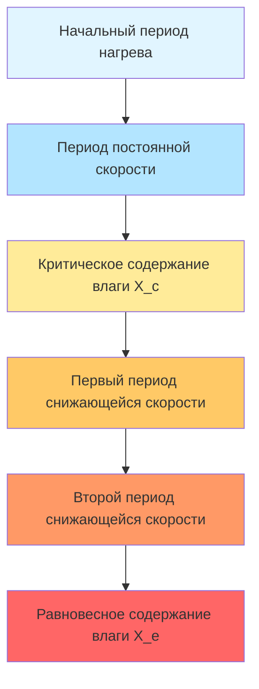
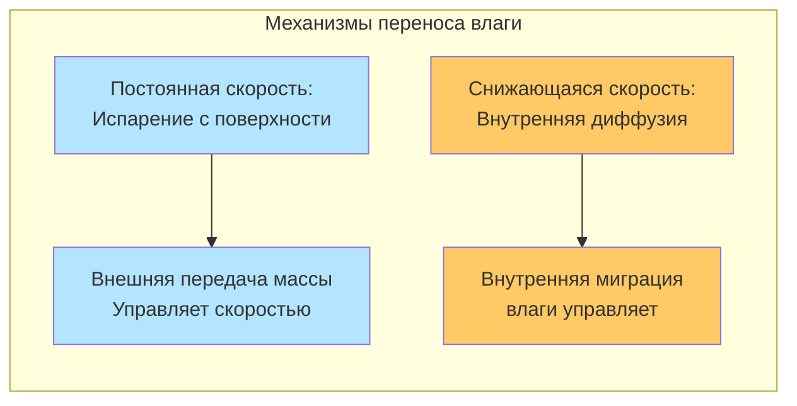

Промышленные процессы сушки демонстрируют различные фазы, характеризующиеся механизмами, контролирующими удаление влаги. Понимание перехода между периодами постоянной скорости и снижающейся скорости обеспечивает точное управление процессом, оптимизацию энергии и точное предсказание времени сушки гигроскопических материалов.

## Физические механизмы периодов сушки

### Период постоянной скорости

Во время периода постоянной скорости поверхность материала остается насыщенной жидкой водой. Свободная влага испаряется с поверхности со скоростью, определяемой исключительно внешними условиями: температурой воздуха, влажностью, скоростью и площадью открытой поверхности. Скорость сушки остается постоянной, потому что влага мигрирует из внутренней части материала на поверхность быстрее, чем она испаряется, поддерживая насыщение поверхности.

Скорость испарения в течение этого периода следует принципам конвективной передачи массы:

$$\dot{m}_w = h_m A_s (C_{s} - C_{\infty})$$

Где:
- $\dot{m}_w$ = скорость передачи массы водяного пара (кг/с)
- $h_m$ = коэффициент конвективной передачи массы (м/с)
- $A_s$ = площадь поверхности, подвергаемая воздушному потоку (м²)
- $C_s$ = концентрация пара при насыщенной поверхности (кг/м³)
- $C_{\infty}$ = концентрация пара в основном потоке воздуха (кг/м³)

Тепло, необходимое для испарения, уравновешивается конвективной передачей тепла от воздуха:

$$\dot{Q} = h_c A_s (T_{\infty} - T_s) = \dot{m}_w h_{fg}$$

Где:
- $h_c$ = коэффициент конвективной передачи тепла (Вт/м²·K)
- $T_{\infty}$ = температура основного потока воздуха (K)
- $T_s$ = температура поверхности (K)
- $h_{fg}$ = удельная теплота испарения (Дж/кг)

Во время сушки с постоянной скоростью температура поверхности равна температуре смоченного термометра сушильного воздуха. Это происходит потому, что охлаждение испарением точно уравновешивает конвективный нагрев, устанавливая тепловое равновесие при условии смоченного термометра.

### Критическое содержание влаги

Критическое содержание влаги ($X_c$) отмечает переходную точку, где насыщение поверхности больше не может быть достигнуто. В этом пороге скорость миграции влаги в материале становится недостаточной для восполнения испарения с поверхности. Критическое содержание влаги зависит от структуры материала, толщины, начального распределения влаги и условий сушки.

Для многих материалов:

$$X_c = f(R_c, D_{eff}, \rho_s, h_m)$$

Где:
- $R_c$ = характерный размер (толщина, радиус)
- $D_{eff}$ = эффективная диффузивность влаги (м²/с)
- $\rho_s$ = плотность сухого вещества (кг/м³)

Более тонкие материалы, более высокие скорости воздуха и повышенные температуры снижают критическое содержание влаги, потому что испарение с поверхности интенсифицируется относительно способности внутренней диффузии.

### Период снижающейся скорости

Когда содержание влаги падает ниже критического значения, скорость сушки прогрессивно снижается. Поверхность материала начинает высыхать, и плоскость испарения отступает во внутреннюю часть материала. Внутренняя диффузия влаги становится механизмом, ограничивающим скорость, а не внешняя конвекция.

Период снижающейся скорости обычно следует диффузионно-контролируемой кинетике:

$$\frac{dX}{dt} = -K(X - X_e)$$

Где:
- $X$ = содержание влаги (кг воды/кг сухого вещества)
- $t$ = время (с)
- $K$ = константа скорости сушки (1/с)
- $X_e$ = равновесное содержание влаги (кг/кг)

Для диффузионно-контролируемой сушки в простых геометриях применяется второй закон Фика:

$$\frac{\partial X}{\partial t} = D_{eff} \nabla^2 X$$

Эффективная диффузивность демонстрирует сильную температурную зависимость, следуя соотношению Аррениуса:

$$D_{eff} = D_0 \exp\left(-\frac{E_a}{RT}\right)$$

Где:
- $D_0$ = предэкспоненциальный множитель (м²/с)
- $E_a$ = энергия активации диффузии (Дж/моль)
- $R$ = универсальная газовая постоянная (8.314 Дж/моль·K)
- $T$ = абсолютная температура (K)

## Характеристики кривой сушки

## Сравнение периодов сушки

| Характеристика | Период постоянной скорости | Период снижающейся скорости |
|---|---|---|
| **Механизм, ограничивающий скорость** | Внешняя конвекция (передача тепла/массы) | Внутренняя диффузия |
| **Состояние поверхности** | Насыщено жидкой водой | Частично или полностью сухо |
| **Скорость сушки** | Постоянна, независима от содержания влаги | Снижается с содержанием влаги |
| **Температура поверхности** | Равна температуре смоченного термометра | Повышается к температуре сухого термометра |
| **Профиль влаги** | Относительно однородно во всем материале | Сильный градиент от центра к поверхности |
| **Влияние скорости воздуха** | Сильное влияние на скорость | Минимальное влияние на скорость |
| **Влияние температуры воздуха** | Линейное увеличение скорости | Экспоненциальное увеличение (влияет на диффузивность) |
| **Влияние толщины материала** | Влияет на длительность, не на скорость | Сильное влияние на скорость и длительность |
| **Энергоэффективность** | Высокая (прямое испарение) | Ниже (требуется проникновение тепла) |

## Инженерные приложения

### Расчет времени сушки

Общее время сушки равно сумме периодов постоянной и снижающейся скорости:

$$t_{total} = t_{constant} + t_{falling}$$

Для периода постоянной скорости:

$$t_{constant} = \frac{m_s(X_0 - X_c)}{R_c A_s}$$

Где:
- $m_s$ = масса сухого вещества (кг)
- $X_0$ = начальное содержание влаги (кг/кг)
- $R_c$ = постоянная скорость сушки (кг/м²·с)

Для периода снижающейся скорости (первого порядка приближение):

$$t_{falling} = \frac{m_s}{K A_s} \ln\left(\frac{X_c - X_e}{X_f - X_e}\right)$$

Где $X_f$ = конечное желаемое содержание влаги (кг/кг)

### Оптимизация процесса

Максимизация длительности периода постоянной скорости улучшает энергоэффективность и пропускную способность. Это требует поддержания влажности поверхности через надлежащую обработку материала, оптимизацию условий воздуха и контроль равномерности влажности поступающего материала. Сушка тонкого слоя, увеличенная площадь поверхности и оптимальная скорость воздуха улучшают производительность периода постоянной скорости.

Во время сушки со снижающейся скоростью повышение температуры воздуха увеличивает диффузивность более эффективно, чем повышение скорости воздуха. Однако существуют ограничения по температуре, основанные на качестве продукта, термической деградации и предотвращении коробления поверхности.

## Критические соображения

Равновесное содержание влаги представляет термодинамический предел, при котором давление пара на поверхности материала равно парциальному давлению в окружающем воздухе. Это значение зависит от гигроскопичности материала, температуры и относительной влажности в соответствии с изотермами сорбции. Сушка не может продолжаться ниже равновесного содержания влаги без изменения условий воздуха.

Коробление поверхности возникает, когда удаление влаги с поверхности значительно превышает внутреннюю миграцию, создавая непроницаемую сухую оболочку, которая задерживает внутреннюю влагу. Этот дефект возникает из-за чрезмерных скоростей сушки во время периода снижающейся скорости и требует контролируемых профилей температуры и влажности для предотвращения.

Понимание этих фундаментальных периодов обеспечивает рациональное проектирование сушилок, точное предсказание производительности и эффективное устранение неполадок при промышленных операциях сушки в переработке пищевых продуктов, фармацевтике, керамике, лесной промышленности и текстильном производстве.
