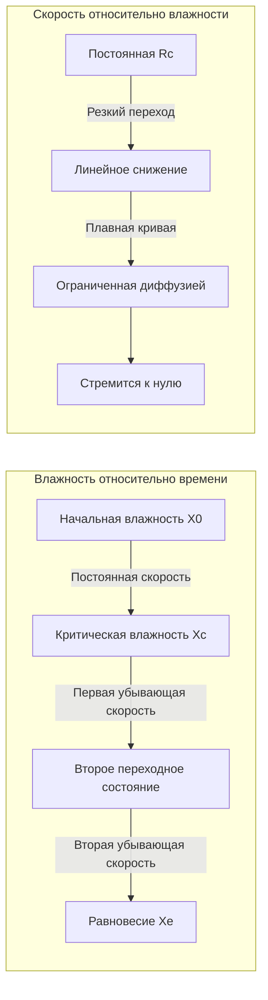
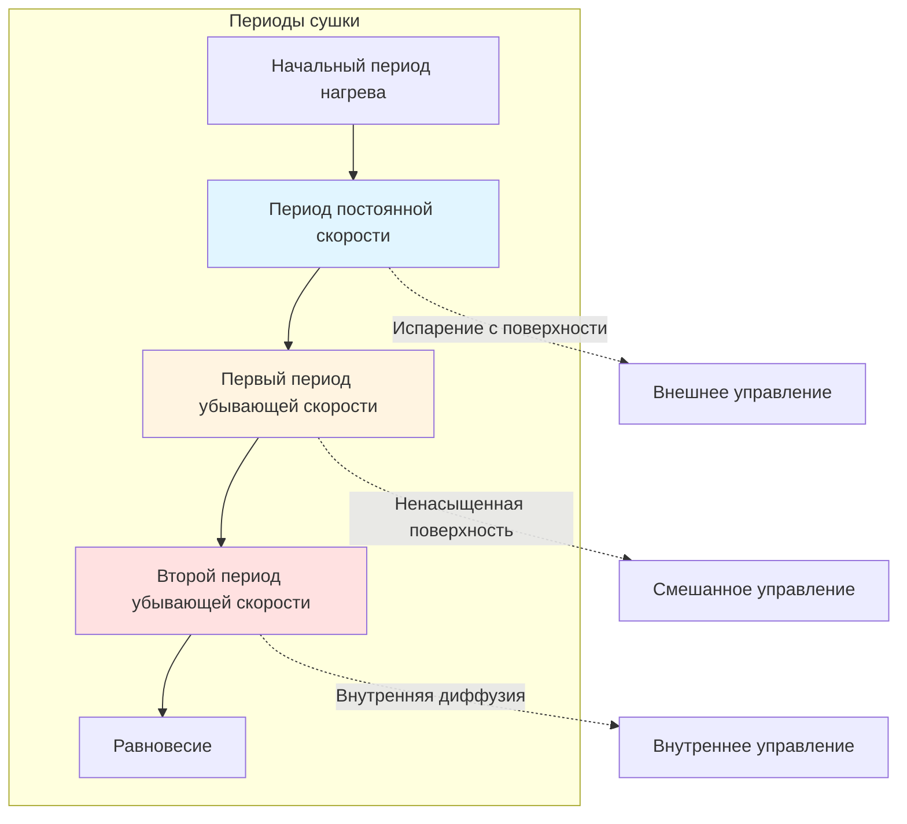

## Фундаментальная теория кривых сушки

Кривая сушки представляет собой отношение между влажностью и временем в процессе сушки. Это графическое представление выявляет основные механизмы массопередачи, контролирующие удаление влаги, и позволяет прогнозировать времена сушки для промышленных процессов.

При построении графика зависимости влажности от времени полученная кривая демонстрирует четкие периоды, характеризующиеся различными механизмами миграции влаги. Понимание этих периодов позволяет правильно проектировать сушилку, оптимизировать энергопотребление и разработать стратегию управления процессом.

## Определения содержания влаги

Свободная влажность в пересчете на абсолютно сухое вещество:

$$X = \frac{m_w}{m_s}$$

где:
- $X$ = содержание влаги (кг воды/кг сухого вещества)
- $m_w$ = масса воды (кг)
- $m_s$ = масса абсолютно сухого вещества (кг)

Отношение влажности (безразмерное):

$$MR = \frac{X - X_e}{X_0 - X_e}$$

где:
- $MR$ = отношение влажности (безразмерное)
- $X_0$ = начальное содержание влаги (кг/кг)
- $X_e$ = равновесное содержание влаги (кг/кг)
- $X$ = содержание влаги в момент времени $t$ (кг/кг)

## Характеристики кривой скорости сушки

Кривая скорости сушки отображает скорость сушки в зависимости от содержания влаги, выявляя критические точки перехода в процессе сушки.

Мгновенная скорость сушки:

$$R = -\frac{m_s}{A} \frac{dX}{dt}$$

где:
- $R$ = скорость сушки (кг/м²·с)
- $A$ = площадь поверхности сушки (м²)
- $t$ = время (с)

### Период постоянной скорости

В период постоянной скорости на поверхности материала присутствует достаточное количество свободной влаги для поддержания непрерывной жидкой пленки. Поверхность ведет себя как поверхность свободной воды, и испарение происходит при температуре влажного термометра воздуха сушки.

Скорость сушки в период постоянной скорости:

$$R_c = k_y(H_{sat,s} - H_a)$$

где:
- $R_c$ = скорость постоянной сушки (кг/м²·с)
- $k_y$ = коэффициент массопередачи (кг/м²·с)
- $H_{sat,s}$ = содержание влаги при насыщении поверхности (кг/кг)
- $H_a$ = содержание влаги в основном потоке воздуха (кг/кг)

Постоянная скорость сохраняется до достижения критической влажности $X_c$. В этой точке поверхность больше не может поставлять достаточно влаги для поддержания полного увлажнения поверхности.

### Период убывающей скорости

После того как содержание влаги падает ниже $X_c$, скорость сушки постепенно снижается. Этот период обычно контролируется двумя различными механизмами:

**Первый период убывающей скорости**: Частично увлажненная поверхность. Скорость сушки уменьшается линейно с уменьшением площади увлажненной поверхности:

$$R = R_c \frac{X - X_e}{X_c - X_e}$$

**Второй период убывающей скорости**: Управление внутренней диффузией. Миграция влаги из внутренней части к поверхности становится ограничивающей скоростью:

$$R = k_d \frac{\partial X}{\partial y}\bigg|_{y=0}$$

где:
- $k_d$ = коэффициент диффузии (м²/с)
- $y$ = расстояние от поверхности (м)

## Расчет времени сушки

Общее время сушки интегрирует вклады от периодов постоянной и убывающей скорости.

Время периода постоянной скорости:

$$t_c = \frac{m_s(X_0 - X_c)}{A \cdot R_c}$$

Время периода убывающей скорости (первый период убывающей скорости):

$$t_f = \frac{m_s(X_c - X_e)}{A \cdot R_c} \ln\left(\frac{X_c - X_e}{X_f - X_e}\right)$$

где $X_f$ — финальное содержание влаги.

## Характеристики кривой сушки

**Типичная последовательность кривой сушки:**

## Поведение сушки в зависимости от материала

| Тип материала | Критическая влажность Xc | Механизм убывающей скорости | Типичное время сушки |
|--------------|---------------------|------------------------|---------------------|
| Негигроскопичный пористый | 0,15–0,25 кг/кг | Капиллярный поток доминирует | Короткий период постоянной скорости |
| Гигроскопичный пористый | 0,30–0,60 кг/кг | Диффузия связанной воды | Продленный период убывающей скорости |
| Гранулярный сыпучий | 0,08–0,15 кг/кг | Испарение между частицами | Минимальный период постоянной скорости |
| Коллоидные/гелевые материалы | 0,80–2,00 кг/кг | Риск затвердевания поверхности | Продленная фаза диффузии |
| Плотный непористый | Очень низкий | Управление чистой диффузией | Отсутствует период постоянной скорости |

## Определение критической влажности

Критическая влажность $X_c$ зависит от:

1. **Структура материала**: распределение размера пор, связность капиллярной сети
2. **Условия сушки**: скорость воздуха, температура, влажность
3. **Толщина материала**: более толстые материалы достигают $X_c$ при более высоком содержании влаги
4. **Начальная влажность**: более высокое $X_0$ может увеличить $X_c$

Эмпирическая корреляция для пористых материалов:

$$X_c = X_e + k \cdot L^{0,5} \cdot R_c^{0,3}$$

где:
- $L$ = характеристическая толщина материала (м)
- $k$ = константа материала (определяется экспериментально)

## Практические применения

**Стратегия управления процессом:**
- Непрерывный контроль скорости сушки
- Обнаружение перехода к периоду убывающей скорости (точка оптимизации)
- Регулировка температуры и воздушного потока в зависимости от периода сушки
- Предотвращение избыточной сушки и потерь энергии

**Оптимизация энергии:**
- Максимальная эффективность испарения происходит в период постоянной скорости
- Повышение температуры воздуха в период убывающей скорости для поддержания приемлемых скоростей
- Снижение воздушного потока, когда внешняя массопередача больше не является ограничивающей скоростью

**Соображения качества:**
- Быстрая сушка при постоянной скорости может вызвать затвердевание поверхности
- Контролируемая убывающая скорость предотвращает растрескивание и коробление
- Равновесное содержание влаги определяет окончательную стабильность продукта

## Экспериментальное определение

Стандартная процедура для получения кривых сушки:

1. Подготовить образец материала с известной начальной влажностью $X_0$
2. Подвергнуть воздействию воздуха сушки с контролируемыми параметрами (постоянная $T$, $RH$, скорость)
3. Взвесить образец через регулярные интервалы без удаления из сушилки
4. Рассчитать содержание влаги и скорость сушки
5. Построить график $X$ в зависимости от $t$ и $R$ в зависимости от $X$
6. Определить $X_c$ в пересечении экстраполяций постоянной и убывающей скорости

Полученные кривые предоставляют данные проектирования, специфичные для материала и условий сушки, обеспечивая точное определение размеров сушилки и прогнозирование производительности.

## Заключение

Кривые сушки количественно оценивают основные механизмы удаления влаги, управляющие промышленными процессами сушки. Период постоянной скорости представляет управление внешней массопередачей, где психрометрические движущие силы доминируют. Период убывающей скорости отражает ограничения внутренней миграции влаги, где диффузия и капиллярный поток определяют производительность. Точная характеристика этих периодов с помощью экспериментальных кривых позволяет осуществлять точное проектирование сушилки, энергоэффективную эксплуатацию и обеспечение стабильного качества продукта.
