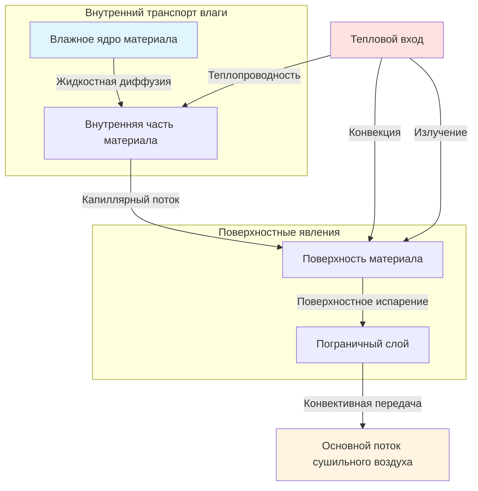

## Основы удаления влаги

Удаление влаги из материалов представляет основную цель промышленных систем сушки. Процесс включает одновременную теплопередачу и массопередачу, управляемые термодинамическими и транспортными свойствами как материала, так и сушильной среды. Понимание этих механизмов позволяет точно предсказывать время сушки, требования к энергии и качество конечного продукта.

## Механизмы передачи влаги

Три первичных механизма выводят влагу из внутренних слоёв материалов на поверхность и затем в сушильный воздух:

**Жидкостная диффузия**: Влага перемещается через материал в виде жидкой воды, движимая градиентами концентрации. Этот механизм преобладает на ранних стадиях сушки, когда содержание влаги остаётся высоким. Поток диффузии следует закону Фика:

$$J = -D \frac{\partial C}{\partial x}$$

где $J$ — поток влаги (кг/м²·с), $D$ — коэффициент диффузии (м²/с), и $\frac{\partial C}{\partial x}$ — градиент концентрации влаги (кг/м⁴).

**Паровая диффузия**: По мере истощения поверхностной влаги, внутренняя влага испаряется и диффундирует через поры и капилляры. Скорость паровой диффузии зависит от градиента парциального давления:

$$J_v = -D_v \frac{\partial P_v}{\partial x}$$

где $D_v$ — коэффициент паровой диффузии и $P_v$ — давление пара.

**Капиллярный поток**: В пористых материалах силы поверхностного натяжения направляют жидкую влагу через соединённые капилляры в сторону более сухих областей. Этот механизм становится значительным в гигроскопических материалах с хорошо определённой структурой пор.

## Уравнения скорости испарения

Скорость удаления влаги с поверхности материала зависит от разности давления пара между поверхностью и основным потоком воздуха:

$$\dot{m} = h_m A (C_s - C_\infty)$$

где:
- $\dot{m}$ = скорость испарения влаги (кг/с)
- $h_m$ = коэффициент массопередачи (м/с)
- $A$ = площадь поверхности (м²)
- $C_s$ = концентрация влаги на поверхности (кг/м³)
- $C_\infty$ = концентрация влаги в основном потоке воздуха (кг/м³)

Коэффициент массопередачи связан с коэффициентом конвективной теплопередачи соотношением Льюиса:

$$\frac{h_m}{h} = \frac{1}{\rho c_p Le^{2/3}}$$

где $Le = \frac{\alpha}{D}$ — число Льюиса, представляющее отношение тепловой диффузивности к массовой диффузивности.

## Периоды скорости сушки

Промышленная сушка происходит в отчётливых периодах, характеризуемых различными контролирующими механизмами:

**Период постоянной скорости**: Поверхностная влага испаряется с постоянной скоростью, полностью определяемой внешними условиями. Скорость сушки остаётся постоянной, поскольку миграция влаги из внутренних слоёв пополняет поверхностную влагу так быстро, как она испаряется:

$$\frac{dX}{dt} = -\frac{h_m A}{m_s}(Y_s - Y_\infty)$$

где $X$ — содержание влаги (по сухому веществу), $m_s$ — масса сухого вещества, и $Y$ представляет коэффициент влажности.

**Период падающей скорости**: Внутренний транспорт влаги становится ограничивающим фактором. Скорость сушки снижается по мере более медленной миграции влаги из истощённого внутреннего слоя:

$$\frac{dX}{dt} = -k(X - X_e)$$

где $k$ — постоянная сушки и $X_e$ — равновесное содержание влаги.

## Сравнение методов удаления влаги

| Метод | Механизм | Источник энергии | Типичная скорость | Применение | Эффективность |
|--------|-----------|---------------|--------------|--------------|------------|
| Конвективная сушка | Испарение + Конвекция | Горячий воздух | 0,5-5 кг/м²·ч | Общего назначения, зёрна, пиломатериалы | 25-60% |
| Кондуктивная сушка | Испарение + Теплопроводность | Нагретая поверхность | 2-10 кг/м²·ч | Пасты, суспензии, тонкие слои | 40-70% |
| Радиационная сушка | Испарение + Поглощение ИК | Инфракрасные лампы | 1-8 кг/м²·ч | Покрытия, текстиль, бумага | 50-80% |
| Вакуумная сушка | Испарение при пониженном давлении | Нагретые стенки | 0,1-2 кг/м²·ч | Теплочувствительные, фармацевтические | 60-85% |
| Лиофилизация | Сублимация | Вакуум + тепло | 0,05-0,5 кг/м²·ч | Биологические материалы, деликатесные продукты | 30-50% |
| Микроволновая сушка | Объёмный нагрев | Электромагнитное | 3-15 кг/м²·ч | Избирательный нагрев, быстрая сушка | 50-75% |

## Требования к энергии для удаления влаги

Минимальная теоретическая энергия для испарения влаги равна скрытой теплоте испарения:

$$Q_{min} = m_w h_{fg}$$

где $m_w$ — масса удалённой воды и $h_{fg}$ — скрытая теплота (приблизительно 2450 кДж/кг при атмосферном давлении).

Фактические требования к энергии превышают этот минимум из-за:

- Чувствительного нагрева материала и влаги
- Нагрева избыточного воздуха выше требуемого насыщения
- Потерь тепла через поверхности оборудования
- Энергии для преодоления сил связывания в гигроскопических материалах

Общее удельное потребление энергии обычно составляет от 3000-6000 кДж/кг удалённой воды:

$$q_{total} = h_{fg} + c_p \Delta T_{material} + \frac{Q_{losses}}{\dot{m}_w}$$

## Энергия связывания влаги

Материалы проявляют различные энергии связывания влаги в зависимости от взаимодействия влаги с твёрдым веществом. Дифференциальная теплота сорбции количественно определяет дополнительную энергию, требуемую сверх свободного испарения воды:

$$q_s = h_{fg} + \Delta h_b$$

где $\Delta h_b$ представляет энергию связывания, которая значительно увеличивается при низких содержаниях влаги в гигроскопических материалах.

## Практические соображения

**Равновесное содержание влаги**: Материалы не могут сохнуть ниже равновесного содержания влаги, соответствующего влажности сушильного воздуха. ЕМС следует изотермам сорбции, специфичным для каждого материала:

$$X_e = f(RH, T)$$

**Условия сушильного воздуха**: Оптимальная сушка требует баланса между температурой (движущая испарение) и влажностью (ёмкость переноса влаги). Психрометрические свойства сушильного воздуха определяют максимальный потенциал удаления влаги.

**Свойства материала**: Теплопроводность, проницаемость и диффузивность управляют скоростями внутреннего транспорта влаги. Плотные, непроницаемые материалы требуют значительно более длительного времени сушки, чем пористые, проницаемые структуры.

Понимание этих фундаментальных основ удаления влаги позволяет проектировать эффективные системы сушки, точно предсказывать время сушки и оптимизировать потребление энергии при сохранении спецификаций качества продукта.
