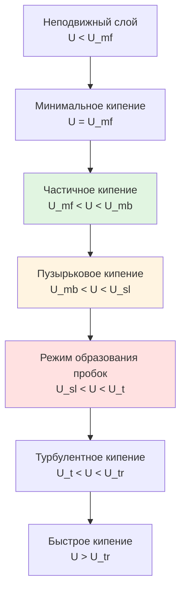
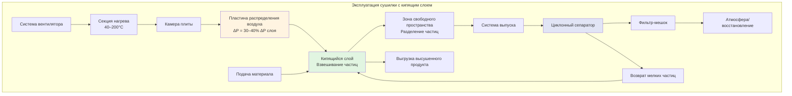

Сушилки с кипящим слоем взвешивают сыпучие материалы в потоке воздуха направленном вверх, создавая кипящееся состояние, которое обеспечивает быстрое и равномерное удаление влаги благодаря превосходному контакту газа и твёрдого вещества. Технология достигает коэффициентов теплопередачи и массопередачи в 3-10 раз выше, чем системы с неподвижным слоем, за счёт непрерывного перемешивания частиц и большой межфазной площади.

## Основы кипения

### Минимальная скорость кипения

Кипение происходит, когда скорость восходящего потока газа создаёт достаточную силу сопротивления, чтобы противостоять весу частиц и межчастичному трению. При минимальной скорости кипения ($U_{mf}$) частицы начинают разделяться и проявляют свойства жидкости. Уравнение Эргуна определяет падение давления через неподвижный слой:

$$\frac{\Delta P}{L} = \frac{150\mu U(1-\varepsilon)^2}{\phi^2 d_p^2 \varepsilon^3} + \frac{1.75\rho_g U^2(1-\varepsilon)}{\phi d_p \varepsilon^3}$$

Где:
- $\Delta P$ = падение давления через слой (Па)
- $L$ = глубина слоя (м)
- $\mu$ = динамическая вязкость газа (Па·с)
- $U$ = поверхностная скорость газа (м/с)
- $\varepsilon$ = доля пустот (безразмерная)
- $\phi$ = сферичность частиц (безразмерная)
- $d_p$ = диаметр частицы (м)
- $\rho_g$ = плотность газа (кг/м³)

При начальном кипении падение давления равно весу слоя на единицу площади:

$$\Delta P = (1-\varepsilon_{mf})(\rho_p - \rho_g)gL$$

Где $\varepsilon_{mf}$ — доля пустот при минимальном кипении, а $\rho_p$ — плотность частицы (кг/м³).

Для мелких частиц (Re < 20) упрощённая корреляция Вэня-Юя оценивает $U_{mf}$:

$$U_{mf} = \frac{d_p^2(\rho_p - \rho_g)g}{1650\mu}$$

Скорость работы обычно варьируется от 1,5 до 3,0 раз $U_{mf}$ для обеспечения стабильного кипения без избыточного уноса частиц.

### Классификация Гельдарта

Система классификации Гельдарта разделяет поведение кипения частиц на основе среднего размера частиц и разницы плотности:

| Группа Гельдарта | Размер частиц ($\mu$м) | Поведение | Применение |
|---|---|---|---|
| **Группа C** | < 30 | Когезионное, канализация, трудно кипит | Очень мелкие порошки, пигменты |
| **Группа A** | 30–100 | Частичное кипение, контролируемое пузырение | Фармацевтические продукты, катализаторы, лактоза |
| **Группа B** | 100–800 | Пузырьковое кипение, интенсивное перемешивание | Песок, сахар, гранулы, пищевые продукты |
| **Группа D** | > 800 | Спутниковое кипение, крупные пузыри, высокая скорость | Гранулы, кофейные зёрна, крупные гранулы |

Частицы группы A показывают плавное расширение перед началом пузырения. Частицы группы B начинают пузыриться сразу при превышении $U_{mf}$. Частицы группы D требуют высоких скоростей и часто используют конфигурации спутникового слоя.

### Режимы кипения

Где $U_{mb}$ = минимальная скорость пузырения, $U_{sl}$ = скорость образования пробок, $U_t$ = скорость падения, $U_{tr}$ = скорость транспорта.

## Механика взвешивания частиц

### Скорость падения

Скорость падения ($U_t$) представляет максимальную скорость газа, предотвращающую унос частиц:

$$U_t = \sqrt{\frac{4g d_p(\rho_p - \rho_g)}{3C_D \rho_g}}$$

Коэффициент сопротивления ($C_D$) зависит от числа Рейнольдса частицы ($Re_p = \rho_g U d_p / \mu$):

- **Ламинарный режим** ($Re_p$ < 0,4): $C_D = 24/Re_p$ (закон Стокса)
- **Промежуточный режим** (0,4 < $Re_p$ < 500): $C_D = 18,5/Re_p^{0,6}$
- **Турбулентный режим** ($Re_p$ > 500): $C_D \approx 0,44$

Операционное окно кипения существует между $U_{mf}$ и $U_t$, определяя стабильные условия работы.

### Эффекты распределения размера частиц

| Диапазон размера частиц | $U_{mf}$ (м/с) | $U_t$ (м/с) | Качество кипения | Типичный продукт |
|---|---|---|---|---|
| 20–50 $\mu$м | 0,001–0,005 | 0,05–0,2 | Когезионное, риск канализации | Фармацевтические порошки |
| 50–200 $\mu$м | 0,005–0,05 | 0,2–1,5 | Плавное, равномерное расширение | Гранулированный сахар, соль |
| 200–500 $\mu$м | 0,05–0,25 | 1,5–5,0 | Интенсивное пузырение | Кофе, хлопья |
| 500–2000 $\mu$м | 0,25–2,0 | 5,0–15,0 | Спутниковое кипение, высокая скорость | Крупные гранулы, орехи |

Широкие распределения размера частиц создают проблемы сегрегации, где мелкие частицы предпочтительно уносятся, а крупные частицы оседают. Коэффициент вариации распределения размеров должен оставаться ниже 30% для оптимальной производительности.

## Проектирование системы распределения воздуха

### Требования к пластине распределителя

Пластина распределения воздуха обеспечивает равномерный поток газа по сечению слоя, предотвращая мёртвые зоны и канализацию. Критические параметры проектирования:

**Критерий падения давления:**

$$\Delta P_{distributor} > 0,3 \times \Delta P_{bed}$$

Это соотношение предотвращает неправильное распределение газа и обеспечивает равномерное кипение по всей площади слоя.

**Расчёт открытой площади:**

$$A_{open} = \frac{n \pi d_{hole}^2}{4A_{total}}$$

Где $n$ = количество отверстий, $d_{hole}$ = диаметр отверстия, $A_{total}$ = общая площадь пластины.

Открытая площадь обычно варьируется от 3–10% в зависимости от размера частиц и требований к падению давления.

### Типы распределителей

| Тип распределителя | Падение давления (Па) | Применение | Преимущества | Недостатки |
|---|---|---|---|---|
| **Перфорированная пластина** | 500–2000 | Общего назначения, частицы группы B/D | Простая, низкая стоимость, легко чистить | Риск обратного потока частиц |
| **Спечённый металл** | 1000–5000 | Мелкие порошки, частицы группы A | Отличная равномерность, высокое ΔP | Дорогая, трудно чистить |
| **Колпачковые распределители** | 800–3000 | Крупные частицы, высокая скорость | Предотвращает обратный поток, гибкая | Сложное изготовление |
| **Сетка сопел** | 1500–4000 | Крупные частицы, операции покрытия | Высокоскоростные струи, хорошее перемешивание | Выше стоимость, техническое обслуживание |
| **Конический распределитель** | 600–2500 | Выгрузка продукта, периодические системы | Облегчает выгрузку, равномерный поток | Требует индивидуального проектирования |

**Шаг отверстий:** Треугольный шаг с расстоянием в 3–6 раз диаметр отверстия обеспечивает равномерное распределение. Диаметр отверстия варьируется от 1–10 мм в зависимости от размера частиц — отверстия должны быть 1/3 или 1/5 минимального диаметра частицы для предотвращения обратного проседания частиц.

### Распределение скорости газа

## Анализ теплопередачи

### Конвективная теплопередача

Теплопередача в сушилках с кипящим слоем происходит в основном через конвекцию газа к частицам. Объёмный коэффициент теплопередачи ($h_v$) варьируется от 300–3000 Вт/м³К в зависимости от размера частиц и интенсивности кипения:

$$h_v = h \times A_s$$

Где $h$ = коэффициент теплопередачи частицы (Вт/м²К) и $A_s$ = площадь поверхности частицы на единицу объёма слоя (м²/м³).

Коэффициент теплопередачи отдельной частицы:

$$h = \frac{Nu \times k_g}{d_p}$$

Корреляции чисел Нуссельта для кипящихся слоёв:

**Корреляция Гупты-Бикмана:**

$$Nu = 0,03 Re_p^{1,3}$$

Действительна для $Re_p$ > 300.

**Корреляция Ранца-Маршалла (меньшие частицы):**

$$Nu = 2,0 + 0,6 Re_p^{0,5} Pr^{0,33}$$

Где $Pr = c_p \mu / k_g$ — число Прандтля, $c_p$ = удельная теплоёмкость газа, $k_g$ = теплопроводность газа.

### Диапазоны рабочих параметров

| Параметр | Диапазон | Типичное значение | Эффект на производительность |
|---|---|---|---|
| **Температура входящего воздуха** | 40–200°C | 80–120°C | Выше = быстрее сушка, риск тепловых напряжений |
| **Скорость входящего воздуха** | 0,3–3,0 м/с | 0,5–1,5 м/с | Должна превышать $U_{mf}$, избегать $U_t$ |
| **Температура слоя** | 30–120°C | 50–80°C | Контрольная точка качества продукта |
| **Глубина слоя (статическая)** | 0,1–1,0 м | 0,3–0,6 м | Глубже = выше ΔP, дольше время пребывания |
| **Коэффициент расширения** | 1,2–3,0 | 1,5–2,5 | Выше = лучше перемешивание, риск потери частиц |
| **Время пребывания** | 1–60 мин | 10–30 мин | Зависит от продукта и влажности |
| **Относительная влажность (выпуск)** | 40–90% | 60–80% | Указывает на эффективность сушки |

### Кинетика сушки

Скорость удаления влаги в период постоянной скорости:

$$\frac{dM}{dt} = \frac{h A (T_g - T_p)}{\lambda}$$

Где:
- $M$ = содержание влаги (кг воды/кг сухого вещества)
- $t$ = время (с)
- $A$ = общая площадь поверхности частиц (м²)
- $T_g$ = температура газа (К)
- $T_p$ = температура частицы (К)
- $\lambda$ = скрытая теплота испарения (Дж/кг)

Во время периода убывающей скорости внутренняя диффузия определяет процесс:

$$\frac{dM}{dt} = -k(M - M_e)$$

Где $k$ = константа сушки (1/с) и $M_e$ = равновесное содержание влаги.

## Стратегии управления процессом

### Критические переменные управления

| Переменная управления | Измерение | Метод управления | Допустимый диапазон |
|---|---|---|---|
| **Температура слоя** | ДПС, термопара | ПИД-управление температурой входящего воздуха | ±2–5°C |
| **Температура входящего воздуха** | ДПС | Модулирующий электрический/паровой нагреватель | ±3°C |
| **Падение давления** | Датчик дифференциального давления | Указывает качество кипения | ±10% уставки |
| **Скорость воздушного потока** | Трубка Пито, вентури | ЧРП вентилятора | ±5% уставки |
| **Влажность продукта** | ИК спектроскопия, LOD проба | Регулировка времени пребывания | ±0,5% цели |
| **Влажность выпуска** | Ёмкостной/датчик точки росы | Индикатор конечной точки процесса | Зависит от процесса |

**Мониторинг кипения:** Падение давления через слой обеспечивает контроль кипения в реальном времени. Стабильное ΔP указывает на правильное кипение; колеблющееся ΔP предполагает режим пузырения; уменьшающееся ΔP указывает на канализацию или дефлюидизацию.

## Промышленные применения

**Фармацевтический сектор:**
- Сушка гранулята после влажного гранулирования (циклы 15–60 мин)
- Сушка кристаллизованного активного вещества при контролируемых температурах (< 60°C)
- Покрытие Вюрстера для таблеток с контролируемым выпуском
- Сушка гранул после сфероидизации (время пребывания 10–30 мин)

**Пищевая промышленность:**
- Агломерация растворимого кофе и молочного порошка
- Сушка хлопьев для завтрака и регулировка влажности (5–15 мин)
- Сушка специй и трав при низких температурах (40–70°C)
- Обжарка орехов и стандартизация влажности

**Химическая промышленность:**
- Сушка катализаторов и активация
- Сушка полимерного порошка после полимеризации
- Сушка гранул удобрений
- Обработка порошка моющих средств

**Стандарты проектирования:**
- ASME BPE для фармацевтических применений (санитарный дизайн)
- FDA 21 CFR часть 11 для электронных записей (валидация процесса)
- NFPA 68/69 для предотвращения/подавления взрывов (обработка растворителей)
- Стандарты 3-A для пищевого оборудования

Улучшения энергоэффективности включают восстановление тепла выпускного воздуха (15–30% экономия энергии), осушение рециркулируемого воздуха во влажном климате и переменные частотные приводы для оптимизации вентилятора. Современные системы достигают удельного энергопотребления 2500–4500 кДж/кг испарённой воды.

Выбор сушилки с кипящим слоем требует комплексной характеристики частиц (распределение размера, плотность, содержание влаги), термодинамического анализа (психрометрия, расчёты теплопередачи) и требований процесса (пропускная способность, конечная влажность, чувствительность к температуре) для достижения оптимального удаления влаги при сохранении целостности продукта.
