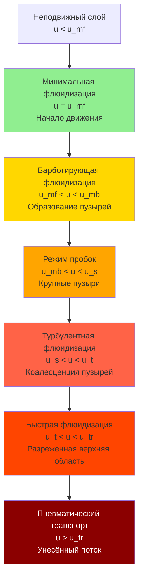

Флюидизация преобразует статический слой твёрдых частиц в состояние, подобное жидкости, благодаря восходящему потоку газа, создавая интенсивный контакт газа и твёрдого тела, необходимый для эффективной теплопередачи и массопередачи в промышленных операциях сушки. Понимание физики, управляющей этим переходом, является основополагающим для эффективного проектирования и эксплуатации сушилок с кипящим слоем.

## Фундаментальная механика флюидизации

Когда газ течёт вверх через слой частиц, система проходит через различные режимы потока по мере увеличения скорости. При низких скоростях газ фильтруется через межзёренные пространства, при этом частицы остаются неподвижными. По мере увеличения скорости силы сопротивления на отдельных частицах возрастают, пока не уравновесят эффективный вес слоя. В этой критической точке, называемой минимальной флюидизацией, слой переходит из неподвижного состояния в взвешенное.

Перепад давления на флюидизированном слое равен весу частиц на единицу площади поперечного сечения:

$$\Delta P = (1 - \varepsilon_{mf}) \cdot (\rho_p - \rho_g) \cdot g \cdot H_{mf}$$

Где $\varepsilon_{mf}$ — пористость при минимальной флюидизации, $\rho_p$ — плотность частицы, $\rho_g$ — плотность газа, $g$ — ускорение свободного падения, $H_{mf}$ — высота слоя при минимальной флюидизации.

## Минимальная скорость флюидизации

Уравнение Эргуна описывает перепад давления через неподвижные слои и составляет основу для расчёта минимальной скорости флюидизации. Для сферических частиц корреляция даёт:

$$\frac{1.75}{(\varepsilon_{mf})^3} \cdot Re_{mf}^2 + \frac{150(1-\varepsilon_{mf})}{(\varepsilon_{mf})^3} \cdot Re_{mf} = Ar$$

Число Рейнольдса частицы при минимальной флюидизации:

$$Re_{mf} = \frac{\rho_g \cdot u_{mf} \cdot d_p}{\mu_g}$$

Число Архимеда характеризует свойства системы частица-жидкость:

$$Ar = \frac{d_p^3 \cdot \rho_g \cdot (\rho_p - \rho_g) \cdot g}{\mu_g^2}$$

Где $u_{mf}$ — минимальная скорость флюидизации, $d_p$ — диаметр частицы, $\mu_g$ — динамическая вязкость газа.

Для мелких частиц (Ar < 20) корреляция Вэня-Юя упрощает прогноз:

$$Re_{mf} = (33.7^2 + 0.0408 \cdot Ar)^{0.5} - 33.7$$

Эта зависимость показывает, что минимальная скорость флюидизации возрастает с размером и плотностью частицы и уменьшается с вязкостью газа.

## Характеристики режимов флюидизации

При скоростях выше минимальной флюидизации поведение слоя сильно зависит от поверхностной скорости газа. Рабочий режим определяет коэффициенты теплопередачи, интенсивность перемешивания и скорость истирания частиц.

### Классификация частиц по поведению при флюидизации

Гельдарт классифицировал частицы на четыре группы на основе разности плотностей и среднего размера частицы:

| Группа Гельдарта | Размер частицы | Разность плотностей | Характер флюидизации | Типичные материалы |
|---------------|---------------|-------------------|------------------------|-------------------|
| Группа C | < 30 мкм | Переменная | Когезионные, трудно флюидизируемые | Мука, крахмал, тонкие катализаторы |
| Группа A | 30–100 мкм | < 1.4 г/см³ | Аэрируемые, плавная флюидизация | Катализаторы каталитического крекинга |
| Группа B | 100–800 мкм | 1.4–4.0 г/см³ | Барботирующие, энергичное действие | Песок, стеклянные шарики, семена |
| Группа D | > 800 мкм | > 4.0 г/см³ | Фонтанирующие, требуют высокой скорости | Крупные частицы, металлические руды |

## Выбор рабочей скорости

Рабочая скорость должна превышать минимальную флюидизацию, но оставаться ниже конечной скорости падения, чтобы предотвратить чрезмерный унос частиц:

$$u_t = \left[\frac{4 \cdot d_p \cdot (\rho_p - \rho_g) \cdot g}{3 \cdot C_D \cdot \rho_g}\right]^{0.5}$$

Где $C_D$ — коэффициент сопротивления, который зависит от числа Рейнольдса частицы. Для большинства промышленных приложений:

$$\frac{u_{op}}{u_{mf}} = 2.0 \text{ до } 5.0$$

Это отношение обеспечивает адекватное перемешивание и теплопередачу при минимизации потерь от уноса. Более высокие отношения увеличивают размер пузырей и уменьшают однородность слоя.

## Расширение слоя и пористость

При увеличении скорости выше минимальной флюидизации слой расширяется и пористость возрастает. Для барботирующих слоёв корреляция Ричардсона-Зейки прогнозирует расширение:

$$\frac{u}{u_t} = \varepsilon^n$$

Показатель степени $n$ варьируется от 2.4 до 4.6 в зависимости от числа Рейнольдса частицы. Высота слоя при рабочих условиях связана с высотой при минимальной флюидизации:

$$\frac{H}{H_{mf}} = \frac{1 - \varepsilon_{mf}}{1 - \varepsilon}$$

## Соображения по теплопередаче

Максимальные коэффициенты теплопередачи достигаются в режиме барботирующей флюидизации при умеренных скоростях газа. Коэффициент достигает максимума при:

$$u_{opt} \approx (2-3) \cdot u_{mf}$$

Более высокие скорости сокращают время пребывания частиц возле поверхностей теплопередачи и уменьшают коэффициенты. Типичные значения составляют 200–600 Вт/м²·К для большинства промышленных систем, что значительно превышает производительность неподвижного слоя.

## Характеристики перепада давления

Зависимость перепада давления от скорости предоставляет диагностическую информацию о состоянии слоя. Правильно работающий флюидизированный слой поддерживает постоянный перепад давления выше минимальной флюидизации, независимо от скорости газа. Увеличение перепада давления со скоростью выше этой точки указывает на пробивание газа, агломерацию или неадекватное проектирование распределителя.

Перепад давления на распределителе должен составлять 20–40% от перепада давления в слое, чтобы обеспечить равномерное распределение газа и предотвратить пробивание газа. Это требование напрямую влияет на потребление энергии вентилятором и должно быть сбалансировано с операционной однородностью.

## Стандарты и справочные материалы по проектированию

Стандарты ASME предоставляют руководство по проектированию сосудов под давлением, содержащих системы с кипящим слоем. Ключевые соображения включают:

- Проектирование распределительной пластины согласно API 650 для обеспечения структурной целостности
- Определение высоты свободного пространства для минимизации потерь от уноса
- Проектирование циклонного сепаратора для восстановления мелких частиц
- Требования по взрывному разгерметизированию согласно NFPA 68 для горючих материалов

Понимание фундаментальных принципов флюидизации позволяет инженерам прогнозировать поведение слоя, оптимизировать рабочие условия и решать проблемы производительности в промышленных приложениях сушки. Переход от неподвижного слоя в флюидизированное состояние представляет критический рабочий параметр, определяющий общую эффективность системы и качество продукта.
