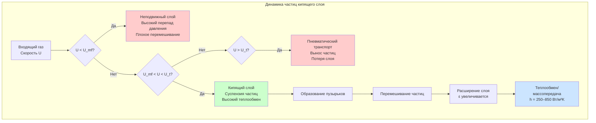

## Фундаментальная физика суспензии частиц

Суспензия частиц в сушилках кипящего слоя представляет критический переход между статическим насыпным слоем и состоянием кипения, при котором твёрдые частицы ведут себя как жидкость. Это явление происходит, когда восходящий поток газа создаёт достаточную силу лобового сопротивления для противодействия гравитационной силе на частицы, создавая оптимальные условия для теплообмена и массопередачи в промышленных операциях сушки.

Процесс кипения зависит от достижения точного баланса между силами лобового сопротивления жидкости и весом частиц. Когда скорость газа достигает минимальной скорости кипения, перепад давления на слое равен весу слоя на единицу площади. Это условие равновесия обеспечивает равномерное перемешивание частиц, максимальное увеличение площади поверхности и повышенные коэффициенты теплопередачи, которые могут достигать 250–850 Вт/(м²·К), что значительно выше, чем в неподвижных слоях.

## Минимальная скорость кипения

Минимальная скорость кипения (U_mf) представляет критическую поверхностную скорость газа, при которой начинается кипение. Для этого условия перепад давления на слое равен выталкивающему весу частиц:

$$\Delta P = \frac{(1-\varepsilon_{mf})(\rho_p - \rho_g)gH}{}$$

где ε_mf — доля пустого пространства при минимальном кипении (обычно 0,40–0,45 для сферических частиц), ρ_p — плотность частицы, ρ_g — плотность газа, g — ускорение свободного падения, H — высота слоя.

Уравнение Эргуна обеспечивает фундаментальное соотношение для расчёта U_mf путём приравнивания перепада давления весу слоя:

$$\frac{150(1-\varepsilon_{mf})^2 \mu U_{mf}}{\varepsilon_{mf}^3 \phi^2 d_p^2} + \frac{1.75(1-\varepsilon_{mf})\rho_g U_{mf}^2}{\varepsilon_{mf}^3 \phi d_p} = (1-\varepsilon_{mf})(\rho_p - \rho_g)g$$

где μ — динамическая вязкость газа, φ — сферичность частицы (0,6–1,0), d_p — диаметр частицы. Уравнение состоит из вязких (ламинарных) и инерционных (турбулентных) членов, причём вязкий член доминирует для мелких частиц, а инерционный член — для крупных частиц.

Для инженерных расчётов корреляция Вэна и Ю упрощает определение U_mf:

$$Re_{mf} = \sqrt{(33.7)^2 + 0.0408 \cdot Ar} - 33.7$$

где Re_mf = (ρ_g U_mf d_p)/μ — число Рейнольдса при минимальном кипении, Ar — число Архимеда:

$$Ar = \frac{d_p^3 \rho_g (\rho_p - \rho_g) g}{\mu^2}$$

## Скорость витания и рабочее окно

Скорость витания (U_t) представляет максимальную поверхностную скорость до выноса частиц. Для сферических частиц скорость витания вытекает из баланса сил:

$$U_t = \sqrt{\frac{4 d_p (\rho_p - \rho_g) g}{3 C_D \rho_g}}$$

где C_D — коэффициент лобового сопротивления, который варьирует с числом Рейнольдса. Диапазон рабочей скорости для стабильного кипения находится между U_mf и U_t, обеспечивая окно проектирования:

$$1.5 U_{mf} < U_{op} < 0.8 U_t$$

Типичные рабочие скорости варьируют от 0,3–3,0 м/с в зависимости от свойств частиц, причём крупные частицы требуют более высоких скоростей.

## Динамика расширения слоя

Корреляция Ричардсона-Заки описывает расширение слоя как функцию поверхностной скорости газа:

$$\frac{U}{U_t} = \varepsilon^n$$

где ε — пористость слоя и n — показатель расширения (обычно 2,4–4,6, уменьшается с увеличением числа Рейнольдса). Коэффициент расширения слоя составляет:

$$\frac{H}{H_{mf}} = \frac{1-\varepsilon_{mf}}{1-\varepsilon}$$

Это соотношение позволяет предсказать высоту слоя при любой рабочей скорости, что критично для проектирования свободного пространства и предотвращения выноса частиц.

## Эффекты характеристик частиц

Свойства частиц принципиально влияют на поведение суспензии и производительность системы:

| Свойство | Диапазон | Эффект на кипение | Воздействие на проектирование |
|----------|----------|------------------|------------------------------|
| Диаметр частицы | 50–500 мкм (Группа А) | Низкая U_mf, плавное кипение | Меньшая мощность вентилятора, лучшее управление |
| Диаметр частицы | 500–2000 мкм (Группа В) | Умеренная U_mf, слой с пузырьками | Умеренная мощность, хорошее перемешивание |
| Диаметр частицы | >2000 мкм (Группа D) | Высокая U_mf, поведение фонтанирования | Высокая требуемая мощность |
| Плотность частицы | 700–1200 кг/м³ | Умеренная сила суспензии | Стандартное проектирование распределителя |
| Плотность частицы | 1200–2500 кг/м³ | Требуется высокая сила суспензии | Необходим усиленный распределитель |
| Сферичность | 0,6–0,8 (неправильная) | Увеличенная U_mf (30–50%) | Более высокая рабочая скорость |
| Сферичность | 0,9–1,0 (сферическая) | Минимальная U_mf | Оптимальная эффективность |
| Влажность | 0–5% (сухая) | Минимальная адгезия | Свободное течение |
| Влажность | 10–30% (влажная) | Сильная адгезия, канализирование | Может требоваться предварительная сушка |

## Инженерные соображения проектирования

**Проектирование пластины распределителя:** Перепад давления на распределителе должен превышать 30–40% перепада давления слоя для обеспечения равномерного распределения газа:

$$\Delta P_{distributor} = 0.3-0.4 \cdot \Delta P_{bed}$$

Открытая площадь обычно составляет 5–15% общей площади поперечного сечения, с диаметрами отверстий 2–5 мм для предотвращения просыпания частиц при поддержании равномерного потока.

**Высота свободного пространства:** Адекватное свободное пространство предотвращает вынос частиц и позволяет отделение пузырьков. Высота транспортного разделения (TDH), при которой вынос частиц становится незначительным, обычно варьирует от 1,5–4,0 кратных диаметра слоя в зависимости от распределения размера частиц и рабочей скорости.

**Распределение размера частиц:** Широкие распределения размеров вызывают проблемы сегрегации, с концентрацией мелких частиц вблизи поверхности слоя. Для оптимальной производительности поддерживайте отношение размера частиц (d_max/d_min) ниже 3:1 или используйте системы классификации для непрерывного удаления мелких частиц.

**Соотношения масштабирования:** Качество кипения ухудшается с увеличением диаметра слоя из-за роста пузырьков. Поддерживайте подобие чисел Фруда:

$$Fr = \frac{U^2}{gD} = constant$$

где D — диаметр слоя, для сохранения гидродинамического поведения при масштабировании.

## Стандарты и ссылки проектирования

Проектирование суспензии частиц следует ASME BPVC Section VIII для требований сосудов под давлением при работе выше атмосферного давления. Процедура испытания оборудования AIChE для сушилок кипящего слоя предусматривает протоколы испытаний для экспериментального определения U_mf. Для фармацевтических приложений FDA CFR Title 21 Part 11 регулирует требования управления процессом и валидации.

Экспериментальное определение U_mf путём кривых перепада давления в зависимости от скорости остаётся наиболее надёжным подходом к проектированию, особенно для несферических частиц или полидисперсных систем, где корреляции вводят неопределённость 20–40%.
