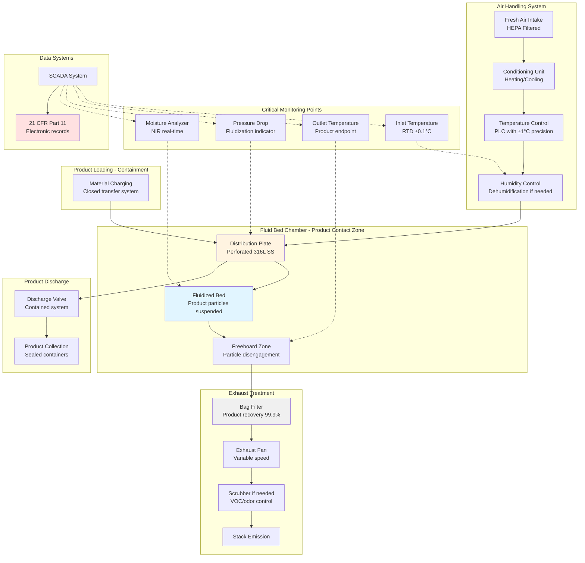

## Физика фармацевтической и пищевой сушки с кипящим слоем

Сушилки с кипящим слоем для фармацевтической и пищевой промышленности работают в условиях самых строгих нормативных требований промышленной сушки. Фундаментальная физика остается физикой тепло- и массопередачи, но ограничения целостности продукта, предотвращения загрязнения и валидации процесса требуют точного управления HVAC, превосходящего обычные промышленные приложения.

### Массопередача в регулируемых средах

Скорость сушки в фармацевтических и пищевых приложениях следует закону Фика, но деградация продукта ограничивает условия эксплуатации:

$$\frac{dm}{dt} = -h_m A (C_s - C_\infty)$$

Где:
- $\frac{dm}{dt}$ = скорость массопередачи (кг/с)
- $h_m$ = коэффициент массопередачи (м/с)
- $A$ = площадь поверхности частицы (м²)
- $C_s$ = концентрация влаги на поверхности (кг/м³)
- $C_\infty$ = концентрация влаги в объеме воздуха (кг/м³)

Для фармацевтических гранул и пищевых частиц коэффициент массопередачи зависит от числа Рейнольдса частицы:

$$Sh = 2 + 0.6 Re_p^{0.5} Sc^{0.33}$$

Число Шервуда (Sh) определяет коэффициент массопередачи, а число Шмидта (Sc) характеризует свойства жидкости. Это соотношение определяет скорость удаления влаги из частицы без термической деградации.

### Энергетический баланс и управление температурой продукта

Критическое ограничение при фармацевтической и пищевой сушке — поддержание температуры продукта ниже пороговой деградации при достижении целевого содержания влаги. Энергетический баланс для отдельной частицы:

$$m_p c_p \frac{dT_p}{dt} = h A (T_g - T_p) - \lambda \frac{dm}{dt}$$

Где:
- $m_p$ = масса частицы (кг)
- $c_p$ = удельная теплоемкость частицы (Дж/кг·К)
- $T_p$ = температура частицы (К)
- $T_g$ = температура газа (К)
- $h$ = коэффициент конвективной теплопередачи (Вт/м²·К)
- $\lambda$ = скрытая теплота испарения (Дж/кг)

Температура частицы остается при температуре термометра смоченного луковицы во время периода постоянной скорости, обеспечивая тепловую защиту. По мере начала периода убывающей скорости температура продукта повышается в направлении температуры газа, требуя тщательного управления температурой на выходе.

### Психрометрическое управление для обеспечения качества

Фармацевтические и пищевые продукты требуют точного управления влажностью, чтобы предотвратить чрезмерную сушку (потеря качеств продукта) или неполную сушку (риск микробного роста). Абсолютная влажность подаваемого воздуха определяет движущую силу сушки:

$$Y = 0.622 \frac{P_v}{P - P_v}$$

Где:
- $Y$ = коэффициент влажности (кг воды/кг сухого воздуха)
- $P_v$ = парциальное давление водяного пара (Па)
- $P$ = полное давление (Па)

Емкость удаления влаги воздухом увеличивается с температурой, но уменьшается с влажностью входящего воздуха. Для чувствительных к температуре продуктов осушенный входящий воздух позволяет использовать более низкие температуры газа при сохранении скоростей сушки.

## Требования к сушилкам с кипящим слоем для фармацевтической промышленности

### Соответствие cGMP и валидация

FDA 21 CFR Часть 211 требует, чтобы оборудование фармацевтического производства было надлежащего конструкции, адекватного размера и надлежащим образом расположено для облегчения операций по предусмотренному использованию и очистки и обслуживания. Для сушилок с кипящим слоем это переводится в:

**Критические элементы проектирования:**
- Все контактирующие с продуктом поверхности из нержавеющей стали 316L с электрополированной отделкой (Ra < 0,4 мкм)
- Валидация очищаемости, демонстрирующая удаление остатков ниже пределов обнаружения
- Отсутствие тупиковых участков или зон потенциального накопления продукта
- HEPA-фильтрованный входящий воздух (ISO 7 или лучше для стерильных продуктов)
- Системы локализации для мощных соединений (OEB 3-5)

**Требования валидации процесса:**
- Квалификация установки (IQ): оборудование установлено в соответствии со спецификациями
- Квалификация эксплуатации (OQ): параметры эксплуатации в пределах диапазонов проектирования
- Квалификация производительности (PQ): согласованное качество продукта в трех последовательных партиях

Тепловая квалификация включает исследования распределения температуры, демонстрирующие однородность в пределах ±2°C во всем продуктовом слое.

### Фармацевтические применения и параметры

| Применение | Входящая температура (°C) | Выходящая температура (°C) | Температура продукта (°C) | Время сушки (мин) | Конечная влажность (%) |
|-------------|----------------------------|---------------------------|--------------------------|-------------------|-----------------------|
| Гранулы для таблеток | 60-80 | 40-50 | 35-45 | 30-90 | 2-4 |
| Сушка API | 40-60 | 30-40 | 25-35 | 60-180 | 0,5-2 |
| Сушка после нанесения покрытия на гранулы | 50-70 | 35-45 | 30-40 | 20-60 | 1-3 |
| Лиофилизированные продукты | 30-50 | 25-35 | 20-30 | 90-240 | 1-5 |

Действующие фармацевтические ингредиенты (API) часто требуют инертной газовой среды (азот) для предотвращения окисления, добавляя сложность в психрометрические расчеты и требуя взрывозащитных электрических систем.

## Сушка с кипящим слоем в пищевой промышленности

### Пищевая безопасность и нормативная база

Сушилки с кипящим слоем пищевого класса должны соответствовать Закону о модернизации пищевой безопасности (FSMA) FDA и применимым требованиям HACCP. Система HVAC становится критической контрольной точкой (CCP) при использовании тепловой обработки для достижения микробного снижения.

**Требования санитарного проектирования:**
- 3-A Sanitary Standards для конструкции
- Наклонные поверхности (минимум 2%) для дренажа
- Доступность для ежедневной очистки и проверки
- Материалы, одобренные для пищевого контакта (NSF/ANSI 51)

В отличие от фармацевтических приложений, пищевые продукты часто допускают более высокие температуры, но требуют тщательного контроля, чтобы предотвратить корковое затвердевание, при котором поверхность высыхает быстро, запирая влагу в ядре.

### Пищевые продукты

| Продукт | Входящая температура (°C) | Температура продукта (°C) | Размер частиц (мм) | Конечная влажность (%) | Критический параметр качества |
|---------|--------------------------|--------------------------|-------------------|------------------------|-------------------------------|
| Кофе растворимый | 120-150 | 80-100 | 0,5-3 | 3-5 | Сохранение аромата |
| Молочный порошок | 70-100 | 50-70 | 0,1-0,5 | 3-4 | Индекс растворимости |
| Завтрак из хлопьев | 140-180 | 90-120 | 3-10 | 2-3 | Хрустящая текстура |
| Высушенные овощи | 60-80 | 45-60 | 5-15 | 5-8 | Сохранение цвета |
| Протеиновые концентраты | 50-70 | 40-50 | 0,2-1 | 4-6 | Денатурация белка |

## Сравнение фармацевтического и пищевого применения

| Требование | Фармацевтическое | Пищевое |
|------------|-----------------|---------|
| Материал | 316L электрополированная SS | 304 SS или 316 SS |
| Отделка поверхности | Ra < 0,4 мкм | Ra < 0,8 мкм |
| Качество входящего воздуха | HEPA фильтр (ISO 7) | MERV 13-15 фильтр |
| Валидация | требуется IQ/OQ/PQ | валидация процесса опциональна |
| Документация | Записи партии в соответствии с 21 CFR 211 | Производственные записи в соответствии с FSMA |
| Протокол очистки | Валидированные процедуры очистки | SOP по санитизации |
| Управление температурой | ±1-2°C | ±3-5°C |
| Прослеживаемость партии | Полная история требуется | Отслеживание партии требуется |

## Процесс и управляющие системы

## Расчеты воздушного потока для минимальной флюидизации

Минимальная скорость флюидизации критична для проектирования процесса и должна быть валидирована во время квалификации:

$$u_{mf} = \frac{(d_p)^2 (\rho_p - \rho_g) g}{150 \mu} \cdot \frac{\epsilon_{mf}^3}{1-\epsilon_{mf}}$$

Для фармацевтических гранул (плотность 1400 кг/м³, диаметр 500 мкм) в воздухе при 60°C:

Требование объемного расхода воздуха для партии 100 кг с площадью поперечного сечения слоя 1 м²:

$$Q = u_{op} \cdot A = (2-3) \cdot u_{mf} \cdot A$$

Работа при 2,5 кратной минимальной скорости флюидизации обеспечивает стабильную флюидизацию без чрезмерного истирания частиц, что критично для целостности гранул таблеток.

## Валидация и управление процессом

### Критические параметры процесса (CPPs)

1. **Температура входящего воздуха**: управляет скоростью сушки и потолком температуры продукта
2. **Расход воздуха**: определяет качество флюидизации и коэффициент теплопередачи
3. **Размер партии**: влияет на глубину слоя и распределение времени пребывания
4. **Влажность входящего воздуха**: влияет на емкость сушки и достижение конечной точки

### Критические атрибуты качества (CQAs)

1. **Содержание влаги**: прямое воздействие на стабильность продукта и рост микробов
2. **Распределение размера частиц**: влияет на текучесть и последующую обработку
3. **Объемная плотность**: указывает на степень агломерации во время сушки
4. **История температуры**: обеспечивает отсутствие термической деградации

Современные сушилки с кипящим слоем используют измерение влаги в реальном времени с использованием спектроскопии ближней инфракрасной области (NIR), позволяя автоматизировать определение конечной точки на основе достижения CQA, а не циклов, основанных на фиксированном времени.

Пересечение инженерии HVAC и соответствия нормативам делает фармацевтические и пищевые сушилки с кипящим слоем одними из самых сложных промышленных систем сушки. Успех требует понимания как фундаментальных явлений переноса, так и систем качества, которые обеспечивают безопасность пациентов и пищевую безопасность.
