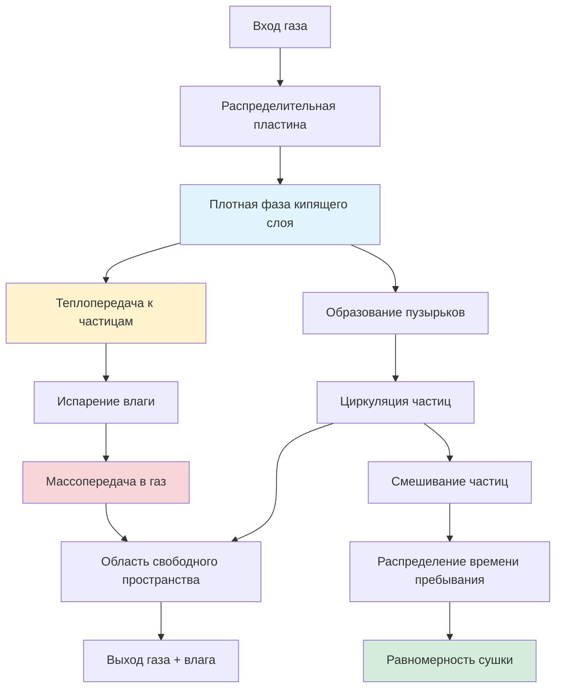

## Основы равномерного высушивания

Равномерное высушивание в системах с кипящим слоем зависит от достижения последовательных условий теплопередачи и массопередачи для всех частиц по всему слою. Физические механизмы, управляющие равномерностью, включают интенсивность смешивания частиц, распределение времени пребывания и локальные изменения скорости газа и температуры.

Скорость высушивания одиночной частицы подчиняется соотношению:

$$\frac{dm}{dt} = -h_m A_p (C_{s} - C_{\infty})$$

где $h_m$ — коэффициент массопередачи (м/с), $A_p$ — площадь поверхности частицы (м²), $C_s$ — концентрация влаги на поверхности частицы (кг/м³), и $C_{\infty}$ — объемная концентрация влаги в газе (кг/м³).

Для равномерного высушивания по всему слою эта скорость должна оставаться постоянной для всех частиц, требуя равномерного воздействия условий сушки.

## Равномерность теплопередачи

Конвективная теплопередача к частицам в кипящем слое описывается:

$$q = h A_p (T_g - T_p)$$

где $h$ — коэффициент конвективной теплопередачи (Вт/м²·К), $T_g$ — температура газа (К), и $T_p$ — температура частицы (К).

Коэффициент теплопередачи в кипящих слоях варьируется от 200 до 800 Вт/м²·К, что значительно выше, чем в других методах сушки. Равномерность требует постоянного контакта газа с частицами по всему слою.

**Ключевые факторы, влияющие на равномерность теплопередачи:**

- Распределение скорости газа через распределительную пластину
- Высота слоя и режим кипения
- Характеры циркуляции частиц
- Температурные градиенты в области свободного пространства
- Потери тепла через стенки и холодные зоны

Корреляция числа Нуссельта для кипящих слоев:

$$Nu = \frac{hd_p}{k_g} = 2 + 0.6 Re^{0.5} Pr^{0.33}$$

где $d_p$ — диаметр частицы (м), $k_g$ — теплопроводность газа (Вт/м·К), $Re$ — число Рейнольдса, и $Pr$ — число Прандтля.

## Массопередача и удаление влаги

Число Шервуда характеризует массопередачу в кипящих слоях:

$$Sh = \frac{h_m d_p}{D_{AB}} = 2 + 0.6 Re^{0.5} Sc^{0.33}$$

где $D_{AB}$ — коэффициент бинарной диффузии (м²/с) и $Sc$ — число Шмидта.

Равномерное удаление влаги требует:

1. **Постоянное время контакта газа с частицами** — достигается за счет надлежащей циркуляции частиц
2. **Равномерное распределение газа** — конструкция распределительной пластины критична
3. **Адекватная интенсивность смешивания** — предотвращает мертвые зоны и шунтирование
4. **Равномерность температуры** — минимизирует локальные вариации скорости сушки

Общая скорость удаления влаги:

$$\frac{dX}{dt} = -\frac{h_m A_s}{\rho_s V_p} (X^* - X)$$

где $X$ — содержание влаги (кг воды/кг сухого твердого вещества), $X^*$ — равновесное содержание влаги, $A_s$ — удельная площадь поверхности (м²/кг), $\rho_s$ — плотность твердого вещества (кг/м³), и $V_p$ — объем частицы (м³).

## Распределение времени пребывания

Распределение времени пребывания частиц (RTD) непосредственно влияет на равномерность сушки. Дисперсия RTD ($\sigma^2$) количественно определяет равномерность:

$$\sigma^2 = \frac{\int_0^{\infty} (t - \bar{t})^2 E(t) dt}{\bar{t}^2}$$

где $E(t)$ — функция распределения времени пребывания и $\bar{t}$ — среднее время пребывания (с).

Более низкая дисперсия указывает на более равномерную обработку частиц. Идеальное смешивание приближается к $\sigma^2/\bar{t}^2 = 1$, в то время как поршневой поток приближается к 0.

## Анализ фактора равномерности

| Фактор | Влияние на равномерность | Оптимальный диапазон | Метод управления |
|--------|---------------------|---------------|----------------|
| Скорость газа | Высокое — влияет на качество кипения | 1,5–3,0 × $U_{mf}$ | Управление скоростью вентилятора |
| Открытая площадь распределителя | Высокое — управляет распределением газа | 5–15% | Оптимизация конструкции пластины |
| Коэффициент высоты слоя | Среднее — влияет на смешивание | H/D = 0,5–2,0 | Выбор геометрии слоя |
| Распределение размера частиц | Высокое — влияет на сегрегацию | $d_{max}/d_{min}$ < 2 | Классификация/просеивание |
| Скорость подачи твердого вещества | Среднее — влияет на время пребывания | Поддерживать постоянный поток | Калибровка питателя |
| Температура газа | Среднее — стимулирует скорость сушки | 80–150°C типично | Контурное управление температурой |
| Циркуляция частиц | Высокое — обеспечивает равномерность воздействия | Полный оборот < 30 с | Размещение перегородок |

## Гидродинамика и смешивание слоя

## Стратегии оптимизации

**Конструкция распределительной пластины:**

Перепад давления через распределитель должен превышать перепад давления слоя:

$$\Delta P_{distributor} > (1,5–2,0) \times \Delta P_{bed}$$

Это обеспечивает равномерное распределение газа даже при незначительных колебаниях плотности слоя.

**Улучшение смешивания:**

- Внутренние перегородки для содействия циркуляции частиц
- Направляющие трубы для контролируемых областей восходящего/нисходящего потока
- Надлежащая высота свободного пространства для минимизации уноса частиц
- Несколько точек инжекции газа для крупногабаритных слоев

**Управление процессом:**

Отслеживание и управление:
- Влажность выходящего газа (указывает на эффективность сушки)
- Распределение температуры в слое (термопары на различных высотах)
- Перепад давления (индикатор качества кипения)
- Содержание влаги в продукте (встроенная система или образцы)

**Соображения при масштабировании:**

Безразмерное число Пекле характеризует смешивание:

$$Pe = \frac{UL}{D_m}$$

где $U$ — поверхностная скорость газа (м/с), $L$ — характеристическая длина (м), и $D_m$ — коэффициент смешивания частиц (м²/с).

Поддержание сходных значений Pe при масштабировании сохраняет характеристики смешивания и равномерность сушки.

## Практическое применение

Достижение равномерного высушивания требует:

1. **Надлежащая конструкция распределителя** — Равномерная инжекция газа предотвращает шунтирование и мертвые зоны
2. **Адекватная скорость кипения** — Обеспечивает активное смешивание без чрезмерного уноса
3. **Управляемое введение подаваемого материала** — Равномерное распределение влажного материала по поверхности слоя
4. **Управление температурой** — Минимизирует горячие точки и термальные градиенты
5. **Управление временем пребывания** — Баланс производительности с требуемым временем сушки

Коэффициент вариации (CV) для содержания влаги в продукте должен оставаться ниже 10% для приемлемой равномерности:

$$CV = \frac{\sigma_X}{\bar{X}} \times 100\%$$

где $\sigma_X$ — стандартное отклонение содержания влаги и $\bar{X}$ — среднее содержание влаги.

Регулярный мониторинг распределения влаги в продукте обеспечивает прямую обратную связь о равномерности сушки и направляет корректировки процесса для поддержания оптимальной производительности.
