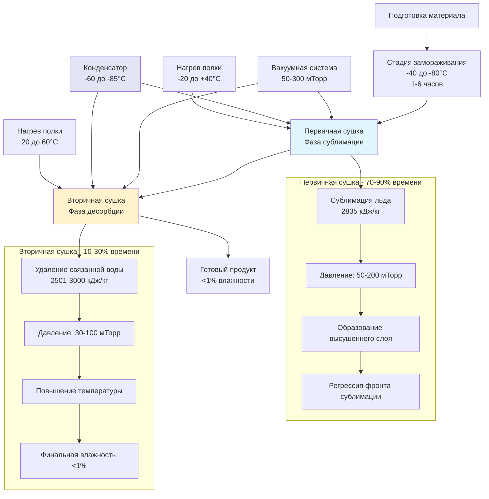

Сублимационная сушка удаляет воду из материалов путем сублимации при вакуумных условиях, преобразуя лед непосредственно в пар без прохождения через жидкую фазу. Этот процесс сохраняет термочувствительные материалы, биологические продукты и фармацевтические соединения, которые деградируют при обычных температурах сушки. Лиофилизация достигает влажности ниже 1% при сохранении структуры продукта, активности и свойств восстановления.

## Термодинамика сублимационной сушки

### Диаграмма фаз и тройная точка

Сублимация воды происходит, когда давление пара превышает окружающее давление при температурах ниже тройной точки (0,01°C при 611,66 Па). Уравнение Клаузиуса-Клапейрона определяет взаимосвязь давления пара и температуры:

$$\ln\left(\frac{P_2}{P_1}\right) = \frac{\Delta H_{sub}}{R}\left(\frac{1}{T_1} - \frac{1}{T_2}\right)$$

Где:
- $P$ = давление пара (Па)
- $\Delta H_{sub}$ = энтальпия сублимации (Дж/моль), приблизительно 51 050 Дж/моль для льда
- $R$ = универсальная газовая постоянная, 8,314 Дж/(моль·К)
- $T$ = абсолютная температура (К)

Давление пара льда при типичных температурах сублимационной сушки:

| Температура (°C) | Температура (К) | Давление пара (Па) | Давление пара (мТорр) |
|------------------|----------------|---------------------|------------------------|
| -60 | 213 | 1,08 | 8,1 |
| -50 | 223 | 3,94 | 29,6 |
| -40 | 233 | 12,84 | 96,3 |
| -30 | 243 | 38,25 | 286,9 |
| -20 | 253 | 103,5 | 776,3 |
| -10 | 263 | 259,9 | 1949 |
| 0 | 273 | 611,7 | 4588 |

Давление в камере должно оставаться ниже давления пара льда, чтобы стимулировать сублимацию. Фармацевтические сублимационные сушилки обычно работают при 50-300 мТорр во время первичной сушки.

### Требования энергии к сублимации

Сублимация льда требует значительно больше энергии, чем испарение жидкой воды. Энтальпия сублимации равна сумме энтальпии плавления и испарения:

$$\Delta H_{sub} = \Delta H_{fus} + \Delta H_{vap}$$

При 0°C:
- $\Delta H_{fus}$ = 333,5 кДж/кг (теплота плавления)
- $\Delta H_{vap}$ = 2501 кДж/кг (теплота испарения)
- $\Delta H_{sub}$ = 2835 кДж/кг (теплота сублимации)

Энтальпия сублимации изменяется с температурой:

$$\Delta H_{sub}(T) = 2835 - 0,24(T - 273,15) \text{ кДж/кг}$$

Эта температурная зависимость влияет на расчеты теплопередачи на протяжении всего цикла сушки.

## Стадии процесса сублимационной сушки

### Стадия замораживания

Замораживание превращает воду в кристаллы льда, которые определяют структуру продукта и эффективность сушки. Скорость охлаждения контролирует распределение размера кристаллов:

**Медленное замораживание** (0,1-1°C/мин):
- Крупные кристаллы льда (50-200 мкм)
- Увеличенный размер пор в высушенном продукте
- Более быстрая сублимация во время первичной сушки
- Возможное повреждение клеток в биопрепаратах

**Быстрое замораживание** (5-50°C/мин):
- Мелкие кристаллы льда (5-20 мкм)
- Тонкая структура пор, более медленная сушка
- Лучшее сохранение структуры
- Фармацевтические применения

Температура замораживания должна достичь 10-20°C ниже эвтектической температуры (для кристаллических систем) или температуры стеклования (для аморфных систем), чтобы обеспечить полное затвердевание.

Типичные эвтектические температуры:

| Раствор | Эвтектическая температура (°C) | Состав в эвтектической точке |
|----------|---------------------------|-------------------------------|
| Хлорид натрия | -21,1 | 23,3% NaCl |
| Маннитол | -1,5 | 15,6% маннитола |
| Глицин | -6,5 | 30% глицина |
| Лактоза | -3,5 | 20% лактозы |
| Трегалоза | -15 | 45% трегалозы |
| Сахароза | -9,5 | 62% сахарозы |

### Стадия первичной сушки

Первичная сушка удаляет 85-95% от общего количества воды путем сублимации льда. Скорость сублимации зависит от теплопередачи к продукту и массопередачи пара от фронта сублимации к конденсатору.

**Скорость теплопередачи:**

$$Q = K_v A \Delta P$$

Где:
- $Q$ = скорость сублимации (кг/с)
- $K_v$ = общий коэффициент массопередачи (кг/(м²·с·Па))
- $A$ = площадь поверхности продукта (м²)
- $\Delta P$ = разность давления пара между фронтом сублимации и конденсатором (Па)

Движущая сила давления пара:

$$\Delta P = P_{ice}(T_{interface}) - P_{chamber}$$

**Теплопередача от полки:**

$$\dot{q}_{shelf} = h_{shelf}(T_{shelf} - T_{product}) + \sigma \varepsilon (T_{shelf}^4 - T_{product}^4)$$

Где $h_{shelf}$ – коэффициент конвективной/кондуктивной теплопередачи (Вт/м²К), а второй член представляет лучистую теплопередачу с $\sigma$ = постоянная Стефана-Больцмана (5,67×10⁻⁸ Вт/м²К⁴) и $\varepsilon$ = эффективная степень черноты (обычно 0,3-0,6).

При низком давлении в камере (50-200 мТорр) лучистая теплопередача преобладает. Контактная теплопроводность становится значительной только при хорошем контакте между флаконом и полкой.

**Сопротивление массопередачи:**

Слой высушенного продукта оказывает сопротивление диффузии уходящему водяному пару:

$$R_{dry} = \frac{L_{dry}}{K_p A}$$

Где $L_{dry}$ – толщина высушенного слоя (м), а $K_p$ – проницаемость продукта (м²·с/кг).

По мере продвижения первичной сушки $L_{dry}$ увеличивается и скорость сублимации снижается. Высушенный слой действует как теплоизолирующий барьер, снижая теплопередачу к фронту сублимации.

**Оценка времени первичной сушки:**

$$t_{primary} = \frac{L_{frozen} \rho_{ice} \Delta H_{sub}}{q_{in} - q_{out}}$$

Где:
- $L_{frozen}$ = толщина исходного замороженного слоя (м)
- $\rho_{ice}$ = плотность льда, 920 кг/м³
- $q_{in}$ = тепловой поток в продукт (Вт/м²)
- $q_{out}$ = тепловой поток, уходящий с паром (Вт/м²)

Типичная длительность первичной сушки: 12-48 часов в зависимости от толщины продукта, температуры и давления.

### Стадия вторичной сушки

Вторичная сушка удаляет остаточную влажность, связанную с матрицей продукта, путем десорбции. Давление в камере снижается до 30-100 мТорр, а температура полки повышается до 20-60°C.

**Кинетика десорбции:**

$$\frac{dM}{dt} = -k_d(M - M_e)$$

Где:
- $M$ = содержание влаги (кг воды/кг сухого вещества)
- $k_d$ = константа скорости десорбции (1/с)
- $M_e$ = равновесное содержание влаги

Константа скорости следует температурной зависимости Аррениуса:

$$k_d = k_0 \exp\left(-\frac{E_a}{RT}\right)$$

Где $E_a$ – энергия активации для десорбции, обычно 40-80 кДж/моль для фармацевтических продуктов.

Температурные ограничения вторичной сушки зависят от стабильности продукта. Белки обычно переносят 25-40°C; малые молекулы могут выдержать 40-60°C.

**Определение конца вторичной сушки:**

- Тест сравнительного повышения давления: изолируют камеру от вакуумного насоса, контролируют скорость повышения давления
- Сравнение манометров Пирани и емкостных: дифференциальное показание указывает на парциальное давление водяного пара
- Анализаторы влаги: титрование по Карлу Фишеру или спектроскопия в ближней инфракрасной области

Целевое конечное содержание влаги: 0,5-3% для фармацевтических продуктов, обеспечивающее долгосрочную стабильность.

## Проектирование вакуумной системы

### Требования к давлению в камере

Давление в камере сублимационной сушилки напрямую влияет на скорость сублимации и температуру продукта. Рабочее давление представляет баланс между скоростью сушки и качеством продукта:

**Низкое давление (30-100 мТорр):**
- Максимальная движущая сила сублимации
- Риск перегрева продукта от чрезмерного ввода тепла
- Более низкий коэффициент теплопередачи (сниженная газовая теплопроводность)

**Более высокое давление (150-300 мТорр):**
- Лучшая теплопередача через газовую теплопроводность
- Сниженная движущая сила сублимации
- Пониженный риск коллапса или обратного таяния

Оптимальное давление обычно варьируется от 80 до 150 мТорр во время первичной сушки.

### Выбор вакуумного насоса

Сублимационные сушилки требуют вакуумных систем, способных эвакуировать объем камеры и справляться с непрерывной нагрузкой пара во время сублимации.

| Тип насоса | Предельное давление (мТорр) | Диапазон скорости откачки | Преимущества | Недостатки |
|-----------|---------------------------|---------------------|------------|---------------|
| **Ротационный пластинчатый** | 1-10 | 50-2000 CFM (85-3400 м³/ч) | Низкая стоимость, надежность | Риск загрязнения маслом, ограниченное предельное давление |
| **Спиральный** | 5-50 | 10-500 CFM (17-850 м³/ч) | Без масла, низкие затраты на обслуживание | Более высокая стоимость, чем ротационный пластинчатый |
| **Воздуходувка Рутса + ротационный пластинчатый** | 0,1-1 | 200-5000 CFM (340-8500 м³/ч) | Высокая скорость откачки | Сложная система, риск обратного потока масла |
| **Винтовой насос** | 0,1-10 | 100-2000 CFM (170-3400 м³/ч) | Без масла, хорошая работа с паром | Высокие первоначальные затраты, более громкая работа |
| **Турбомолекулярный** | 0,001-0,1 | 50-2000 л/с | Возможность ультравысокого вакуума | Дорогостоящий, требует форвакуумного насоса, хрупкий |

**Расчет скорости откачки:**

Требуемая эффективная скорость откачки в камере:

$$S_{eff} = \frac{Q_{vapor}}{P_{chamber}}$$

Где $Q_{vapor}$ – пропускная способность пара (Па·м³/с), а $P_{chamber}$ – рабочее давление (Па).

Для фармацевтических производственных сублимационных сушилок, обрабатывающих партии 100-500 кг, требования по скорости откачки варьируются от 500-5000 CFM (850-8500 м³/ч).

### Конструкция конденсатора

Конденсатор улавливает сублимированный водяной пар, предотвращая перегрузку насоса и поддерживая давление в камере. Температура конденсатора должна оставаться на 15-20°C ниже самой холодной температуры продукта, чтобы обеспечить адекватную разность давления пара.

**Емкость конденсатора:**

$$m_{ice} = \frac{Q_{sublimation} \times t_{cycle}}{\Delta H_{sub}}$$

Где:
- $m_{ice}$ = накопление льда на конденсаторе (кг)
- $Q_{sublimation}$ = общий ввод тепла во время сублимации (Дж)
- $t_{cycle}$ = длительность цикла (с)

Требование к площади поверхности конденсатора:

$$A_{condenser} = \frac{\dot{m}_{vapor} \times \Delta H_{dep}}{h_{cond}(T_{vapor} - T_{condenser})}$$

Где:
- $\dot{m}_{vapor}$ = скорость потока пара по массе (кг/с)
- $\Delta H_{dep}$ = энтальпия конденсации пара (Дж/кг), приблизительно 2835 кДж/кг
- $h_{cond}$ = коэффициент теплопередачи при конденсации (Вт/м²К), обычно 20-100 Вт/м²К
- $T_{vapor}$ = температура пара (К)
- $T_{condenser}$ = температура поверхности конденсатора (К)

**Системы охлаждения конденсатора:**

| Тип охлаждения | Диапазон температур (°C) | Диапазон емкости (кВт) | Применения |
|--------------------|------------------------|---------------------|--------------|
| **Механический каскадный** | -50 до -85 | 5-50 | Лабораторные, опытно-промышленные системы |
| **Однохладагентный с этиленгликолем** | -40 до -60 | 3-30 | Небольшие производственные системы |
| **Двухступенчатый механический** | -60 до -80 | 10-100 | Производственные фармацевтические сублимационные сушилки |
| **Жидкий азот** | -80 до -196 | Переменная | Исследовательские применения, резервное охлаждение |

Типичная загрузка конденсатора: 0,5-1,5 кг льда на литр объема камеры за цикл.

## Механизмы теплопередачи

### Коэффициент теплопередачи полки

Эффективный коэффициент теплопередачи между нагреваемой полкой и флаконом с продуктом зависит от множественных механизмов:

$$h_{eff} = h_{contact} + h_{gas} + h_{radiation}$$

**Контактная теплопроводность** происходит в дискретных точках контакта между дном флакона и полкой:

$$h_{contact} = \frac{k_{glass} \times f_{contact}}{L_{contact}}$$

Где $k_{glass}$ – теплопроводность стекла (≈1,0 Вт/м·К), $f_{contact}$ – доля площади контакта (обычно 0,01-0,10), а $L_{contact}$ – толщина контактного слоя.

**Газовая теплопроводность** через остаточные газы в камере:

$$h_{gas} = \frac{k_{gas} \times P}{d \times P_{ref}}$$

Где $k_{gas}$ – теплопроводность газа, $P$ – давление в камере, $d$ – расстояние зазора (обычно 0,1-0,5 мм), а $P_{ref}$ – эталонное давление (атмосферное).

При давлении в камере 100 мТорр газовая теплопроводность вносит 1-5 Вт/м²К в зависимости от геометрии зазора.

**Лучистая теплопередача:**

$$h_{radiation} = 4 \sigma \varepsilon T_{avg}^3$$

Где $T_{avg}$ – средняя абсолютная температура между полкой и продуктом.

Типичные эффективные коэффициенты теплопередачи:

| Условие | $h_{eff}$ (Вт/м²К) | Преобладающий механизм |
|-----------|-------------------|-------------------|
| Хороший контакт флакона, 200 мТорр | 15-25 | Контакт + газовая теплопроводность |
| Плохой контакт, 100 мТорр | 5-10 | Газовая теплопроводность + излучение |
| Очень низкое давление (10 мТорр) | 2-4 | Преобладающее излучение |
| Атмосферное давление (тест утечки) | 150-300 | Полная газовая теплопроводность |

### Контроль температуры продукта

Температура продукта во время первичной сушки должна оставаться ниже температуры коллапса (аморфные материалы) или эвтектической температуры (кристаллические материалы), чтобы предотвратить структурное разрушение.

**Температура коллапса ($T_c$):** Температура, при которой аморфная замороженная матрица теряет структурную жесткость и коллапсирует. Обычно определяется дифференциальной сканирующей калориметрией (DSC) или микроскопией сублимационной сушки.

**Максимальная температура продукта:**

$$T_{product,max} = T_c - 2 \text{ до } 5 \text{°C}$$

Этот запас безопасности учитывает локальные температурные вариации и неопределенность измерения.

**Баланс теплового потока на интерфейсе сублимации:**

$$q_{in} = q_{sublimation} + q_{out}$$

$$h_{eff}(T_{shelf} - T_{interface}) = \dot{m}_{sub} \Delta H_{sub} + h_{vapor}(T_{interface} - T_{chamber})$$

Где $\dot{m}_{sub}$ – скорость сублимации на единицу площади (кг/м²с).

В продукте развивается температурный градиент:
- Самая холодная точка: интерфейс сублимации (близко к температуре коллапса)
- Самая теплая точка: дно флакона (ближайшее к нагреваемой полке)
- Высушенный слой: промежуточная температура

Термопары, размещенные на дне флакона, обеспечивают консервативный контроль температуры продукта для управления процессом.

## Фармацевтические применения сублимационной сушки

### Биофармацевтические продукты

Формулировки белков и антител требуют лиофилизации для достижения полочной жизни 2-3 года при охлажденном хранении. Лиофилизация сохраняет биологическую активность, предотвращая агрегацию и химическую деградацию.

**Типичные замораживаемые биофармацевтические продукты:**

| Класс продукта | Типичная концентрация | Время цикла | Стабильность при хранении | Время восстановления |
|---------------|----------------------|------------|-------------------|---------------------|
| Моноклональные антитела | 25-100 мг/мл | 48-72 часа | 18-36 месяцев при 2-8°C | 2-5 минут |
| Вакцины (вирусные/бактериальные) | Переменные титры | 24-48 часов | 12-24 месяца при 2-8°C | 1-3 минуты |
| Факторы крови | 250-1000 МЕ/флакон | 36-60 часов | 24-36 месяцев при 2-8°C | 3-10 минут |
| Ферменты | 500-5000 единиц | 30-48 часов | 24-36 месяцев при комнатной температуре | 2-5 минут |
| Цитокины | 0,1-10 мг/флакон | 40-60 часов | 12-24 месяца при -20°C | 2-5 минут |

**Соображения по составу:**

Криопротекторы и лиопротекторы стабилизируют белки во время замораживания и сушки:
- **Сахароза, трегалоза** (5-10% мас./об.): сохраняют структуру белка через механизм замены воды
- **Маннитол** (2-5% мас./об.): вспомогательный агент, формирователь кристаллической матрицы
- **Глицин** (1-3% мас./об.): буферирование, вспомогательный агент
- **Полисорбат 80** (0,01-0,1% мас./об.): поверхностно-активное вещество, предотвращающее агрегацию

### Фармацевтические производственные стандарты

**Документы по руководству FDA:**
- Руководство для промышленности: PAT – Основа для инновационного фармацевтического развития, производства и обеспечения качества (2004)
- Руководство для промышленности: Q8(R2) Фармацевтическое развитие (2009)
- Руководство по асептической обработке (2004)

**Требования USP:**
- USP <1116> Микробиологический контроль и мониторинг окружающей среды асептической обработки
- USP <797> Фармацевтическое приготовление—Стерильные препараты
- USP <71> Тесты стерильности

**Требования валидации процесса:**
- Квалификация установки (IQ): проверены спецификации оборудования
- Квалификация операций (OQ): продемонстрированы рабочие диапазоны
- Квалификация производительности (PQ): обеспечена последовательное качество продукта на нескольких партиях
- Непрерывная проверка процесса: постоянный мониторинг и контроль

### Конструктивные особенности сублимационной сушилки GMP

| Конструктивный элемент | Требование | Ссылка на стандарт |
|----------------|-------------|-------------------|
| **Поверхности, контактирующие с продуктом** | 316L электрополированная нержавеющая сталь, Ra < 0,8 мкм | ASME BPE |
| **Возможность стерилизации** | На месте паром (SIP) 121°C, 30 минут | PDA Technical Report No. 1 |
| **Чистка на месте (CIP)** | Автоматизированная система распыления, документированная валидация | 21 CFR Part 211.67 |
| **Фильтрация HEPA** | 99,97% эффективность при 0,3 мкм при вентиляции камеры | ISO 14644-1 Class 5 |
| **Целостность уплотнения двери** | Скорость утечки < 5 мТорр·л/с при рабочем давлении | ASME BPE |
| **Отображение температуры** | ±1°C равномерность во всех позициях полки | Руководство FDA по валидации процесса |
| **Автоматизированная загрузка/разгрузка** | Роботизированные системы для стерильной обработки | ISO 14644-1 |
| **Целостность данных** | Совместимость с 21 CFR Part 11 для электронных записей | 21 CFR Part 11 |

### Разработка цикла сублимационной сушки

Оптимизация цикла следует принципам Design of Experiments (QbD):

**1. Характеризация продукта:**
- Тепловой анализ (DSC): температура коллапса, эвтектическая температура, температура стеклования
- Микроскопия сублимационной сушки: визуальное наблюдение коллапса/таяния эвтектики
- Изотермы сорбции влаги: равновесное содержание влаги в сравнении с относительной влажностью

**2. Скрининг параметров цикла:**
- Скорость замораживания: -0,5°C/мин до -2°C/мин (может применяться контролируемая нуклеация)
- Давление первичной сушки: 50-300 мТорр (зависит от продукта)
- Температура полки: -30°C до +10°C (должна держать продукт ниже температуры коллапса)
- Температура вторичной сушки: +20°C до +60°C
- Длительность вторичной сушки: 2-12 часов

**3. Определение пространства проектирования:**
- Design of Experiments (DOE): факториальный или метод поверхности отклика
- Критические атрибуты качества (CQA): содержание влаги, время восстановления, активность белка, внешний вид
- Критические параметры процесса (CPP): температура полки, давление в камере, время сушки

**4. Соображения по масштабированию:**
- Коэффициенты теплопередачи варьируются в зависимости от размера оборудования
- Краевые флаконы получают больше лучистого тепла, чем центральные флаконы
- Более крупные партии требуют более длительного времени уравнивания

## Типы оборудования сублимационной сушилки

### Лабораторные сублимационные сушилки

Лабораторные установки обрабатывают 0,1-4 литра продукта для разработки рецептур и оптимизации процесса.

| Параметр | Настольные системы | Напольные системы |
|-----------|------------------|---------------------|
| **Объем камеры** | 3-8 литров | 8-25 литров |
| **Площадь полки** | 0,1-0,3 м² | 0,3-1,0 м² |
| **Емкость конденсатора** | 2-6 кг льда | 6-15 кг льда |
| **Вакуумная система** | Ротационный пластинчатый или спиральный насос | Ротационный пластинчатый насос |
| **Типичное время цикла** | 24-48 часов | 48-72 часа |
| **Контроль температуры** | ±2-5°C | ±1-3°C |
| **Типичная стоимость** | $15 000-$50 000 | $50 000-$150 000 |

### Опытно-промышленные сублимационные сушилки

Опытные системы обрабатывают 5-50 литров для клинических испытаний и валидации процесса.

**Спецификации:**
- Объем камеры: 50-200 литров
- Площадь полки: 1-5 м²
- Емкость конденсатора: 50-200 кг льда
- Вакуумная система: ротационный пластинчатый + воздуходувка Рутса или винтовой насос
- Контроль температуры полки: ±0,5-1°C
- Стоимость: $200 000-$800 000

### Производственные сублимационные сушилки

Производственные системы обрабатывают 100-1000 литров на партию с полным соответствием GMP.

| Масштаб | Объем камеры | Площадь полки | Флаконы за партию (20 мл) | Емкость конденсатора | Типичная стоимость |
|--------|---------------|------------|------------------------|-------------------|--------------|
| **Малое производство** | 0,5-2 м³ | 5-15 м² | 5 000-15 000 | 200-500 кг | $800K-$2M |
| **Среднее производство** | 2-5 м³ | 15-35 м² | 15 000-35 000 | 500-1 200 кг | $2M-$5M |
| **Крупное производство** | 5-15 м³ | 35-100 м² | 35 000-100 000 | 1 200-3 500 кг | $5M-$12M |

**Характеристики производственных систем:**
- Несколько зон полок с независимым контролем температуры
- Автоматизированные системы загрузки/разгрузки (интеграция изолятора)
- Резервные вакуумные насосы и системы охлаждения
- Программное обеспечение управления рецептом и отслеживания партии
- Мониторинг процесса в реальном времени (давление, температура в нескольких точках)

## Сравнение промышленных применений

| Применение | Типичные продукты | Рабочие условия | Критические параметры | Экономические факторы |
|-----------|------------------|---------------------|-------------------|------------------|
| **Фармацевтика** | Антитела, вакцины, API | Продукт -45°C, 100 мТорр, 48-72 часа | Стерильность, стабильность, активность | Высокая стоимость, малые партии |
| **Биопрепараты** | Продукты крови, ферменты | Продукт -40°C, 80 мТорр, 36-60 часов | Сохранение активности, восстановление | Критическая терапия, стабильное хранение |
| **Диагностика** | Наборы реагентов, тест-полоски | Продукт -30°C, 150 мТорр, 24-48 часов | Последовательная производительность, полочная жизнь | Объемное производство, контроль затрат |
| **Пищевые продукты** | Кофе, фрукты, травы | Продукт -20°C, 200 мТорр, 12-24 часа | Вкус, цвет, гидратация | Премиум продукты, легкий вес |
| **Аэрокосмос** | Блюда, ингредиенты | Продукт -25°C, 150 мТорр, 18-36 часов | Снижение веса, полочная жизнь | Космические миссии, длительные экспедиции |
| **Музеи/архивы** | Документы, артефакты | Продукт -30°C, 100 мТорр, 48-96 часов | Целостность структуры, сохранение | Уникальные предметы, одноразовый процесс |

## Энергетические соображения и эффективность

Сублимационная сушка требует 2500-4000 кДж/кг удаленной воды, значительно больше, чем обычная сушка (2500-3500 кДж/кг) из-за требований охлаждения и вакуума.

**Разбор потребления энергии:**
- Охлаждение (конденсатор): 40-50%
- Вакуумные насосы: 15-25%
- Нагрев полки: 20-30%
- Системы управления, вспомогательные: 5-15%

**Стратегии оптимизации энергии:**
- Контролируемая нуклеация: равномерное образование кристаллов льда снижает время первичной сушки на 10-25%
- Анализ повышения давления: точное определение конца процесса предотвращает пересушивание
- Зоны с несколькими температурами: оптимизация ввода тепла на всех позициях полки
- Рекуперация тепла: тепло конденсатора используется для обогрева помещения или горячего водоснабжения

## Контроль качества и мониторинг процесса

### Технологии внутрипроцессного мониторинга

| Технология | Измеряемый параметр | Преимущества | Ограничения |
|-----------|-------------------|------------|-------------|
| **Манометр Пирани** | Общее давление (включая неконденсирующиеся газы) | Простой, надежный | Не может различить водяной пар от других газов |
| **Емкостный манометр** | Истинное давление в камере | Точный, независим от газа | Более дорогой, чем Пирани |
| **Сравнительное измерение давления** | Парциальное давление водяного пара | Мониторинг сублимации в реальном времени | Требует оба типа манометра |
| **Термопары** | Температура продукта | Прямое измерение, низкая стоимость | Инвазивный, влияет на локальную сушку |
| **Беспроводные датчики температуры** | Температура продукта | Неинвазивный после загрузки | Более высокая стоимость, ограниченный срок батареи |
| **Масс-спектрометрия процесса** | Состав газа | Обнаружение утечек, мониторинг состава пара | Дорогостоящий, сложная эксплуатация |
| **Спектроскопия в ближней инфракрасной области** | Содержание влаги | Неинвазивный, мониторинг в реальном времени | Требует калибровки, дорогостоящий |
| **Абсорбционная спектроскопия настраиваемого диодного лазера** | Концентрация водяного пара | Высокая чувствительность, быстрый отклик | Сложная настройка, высокая стоимость |

### Атрибуты качества продукта

**Критические атрибуты качества, требующие валидации:**

1. **Остаточное содержание влаги**: титрование по Карлу Фишеру, целевое 0,5-3%
2. **Внешний вид пирожка**: равномерная структура, отсутствие коллапса, отсутствие обратного таяния
3. **Время восстановления**: <5 минут для большинства фармацевтических продуктов
4. **Биологическая активность**: анализы белков, активность ферментов, тестирование эффективности
5. **Стабильность**: исследования ускоренной и реальной стабильности в соответствии с руководящими принципами ICH
6. **Твердые частицы**: требования USP <788> и <789> для инъекционных препаратов

## Стандарты и ссылки

**Нормативное руководство:**
- Руководство FDA для промышленности: Лиофилизация парентеральных продуктов (в разработке)
- Руководящие принципы EMA по стерилизации лекарственного средства, активного вещества, вспомогательного вещества и первичной упаковки (2019)
- ICH Q8(R2): Фармацевтическое развитие
- ICH Q11: Разработка и производство фармацевтического ингредиента

**Промышленные стандарты:**
- ASME BPE: Оборудование биопроцессов
- PDA Technical Report No. 1 (Пересмотренный 2007): Валидация процессов стерилизации влажным теплом
- PDA Technical Report No. 3 (Пересмотренный 2013): Валидация процессов сухого тепла, используемых для депирогенизации и стерилизации
- ISO 13408-1:2008: Асептическая обработка медицинских изделий

**Технические ссылки:**
- Oetjen, G.W. & Haseley, P. (2004). *Freeze-Drying*. 2-е издание. Wiley-VCH.
- Tang, X.C. & Pikal, M.J. (2004). "Рациональное проектирование стабильных лиофилизированных белковых составов". *Pharmaceutical Research*, 21(2): 191-200.
- ASHRAE Handbook - HVAC Applications (2023), Chapter 29: Industrial Drying Systems
- Carpenter, J.F., et al. (1997). "Рациональное проектирование стабильных лиофилизированных белковых составов". *Pharmaceutical Research*, 14(8): 969-975.
