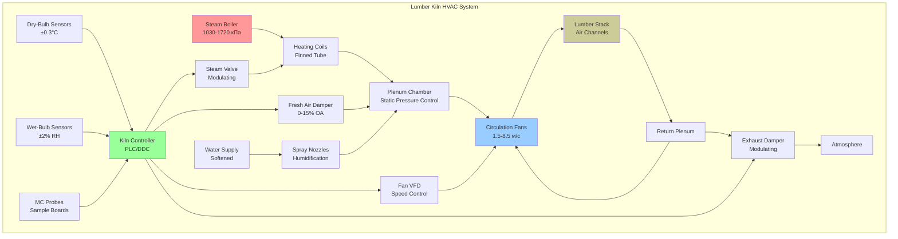

Сушильные камеры для пиломатериалов представляют специализированные HVAC приложения, где точный контроль температуры, влажности и воздушного потока обеспечивает диффузию влаги из клеточных структур древесины. Процесс принципиально заключается в создании градиентов давления пара, превышающих капиллярные силы в древесных волокнах, при предотвращении поверхностного растрескивания и развития внутренних напряжений.

## Физика диффузии влаги

Сушка древесины следует второму закону диффузии Фика, где движение влаги зависит от коэффициентов диффузии, которые экспоненциально варьируются с температурой и содержанием влаги:

$$\frac{\partial M}{\partial t} = D \nabla^2 M$$

где:
- $M$ = содержание влаги (доля)
- $t$ = время (часы)
- $D$ = коэффициент диффузии (м²/с)

Коэффициент диффузии возрастает с увеличением как температуры, так и содержания влаги:

$$D = D_0 \exp\left(-\frac{E_a}{RT}\right) \cdot \exp(kM)$$

где:
- $D_0$ = опорный коэффициент диффузии
- $E_a$ = энергия активации (типично 40–60 кДж/моль для древесины)
- $R$ = универсальная газовая постоянная (8,314 Дж/моль·К)
- $T$ = абсолютная температура (К)
- $k$ = коэффициент содержания влаги (типично 10–15 для мягких пород)

## Равновесное содержание влаги

Целевое конечное содержание влаги зависит от равновесного содержания влаги (EMC), определяемого моделью Хэйлвуда–Горобина:

$$\text{EMC} = \frac{1800}{W}\left[\frac{K_1 K h}{1-K h} + \frac{K_1 K_2 K h}{1 + K_1 K h}\right]$$

Упрощенный расчет для практического применения в камере, используя аппроксимацию Симпсона:

$$\text{EMC} = \frac{1800}{W}\left[\frac{K h}{1-K h} + \frac{K_1 K h + 2K_1 K_2 K^2 h^2}{1 + K_1 K h + K_1 K_2 K^2 h^2}\right]$$

Для большинства коммерческих приложений используется корреляция Хэйлвуда–Горобина:

$$\text{EMC} = A_1 + A_2 T + A_3 \text{RH} + A_4 T \cdot \text{RH} + A_5 T^2 + A_6 \text{RH}^2$$

где коэффициенты варьируются в зависимости от вида древесины.

## Расчеты времени сушки

Приблизительное время сушки от начального содержания влаги $M_i$ к конечному содержанию влаги $M_f$ для пиломатериала толщиной $L$:

$$t = \frac{L^2}{4\pi^2 D}\ln\left(\frac{M_i - M_e}{M_f - M_e}\right)$$

где $M_e$ = равновесное содержание влаги при условиях камеры.

Для практического планирования используется характеристическое время сушки:

$$\tau = \frac{L^2 \rho_d}{8h_m}$$

где:
- $\rho_d$ = плотность сухой древесины (кг/м³)
- $h_m$ = коэффициент массопередачи (кг/м²·с)

Общее время сушки с несколькими этапами:

$$t_{total} = \sum_{i=1}^{n} \frac{L^2}{4\pi^2 D_i}\ln\left(\frac{M_{i-1} - M_{e,i}}{M_i - M_{e,i}}\right)$$

## Конфигурация системы камеры

## Сравнение типов камер

| Тип камеры | Диапазон температур | Скорость сушки | Начальная стоимость | Потребление энергии | Лучшее применение |
|-----------|------------------|-------------|--------------|------------|------------------|
| **Обычная паровая** | 37–82°C | Умеренная | $0,33–0,55 млн руб./м³ | 1,6–2,6 ГДж/м³ | Твердые породы, качественный внешний вид |
| **Высокотемпературная** | 82–116°C | Быстрая (50% снижение) | $0,26–0,44 млн руб./м³ | 1,1–1,6 ГДж/м³ | Мягкие породы, конструкционный класс |
| **Осушительная** | 37–71°C | Медленная–умеренная | $0,88–1,32 млн руб./м³ | 0,53–0,85 ГДж/м³ | Ценные твердые породы, небольшие партии |
| **Вакуумная** | 49–71°C (0,1–0,3 атм) | Очень быстрая | $1,76–2,64 млн руб./м³ | 1,9–2,6 ГДж/м³ | Толстые твердые породы, рефрактерные виды |
| **Солнечная** | Окружающая до 60°C | Очень медленная | $0,11–0,22 млн руб./м³ | Минимальное (только вентилятор) | Низкосортные материалы, тропический климат |
| **Радиочастотная** | 60–82°C ядро | Чрезвычайно быстрая | $3,3–5,5 млн руб./м³ | 3,2–4,7 ГДж/м³ | Предварительная сушка толстых сечений, уравнивание |

*м³ = кубический метр*

## Стратегия психрометрического управления

Обычная сушка пиломатериалов в камере следует поэтапным графикам, которые прогрессивно повышают температуру сухого термометра, управляя депрессией влажного термометра для контроля сушильного стресса:

**Этап 1 – Нагрев (6–12 часов)**
- Сухой термометр: постепенный рост до 43–54°C
- Депрессия влажного термометра: 3–6°C
- Цель: равномерное распределение температуры, предотвращение закупорки поверхности

**Этап 2 – Сушка с постоянной скоростью**
- Сухой термометр: 54–71°C (в зависимости от вида)
- Депрессия влажного термометра: 6–14°C
- Продолжительность: до точки насыщения волокна (~30% содержание влаги)
- Воздушный поток: 5–8,5 м/с через стопку пиломатериала

**Этап 3 – Сушка с падающей скоростью**
- Сухой термометр: 71–82°C
- Депрессия влажного термометра: 14–28°C
- Постепенное увеличение депрессии по мере снижения содержания влаги
- Продолжительность: до целевого содержания влаги ±2%

**Этап 4 – Кондиционирование (12–48 часов)**
- Паровое распыление для увеличения RH до 80–95%
- Температура поддерживается или снижается на 6–11°C
- Цель: снятие сушильных напряжений, уравнивание содержания влаги

**Этап 5 – Охлаждение**
- Постепенное снижение до окружающей температуры +11°C
- Полная вентиляция
- Предотвращает тепловой удар и растрескивание

## Анализ теплопередачи

Общее требуемое количество тепла для сушки:

$$Q_{total} = Q_{heating} + Q_{evap} + Q_{losses}$$

Тепловая нагрузка древесины:

$$Q_{heating} = m_{wood}(c_{wood} + M_i c_{water})(T_f - T_i)$$

где:
- $c_{wood}$ ≈ 1,2 кДж/кг·К (удельная теплоемкость сухой древесины)
- $c_{water}$ = 4,18 кДж/кг·К

Нагрузка на испарение:

$$Q_{evap} = m_{wood}(M_i - M_f)h_{fg}$$

где $h_{fg}$ = скрытая теплота испарения ≈ 2260 кДж/кг при 100°C, возрастающая при более низких температурах.

Потери через оболочку:

$$Q_{losses} = U \cdot A \cdot (T_{kiln} - T_{ambient}) \cdot t$$

Типичные U-значения для конструкции камеры: 1,7–2,8 Вт/м²·К для теплоизолированных металлических зданий.

## Требования воздушного потока

Требуемая скорость воздуха через стопку пиломатериала:

$$v = \frac{k \cdot DR}{P_v^{sat} - P_v^{amb}}$$

где:
- $k$ = коэффициент фактора передачи массы
- $DR$ = требуемая скорость сушки (кг воды/м²·ч)
- $P_v^{sat}$ = давление насыщенного пара на поверхности древесины
- $P_v^{amb}$ = давление пара в атмосфере камеры

Потеря давления через стопку пиломатериала (модифицированное уравнение Дарси–Вейсбаха):

$$\Delta P = f \frac{L}{D_h} \frac{\rho v^2}{2}$$

Для типичного расположения пиломатериалов с планками гидравлический диаметр $D_h$ ≈ 4 × расстояние между планками.

Требуемая мощность вентилятора:

$$W_{fan} = \frac{\dot{V} \Delta P}{\eta_{fan}}$$

Типичная мощность циркуляционного вентилятора: 0,4–1,1 кВт на кубометр емкости камеры.

## Стандарты и справочные материалы

Эксплуатация камер следует указаниям:

- **USDA Forest Products Laboratory**: технические спецификации графиков сушки пиломатериалов в камерах по видам
- **ASTM D4933**: стандартное руководство по кондиционированию влаги древесины и композитов
- **ASTM D4442**: стандартные методы испытаний для прямого измерения содержания влаги в древесине
- **International Building Code (IBC)**: требует пиломатериал каркаса ≤19% содержание влаги
- **Southern Pine Inspection Bureau**: сертификация KD-15 (15% содержание влаги ±3%)

Фундаментальная задача в проектировании сушильной камеры заключается в балансировании между быстрым удалением влаги и образованием дефектов. Чрезмерные скорости сушки вызывают закупорку поверхности (закупорка случая), внутреннее растрескивание и коробление. Недостаточная циркуляция воздуха создает градиенты влаги между досками. Надлежащая эксплуатация камеры требует постоянного мониторинга образцов досок и корректировки графиков на основе вида, толщины и начального содержания влаги.

Улучшения энергоэффективности сосредоточены на рекуперации тепла из выходящего воздуха, вентиляторах переменной скорости циркуляции и оптимальном планировании для минимизации времени кондиционирования при поддержании сорта пиломатериала.
