## Физические принципы сушки древесины в камере

Сушка древесины в камере удаляет влагу из клеток древесины посредством одновременного теплообмена и массопередачи. Процесс сушки требует:

1. **Подвода тепла** для испарения связанной и свободной воды в волокнах древесины
2. **Удаления парообразной влаги** для сохранения благоприятных градиентов давления пара
3. **Контролируемой влажности** для предотвращения дефектов при сушке (трещины, коробление, поверхностное упрочнение)

Фундаментальная скорость удаления влаги зависит от разности давления насыщенного пара между поверхностью древесины и окружающим воздухом:

$$\dot{m}_{water} = h_m A_s (P_{sat,wood} - P_{vapor,air})$$

Где:
- $\dot{m}_{water}$ = скорость испарения влаги (кг/с)
- $h_m$ = коэффициент массопередачи (м/с)
- $A_s$ = площадь открытой поверхности древесины (м²)
- $P_{sat,wood}$ = давление насыщенного пара при температуре поверхности древесины (Па)
- $P_{vapor,air}$ = парциальное давление пара в окружающем воздухе (Па)

## Обычные паровые сушильные камеры

Обычные камеры используют паровые оребренные трубчатые теплообменники для повышения температуры воздуха и ускорения испарения влаги. Энергетический баланс для обычной камеры:

$$Q_{total} = Q_{evap} + Q_{wood} + Q_{losses}$$

Разложение каждого компонента:

$$Q_{evap} = \dot{m}_{water} h_{fg}$$

$$Q_{wood} = m_{wood} c_{p,wood} \frac{dT}{dt}$$

$$Q_{losses} = UA_{kiln}(T_{inside} - T_{ambient})$$

Где:
- $Q_{evap}$ = энергия, требуемая для испарения воды (кВт)
- $h_{fg}$ = скрытая теплота парообразования (2257 кДж/кг при 100°C)
- $Q_{wood}$ = явное тепло для повышения температуры древесины (кВт)
- $c_{p,wood}$ = удельная теплоёмкость древесины (1,2-2,0 кДж/кг·К, зависит от влажности)
- $Q_{losses}$ = потери тепла через оболочку камеры (кВт)
- $UA_{kiln}$ = коэффициент теплопередачи × площадь (кВт/К)

Обычные камеры выпускают насыщенный влагой воздух в атмосферу, теряя как явное, так и скрытое тепло. Это приводит к высокому потреблению энергии, обычно 3000-5000 кДж на кг удалённой воды.

**Характеристики эксплуатации:**
- Диапазон температур: 40-90°C
- Управление относительной влажностью: 20-90% ОВ
- Время сушки: 2-6 недель для лиственных пород
- Источник энергии: паровой котёл (природный газ, биомасса)
- Вентиляция: 10-30% обновления воздуха в час

## Камеры с осушением

Камеры с осушением (ОВ) используют холодильные циклы тепловых насосов для одновременного охлаждения воздуха ниже точки росы (конденсация влаги) и его повторного нагрева с использованием энергии, восстановленной от конденсатора. Этот замкнутый цикл восстанавливает скрытое тепло.

Энергетическое уравнение для камеры с осушением:

$$Q_{compressor} = Q_{evap} - Q_{condensation}$$

Где холодильный цикл извлекает влагу:

$$\dot{m}_{water,condensed} = \frac{\dot{Q}_{evaporator}}{h_{fg}} = \frac{\dot{V} \rho_{air} (W_1 - W_2) h_{fg}}{1}$$

Коэффициент производительности (COP) для системы теплового насоса:

$$COP = \frac{Q_{heating}}{W_{compressor}} = \frac{h_2 - h_3}{h_2 - h_1}$$

Где:
- $h_1, h_2, h_3$ = энтальпия холодильного агента на входе компрессора, выходе компрессора и выходе конденсатора (кДж/кг)
- $W_{compressor}$ = мощность компрессора (кВт)
- $\dot{V}$ = скорость циркуляции воздуха (м³/с)
- $W_1, W_2$ = коэффициенты влагосодержания до и после испарительной катушки (кг воды/кг сухого воздуха)

Типичные значения COP для деревянных камер с осушением варьируются от 2,5 до 4,0, что означает 2,5-4,0 единиц теплоотдачи на единицу электроэнергии.

**Энергоэффективность:**

$$\eta_{DH} = \frac{Q_{evap}}{W_{electric}} = COP \times \eta_{motor}$$

Камеры с осушением потребляют 600-1500 кДж на кг удалённой воды, что представляет 50-75% экономию энергии по сравнению с обычными камерами.

## Сравнение технологий сушильных камер

| Параметр | Обычная паровая | С осушением | Тепловой насос (продвинутый) |
|-----------|-------------------|------------------|----------------------|
| **Источник энергии** | Паровой котёл | Электрический компрессор | Электрический компрессор + дополнительное тепло |
| **Потребление энергии** | 3000-5000 кДж/кг воды | 600-1500 кДж/кг воды | 400-900 кДж/кг воды |
| **Стоимость капитала** | 150 000-250 000 руб./м³ ёмкости | 250 000-400 000 руб./м³ ёмкости | 350 000-500 000 руб./м³ ёмкости |
| **Макс. температура** | 90-115°C | 45-65°C | 60-80°C |
| **Коэффициент времени сушки** | 1,0× (базовый) | 1,2-1,5× | 1,0-1,2× |
| **Точность управления влажностью** | ±5% ОВ | ±2% ОВ | ±1% ОВ |
| **Подходящие породы** | Все породы | Мягкие породы, отдельные лиственные | Большинство лиственных/мягких пород |
| **Требования вентиляции** | Высокие (10-30% ACH) | Минимальные (герметичная) | Минимальные (герметичная) |
| **Эксплуатационные затраты** | Высокие | Низкие | Очень низкие |

## Критерии выбора системы

**Выбирайте обычные паровые камеры когда:**
- Требуются высокотемпературные графики (>70°C) для рефрактерных лиственных пород
- Большие производственные объёмы оправдывают инфраструктуру котельной
- Доступное дешёвое топливо из биомассы
- Критичны быстрые циклы сушки
- Существует система парораспределения

**Выбирайте камеры с осушением когда:**
- Стоимость электроэнергии превышает 0,08 руб./кВт·ч
- Подходят низко- и среднетемпературные графики (<65°C)
- Требуется точное управление влажностью
- Малые и средние партии (10-50 м³)
- Нормативные требования ограничивают выбросы

**Выбирайте продвинутые камеры с тепловым насосом когда:**
- Требуется максимальная энергоэффективность
- Благоприятные тарифы на электроэнергию или доступна возобновляемая энергия
- Высокая стоимость пород оправдывает премиум за капитальные затраты
- Желательно сочетание скорости и эффективности

## Сравнение процессных потоков

```mermaid
graph TB
    subgraph "Обычная паровая камера"
        A1[Паровой котёл] --> A2[Оребренные трубчатые теплообменники]
        A2 --> A3[Циркуляция горячего воздуха]
        A3 --> A4[Штабель древесины]
        A4 --> A5[Испарение влаги]
        A5 --> A6[Выпуск воздуха]
        A6 --> A7[Энергия теряется в атмосферу]
    end

    subgraph "Камера с осушением"
        B1[Электрический компрессор] --> B2[Холодильный цикл]
        B2 --> B3[Испарительная катушка - осушение]
        B3 --> B4[Конденсаторная катушка - повторный нагрев]
        B4 --> B5[Циркуляция горячего воздуха]
        B5 --> B6[Штабель древесины]
        B6 --> B7[Влага в воздух]
        B7 --> B3
        B3 --> B8[Дренаж конденсата]
    end

    style A7 fill:#ff6b6b
    style B8 fill:#51cf66
```

## Стандарты и ссылки

Проектирование и эксплуатация сушильных камер соответствует следующим отраслевым стандартам:

- **USDA Forest Products Laboratory**: технические спецификации для графиков сушки
- **Western Dry Kiln Association (WDK)**: руководства по эксплуатации и лучшие практики
- **NFPA 664**: стандарт по предотвращению пожаров и взрывов на деревоперерабатывающих предприятиях
- **ASHRAE Handbook - HVAC Applications**: глава об индустриальных системах сушки

Тестирование производительности камер с осушением согласно ASTM D4933 "Standard Guide for Moisture Conditioning of Wood and Wood-Based Materials."

## Экономический анализ

Для камеры ёмкостью 30 м³, работающей 250 дней в год:

**Годовая энергия обычной камеры:**
- Потребление пара: 200 000 кг/год
- Природный газ: 180 000 м³/год по 0,30 руб./м³ = 54 000 руб.

**Годовая энергия камеры с осушением:**
- Потребление электроэнергии: 65 000 кВт·ч/год по 0,12 руб./кВт·ч = 7 800 руб.

Разница в эксплуатационных затратах: 46 200 руб./год в пользу технологии с осушением. При премиум стоимости 80 000 руб. для системы с осушением, простой период окупаемости: 1,7 года.

Физическое преимущество восстановления скрытого тепла в системах с осушением обеспечивает убедительную экономику в большинстве приложений, где рабочие температуры остаются ниже 65°C.
