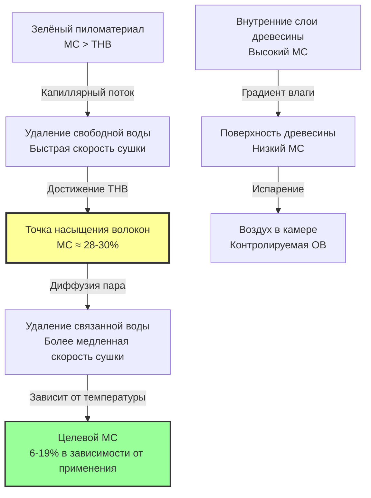

Удаление влаги из пиломатериалов представляет собой сложный процесс теплопередачи и массопередачи, управляемый диффузией через пористые среды. Эффективная работа сушильной камеры требует точного управления температурой, влажностью и скоростью воздуха для извлечения влаги из внутренних слоёв древесины на поверхность, при этом предотвращая дефекты, такие как растрескивание, коробление и закалка поверхности.

## Основы влажности древесины

Влага в древесине существует в двух различных формах. Свободная вода занимает полости клеток и пустоты в структуре древесины, тогда как связанная вода находится в стенках самих клеток, удерживаемая водородными связями с молекулами целлюлозы и лигнина. Точка перехода между этими состояниями — **точка насыщения волокон (ТНВ)**, обычно возникающая при содержании влаги 28-30% для большинства пород.

Содержание влаги в древесине определяется как отношение массы воды к абсолютно сухой массе древесины:

$$MC = \frac{m_{wet} - m_{dry}}{m_{dry}} \times 100\%$$

Где:
- $MC$ = содержание влаги (%)
- $m_{wet}$ = текущая масса древесины (кг)
- $m_{dry}$ = абсолютно сухая масса древесины (кг)

Выше ТНВ удаление влаги происходит относительно быстро, так как свободная вода испаряется из полостей клеток. Ниже ТНВ сушка значительно замедляется, потому что связанная вода должна диффундировать через структуру клеточной стенки, прежде чем она сможет испариться с поверхности древесины.

## Механизмы движения влаги

Три основных механизма управляют движением влаги во время сушки в камере:

**Капиллярный поток** преобладает выше ТНВ, где свободная вода движется через взаимосвязанную структуру пустот под градиентами капиллярного давления. Этот механизм относительно быстрый и продолжается до достижения ТНВ.

**Диффузия пара** происходит, когда водяной пар движется через структуру древесины из областей с высоким парциальным давлением пара (внутренние слои) в область с низким парциальным давлением пара (поверхность). Скорость следует первому закону Фика:

$$J = -D \frac{\partial C}{\partial x}$$

Где:
- $J$ = поток диффузии (кг/м²·с)
- $D$ = коэффициент диффузии (м²/с)
- $C$ = концентрация влаги (кг/м³)
- $x$ = расстояние (м)

**Диффузия связанной воды** становится этапом, определяющим скорость, ниже ТНВ, где молекулы воды мигрируют через структуру клеточной стенки. Этот процесс сильно зависит от температуры, коэффициенты диффузии экспоненциально возрастают с температурой в соответствии с соотношением Аррениуса:

$$D = D_0 e^{-E_a/RT}$$

Где:
- $D_0$ = предэкспоненциальный множитель (м²/с)
- $E_a$ = энергия активации (Дж/моль)
- $R$ = газовая постоянная (8,314 Дж/моль·К)
- $T$ = абсолютная температура (К)

## Целевое содержание влаги по применению

Целевое содержание влаги значительно варьируется в зависимости от конечного назначения и географического расположения, где будет установлен пиломатериал. Равновесное содержание влаги (РСВ) древесины регулируется в соответствии с относительной влажностью и температурой окружающей среды.

| Порода древесины | Зелёный MC (%) | Целевой MC внутренн. использ. (%) | Целевой MC наружн. использ. (%) | ТНВ (%) |
|--------------|--------------|---------------------------|---------------------------|---------|
| Сосна жёлтая южная | 80-150 | 6-8 | 9-14 | 28 |
| Ель Дугласа | 40-120 | 6-8 | 9-14 | 28 |
| Красный дуб | 70-100 | 6-8 | 9-14 | 30 |
| Белый дуб | 70-100 | 6-8 | 9-14 | 30 |
| Клён твёрдый | 65-90 | 6-8 | 9-14 | 29 |
| Клён мягкий | 65-90 | 6-8 | 9-14 | 29 |
| Туя западная красная | 45-80 | 8-10 | 10-15 | 27 |
| Чёрный орех | 70-90 | 6-8 | 9-14 | 29 |

## Управление градиентом влаги

Градиент влаги между ядром и поверхностью древесины должен тщательно контролироваться, чтобы предотвратить напряжения при сушке. Когда поверхность высыхает слишком быстро по сравнению с ядром, на поверхности развиваются растягивающие напряжения, в то время как влажное ядро остаётся в состоянии сжатия. Это распределение напряжений может привести к поверхностному растрескиванию и внутренним дефектам типа «сотовой структуры».

Напряжение при сушке можно приблизительно выразить как:

$$\sigma = E \cdot \beta \cdot \Delta MC$$

Где:
- $\sigma$ = напряжение при сушке (МПа)
- $E$ = модуль упругости (ГПа)
- $\beta$ = коэффициент усадки (безразмерный)
- $\Delta MC$ = разность содержания влаги между поверхностью и ядром (%)

Операторы сушильной камеры управляют градиентом влаги путём изменения депрессии по влажному термометру (температура по сухому термометру минус температура по влажному термометру). Более высокая депрессия по влажному термометру увеличивает движущую силу испарения, но также увеличивает градиенты влаги между поверхностью и ядром.

## Методы снятия напряжений

**Кондиционирование** — это намеренный этап снятия напряжений, при котором в конце цикла сушки вводится пар или воздух с высокой влажностью. Это временно повышает содержание влаги на поверхности, позволяя релаксации напряжений через механо-сорбционный крип. Процесс кондиционирования обычно происходит при 71-82°C с относительной влажностью, повышенной до 80-90%, в течение 2-8 часов в зависимости от толщины пиломатериала и породы.

**Уравнивание** включает выдержку пиломатериала при умеренной температуре и влажности после достижения среднего содержания влаги целевого значения. Это позволяет внутренней влаге перераспределяться в сторону более сухих поверхностей, снижая градиент влаги перед финальным кондиционированием.

## Управление скоростью сушки

Скорость сушки должна сбалансировать производительность против качества пиломатериала. Чрезмерно быстрая сушка вызывает дефекты, тогда как чрезмерно консервативные режимы увеличивают энергетические затраты и снижают пропускную способность. Мгновенная скорость сушки может быть выражена как:

$$\frac{dMC}{dt} = -k \cdot (MC - MC_{eq})$$

Где:
- $k$ = константа скорости сушки (1/ч), зависит от температуры, влажности, скорости воздуха и свойств древесины
- $MC_{eq}$ = равновесное содержание влаги при текущих условиях в камере (%)

Современные сушильные камеры используют системы мониторинга содержания влаги, которые измеряют электрическое сопротивление или диэлектрические свойства для отслеживания процесса сушки в реальном времени, что позволяет проводить динамическую корректировку режима для оптимизации качества и эффективности.

## Стандарты и спецификации

Добровольный стандарт продукции PS 20 Министерства торговли США определяет требования к содержанию влаги в мягком пиломатериале, указывая максимум 19% MC для пиломатериала, предназначенного для сухого использования. Ассоциация западных сушильных камер и Ассоциация южных лесных продуктов публикуют комплексные режимы сушки для различных пород и толщин, предоставляя уставки температуры и влажности на всём протяжении цикла сушки для достижения целевого содержания влаги при минимизации дефектов.
