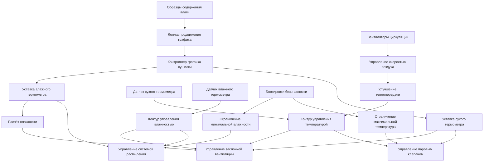

## Фундаментальная физика сушки

Управление температурой и влажностью в сушилке для пиломатериалов основано на принципе дифференциала давления пара между древесиной и окружающим воздухом. Древесина высвобождает влагу, когда её внутреннее давление пара превышает парциальное давление водяного пара в атмосфере сушилки. Скорость сушки зависит от трёх одновременных механизмов переноса: внутренней миграции влаги через капилляры и клеточные стенки, поверхностного испарения, управляемого коэффициентами массопередачи, и конвективного удаления водяного пара циркулирующим воздухом.

Равновесное содержание влаги (EMC) устанавливает теоретическую конечную точку сушки при данных условиях. Древесина непрерывно обменивается влагой с воздухом до достижения равновесия, при котором химический потенциал воды в древесине равен её потенциалу в воздухе. Это соотношение следует термодинамическим принципам, выражаемым через относительную влажность и температуру.

## Психрометрические соотношения управления

Фундаментальное соотношение между температурой сухого термометра, температурой влажного термометра и относительной влажностью управляет всеми стратегиями управления сушилкой:

$$\text{RH} = \frac{p_v}{p_{vs}(T_{db})} \times 100$$

Где относительная влажность равна отношению фактического давления пара к давлению насыщенного пара при температуре сухого термометра. Давление насыщенного пара следует уравнению Антуана:

$$p_{vs} = \exp\left(77.345 + 0.0057T - \frac{7235}{T}\right)$$

С температурой в Кельвинах и давлением в Паскалях. Депрессия влажного термометра связана с потенциалом испарительного охлаждения:

$$T_{db} - T_{wb} = \frac{(h_s - h)}{\lambda}\cdot\frac{c_p}{\alpha}$$

Где $h_s$ представляет энтальпию при насыщении, $h$ — фактическую энтальпию воздуха, $\lambda$ — удельную теплоту испарения (2 257 кДж/кг при 100°C), $c_p$ — удельную теплоёмкость воздуха (1.006 кДж/кг·К), и $\alpha$ — психрометрическую константу (0.665 кПа/К).

Уравнение равновесного содержания влаги на основе теории Хейлвуда-Горробина:

$$\text{EMC} = \frac{1800}{W}\left[\frac{KH(1-KH)}{(1-KH+K_1KH)}\right] + \frac{1800}{W}\left[\frac{K_1KH}{1+K_1KH}\right]$$

Где $W$ — точка насыщения волокна (обычно 30%), $K$ и $K_1$ — зависящие от температуры константы равновесия, и $H$ — относительная влажность, выраженная в виде десятичной дроби.

Для практического управления сушилкой приближение Симпсона обеспечивает достаточную точность:

$$\text{EMC} = \frac{1297W}{W + 1297} - 0.142W + 6.34$$

$$W = \exp\left(\frac{-11.279 + 0.028T_{db}}{T_{db} + 239.44}\right) \times \left(\frac{\text{RH}}{100}\right)$$

## Архитектура системы управления

Система управления поддерживает целевые температуры сухого и влажного термометров посредством согласованного воздействия на паровую инжекцию, водораспыление и заслонки вентиляции. Паровые клапаны модулируют управление температурой сухого термометра, в то время как системы распыления регулируют депрессию влажного термометра. Заслонки вентиляции одновременно влияют на оба параметра путём введения наружного воздуха, что требует компенсации по прямой связи.

## Спецификации графиков сушилки

Стандартные графики сушилки проходят фазы с уменьшающейся относительной влажностью по мере снижения содержания влаги. Выбор графика зависит от вида древесины, толщины, требуемого конечного содержания влаги и допустимого времени сушки.

| Фаза графика | Диапазон содержания влаги | Температура сухого термометра (°C) | Депрессия влажного термометра (°C) | Относительная влажность (%) | Целевая EMC (%) |
|--------------|---------------------------|-------------------------------------|-------------------------------------|-----------------------------|-----------------| 
| Начальное кондиционирование | >50% | 43 | 3 | 85 | 18.5 |
| Первичная сушка | 50-30% | 54 | 8 | 65 | 12.8 |
| Вторичная сушка | 30-20% | 66 | 14 | 48 | 9.2 |
| Финальная сушка | 20-15% | 71 | 19 | 38 | 7.4 |
| Кондиционирование | <15% | 82 | 11 | 52 | 9.8 |
| Выравнивание | <15% | 60 | 6 | 75 | 14.2 |

Фаза кондиционирования при повышенной температуре и влажности снимает напряжения, вызванные сушкой, путём временного увеличения влажности поверхности, позволяя расслабиться напряжениям перед охлаждением. Фаза выравнивания обеспечивает равномерное распределение влаги по всей толщине пиломатериала.

Продвижение графика сушилки происходит, когда среднее содержание влаги в доске достигает пороговых значений переходов между фазами. Образцы досок, репрезентативные для загрузки, обеспечивают обратную связь посредством периодического взвешивания или измерений электрического сопротивления.

## Расчёты теплопередачи и массопередачи

Уравнение скорости сушки объединяет конвективную массопередачу с внутренней диффузией:

$$\frac{dm}{dt} = -h_m A_s (p_{vs,wood} - p_v) = -D_{eff}\frac{A_{cs}}{L}\rho_{wood}\left(\frac{MC_1 - MC_2}{100}\right)$$

Где $h_m$ — коэффициент массопередачи (м/с), $A_s$ — площадь поверхности (м²), $D_{eff}$ — эффективная диффузивность (м²/с), $A_{cs}$ — площадь сечения, $L$ — толщина доски, $\rho_{wood}$ — плотность древесины, и $MC$ представляет процентные значения содержания влаги.

Требуемая теплота уравновешивает чувствительное тепло, испарение воды и потери теплоты:

$$Q_{total} = m_{wood}c_{wood}\Delta T + m_{water}\lambda + Q_{losses}$$

Типичные требования к энергии варьируются от 600 до 900 кВт·ч на тысячу дощечко-футов, в зависимости от начального содержания влаги, вида древесины и агрессивности графика.

## Стратегии управления и оптимизация

Современные сушилки используют каскадное управление, при котором основной контроллер генерирует уставки сухого и влажного термометров из текущей фазы графика, в то время как вторичные контуры PID манипулируют приводами для поддержания этих уставок. Компенсация по прямой связи корректирует влияние температуры и влажности наружного воздуха на операции вентиляции.

Критическая задача управления заключается в поддержании достаточно высокого потенциала сушки (депрессии влажного термометра) без вызывания поверхностного закаливания, растрескивания или коробления от чрезмерных градиентов влаги. Консервативные графики с минимальной депрессией влажного термометра снижают дефекты, но продлевают время сушки и потребление энергии.

Продвинутые алгоритмы управления оптимизируют продвижение графика на основе мониторинга содержания влаги в реальном времени, регулируя траектории температуры и влажности для минимизации времени сушки при соблюдении ограничений качества. Эти системы интегрируют модели напряжений, предсказывающие внутренние распределения влаги и развитие механического напряжения.

Скорость циркуляции воздуха существенно влияет на коэффициенты поверхностной массопередачи. Большинство сушилок поддерживают скорость 60–120 м/мин через пиломатериальные стопы путём реверсивной работы вентиляторов каждые 4–8 часов для выравнивания скоростей сушки между влажной и сухой концами сушилки.

## Практические соображения при внедрении

Размещение датчиков критически влияет на качество управления. Датчики сухого термометра измеряют истинную температуру воздуха в защищённых, аспирируемых местах вдали от прямого впрыска пара. Датчики влажного термометра требуют непрерывного увлажнения дистиллированной водой для предотвращения накопления минералов, влияющих на скорость испарения. Современные установки всё чаще используют датчики относительной влажности, исключающие техническое обслуживание влажного термометра, хотя эти датчики требуют проверки калибровки.

Система управления должна предотвращать конденсацию при начальном нагреве, когда температуры холодной поверхности пиломатериала падают ниже точки росы воздуха. Постепенный рост температуры с минимальной депрессией влажного термометра на стартовых фазах предотвращает окрашивание, вызванное конденсацией.

Выбор размера парораспределителя и равномерность распределения пара существенно влияют на качество управления температурой. Недостаточный размер ловушек или плохое распределение вызывают стратификацию температуры, требующую увеличения смещений уставок и удлинения времени сушки.
