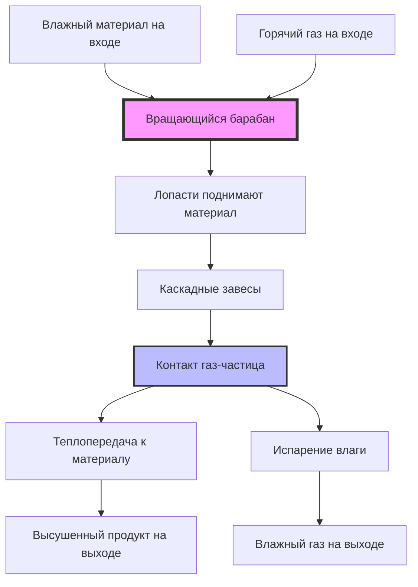

## Принцип работы

Барабанные сушилки используют вращающийся цилиндрический барабан, обычно наклоненный на 2-6 градусов от горизонтали, для непрерывной обработки сыпучих материалов в зоне нагрева. Вращение создает действие перемешивания, которое открывает свежие поверхности материала сушильной среде, при этом транспортируя материал от входа к выходу. Это сочетание теплопередачи, массопередачи и механического транспорта делает барабанные сушилки эффективными для обработки материалов от свободно текучих гранул до вязких паст.

Фундаментальный механизм сушки основан на одновременной теплопередаче и массопередаче. Тепло поступает от горячей среды (газ или нагретая поверхность барабана) к материалу, обеспечивая скрытую теплоту испарения, необходимую для преобразования влаги в пар. Пар затем диффундирует через пограничный слой материала в окружающий газовый поток для удаления.

## Режимы теплопередачи

### Барабанные сушилки прямого нагрева

Сушилки прямого нагрева вводят горячий газ непосредственно в барабан, где он контактирует с материалом. Газ выполняет двойную функцию: источник тепла и переносчик пара. Теплопередача происходит посредством конвекции от газа к поверхностям частиц и излучением от горячего газа к материалу.

Объемный коэффициент теплопередачи для сушилок прямого нагрева обычно находится в диапазоне 5-15 Вт/м³·К, в зависимости от скорости газа, размера частиц и загрузки материала. Сушилки прямого нагрева достигают тепловой эффективности 50-80% при отсутствии рекуперации тепла отходящих газов.

**Ключевые характеристики:**
- Высокие скорости теплопередачи за счет прямого контакта газ-частица
- Материал должен переносить контакт с газом сгорания
- Скорость газа контролирует как теплопередачу, так и удаление пара
- Более низкие капитальные затраты, чем косвенные конструкции
- Требуются более высокие расходы газа

### Барабанные сушилки косвенного нагрева

Сушилки косвенного нагрева передают тепло через стенку барабана от внешних нагревательных элементов, паровых рубашек или циркуляции горячего масла. Тепло проводится через металлическую стенку к материалу, контактирующему с оболочкой или поднимаемому лопастями. Отдельный газовый поток удаляет выделившуюся влагу.

Коэффициенты теплопередачи через стенку находятся в диапазоне 50-150 Вт/м²·К для паровых рубашек, ограниченные площадью контакта между перемешиваемым материалом и поверхностью барабана. Сушилки косвенного нагрева работают с тепловой эффективностью 70-90% за счет уменьшения объемов отходящих газов.

**Ключевые характеристики:**
- Отсутствие загрязнения материала продуктами сгорания
- Подходит для материалов, чувствительных к теплу или склонных к окислению
- Низкие расходы газа снижают выбросы твердых частиц
- Более высокие капитальные и эксплуатационные затраты
- Ограничено материалами, переносящими контактное нагревание

## Анализ конфигураций потока

### Соток (одновременный поток)

Горячий газ и материал движутся в одном направлении через барабан. Материал поступает на горячий конец, где входит газ, и оба выходят вместе на конце выгрузки.

Профиль температуры показывает максимальную разницу температур на входе, где влажный материал встречается с самым горячим газом. Эта разница уменьшается по мере высыхания материала и охлаждения газа. Работа в режиме сотока защищает высушенный продукт от перегрева, так как материал выходит с самым холодным газом.

**Преимущества:**
- Возможны более высокие температуры входящего газа (800-1000°C)
- Высушенный продукт подвергается воздействию только более холодных выходящих газов
- Подходит для термочувствительных материалов, требующих щадящей финальной сушки

**Ограничения:**
- Более низкий средний температурный градиент снижает эффективность
- Скорость удаления влаги уменьшается вдоль длины барабана

### Противоток

Материал и газ движутся в противоположных направлениях. Влажный материал поступает там, где выходит холодный выхлопной газ, постепенно встречая более горячий газ при приближении к выгрузке.

Температурный градиент увеличивается по мере сушки, при этом высушенный материал подвергается воздействию самого горячего входящего газа. Эта конфигурация максимизирует средний движущий потенциал для теплопередачи и массопередачи, но рискует деградацией продукта при избыточных температурах на выходе.

**Преимущества:**
- Более высокий средний температурный градиент увеличивает производительность
- Более эффективное использование тепла
- Лучше подходит для термически стабильных материалов

**Ограничения:**
- Продукт подвергается наибольшим температурам в высушенном состоянии
- Температура входящего газа ограничена предотвращением повреждения продукта (обычно 350-650°C)
- Повышенный риск воспламенения частиц с горючими материалами

## Конструкция лопастей и каскадирование материала

Внутренние лопасти (поднимающие планки), смонтированные на внутренней поверхности барабана, поднимают материал и создают каскадные завесы при вращении барабана. Это действие непрерывно открывает свежую поверхность газовому потоку и предотвращает скольжение материала вдоль дна барабана.

### Геометрия лопастей

Производительность лопастей зависит от трех параметров:

**Высота лопасти:** $h_f = 0.10D$ до $0.15D$, где $D$ — диаметр барабана
**Расстояние между лопастями:** $s_f = 0.5D$ до $1.0D$ вдоль длины барабана
**Количество лопастей:** $N_f = \pi D / w_f$, где $w_f$ — ширина лопасти

Типичные поперечные сечения лопастей включают прямоугольные, угловые и сегментированные конструкции. Прямоугольные лопасти обеспечивают максимальную подъемную способность. Угловые лопасти способствуют выгрузке материала под определенным углом поворота. Сегментированные лопасти снижают требуемую мощность.

### Задержка материала и образование завес

Задержка материала (доля объема барабана, занятая материалом) обычно составляет 10-25% объема барабана. Объемная доля материала $\phi$ связана с конструкцией лопастей:

$$\phi = \frac{Q_m \tau}{V_d}$$

где $Q_m$ — объемный расход материала (м³/с), $\tau$ — время пребывания (с), а $V_d$ — объем барабана (м³).

При вращении барабана лопасти поднимают материал до превышения угла естественного откоса, что вызывает обвал. Падающая завеса создает распределенный контакт газ-частица. Эффективность лопастей снижается при превышении задержкой материала 25%, так как материал начинает скользить по верхней части лопастей.

## Расчеты времени пребывания

Время пребывания определяет продолжительность нахождения материала в сушилке, напрямую влияя на полноту сушки. Для наклоненного вращающегося барабана:

$$\tau = \frac{L}{v_a}$$

где $L$ — длина барабана (м), а $v_a$ — осевая скорость материала (м/с).

Осевая скорость зависит от геометрии барабана и условий эксплуатации:

$$v_a = \frac{4.8 \cdot Q_m \cdot \sin(\alpha)}{D^{2.5} \cdot N \cdot \sqrt{1 + 2F/D}}$$

где:
- $Q_m$ = расход материала на входе (кг/с на сухой основе)
- $\alpha$ = угол наклона барабана (градусы)
- $D$ = внутренний диаметр барабана (м)
- $N$ = частота вращения (об/мин)
- $F$ = высота лопасти (м)

**Типичные значения:**
- Время пребывания: 5-90 минут в зависимости от применения
- Частота вращения: 2-8 об/мин
- Соотношение длины к диаметру: 4:1 до 10:1

Увеличение уклона барабана или частоты вращения уменьшает время пребывания. Установка дамбы выгрузки на выходе увеличивает задержку материала и продлевает время пребывания без изменения скорости барабана или угла.

## Теплопередача и массопередача в вращающихся цилиндрах

### Конвективная теплопередача

Коэффициент конвективной теплопередачи газ-частица для перемешиваемых слоев:

$$h_c = \frac{k_g}{d_p} \cdot Nu$$

где число Нуссельта $Nu$ для барабанных сушилок составляет:

$$Nu = 2.0 + 0.6 \cdot Re^{0.5} \cdot Pr^{0.33}$$

Число Рейнольдса $Re = \rho_g v_g d_p / \mu_g$ характеризует течение газа вокруг частиц, с типичными значениями 100-2000 для промышленных барабанных сушилок.

### Массопередача

Скорость удаления влаги зависит от открытой поверхности перемешиваемого материала и градиента давления пара:

$$\dot{m}_w = h_m \cdot A_s \cdot \rho_g \cdot (Y_s - Y_g)$$

где:
- $h_m$ = коэффициент массопередачи (м/с)
- $A_s$ = открытая поверхность материала (м²)
- $\rho_g$ = плотность газа (кг/м³)
- $Y_s$ = отношение влажности на поверхности частицы (кг пара/кг сухого воздуха)
- $Y_g$ = отношение влажности в основном газе (кг пара/кг сухого воздуха)

Коэффициент массопередачи связан с теплопередачей через число Льюиса:

$$Le = \frac{Sc}{Pr} = \frac{h_c}{\rho_g \cdot c_p \cdot h_m}$$

Для систем воздух-водяной пар $Le \approx 1.0$, что упрощает анализ связанной теплопередачи и массопередачи.

## Сравнение типов конфигураций

| Параметр | Прямой нагрев | Косвенный нагрев | Соток | Противоток |
|-----------|-------------|---------------|------------|-----------------|
| Скорость теплопередачи | Высокая | Умеренная | Умеренная | Высокая |
| Тепловая эффективность | 50-80% | 70-90% | 60-75% | 75-85% |
| Макс. температура входящего газа | 800-1000°C | Н/Д | 800-1000°C | 350-650°C |
| Температура продукта | Умеренная | Низкая | Низкая | Высокая |
| Объем газа | Высокий | Низкий | Высокий | Высокий |
| Капитальные затраты | Ниже | Выше | Стандартные | Стандартные |
| Риск загрязнения продукта | Да | Нет | Умеренный | Умеренный |
| Оптимальное применение | Высокопроизводительные, устойчивые материалы | Термочувствительные, высокоценные | Температурочувствительные | Термически стабильные |

## Проектные соображения по ASHRAE

Хотя стандарты ASHRAE в первую очередь относятся к комфортным HVAC системам, проектирование промышленных сушилок следует принципам из ASHRAE Handbook—HVAC Applications Глава 29 (системы промышленной сушки). Ключевые соображения:

- Температура отходящего газа должна оставаться выше точки росы плюс 15-20°C, чтобы предотвратить конденсацию в воздуховодах
- Подача воздуха для сгорания должна учитывать эффекты высоты на доступность кислорода согласно психрометрическим принципам ASHRAE
- Системы рекуперации тепла следуют методам эффективности теплообменников, подробно описанным в ASHRAE Handbook—Fundamentals
- Системы сбора пыли и контроля выбросов интегрируются с требованиями выхлопа здания

---

**Файл:** `/Users/evgenygantman/Documents/github/gantmane/hvac/content/specialty-applications-testing/specialty-hvac-applications/industrial-drying-systems/rotary-dryers/_index.md`

Комплексный контент включает термодинамические принципы, детальные расчеты времени пребывания, таблицы сравнения, диаграмму технологического процесса и объяснения на основе физики, подходящие для технической аудитории при сохранении оптимизации для SEO.
