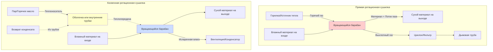

Ротационные сушилки используют два принципиально различных механизма теплопередачи для удаления влаги из материалов: прямой (конвективный) и косвенный (кондуктивный) нагрев. Выбор между этими методами зависит от свойств материала, допустимости загрязнения, требований к тепловой эффективности и эксплуатационных ограничений.

## Прямые ротационные сушилки с теплопередачей

Прямые сушилки подают горячие газы непосредственно в вращающийся барабан, где они соприкасаются с материалом. Теплопередача и массоперенос происходят одновременно благодаря конвекции и испарению.

### Механизм теплопередачи

Скорость теплопередачи в прямых сушилках следует уравнению:

$$Q_{\text{direct}} = h_c A_s (T_g - T_s) + \dot{m}_{\text{evap}} h_{fg}$$

Где:
- $h_c$ = коэффициент конвективной теплопередачи (Вт/м²·К)
- $A_s$ = площадь поверхности материала, подвергаемая воздействию газа (м²)
- $T_g$ = температура газа (К)
- $T_s$ = температура поверхности материала (К)
- $\dot{m}_{\text{evap}}$ = скорость испарения влаги (кг/с)
- $h_{fg}$ = теплота парообразования (кДж/кг)

Коэффициент конвекции зависит от скорости газа и турбулентности:

$$h_c = \frac{k_g}{D_h} \cdot Nu$$

Где $Nu$ — число Нуссельта (обычно 10–100 для турбулентного потока в ротационных сушилках) и $k_g$ — теплопроводность газа.

### Тепловая эффективность

Эффективность прямой сушилки учитывает нагрев материала, испарение влаги и потери тепла с выходящим газом:

$$\eta_{\text{direct}} = \frac{\dot{m}_{\text{evap}} h_{fg}}{\dot{m}_g c_{p,g} (T_{g,in} - T_{g,out})}$$

Типичная эффективность варьируется от 50–75% в зависимости от температуры выхлопного газа и систем рекупирации тепла.

## Косвенные ротационные сушилки с теплопередачей

Косвенные сушилки передают тепло через стенку барабана или внутренние нагревательные элементы (паровые трубки, трубки горячего масла) без соприкосновения газа с материалом. Теплопередача происходит в основном через кондукцию.

### Механизм теплопередачи

Скорость теплопередачи в косвенных сушилках:

$$Q_{\text{indirect}} = UA \Delta T_m + \dot{m}_{\text{evap}} h_{fg}$$

Где:
- $U$ = общий коэффициент теплопередачи (Вт/м²·К)
- $A$ = площадь поверхности теплопередачи (м²)
- $\Delta T_m$ = логарифмическая средняя разность температур (К)

Общий коэффициент включает множественные последовательные сопротивления:

$$\frac{1}{U} = \frac{1}{h_{\text{steam}}} + \frac{t_w}{k_w} + \frac{1}{h_{\text{material}}}$$

Где:
- $h_{\text{steam}}$ = коэффициент конденсации пара (5000–15000 Вт/м²·К)
- $t_w$ = толщина стенки (м)
- $k_w$ = теплопроводность стенки (Вт/м·К)
- $h_{\text{material}}$ = коэффициент со стороны материала (20–200 Вт/м²·К)

### Тепловая эффективность

Косвенные сушилки достигают более высокой эффективности, так как энергия теплоносителя напрямую передается материалу:

$$\eta_{\text{indirect}} = \frac{\dot{m}_{\text{evap}} h_{fg} + \dot{m}_m c_{p,m} (T_{m,out} - T_{m,in})}{\dot{Q}_{\text{heating medium}}}$$

Эффективность обычно достигает 75–90% благодаря минимальным потерям с выхлопом.

## Сравнение конфигураций систем

## Таблица сравнения характеристик

| Параметр | Прямые сушилки | Косвенные сушилки |
|-----------|---------------|-----------------|
| **Режим теплопередачи** | Конвекция (соприкосновение газа и материала) | Кондукция (через стенки/трубки) |
| **Тепловая эффективность** | 50–75% | 75–90% |
| **Типичное значение U** | 25–60 Вт/м²·К (объемный) | 40–120 Вт/м²·К (по площади поверхности) |
| **Расход газа** | Высокий (2–4 кг газа/кг испаренной воды) | Минимальный (только продувочный газ) |
| **Риск загрязнения** | Высокий (продукты сгорания контактируют с материалом) | Низкий (нет контакта газа с материалом) |
| **Температура материала** | Ограничена температурой газа (макс. 400–800°C) | Точный контроль (ограничен теплоносителем) |
| **Капитальные затраты** | Ниже | Выше (сосуды под давлением, трубчатые пучки) |
| **Эксплуатационные затраты** | Выше (топливо + выбросы) | Ниже (эффективная теплопередача) |
| **Подходящие материалы** | Устойчивые к теплу, толерантные к загрязнению | Чувствительные к теплу, нетолерантные к загрязнению |
| **Выбросы** | Значительные (ЛОС, твердые частицы) | Минимальные (закрытая система возможна) |
| **Время пребывания** | Короче (интенсивная сушка) | Дольше (мягкая сушка) |
| **Занимаемая площадь** | Больший диаметр (объем газа) | Компактная (плотная теплопередача) |

## Критерии выбора метода нагрева

### Выбирайте прямые сушилки, когда:

1. **Материал толерантен к загрязнению** продуктами сгорания
2. **Требуется высокая производительность** при низких капитальных затратах
3. **Материал устойчив к теплу** и может выдерживать высокие температуры
4. **Быстрая сушка** — приоритет над тепловой эффективностью
5. **Низкие уровни влажности** можно достичь агрессивной сушкой
6. **Стоимость топлива является благоприятной** по сравнению с производством пара/горячего масла

### Выбирайте косвенные сушилки, когда:

1. **Чистота продукта** критична (фармацевтика, пищевая промышленность)
2. **Чувствительные к теплу материалы** требуют точного контроля температуры
3. **Рекуперация растворителя** или закрытая система необходима
4. **Экологические нормы** ограничивают выбросы
5. **Оптимизация эксплуатационных затрат** оправдывает более высокие капитальные вложения
6. **Материалы пыльные** или создают взрывоопасные атмосферы
7. **Мягкая сушка** предотвращает деградацию материала

## Гибридные конфигурации

Некоторые установки комбинируют оба метода для оптимизации производительности:

$$Q_{\text{total}} = Q_{\text{direct}} + Q_{\text{indirect}}$$

Гибридные системы обеспечивают:
- Начальную быструю сушку через прямой нагрев
- Завершающую точную сушку через косвенный нагрев
- Улучшенную общую тепловую эффективность
- Сниженные выбросы на единицу удаленной влаги

Тепловой баланс для гибридных систем требует тщательного проектирования для предотвращения скачков температуры:

$$\dot{m}_m c_{p,m} \frac{dT_m}{dt} = Q_{\text{direct}} + Q_{\text{indirect}} - \dot{m}_{\text{evap}} h_{fg}$$

## Проектные соображения

Свойства материала принципиально определяют жизнеспособность метода нагрева. Число Био указывает, доминирует ли внутреннее сопротивление материала:

$$Bi = \frac{h_c L_c}{k_m}$$

Где $L_c$ — характерная длина и $k_m$ — теплопроводность материала. При $Bi < 0,1$ температура материала практически однородна, и выбор метода нагрева зависит в основном от допустимости загрязнения и требований эффективности.

Выбор метода нагрева ротационной сушилки представляет компромисс между капитальными затратами, рабочей эффективностью, требованиями качества продукта и экологическими ограничениями. Прямые сушилки предлагают простоту и низкие первоначальные инвестиции, в то время как косвенные сушилки обеспечивают превосходную эффективность и чистоту продукта при более высоких капитальных затратах.
