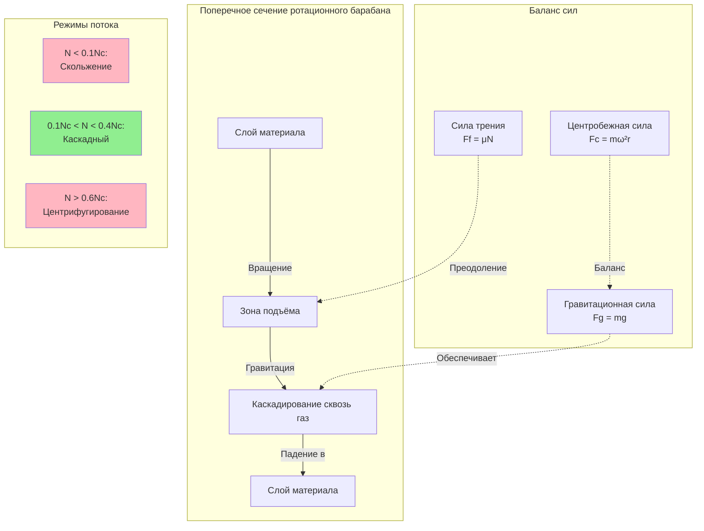

## Основная механика вращения

Работа ротационной сушилки критически зависит от скорости вращения барабана, которая определяет характер движения материала, время пребывания и эффективность теплопередачи. Вращающийся барабан создаёт каскадный эффект, при котором материал поднимается на восходящей стороне и падает сквозь поток горячего газа, максимизируя контактную площадь и тепловой обмен.

При увеличении скорости вращения возникают три различных режима потока:

**Режим скольжения** — материал скользит вдоль стенки барабана без подъёма. Происходит при очень низких скоростях, когда центробежная сила недостаточна для преодоления статического трения. Обеспечивает минимальный контакт материала с газом и низкую эффективность сушки.

**Режим каскадного потока** — материал поднимается на восходящей стороне и каскадом падает сквозь поток газа. Это оптимальный режим работы для большинства промышленных сушилок, обеспечивающий максимальную экспозицию поверхности и теплопередачу.

**Режим центрифугирования** — материал прилипает к стенке барабана из-за избыточной центробежной силы. Возникает при слишком высокой скорости вращения. Приводит к минимальному движению материала и резко сниженной производительности сушки.

## Связь критической скорости

Переход между режимами определяется балансом между центробежным ускорением и гравитационным ускорением. Критическая скорость представляет теоретическую частоту вращения, при которой материал остаётся прижатым к стенке барабана:

$$N_c = \frac{42.3}{\sqrt{D}}$$

Где:
- $N_c$ = критическая скорость (об/мин)
- $D$ = внутренний диаметр барабана (фут)

В единицах СИ:

$$N_c = \frac{76.6}{\sqrt{D_m}}$$

Где $D_m$ — диаметр барабана в метрах.

**Физическая основа**: При критической скорости центробежное ускорение равно гравитационному ускорению. Коэффициент 42.3 выводится из $\frac{1}{2\pi}\sqrt{g}$, где $g$ — ускорение свободного падения. Это представляет скорость, при которой коэффициент центробежной силы равен единице.

## Анализ числа Фруда

Число Фруда обеспечивает безразмерную меру скорости вращения относительно критической скорости:

$$Fr = \frac{N^2 D}{N_c^2 D} = \left(\frac{N}{N_c}\right)^2$$

Где:
- $Fr$ = число Фруда (безразмерное)
- $N$ = действительная скорость вращения (об/мин)

Оптимальная работа сушилки обычно происходит при числах Фруда между 0.01 и 0.15, соответствующих 10–40% критической скорости. Этот диапазон обеспечивает каскадный поток без центрифугирования.

## Расчёт времени пребывания

Время пребывания материала в барабане определяет тепловую обработку и должно быть достаточным для полной сушки. Для цилиндрического барабана без лопаток подъёма:

$$\tau = \frac{0.19 L}{N D S \tan(\theta)}$$

Где:
- $\tau$ = время пребывания (мин)
- $L$ = длина барабана (фут)
- $N$ = скорость вращения (об/мин)
- $D$ = диаметр барабана (фут)
- $S$ = доля критической скорости ($N/N_c$)
- $\theta$ = угол наклона барабана (градусы)

**Физическая интерпретация**: Время пребывания увеличивается с длиной барабана и уменьшается со скоростью вращения, диаметром и углом наклона. Член $\tan(\theta)$ отражает скорость аксиального потока, обусловленную гравитацией. Коэффициент 0.19 получен эмпирически для цилиндрических барабанов и варьируется в зависимости от свойств материала и конструкции лопаток.

Для барабанов, оснащённых лопатками подъёма:

$$\tau = \frac{0.19 L F_L}{N D S \tan(\theta)}$$

Где $F_L$ — коэффициент лопатки, обычно находящийся в диапазоне от 1.5 до 3.0, в зависимости от геометрии и расстояния между лопатками.

## Стратегия управления скоростью вращения

Промышленные сушилки требуют точного управления скоростью для поддержания оптимальной обработки материала:

**Частотные преобразователи (VFD)** обеспечивают основной метод управления:
- Непрерывная регулировка скорости от 0–100% расчётной скорости
- Возможность мягкого пуска для снижения механических нагрузок
- Энергетическая оптимизация при частичной нагрузке
- Интеграция с системами управления процессом

**Критерии выбора скорости**:

1. **Свойства материала**: Липкие или влажные материалы требуют более низких скоростей, чтобы избежать комкования и прилипания к стенкам. Сыпучие материалы переносят более высокие скорости.

2. **Распределение по размеру частиц**: Тонкие материалы нуждаются в более низких скоростях, чтобы минимизировать образование пыли и уноса. Крупные материалы выигрывают от более высоких скоростей для улучшенного каскадного потока.

3. **Требуемое время пребывания**: Более длительные времена сушки требуют более низкого вращения или более длинных барабанов.

4. **Чувствительность к температуре**: Термочувствительные материалы могут требовать более быстрого вращения для сокращения времени пребывания при более высоких температурах газа.

## Механика вращения барабана

## Сравнение скорости вращения по приложениям

| Приложение | Типовая скорость (% критической) | Действительная скорость (об/мин)* | Время пребывания (мин) | Ключевые рассмотрения |
|-------------|---------------------------|---------------------|---------------------|-------------------|
| Песок и заполнители | 25–35% | 4–7 | 10–20 | Сыпучесть, высокая производительность |
| Гранулы удобрений | 20–30% | 3–6 | 15–30 | Предотвращение истирания, равномерная сушка |
| Древесная щепа/биомасса | 15–25% | 2–5 | 20–40 | Предотвращение повреждения волокна, высокое удаление влаги |
| Химические порошки | 15–20% | 2–4 | 20–35 | Минимизация пыли, предотвращение агломерации |
| Минеральные концентраты | 20–30% | 3–6 | 15–25 | Липкость при намокании, предотвращение отложений |
| Пищевые продукты | 10–20% | 2–4 | 25–45 | Щадящая обработка, управление температурой |
| Фармацевтика | 10–15% | 1.5–3 | 30–60 | Минимальная деградация, точное управление |
| Осадок/биосолиды | 15–25% | 2–5 | 25–40 | Липкий материал, частая очистка |

*Предполагается диаметр барабана 2.4 м. Масштабируйте пропорционально для других размеров.

## Стандарты и рекомендации проектирования

**Стандарты ASME** не определяют прямо скорости вращения, но предоставляют критерии механического проектирования вращающихся сосудов под давлением, которые влияют на максимально допустимые скорости.

**Рекомендации производителей** обычно рекомендуют:
- Рабочая скорость: 15–30% критической скорости для общего промышленного применения
- Максимальная скорость: 40% критической скорости для поддержания запаса безопасности от центрифугирования
- Минимальная скорость: 10% критической скорости для обеспечения каскадного действия

**Справочник химических инженеров Perry** предоставляет эмпирические корреляции для времени пребывания и рекомендует углы наклона 0–5 градусов с скоростями вращения, обратно пропорциональными наклону.

## Практические соображения реализации

**Протокол пуска**: Начните вращение перед введением материала и тепла, чтобы проверить механическую целостность. Постепенно увеличивайте до рабочей скорости, контролируя вибрацию и температуру подшипников.

**Глубина слоя материала**: Оптимальная заполненность обычно составляет 8–15% площади поперечного сечения барабана. Избыточная заполненность увеличивает время пребывания, но снижает эффективность каскадного потока. Недостаточная заполненность расходует тепловую мощность.

**Размер привода**: Требования к мощности двигателя масштабируются с диаметром барабана в четвёртой степени из-за инерционных нагрузок. Крутящий момент должен преодолевать статическое трение при пуске, обычно в 2–3 раза превышая крутящий момент работы.

**Управление вибрацией**: Неравномерное распределение материала создаёт циклические нагрузки. Современные системы используют непрерывный мониторинг с автоматическими пороговыми значениями отключения для предотвращения структурных повреждений.

Физика вращения барабана фундаментально определяет производительность ротационной сушилки. Надлежащий выбор скорости балансирует требования времени пребывания материала против эффективности теплопередачи, одновременно поддерживая режим каскадного потока, необходимый для эффективной тепловой обработки.
