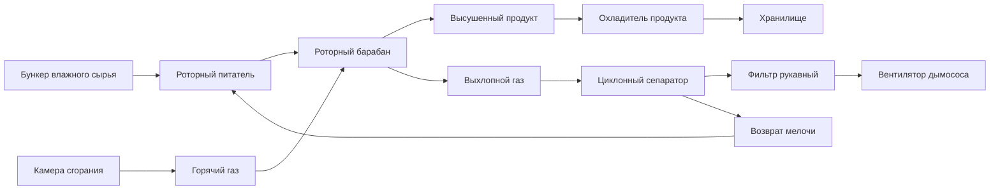

## Роторные сушилки для зерна и минералов

Роторные сушилки обеспечивают непрерывное удаление влаги с высокой производительностью для сыпучих гранулированных материалов, включая сельскохозяйственное зерно и минеральную продукцию. Основы конструкции существенно различаются между приложениями в зависимости от чувствительности к температуре в зерновых культурах в сравнении с допуском минералов к повышенным температурам.

### Физические принципы роторной сушки

Материал перемещается через наклонный вращающийся цилиндр, в то время как горячий газ течет либо прямотоком, либо противотоком. Тепловой обмен происходит тремя одновременными механизмами:

1. **Конвекция** от горячего газа к поверхностям частиц (доминирующий режим)
2. **Теплопроводность** от нагретых стенок барабана к материалу
3. **Излучение** от газа и стенок (значительное при высоких температурах)

Скорость сушки зависит от диффузии влаги из внутренней части частиц на поверхность, где происходит испарение. Критическое содержание влаги представляет переход от контролируемой поверхностью к контролируемой диффузией сушки, типично 0,15–0,25 кг воды/кг сухого вещества для зерна.

### Применение в зерносушке

#### Пределы температуры для сохранения качества

Сельскохозяйственное зерно требует строгого контроля температуры для предотвращения денатурации белков, желатинизации крахмала и потери жизнеспособности семян:

| Тип зерна | Максимальная температура в зоне подачи воздуха | Максимальная температура зерна | Проблема качества |
|-----------|----------------------------------------------|--------------------------------|-------------------|
| Кукуруза (семена) | 43°C | 38°C | Жизнеспособность прорастания |
| Кукуруза (товарная) | 71°C | 60°C | Растрескивание от напряжений |
| Пшеница (семена) | 49°C | 43°C | Жизнеспособность прорастания |
| Рис (помол) | 60°C | 54°C | Дробление ядра |
| Соевые бобы | 71°C | 60°C | Деградация качества масла |

Чрезмерные температуры вызывают термическое растрескивание зерен кукурузы, когда градиент влаги превышает 4–5 процентных пункта между внешней и внутренней частью зерна. Напряжение развивается из-за дифференциального объемного усадки согласно:

$$\sigma = E \cdot \alpha \cdot \Delta M$$

где $\sigma$ — термическое напряжение, $E$ — модуль упругости (1,5–2,0 ГПа для кукурузы), $\alpha$ — коэффициент влажностного расширения (0,012–0,015 на процентный пункт влаги), $\Delta M$ — градиент влаги.

#### Время пребывания в зерносушилке

Время пребывания в роторной зерносушилке обычно колеблется от 15 до 45 минут в зависимости от начального содержания влаги и требуемого конечного содержания влаги. Среднее время пребывания рассчитывается по формуле:

$$t_r = \frac{L}{N \cdot D \cdot \tan(\theta) \cdot 60}$$

где $t_r$ — время пребывания (мин), $L$ — длина сушилки (м), $N$ — частота вращения (об/мин), $D$ — диаметр (м), $\theta$ — угол наклона (типично 0–5°).

Для непрерывной смешанной операции с минимальной сегрегацией частиц:

$$t_r = \frac{0,19 \cdot L}{N \cdot D \cdot S}$$

где $S$ — уклон (м/м). Конструкция лопастей существенно влияет на распыление материала и контакт газа с твердым веществом, при этом прямые радиальные лопасти обеспечивают базовую производительность, а наклонные или поднимающие лопасти увеличивают время пребывания на 20–40%.

### Применение при обработке минералов

#### Высокотемпературная операция

Минеральные продукты (песок, концентраты руды, уголь, промышленные минералы) допускают существенно более высокие температуры:

| Материал | Типовая температура входящего газа | Цель обработки |
|----------|-----------------------------------|----------------|
| Кварцевый песок | 650–870°C | Удаление поверхностной влаги |
| Окатыши железной руды | 400–650°C | Предварительный нагрев перед спеканием |
| Угольная мелочь | 260–540°C | Снижение влаги до <5% |
| Известняк | 315–650°C | Подготовка к прокалке |

Противоточный поток максимизирует тепловую эффективность в применениях с минералами, достигая 50–65% тепловой эффективности по сравнению с 35–50% для прямоточных конструкций. Однако противоточная операция подвергает влажное сырье воздействию более холодных выхлопных газов, требуя внимательного подбора размеров для предотвращения конденсации.

#### Методология расчета производительности

Объемная нагрузка для минеральных сушилок обычно работает при 8–15% от объема барабана, в то время как зерносушилки используют 10–20% для минимизации механических повреждений. Производительность определяется на основе теплового и материального баланса:

$$\dot{m}_s = \frac{\dot{Q}_{avail}}{\lambda_w \cdot (M_i - M_f) + c_s \cdot (T_{out} - T_{in})}$$

где:
- $\dot{m}_s$ = производительность сухого вещества (кг/ч)
- $\dot{Q}_{avail}$ = доступная скорость теплопередачи (кДж/ч)
- $\lambda_w$ = скрытая теплота парообразования воды при средней температуре (кДж/кг)
- $M_i$, $M_f$ = начальное и конечное содержание влаги (кг воды/кг сухого вещества)
- $c_s$ = удельная теплоемкость сухого вещества (кДж/кг·К)
- $T_{out}$, $T_{in}$ = температуры выхода и подачи (К)

Доступная скорость теплопередачи зависит от объемного коэффициента теплопередачи ($U_v$, типично 400–1200 кДж/м³·ч·К для роторных сушилок):

$$\dot{Q}_{avail} = U_v \cdot V \cdot \Delta T_{lm} \cdot \eta$$

где $V$ — объем барабана (м³), $\Delta T_{lm}$ — логарифмическая средняя разность температур, $\eta$ — тепловая эффективность (0,35–0,65).

### Конфигурация технологического потока

### Матрица решений проектирования

| Параметр проектирования | Применение зерна | Применение минералов |
|----------------------|------------------|----------------------|
| Схема потока | Прямоток (защита от высокой температуры) | Противоток (тепловая эффективность) |
| Температура входящего газа | 70–160°C | 260–870°C |
| Время пребывания | 15–45 мин | 30–90 мин |
| Частота вращения | 3–8 об/мин | 2–6 об/мин |
| Соотношение L/D | 4:1 на 8:1 | 6:1 на 12:1 |
| Объемная нагрузка | 10–20% | 8–15% |
| Конструкция лопастей | Глубокие карманы (щадящая обработка) | Прямые радиальные (макс. воздействие) |

### Анализ скорости удаления влаги

Скорость сушки в периоде постоянной скорости (поверхностная влага) следует:

$$\frac{dM}{dt} = -\frac{h \cdot A}{m_s \cdot \lambda_w} \cdot (T_g - T_{wb})$$

где $h$ — коэффициент конвективной теплопередачи (20–80 Вт/м²·К в зависимости от скорости газа), $A$ — площадь поверхности частицы, $m_s$ — масса частицы, $T_{wb}$ — температура по влажному термометру.

В периоде убывающей скорости (контроль внутренней диффузией):

$$\frac{dM}{dt} = -k \cdot (M - M_{eq})$$

где $k$ — постоянная сушки (0,05–0,3 мин⁻¹), $M_{eq}$ — равновесное содержание влаги при условиях сушилки.

### Рассмотрения энергетической эффективности

Справочник ASHRAE — применение HVAC (глава 29) содержит рекомендации по эффективности промышленной сушки. Удельное энергопотребление (SEC) для роторных сушилок:

$$SEC = \frac{\dot{m}_g \cdot c_p \cdot (T_{in} - T_{out})}{\dot{m}_s \cdot (M_i - M_f)} \quad \text{(кДж/кг удаленной воды)}$$

Типовые значения SEC:
- Зерносушилки: 4000–6000 кДж/кг воды (прямоток, более низкая эффективность)
- Минеральные сушилки: 3000–4500 кДж/кг воды (противоток, более высокая эффективность)

Рекуперация тепла из выхлопных газов через рекуперативные теплообменники снижает SEC на 15–30%, хотя применения с зерном должны избегать конденсации, которая может загрязнить возвратный воздух спорами плесени или микотоксинами.

### Параметры контроля производительности

Критические эксплуатационные показатели включают:

1. **Удельная скорость испарения**: 15–40 кг воды/м³·ч (функция температуры газа и скорости)
2. **Тепловая эффективность**: Отношение тепла, использованного для испарения, к общему тепловому вводу
3. **Повышение температуры продукта**: Должно оставаться в пределах качественных требований
4. **Влажность выхлопного газа**: Указывает на приближение к насыщению и эффективность

Требуемая длина сушилки для указанного снижения влаги оценивается на основе эмпирических корреляций, подтвержденных при пилотном тестировании, поскольку эффективность контакта частица-газ зависит от конструкции лопастей, частоты вращения и характеристик материала, которые устойчивы к простому теоретическому предсказанию.
